<div class="MCWHeader1">
SAP NetWeaver on Azure
</div>

<div class="MCWHeader2">
Hands-on lab step-by-step
</div>

<div class="MCWHeader3">
June 2019
</div>


Information in this document, including URL and other Internet Web site references, is subject to change without notice. Unless otherwise noted, the example companies, organizations, products, domain names, e-mail addresses, logos, people, places, and events depicted herein are fictitious, and no association with any real company, organization, product, domain name, e-mail address, logo, person, place or event is intended or should be inferred. Complying with all applicable copyright laws is the responsibility of the user. Without limiting the rights under copyright, no part of this document may be reproduced, stored in or introduced into a retrieval system, or transmitted in any form or by any means (electronic, mechanical, photocopying, recording, or otherwise), or for any purpose, without the express written permission of Microsoft Corporation.

Microsoft may have patents, patent applications, trademarks, copyrights, or other intellectual property rights covering subject matter in this document. Except as expressly provided in any written license agreement from Microsoft, the furnishing of this document does not give you any license to these patents, trademarks, copyrights, or other intellectual property.

The names of manufacturers, products, or URLs are provided for informational purposes only and Microsoft makes no representations and warranties, either expressed, implied, or statutory, regarding these manufacturers or the use of the products with any Microsoft technologies. The inclusion of a manufacturer or product does not imply endorsement of Microsoft of the manufacturer or product. Links may be provided to third party sites. Such sites are not under the control of Microsoft and Microsoft is not responsible for the contents of any linked site or any link contained in a linked site, or any changes or updates to such sites. Microsoft is not responsible for webcasting or any other form of transmission received from any linked site. Microsoft is providing these links to you only as a convenience, and the inclusion of any link does not imply endorsement of Microsoft of the site or the products contained therein.

© 2019 Microsoft Corporation. All rights reserved.

Microsoft and the trademarks listed at <https://www.microsoft.com/en-us/legal/intellectualproperty/Trademarks/Usage/General.aspx> are trademarks of the Microsoft group of companies. All other trademarks are property of their respective owners.

**Contents**

<!-- TOC -->

- [SAP NetWeaver on Azure hands-on lab step-by-step](#sap-netweaver-on-azure-hands-on-lab-step-by-step)
    - [Abstract and learning objectives](#abstract-and-learning-objectives)
    - [Overview](#overview)
    - [Solution architecture](#solution-architecture)
    - [Exercise 1: Deploy the SAP on Azure infrastructure components](#exercise-1-deploy-the-sap-on-azure-infrastructure-components)
        - [Task 1: Implement Azure virtual network](#task-1-implement-azure-virtual-network)
        - [Task 2: Deploy SAP NetWeaver application and database tier VMs](#task-2-deploy-sap-netweaver-application-and-database-tier-vms)
        - [Task 3: Deploy Windows Server 2019 jumpbox Azure VM](#task-3-deploy-windows-server-2019-jumpbox-azure-vm)
        - [Task 4: Implement Azure Active Directory Domain Services (Azure AD DS)](#task-4-implement-azure-active-directory-domain-services)
        - [Task 5: Create Azure AD DS user accounts to facilitate implementation of SAP NetWeaver](#task-5-create-azure-ad-ds-user-accounts-to-facilitate-implementation-of-sap-netweaver)
        - [Task 6: Join Windows Server 2019 Azure VMs to the Azure AD DS domain](#task-6-join-windows-server-2019-azure-vms-to-the-azure-ad-ds-domain)
        - [Task 7: Install Remote Server Administration Tools on all Azure VMs](#task-7-install-remote-server-administration-tools-on-all-azure-vms)
        - [Task 8: Prepare the Azure AD DS for deployment of SAP NetWeaver application and database tier VMs](#task-8-prepare-the-azure-ad-ds-for-deployment-of-sap-netweaver-application-and-database-tier-vms)
        - [Task 9: Configure IP addresses of Azure VMs and internal load balancers](#task-9-configure-ip-addresses-of-azure-vms-and-internal-load-balancers)
        - [Task 10: Create and configure the sapmnt share](#task-10-create-and-configure-the-sapmnt-share)
        - [Task 11: Configure User Account Control on application and the database VMs](#task-11-configure-user-account-control-on-application-and-the-database-vms)
        - [Summary](#summary)
    - [Exercise 2: Configure the SAP NetWeaver ASCS servers](#exercise-2-configure-the-sap-netweaver-ascs-servers)
        - [Overview](#overview-1)
        - [Task 1: Set up Failover Clustering on the ASCS VMs](#task-1-set-up-failover-clustering-on-the-ascs-vms)
        - [Task 2: Install the SAP ASCS components on s03-ascs-0](#task-2-install-the-sap-ascs-components-on-s03-ascs-0)
        - [Task 3: Install the SAP ASCS components on s03-ascs-1](#task-3-install-the-sap-ascs-components-on-s03-ascs-1)
        - [Task 4: Configure SAP ASCS cluster components on s03-ascs-0 and s03-ascs-1](#task-4-configure-sap-ascs-cluster-components-on-s03-ascs-0-and-s03-ascs-1)
        - [Task 5: Install the Enqueue Replication Server instance on both nodes of the cluster](#task-5-install-the-enqueue-replication-server-instance-on-both-nodes-of-the-cluster)
        - [Summary](#summary-1)
    - [Exercise 3: Configure SAP NetWeaver database servers](#exercise-3-configure-sap-netweaver-database-servers)
        - [Overview](#overview-2)
        - [Task 1: Configure storage of the SAP database layer.](#task-1-configure-storage-of-the-sap-database-layer)
        - [Task 2: Grant elevated user rights to the SQL Server service account](#task-2-grant-elevated-user-rights-to-the-sql-server-service-account)
        - [Task 3: Install SQL Server 2017 with the SQL\_Latin1\_General\_CP850\_BIN2 collation](#task-3-install-sql-server-2017-with-the-sql\_latin1\_general\_cp850\_bin2-collation)
        - [Task 4: Install the SAP database layer](#task-4-install-the-sap-database-layer)
        - [Task 5: Implement Always-On Availability Group](#task-5-implement-always-on-availability-group)
        - [Task 6: Modify the SAP Default Profile](#task-6-modify-the-sap-default-profile)
        - [Summary](#summary-2)
    - [Exercise 4: Configure SAP NetWeaver Application servers](#exercise-4-configure-sap-netweaver-application-servers)
        - [Overview](#overview-3)
        - [Task 1: Configure storage and software prerequisites of the SAP Application layer](#task-1-configure-storage-and-software-prerequisites-of-the-sap-application-layer)
        - [Task 2: Install the SAP Primary Application Server (PAS) layer](#task-2-install-the-sap-primary-application-server-pas-layer)
        - [Task 3: Install the SAP Additional Application Server (AAS) layer](#task-3-install-the-sap-additional-application-server-aas-layer)
        - [Task 4: Install the SAP Enhanced Monitoring Extension for SAP](#task-4-install-the-sap-enhanced-monitoring-extension-for-sap)
        - [Summary](#summary-3)
    - [Lab summary](#lab-summary)
    - [After the hands-on lab](#after-the-hands-on-lab)
        - [Task 1: Delete resources](#task-1-delete-resources)

<!-- /TOC -->

# SAP NetWeaver on Azure hands-on lab step-by-step 

## Abstract and learning objectives 

In this hands-on lab you will setup and configure SAP NetWeaver by using a combination of Azure Infrastructure as a Service (IaaS) and Platform as a Service (PaaS) components. You will setup identity management by using Azure Active Directory Domain Services (Azure AD DS), file sharing by using Azure Files service, NetWeaver application and database tiers by using Azure virtual machines (VMs) and integrate them with Active Directory. You will then setup high-availability for SAP ASCS components hosted on Azure VMs by configuring failover clustering. Finally, you will configure the database tier with Always-On Availability Groups and configure the NetWeaver application servers for redundancy.

As you step through the hands-on-lab, you will learn how to optimize deployment of SAP on Azure, including configuration of SAP NetWeaver ASCS servers, SAP NetWeaver database servers, and SAP NetWeaver Application servers.

## Overview

Contoso has asked you to develop a process of provisioning a highly available, Windows Server 2019-based SAP NetWeaver deployment on Azure, with SAP Advanced Business Application Programming (ABAP) stack and SQL Server 2017 as the database tier. To provide high-availability of the ABAP SAP Central Services (ASCS) components, you will implement an instance of a failover cluster. The ASCS component will leverage Azure Files to host highly-available sapmnt share. To provide high-availability of the database tier, you will implement an instance of SQL Server Always-On Availability Group. In both cases, you will use a Cloud Witness quorum, introduced in Windows Server 2016 Failover Clustering. All Azure VMs will be using managed disks. To streamline deployment, you will take advantage of Azure Resource Manager templates and PowerShell scripts.

## Solution architecture

From the architectural standpoint, the deployment will consist of the following layers:

-   Authentication layer -- two Active Directory domain controllers

-   Shared storage -- Azure Files

-   SAP ASCS layer -- two servers configured as members of a two-node Windows Failover Clustering cluster

    -   Failover Clustering will rely on Cloud Witness-based quorum

    -   An Azure Standard Internal Load Balancer will provide a front-end IP address of the ASCS Failover Clustering role

-   SAP Application instances layer -- two SAP application servers:

    -   Primary Application Server (PAS)

    -   Additional Application Server (AAS)

-   SAP Database layer -- two servers hosting separate instances of SQL Server 2017 configured as nodes of a SQL Server Always-On Availability Group cluster

    -   Failover Clustering will rely on Cloud Witness-based quorum

    -   An Azure Standard Internal Load Balancer will provide a front-end IP address of the Always-On Availability Group listener

To facilitate high-availability on the platform level, each pair of Azure virtual machines (VMs) in each layer will belong to the same managed availability set.

The solution will also include a Windows Server 2019 Azure VM that will serve the role of a jumpbox server.

![Solution architecture to setup SAP NetWeaver on Azure consisting of Authentication layer (with two Active Directory domain controllers), shared storage (two servers configured as a Storage Spaces Direct cluster), SAP ASCS layer (with two servers configured as members of a two-node Windows Failover Clustering cluster), SAP Application instances layer (with two SAP application servers), SAP Database layer (two servers hosting separate instances of SQL Server 2017 configured as nodes of a SQL Server Always-On Availability Group cluster).](images/Hands-onlabunguided-SAPonAzureimages/media/image1.png  "Solution architecture diagram")

## Exercise 1: Deploy the SAP on Azure infrastructure components 

Duration: 150 minutes

In this exercise, you will deploy Azure infrastructure prerequisites for implementing SAP NetWeaver on Azure Virtual Machines (VMs). This will include creating such resources as an Azure Virtual Network, Azure VMs and Azure load balancers. In addition, you will implement Azure AD DS, and subsequently, join all Azure VMs to the same Active Directory domain.

### Task 1: Implement Azure virtual network

In this task, you will create an Azure virtual network which will host the SAP implementation. You will use the following settings during deployment:

-   Resource group name: **s03-RG**

-   Virtual network name: **s03-RG-vnet**

-   Virtual network IP address space: **10.0.0.0/22**

-   Subnets: 

    -   Subnet name: **dmzSubnet**

    -   Subnet IP address range: **10.0.0.0/24**

    -   Subnet name: **sapSubnet**

    -   Subnet IP address range: **10.0.1.0/24**

    -   Subnet name: **adSubnet**

    -   Subnet IP address range: **10.0.2.0/24**

-   DDoS protection: **Basic**

-   Service endpoints: **Disabled**

-   Firewall: **Disabled**

1.  From the lab computer, start a Web browser, and navigate to the Azure portal at <https://portal.azure.com>.

1.  When prompted, sign into the Azure subscription you will be using in this lab.

1.  On the lab computer, in the Azure portal, click **+ Create a resource**.

1.  On the **New** blade, in the **Search the Marketplace** text box, type **Virtual Network** and, in the list of results, click **Virtual Network**.

1.  On the **Virtual Network** blade, click **Create**.

1.  On the **Create virtual network** blade, specify the following settings and click **Create**:

    -   Name: **s03-RG-vnet**

    -   Address space: **10.0.0.0/22**

    -   Subscription: the name of the Azure subscription you are using for this lab.

    -   Resource group: the name of a new resource group **s03-RG**.

    -   Location: the name of the Azure region where you can provision Azure VMs and where you have sufficient number of vCPU quotas to complete this lab

    -   Subnet: **sapSubnet**

    -   Address range: **10.0.1.0/24**

    -   DDoS protection: **Basic**

    -   Service endpoints: **Disabled**

    -   Firewall: **Disabled**

1.  In the Azure portal, navigate to the blade of the newly created virtual network.

1.  On the **s03-RG-vnet** blade, click **Subnets**.

1.  On the **s03-RG-vnet - Subnets** blade, click **+ Subnet**.

1.  On the **Add subnet** blade, specify the following settings and click **OK**:

    -   Name: **dmzSubnet**

    -   Address range (CIDR block): **10.0.0.0/24**

    -   Network security group: **None**

    -   Route table: **None**

    -   Services: **0 selected**

    -   Delegate subnet to a service: **None**

1.  On the **Add subnet** blade, specify the following settings and click **OK**:

    -   Name: **adSubnet**

    -   Address range (CIDR block): **10.0.2.0/24**

    -   Network security group: **None**

    -   Route table: **None**

    -   Services: **0 selected**

    -   Delegate subnet to a service: **None**

### Task 2: Deploy SAP NetWeaver application and database tier VMs 

In this task, you will deploy Azure VMs that will be hosting your SAP implementation by using an Azure Resource Manager QuickStart template from GitHub available at <https://github.com/Azure/azure-quickstart-templates/tree/master/sap-3-tier-marketplace-image-md>. You will use the following settings during deployment:

-   Resource group: **s03-RG**

-   Sap System Id: **s03**

-   Stack Type: **ABAP**

-   OS Type: **Windows Server 2019 Datacenter**

-   Sap System Size: **Demo**

-   System Availability: **HA**

-   vmSizes:

    -   dbserversize: **Standard\_D8s\_v3**

    -   ascsserversize: **Standard\_D4s\_v3**

    -   diserversize: **Standard\_D4s\_v3**

-   Admin Username: **demouser**

-   Admin Password: **demo\@pass123**

-   New Or Existing Subnet: **existing**

-   Subnet Id: **Id of the sapSubnet**

1.  From the lab computer, start another instance of the Web browser, and navigate to <https://github.com/Azure/azure-quickstart-templates/tree/master/sap-3-tier-marketplace-image-md>.

1.  On the **SAP NetWeaver 3-tier compatible template using a Marketplace image - MD** page, click **Deploy to Azure**.

    

1.  The Web browser window should automatically get redirected to the Azure portal and display the **SAP NetWeaver 3-tier (managed disk)** blade.

1.  Click **Edit template**.

    

1.  On the **Edit template** blade, expand the **Variables** node, and scroll down to the **sizes** subnode.

    

1.  In the editor window, navigate to the **Demo** section, scroll down to the **SQL** section, and modify the values of the **dbvmSize** key per the following screenshot:

    

1.  In the editor window, navigate to the **osType** parameter subsection of the **Parameters** section. Add an entry for **Windows Server 2019** and configure it as the default value of the parameter, as per the following screenshot:

    

1.  In the editor window, navigate to the **images** variable of the **Variables** section. Add an entry for **Windows Server 2019**, as per the following screenshot:

    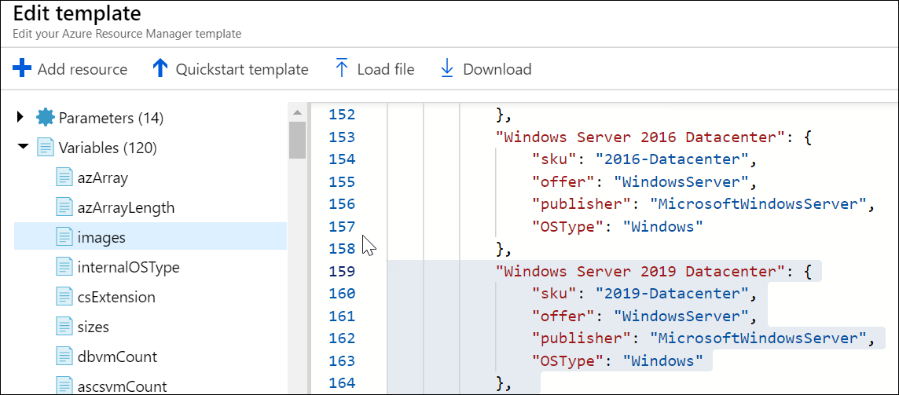

1.  Click **Save** to save your changes.

    

1.  Back on the **SAP NetWeaver 3-tier compatible Marketplace image** blade, specify the following settings:

    -   Subscription: the name of the Azure subscription you are using for this lab.

    -   Resource group: **s03-RG**

    -   Location: accept the default value. 

    -   Sap System Id: **s03**

    -   Stack Type: **ABAP**

    -   OS Type: **Windows Server 2019 Datacenter**

    -   Dbtype: **SQL**

    -   Sap System Size: **Demo**

    -   System Availability: **HA**

    -   Admin Username: **demouser**

    -   Authentication Type: **password**

    -   Admin Password or Key: **demo\@pass123**

    -   Subnet Id: the value returned when running the following commands from a PowerShell session of Cloud Shell:

    ```
    $vnet = Get-AzVirtualNetwork -ResourceGroupName s03-RG -Name s03-RG-vnet

    $subnet = Get-AzVirtualNetworkSubnetConfig -Name 'sapSubnet' -VirtualNetwork $vnet

    $subnet.Id
    ```

    

    -   Availability Zones: the default value

    -   Location: the default value

    -   Artifacts Location: the default value

    -   Artifacts Location Sas Token: the default value

1.  Enable the checkbox labeled **I agree to the terms and conditions stated above** and click **Purchase**.

    

1.  Wait for the deployment to complete. This should take no more than 10 minutes. You can verify the deployment completed successfully by viewing the **Deployments** entry of the s03-RG resource group blade in the Azure portal.

    > **Note**: Disregard any custom script extension errors generated during the template deployment.

    

### Task 3: Deploy Windows Server 2019 jumpbox Azure VM 

In this task, you will deploy Azure VMs that will serve as a jumpbox server for your SAP implementation by using the Azure portal. You will use the following settings during deployment:

-   Subscription: the name of the Azure subscription you are using for this lab.

-   Resource group: **s03-RG**

-   Virtual machine name: **s03-adm-0**

-   Region: the name of the same Azure region which you used earlier in this exercise.

-   Availability options: **No infrastructure redundancy required**

-   Image: **Windows Server 2019 Datacenter**

-   Size: **Standard\_D2s\_v3**

-   Username: **demouser**

-   Password: **demo\@pass123**

-   Public inbound ports: **RDP**

-   Already have a Windows license?: **No**

-   OS disk type: **Standard HDD**

-   Virtual network: **s03-RG-vnet**

-   Subnet name: **dmzSubnet**

-   Public IP: the name of a new public IP address **az1000301-vm0-ip**

-   Network security group: **Basic**

-   Public inbound ports: **Allow selected ports**

-   Select inbound ports: **RDP**

-   Accelerated networking: **Off**

-   Place this virtual machine behind an existing load balancing solution?: **No**

-   Enable basic plan for free: **Off**

-   Boot diagnostics: **Off**

-   OS guest diagnostics: **Off**

-   System assigned managed identity: **Off**

-   Enable auto-shutdown: **Off**

1.  On the lab computer, in the Azure portal, click **+ Create a resource**.

1.  On the **New** blade, in the **Search the Marketplace** text box, type **Windows Server**, in the list of results, select **Windows Server 2019 Datacenter**, and click **Create**.

1.  On the **Basics** tab of the **Create a virtual machine** blade, specify the following settings and click **Next: Disks >**:

    -   Subscription: the name of the Azure subscription you are using for this lab.

    -   Resource group: **s03-RG**

    -   Virtual machine name: **s03-adm-0**

    -   Region: the name of the same Azure region which you used earlier in this exercise.

    -   Availability options: **No infrastructure redundancy required**

    -   Image: **Windows Server 2019 Datacenter**

    -   Size: **Standard\_D2s\_v3**

    -   Username: **demouser**

    -   Password: **demo\@pass123**

    -   Public inbound ports: **Allow selected ports**

    -   Select inbound ports: **RDP**

    -   Already have a Windows license?: **No**

1.  On the **Disks** tab of the **Create a virtual machine** blade, specify the following settings and click **Next: Networking >**:

    -   OS disk type: **Standard HDD**

1.  On the **Networking** tab of the **Create a virtual machine** blade, specify the following settings and click **Next: Management >**:

    -   Virtual network: **s03-RG-vnet**

    -   Subnet name: **dmzSubnet (10.0.0.0/24)**

    -   Public IP: ***(new) s03-adm-0-ip**

    -   NIC network security group: **Basic**

    -   Public inbound ports: **Allow selected ports**

    -   Select inbound ports: **RDP**

    -   Accelerated networking: **Off**

    -   Place this virtual machine behind an existing load balancing solution?: **No**

1.  On the **Management** tab of the **Create a virtual machine** blade, specify the following settings and click **Review + create**:

    -   Enable basic plan for free: **Off**

    -   Boot diagnostics: **Off**

    -   OS guest diagnostics: **Off**

    -   System assigned managed identity: **Off**

    -   Enable auto-shutdown: **Off**

1.  On the **Review + create** tab of the **Create a virtual machine** blade, click **Create**.

1.  Wait for the deployment to complete. This should take no more than 10 minutes.

### Task 4: Implement Azure Active Directory Domain Services

In this task, you will implement Azure AD DS domain that will be hosting managed Active Directory domain controller providing authentication and authorization services for your SAP implementation. You will use the following settings during deployment:

-   Directory name: the default value

-   DNS domain name: **contoso.com**

-   Subscription: the name of the Azure subscription you are using for this lab.

-   Resource group: the name of a new resource group **s03-ad-RG**.

-   Region: the name of the same Azure region which you used earlier in this exercise.

-   Virtual network: **s03-RG-vnet**

-   Subnet: use existing **adSubnet**

-   Administrator group: the default setting

-   Synchronization: **All**

1.  On the lab computer, in the Azure portal, navigate to the **Resource groups** blade and click **+ Add**.

1.  On the **Create a resource group** blade, specify the following settings and click **Review + Create**

    -   Subscription: the name of the Azure subscription you are using for this lab.

    -   Resource group: **s03-ad-RG**

    -   Region: the name of the same Azure region which you used earlier in this exercise.

1.  On the **Review + Create** blade, click **Create**.

1.  In the Azure portal, click **+ Create a resource**.

1.  On the **New** blade, in the **Search the Marketplace** text box, type **Azure AD Domain Services** and, in the list of results, click **Azure AD Domain Services**.

1.  On the **Azure AD Domain Services** blade, click **Create**. This will automatically open the **Enable Azure AD Domain Services** blade and its **Basics** blade.

1.  On the **Basics** blade, specify the following settings and click **OK**:

    -   Directory name: the default value

    -   DNS domain name: **contoso.com**

    -   Subscription: the name of the Azure subscription you are using for this lab.

    -   Resource group: **s03-ad-RG**

    -   Region: the name of the same Azure region which you used earlier in this exercise.

1.  On the **Network** blade, specify the following settings and click **OK**:

    -   Virtual network: **s03-RG-vnet**

    -   Subnet: **Use existing** **adSubnet**

1.  On the **Administrator group** blade, click **OK**.

1.  On the **Synchronization** blade, accept the default **All** setting and click **OK**.

1.  On the **Summary** blade, click **OK**.

1.  Wait for the deployment to complete. This should take about 30 minutes.

    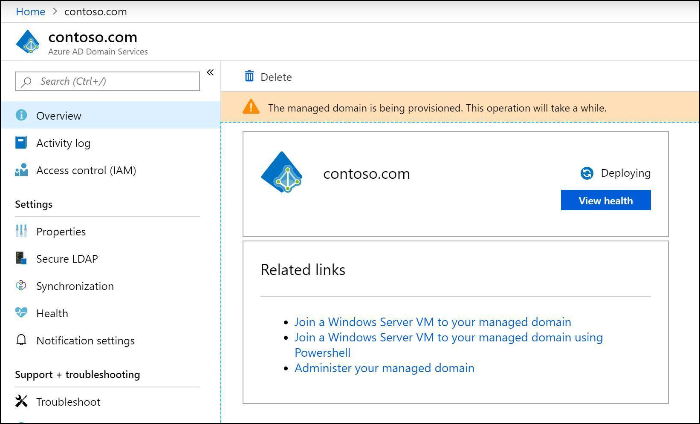


### Task 5: Create Azure AD DS user accounts to facilitate implementation of SAP NetWeaver

In this task, you will create the following user accounts with non-expiring password set to **demo\@pass123** in the managed Azure AD DS instance to facilitate your SAP implementation:

-   The account to perform all operating system level configuration tasks, including installation of all SAP components):

    -   Name: **s03-su** 

    -   Member of:

        -   **AAD DC Administrators**

-   The SAP service accounts:

    -   Name: **s03adm** 

    -   Member of:

        -   **AAD DC Administrators**

-   The SAP service accounts:

    -   Name: **SAPService03** 

    -   Member of:

        -   **AAD DC Administrators**

-   The account to configure SQL Server 2017 services on the first SQL Server VM.

    -   Name: **s03-db-0-sqlsvc**

-   The account to configure SQL Server 2017 services on the second SQL Server VM.

    -   Name: **s03-db-1-sqlsvc**

1.  In the Azure Portal, start a PowerShell session in Cloud Shell. 

    > **Note**: If this is the first time you are launching Cloud Shell in the current Azure subscription, you will be asked to create an Azure file share to persist Cloud Shell files. If so, accept the defaults, which will result in creation of a storage account in an automatically generated resource group.

1.  In the Azure portal, in the **Cloud Shell**, at the PowerShell prompt, run the following to create a new Azure AD user named **s03-su**: 

    ```
    $passwordProfile = New-Object -TypeName Microsoft.Open.AzureAD.Model.PasswordProfile

    $passwordProfile.Password = 'demo@pass123'

    $passwordProfile.ForceChangePasswordNextLogin = $false

    $passwordProfile.EnforceChangePasswordPolicy = $false

    $userName = 's03-su'

    $domainName = (Get-AzureADDomain).Name

    $user = New-AzureADUser -DisplayName $userName -userPrincipalName "$userName@$domainName" -PasswordProfile $passwordProfile -AccountEnabled $true -MailNickName $userName
    ``` 

1.  In the Azure portal, in the **Cloud Shell**, at the PowerShell prompt, run the following to create a new Azure AD user named **s03adm**: 

    ```
    $passwordProfile = New-Object -TypeName Microsoft.Open.AzureAD.Model.PasswordProfile

    $passwordProfile.Password = 'demo@pass123'

    $passwordProfile.ForceChangePasswordNextLogin = $false

    $passwordProfile.EnforceChangePasswordPolicy = $false

    $userName = 's03adm'

    $domainName = (Get-AzureADDomain).Name

    $user = New-AzureADUser -DisplayName $userName -userPrincipalName "$userName@$domainName" -PasswordProfile $passwordProfile -AccountEnabled $true -MailNickName $userName
    ``` 

1.  In the Azure portal, in the **Cloud Shell**, at the PowerShell prompt, run the following to create a new Azure AD user named **SAPServiceS03**: 

    ```
    $passwordProfile = New-Object -TypeName Microsoft.Open.AzureAD.Model.PasswordProfile

    $passwordProfile.Password = 'demo@pass123'

    $passwordProfile.ForceChangePasswordNextLogin = $false

    $passwordProfile.EnforceChangePasswordPolicy = $false

    $userName = 'SAPServiceS03'

    $domainName = (Get-AzureADDomain).Name

    $user = New-AzureADUser -DisplayName $userName -userPrincipalName "$userName@$domainName" -PasswordProfile $passwordProfile -AccountEnabled $true -MailNickName $userName
    ``` 

1.  In the Azure portal, in the **Cloud Shell**, at the PowerShell prompt, run the following to add the newly created users to the Azure AD group named **AAD DC Administrators**: 

    ```
    $group = Get-AzureADGroup -Filter "DisplayName eq 'AAD DC Administrators'"

    $user = Get-AzureADUser -Filter "DisplayName eq 's03-su'"

    Add-AzureADGroupMember -ObjectId $group.ObjectId -RefObjectId $user.ObjectId

    $user = Get-AzureADUser -Filter "DisplayName eq 's03adm'"

    Add-AzureADGroupMember -ObjectId $group.ObjectId -RefObjectId $user.ObjectId

    $user = Get-AzureADUser -Filter "DisplayName eq 'SAPServiceS03'"

    Add-AzureADGroupMember -ObjectId $group.ObjectId -RefObjectId $user.ObjectId
    ```

1.  In the Azure portal, in the **Cloud Shell**, at the PowerShell prompt, run the following to create a new Azure AD group named **SAP_S03_GlobalAdmin**: 

    ```
    $group = New-AzureADGroup -Description 'SAP Global Administration Group' -DisplayName "SAP_S03_GlobalAdmin" -MailEnabled $false -SecurityEnabled $true -MailNickName 'SAP_S03_GlobalAdmin'
    ```

1.  In the Azure portal, in the **Cloud Shell**, at the PowerShell prompt, run the following to add the users **s03adm** and **SAPServiceS03** to the Azure AD group named **SAP_S03_GlobalAdmin**: 

    ```
    $group = Get-AzureADGroup -Filter "DisplayName eq 'SAP_S03_GlobalAdmin'"

    $user = Get-AzureADUser -Filter "DisplayName eq 's03adm'"

    Add-AzureADGroupMember -ObjectId $group.ObjectId -RefObjectId $user.ObjectId

    $user = Get-AzureADUser -Filter "DisplayName eq 'SAPServiceS03'"

    Add-AzureADGroupMember -ObjectId $group.ObjectId -RefObjectId $user.ObjectId
    ```

1.  In the Azure portal, in the **Cloud Shell**, at the PowerShell prompt, run the following to create a new Azure AD user named **s03-db-0-sqlsvc**: 

    ```
    $passwordProfile = New-Object -TypeName Microsoft.Open.AzureAD.Model.PasswordProfile

    $passwordProfile.Password = 'demo@pass123'

    $passwordProfile.ForceChangePasswordNextLogin = $false

    $passwordProfile.EnforceChangePasswordPolicy = $false

    $userName = 's03-db-0-sqlsvc'

    $domainName = (Get-AzureADDomain).Name

    $user = New-AzureADUser -DisplayName $userName -userPrincipalName "$userName@$domainName" -PasswordProfile $passwordProfile -AccountEnabled $true -MailNickName $userName
    ``` 

1.  In the Azure portal, in the **Cloud Shell**, at the PowerShell prompt, run the following to create a new Azure AD user named **s03-db-0-sqlsvc**: 

    ```
    $passwordProfile = New-Object -TypeName Microsoft.Open.AzureAD.Model.PasswordProfile

    $passwordProfile.Password = 'demo@pass123'

    $passwordProfile.ForceChangePasswordNextLogin = $false

    $passwordProfile.EnforceChangePasswordPolicy = $false

    $userName = 's03-db-1-sqlsvc'

    $domainName = (Get-AzureADDomain).Name

    $user = New-AzureADUser -DisplayName $userName -userPrincipalName "$userName@$domainName" -PasswordProfile $passwordProfile -AccountEnabled $true -MailNickName $userName
    ``` 

### Task 6: Join Windows Server 2019 Azure VMs to the Azure AD DS domain

In this task, you will join all the Windows Server 2019 Azure VMs you deployed earlier in this exercise to the Active Directory domain contoso.com.

1.  In the Azure portal, navigate to the **Azure AD Domain Services** blade and click **contoso.com**.

1.  On the **contoso.com** blade, in the **Required configuration steps**, click **Configure** to update DNS server settings for the virtual network.

1.  In the Azure portal, navigate to the **Virtual machines** blade and restart all virtual machines you deployed earlier in this exercise.

1.  In the Azure portal, if necessary, open the PowerShell session within **Cloud Shell** and, in the PowerShell pane, run the following to join Azure VMs to the Azure AD DS domain: 

    ```
    $userName = 's03-su'

    $domainName = (Get-AzureADDomain).Name

    $settingStringTemplate = '{"Name": "contoso.com", "User": "creds", "Restart": "true", "Options": "3"}'

    $settingString = $settingStringTemplate -replace 'creds',"$userName@$domainName"

    $protectedSettingString = '{"Password": "demo@pass123"}'

    $resourceGroupName = 's03-RG'

    $location = (Get-AzResourceGroup -Name $resourceGroupName).Location

    $vmNames = @('s03-adm-0','s03-ascs-0','s03-ascs-1','s03-db-0','s03-db-1','s03-di-0','s03-di-1')

    Foreach ($vmName in $vmNames) {Set-AzVMExtension -ResourceGroupName $resourceGroupName -ExtensionType 'JsonADDomainExtension' -Name 'joindomain' -Publisher "Microsoft.Compute" -TypeHandlerVersion "1.0" -Vmname $vmName -Location $location -SettingString $settingString -ProtectedSettingString $protectedSettingString}
    ```

1.  Wait until the script completes. This might take about 10 minutes.


### Task 7: Install Remote Server Administration Tools on all Azure VMs

In this task, you will install Remote Server Administration Tools all of the Windows Server 2019 Azure VMs you deployed earlier in this exercise. 

1.  In the Azure portal, navigate to **Virtual machines** blade and click **s03-adm-0**.

1.  On the **s03-adm-0** blade, click **Connect** and, on the **Connect to virtual machine** blade, click **Download RDP File**. When prompted, authenticate by using the following credentials:

    -   Username: **contoso\\s03-su**

    -   Password: **demo\@pass123**

1.  Within the Remote Desktop session to s03-adm-0, start a Windows PowerShell ISE as Administrator and install Remote Administrative tools features by running the following:

    ```
    $vmNames = @('s03-adm-0','s03-ascs-0','s03-ascs-1','s03-db-0','s03-db-1','s03-di-0','s03-di-1')

    Invoke-Command $vmNames {Install-WindowsFeature RSAT -IncludeAllSubFeature} 
    ```

### Task 8: Prepare the Azure AD DS for deployment of SAP NetWeaver application and database tier VMs 

In this task, you will configure the managed Azure AD DS instance and its DNS services to prepare for deployment of your SAP implementation. You will configure the following settings:

-   In the contoso.com Active Directory:

    -   Create an organizational unit in the root of the contoso.com domain named **S03** that will host SAP-specific users and groups.

-   In the contoso.com DNS zone:

    -   Create the following DNS Host (A) records:

        -   **s03-ascs-v0 10.0.1.16** (this IP address must match the IP address that will be assigned to the **frontendascs** front end IP configuration of the ASCS-layer internal load balancer)

        -   **s03-ascs-ers-v0 10.0.1.17** (this IP address must match the IP address that will be assigned to the **frontendaers** front end IP configuration of the ASCS-layer internal load balancer)

        -   **s03-ascs-ers0 10.0.1.18** (this IP address must match the IP address that will be assigned to the **s03-ascs-0**)

        -   **s03-ascs-ers1 10.0.1.19** (this IP address must match the IP address that will be assigned to the **s03-ascs-1**)

        -   **s03-di-v0 10.0.1.38** (this IP address must match the IP address that will be assigned to the SAP Primary Application Server s0-di-0)

        -   **s03-di-v1 10.0.1.39** (this IP address must match the IP address that will be assigned to the SAP Additional Application Server s0-di-1)

    -   Enable non-secure DNS updates.

-   In the contoso.com Active Directory:

    -   Create an organizational unit in the root of the contoso.com domain named **S03** that will host SAP-specific computer, users, and group objects.

    -   Move the following computer objects to the **S03** organizational unit: **s03-ascs-0**, **s03-ascs-1**, **s03-db-0**, **s03-db-1**, **s03-di-0**, and **s03-di-1** 

    -   Create the following SAP-specific user and group objects in the **S03** organizational unit:

        -   Full name: **s03-db-0-sqlsvc**

            -   User UPN logon: [s03-db-0-sqlsvc\@contoso.com](mailto:s03-su@contoso.com)

            -   User SamAccountName: **contoso\\s03-db-0-sqlsvc**

            -   Password: **demo\@pass123** 

            -   Password options:

                -   Password never expires

        -   Full name: **s03-db-1-sqlsvc**

            -   User UPN logon: [s03-db-1-sqlsvc\@contoso.com](mailto:%20s03-db-1-sqlsvc@contoso.com)

            -   User SamAccountName: **contoso\\s03-db-1-sqlsvc**

            -   Password: **demo\@pass123**

            -   Password options:

                -   Password never expires

        -   Full name: **s03adm**

            -   User UPN logon: [s03-db-1-sqlsvc\@contoso.com](mailto:%20s03-db-1-sqlsvc@contoso.com)

            -   User SamAccountName: **contoso\\s03-db-1-sqlsvc**

            -   Password: **demo\@pass123**

            -   Password options:

                -   Password never expires

            -   Member of:

                -   **SAP_S03_GlobalAdmin**

        -   Full name: **SAPServiceS03**

            -   User UPN logon: [SAPServiceS03\@contoso.com](mailto:%SAPServiceS03@contoso.com)

            -   User SamAccountName: **contoso\\SAPServiceS03**

            -   Password: **demo\@pass123**

            -   Password options:

                -   Password never expires

            -   Member of:

                -   **SAP_S03_GlobalAdmin**

1.  Within the Remote Desktop session to s03-adm-0, start DNS Manager console and connect to **contoso.com**. 

    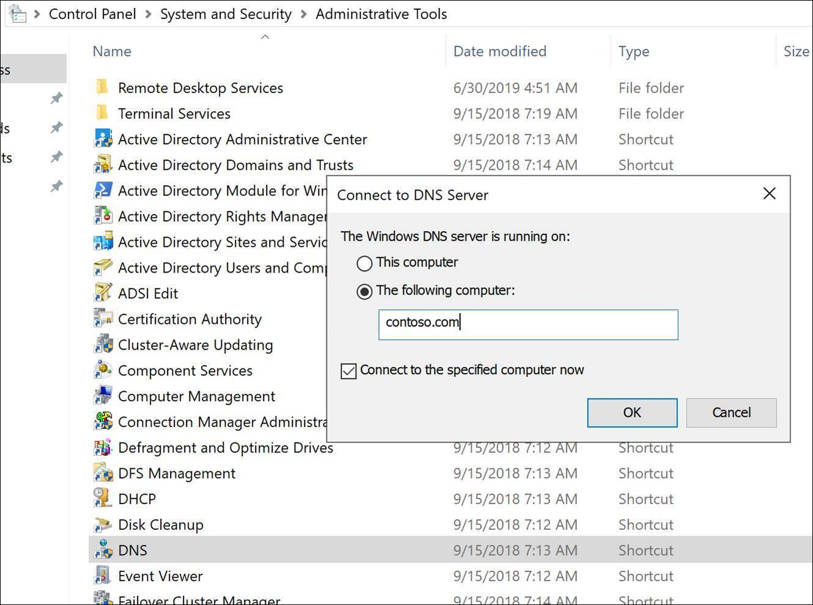

1.  In the DNS Manager console, expand the **contoso.com** , **Forward Lookup Zones**, and **contoso.com** nodes, and, in the **contoso.com** zone, create Host (A) records with the following settings:

    -   Name: **s03-ascs-v0**

        -   Data: **10.0.1.16** - this IP address must match the IP address assigned to the **frontendascs** front end IP configuration of the ASCS-layer internal load balancer (that will be configured in the next task of this exercise).

            

    -   Name: **s03-ascs-ers-v0**

        -   Data: **10.0.1.17** - this IP address must match the IP address assigned to the **frontendaers** front end IP configuration of the ASCS-layer internal load balancer (that will be configured in the next task of this exercise).

            

    -   Name: **s03-ascs-ers0**

        -   Data: **10.0.1.18** - this IP address must match the IP address that will be assigned to the **s03-ascs-0** (that will be configured in the next task of this exercise).

            

    -   Name: **s03-ascs-ers1**

        -   Data: **10.0.1.19** - this IP address must match the IP address that will be assigned to the **s03-ascs-1** (that will be configured in the next task of this exercise).

            

    -   Name: **s03-di-v0**

        -   Data: **10.0.1.38** - this IP address must match the IP address that will be assigned to the SAP Primary Application Server s0-di-0.

            

    -   Name: **s03-di-v1**

        -   Data: **10.0.1.39** - this IP address must match the IP address that will be assigned to the SAP Additional Application Server s0-di-1.

            

1.  In the DNS Manager console, display the **contoso.com Properties** dialog box and, on the **General** tab, click **Nonsecure and secure** entry in the **Dynamic updates** drop-down list.

1.  From the Windows PowerShell ISE console, launch Active Directory Administrative Center by running the following:

    ```
    dsac
    ```

1.  In the Active Directory Administrative Center, create an organizational unit named **S03** directly in the root of the domain.

    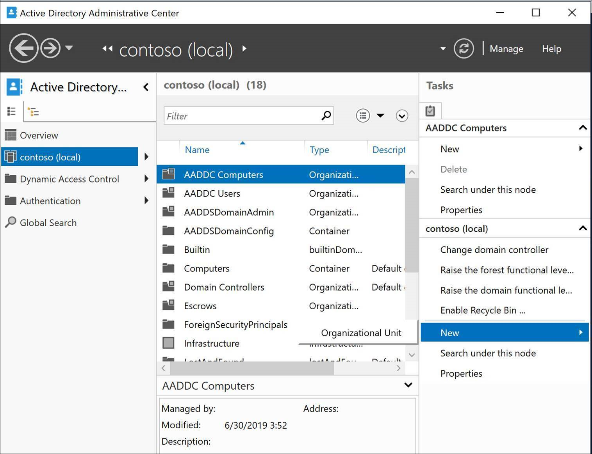

    

1.  In the Active Directory Administrative Center, navigate to the organizational unit **AADDC Computers**, and move the computer objects **s03-ascs-0**, **s03-ascs-1**, **s03-db-0**, **s03-db-1**, **s03-di-0**, and **s03-di-1** to the **S03** organizational unit.

    

### Task 9: Configure IP addresses of Azure VMs and internal load balancers

In this exercise, you will configure private IP addresses assigned to the Azure VMs and front end IP configuration of load balancers deployed in the previous task by using an Azure Resource Manager template. 

>**Note:** At this point, each of the Azure VMs we have deployed in the previous task has a dynamically assigned Private IP address.

Configure the private IP addresses of Azure VMs and frontend IP configuration of load balancers in the following manner:

-   s03-nic-ascs-0: 10.0.1.18

-   s03-nic-ascs-1: 10.0.1.19

-   s03-nic-db-0: 10.0.1.28

-   s03-nic-db-1: 10.0.1.29

-   s03-nic-di-0: 10.0.1.38

-   s03-nic-di-1: 10.0.1.39

-   s03-lb-db:

    -   frontendsql: 10.0.1.25

    -   frontendsqlcl: 10.0.1.26

-   s03-lb-ascs:

    -   frontendascscl: 10.0.1.15

    -   frontendascs: 10.0.1.16

    -   frontendaers: 10.0.1.17

1.  In the Azure Portal, start a PowerShell session in Cloud Shell. 

1.  In the Azure portal, in the **Cloud Shell**, at the PowerShell prompt, run the following to assign private static IP addresses to Azure VMs and to the front end IP configuration of Azure load balancers:

    ```
    $resourceGroupName = 's03-RG'

    $resourceGroup = Get-AzResourceGroup -Name $resourceGroupName

    $ilbName = 's03-lb-ascs'
    $ilb = Get-AzLoadBalancer -ResourceGroupName $resourceGroupName -Name $ilbName
    $ilbConfigurations = @('frontendascsl','frontendascs','frontendaers')
    $ilbIPAddresses = @('10.0.1.15','10.0.1.16','10.0.1.17') 

    for ($count=0; $count -le $ilbConfigurations.Count-1; $count++) {
        $ilb.FrontendIpConfigurations[$count].PrivateIpAllocationMethod = 'Static'
        $ilb.FrontendIpConfigurations[$count].PrivateIpAddress = $ilbIPAddresses[$count]
        $ilb | Set-AzLoadBalancer
    }

    $ilbName = 's03-lb-db'
    $ilb = Get-AzLoadBalancer -ResourceGroupName $resourceGroupName -Name $ilbName
    $ilbConfigurations = @('frontendsql','frontendsqlcl')
    $ilbIPAddresses = @('10.0.1.25','10.0.1.26') 

    for ($count=0; $count -le $ilbConfigurations.Count-1; $count++) {
        $ilb.FrontendIpConfigurations[$count].PrivateIpAllocationMethod = 'Static'
        $ilb.FrontendIpConfigurations[$count].PrivateIpAddress = $ilbIPAddresses[$count]
        $ilb | Set-AzLoadBalancer
    }

    $vmNicNames = @('s03-nic-di-0','s03-nic-di-1','s03-nic-db-0','s03-nic-db-1','s03-nic-ascs-0','s03-nic-ascs-1')

    $vmIPAddresses = @('10.0.1.38','10.0.1.39','10.0.1.28','10.0.1.29','10.0.1.18','10.0.1.19')

    for ($count=0; $count -le $vmNicNames.Count-1; $count++) {
        $nic = Get-AzNetworkInterface -ResourceGroupName $resourceGroupName -Name $vmNicNames[$count]
        $nic.IpConfigurations[0].PrivateIpAllocationMethod = 'Static'
        $nic.IpConfigurations[0].PrivateIpAddress = $vmIPAddresses[$count]
        Set-AzNetworkInterface -NetworkInterface $nic 
        $nicIP = $nic.IpConfigurations[0].PrivateIpAddress
    }
    ```

1.  Wait until the script completes. This may take up to 10 minutes.

### Task 10: Create and configure the sapmnt share

In this task, you will create and configure the **sapmnt** share by using Azure Files.

1.  On the lab computer, in the Azure portal, click **+ Create a resource**.

1.  On the **New** blade, in the **Search the Marketplace** text box, type **Storage account** and, in the list of results, click **Storage account**.

1.  On the **Storage account** blade, click **Create**.

1.  On the **Basics** tab of the **Create storage account** blade, specify the following settings and click **Next: Advanced >**:

    -   Subscription: the name of the Azure subscription you are using for this lab.

    -   Resource group: **s03-RG**

    -   Storage account name: any valid storage account name.

    -   Location: the name of the same Azure region which you used earlier in this exercise.

    -   Performance: **Standard**

    -   Account kind: **StorageV2 (general purpose v2)**

    -   Replication: **Locally-redundant storage (LRS)**

    -   Access tier: **Hot**

    > **Note**: Take a note of the name of the storage account you are creating. You will need it later in this lab.

1.  On the **Advanced** tab of the **Create storage account** blade, specify the following settings and click **Review + create**:

    -   Secure transfer required: **Enabled**

    -   Allow access from: **All networks**

    -   Blob soft delete: **Disabled**

    -   Hierarchical namespace: **Disabled**

1.  On the **Review + create** tab of the **Create storage account** blade, click **Create**:

1.  Wait for the provisioning of the storage account to complete and then navigate to its blade in the Azure portal.

1.  On the storage account blade, click **Configuration**.

1.  On the configuration blade of the storage account, enable the setting **Azure Active Directory authentication for Azure Files (Preview)** and click **Save**.

1.  On the storage account blade, click **Files**.

1.  On the files blade, click **+ File share**.

1.  On the **File share** blade, specify the following settings and click **Create**

    -   Name: **sapmnt**

    -   Quota: blank

1.  On the files blade, click **sapmnt**.

1.  On the **sapmnt** blade, click **Access Control (IAM)**.

1.  On the **sapmnt - Access Control (IAM)** blade, click **+ Add** and then click **Add role assignment**.

1.  On the **Add role assignment** blade, specify the following settings and click **Save**: 

    -   Role: **Owner**

    -   Assign access to: **Azure AD user, group, or service principal**

    -   Select: **AAD DC Administrators** and **SAP_S03_GlobalAdmin**

1.  Switch to the Remote Desktop session to s03-adm-0, start Server Manager, click **Local Server**, and click **On** link next to the **IE Enhanced Security Configuration**.

1.  In the **Internet Explorer Enhanced Security Configuration**, select both **Off** options and click **OK**.

1.  Within the Remote Desktop session to s03-adm-0, start Internet Explorer and navigate to the Azure portal at <https://portal.azure.com>.

1.  When prompted, sign into the Azure subscription you are using in this lab.

1.  In the Azure portal, navigate to the **sapmnt** file share blade and click **Connect**.

1.  On the **Connect** blade, copy to Clipboard the Windows commands (**cmdkey** and **net use**) that create a Z: drive mapping to the target share.

1.  Within the Remote Desktop session to s03-adm-0, start **Command Prompt** and paste both commands to create a Z: drive mapping. 

1.  From the Command Prompt, grant Full Control permissions to the **CONTOSO\AAD DC Administrators** and **CONTOSO\SAP_S03_GlobalAdmin** Azure AD groups by running the following:

    ```
    icacls Z: /grant "CONTOSO\AAD DC Administrators":(f)
    icacls Z: /grant "CONTOSO\SAP_S03_GlobalAdmin":(f)
    ```

### Task 11: Configure User Account Control on application and the database VMs

In this task, you will disable User Account Control on the Windows Server 2019 Azure VMs that will be hosting your SAP implementation.

> **Note**: This is a temporary measure. You should re-enable User Account Control once you complete the setup.

1.  Within the Remote Desktop session to s03-adm-0, from the Windows PowerShell ISE console, disable User Account Control on all Windows Server 2019 Azure VMs by running the following:

    ```
    Clear-DnsClientCache
    Clear-DnsServerCache -ComputerName "contoso.com" -Force
    $vmNames = @('s03-adm-0','s03-ascs-0','s03-ascs-1','s03-db-0','s03-db-1','s03-di-0','s03-di-1')
    Invoke-Command $vmNames {Set-ItemProperty -Path REGISTRY::HKEY_LOCAL_MACHINE\Software\Microsoft\Windows\CurrentVersion\Policies\System -Name EnableLUA -Value 0}
    ```

2.  Within the Remote Desktop session to s03-adm-0, from the Windows PowerShell ISE console, restart all servers by running the following:

    ```
    $vmNames = @('s03-ascs-0','s03-ascs-1','s03-db-0','s03-db-1','s03-di-0','s03-di-1')
    Invoke-Command $vmNames {Restart-Computer -Force}
    Restart-Computer -Force
    ```

### Summary

In this exercise, you deployed Azure infrastructure prerequisites for implementing SAP NetWeaver on Azure IaaS virtual machines (VMs). This included creation of such resources as an Azure Virtual Network, Azure VMs, Azure load balancers and Azure Storage accounts. You also used managed PaaS services, including Azure Active Directory Domain Services and Azure Files to provide authentication, authorization, and highly available file sharing capabilities.


## Exercise 2: Configure the SAP NetWeaver ASCS servers

Duration: 90 minutes

### Overview

In this exercise, you will configure the Azure VMs that constitute the SAP ASCS layer. This will include installing Failover Clustering on s03-ascs-0 and s03-ascs-1. You will also run the SAP Software Provisioning Manager to perform highly available installation of the ASCS components on the s03-ascs-0 and s03-ascs-1 VMs. 

### Task 1: Set up Failover Clustering on the ASCS VMs

In this task, you will start by configuring operating system on s03-ascs-0 and s03-ascs-1. On both VMs, mount the 128 GB data disk as ReFS-formatted U: drive with the disk label **SAP Local FS**. On both VMs, disable Windows firewall for the domain profile. Next, implement a Failover Clustering-based cluster named **s03-ascs-cl0** with the IP address of **10.0.1.11** consisting of **s03-ascs-0** and **s03-ascs-1** Azure VMs. Set up the cluster with a Cloud Witness quorum by using the storage account that was provisioned in the previous exercise when you implemented Azure Files. Finally, grant permissions to the **s03-ascs-cl0** cluster computer account to create computer objects in the **S03** organizational unit.

1.  On the lab computer, in the Azure portal, navigate to the **s03-adm-0** VM blade, and use the **Connect** icon in the toolbar to establish an RDP session to that VM. When prompted to authenticate, sign in with the **CONTOSO\\s03-su** user account you created in the first exercise.

1.  Within the Remote Desktop session to the **s03-adm-0** Azure VM, start Internet Explorer, browse to the Azure portal at <https://portal.azure.com>.

1.  When prompted, sign into the Azure subscription you are using in this lab.

1.  Within the Remote Desktop session to the **s03-adm-0** Azure VM, start a Remote Desktop session to **s03-ascs-0**. When prompted to authenticate, sign in with the **CONTOSO\\s03-su** user account you created in the first exercise.

1.  Within the Remote Desktop session to s03-ascs-0 VM, in Server Manager, click the **Local Server** entry, click the **On** link next to the **IE Enhanced Security Configuration**, in the **Internet Explorer Enhanced Security Configuration** dialog box, select both **Off** options, and click **OK**.

1.  Within the Remote Desktop session to s03-ascs-0 VM, start a Windows PowerShell ISE session as Administrator, and run the following:

    ```
    $nodes = ('s03-ascs-0','s03-ascs-1')
    Invoke-Command $nodes {Get-Partition -DiskNumber 2 -PartitionNumber 2 | Set-Partition -NewDriveLetter U}
    Invoke-Command $nodes {Set-NetFirewallProfile -Profile Domain -Enabled False}
    Invoke-Command $nodes {Install-WindowsFeature Failover-Clustering -IncludeAllSubFeature -IncludeManagementTools} 
    Restart-Computer -ComputerName 's03-ascs-1'
    Restart-Computer -ComputerName 's03-ascs-0'
    ```

1.  Within the Remote Desktop session to the **s03-adm-0** Azure VM, start a Remote Desktop session to **s03-ascs-0**. When prompted to authenticate, sign in with the **CONTOSO\\s03-su** user account you created in the first exercise.

1.  Within the Remote Desktop session to s03-ascs-0 VM, start a Windows PowerShell ISE session as Administrator, and run the following:

    ```
    $nodes = ('s03-ascs-0','s03-ascs-1')
    New-Cluster -Name s03-ascs-cl0 -Node $nodes -NoStorage -StaticAddress 10.0.1.11
    ```

1.  Wait for the new cluster to be created. Then, in the same Windows PowerShell ISE session, install the Az PowerShell module by running the following (when prompted to install NuGet provider, click **Yes** and when prompted to install modules from PSGallery, click **Yes to All**):

    ```
    Install-Module -Name Az -Force
    ```

1.  In the same Windows PowerShell ISE session, sign in to the Azure subscription you are using in this lab by running the following (when prompted, authenticate by using the same Azure AD credentials you have been using earlier in this exercise):

    ```
    Add-AzAccount
    ```

1.  Within the Remote Desktop session to s03-adm-0, from the Windows PowerShell ISE console, configure a Cloud Witness quorum by running the following:

    ```
    $resourceGroupName = 's03-RG'

    $storageAccountName = (Get-AzStorageAccount -ResourceGroupName $resourceGroupName)[0].StorageAccountName

    $storageAccountKey = (Get-AzStorageAccountKey -ResourceGroupName $resourceGroupName -Name $storageAccountName).Value[0]

    Set-ClusterQuorum -CloudWitness -AccountName $storageAccountName -AccessKey $storageAccountKey
    ```

1.  In the Remote Desktop session to s03-ascs-0, start Active Directory Administrative Center.

1.  In the Active Directory Administrative Center, navigate to the **S03** organizational unit of the contoso.com domain, and display its properties.

    

1.  In the **S03** window, navigate to the **Extensions** section, and on the **Security** tab, click **Advanced**.

    

1.  In the **Advanced Security Settings for S03** window, click **Add**.

    

1.  In the **Permission Entry for S03** window, click **Select Principal**. In the **Select User, Service Account or Group** dialog box, click **Object Types**, enable the checkbox next to the **Computers** entry, and click **OK**. Back in the **Select User, Computer, Service Account or Group** dialog box, type **s03-ascs-cl0** in the **Enter the object name to select** and click **OK**.

    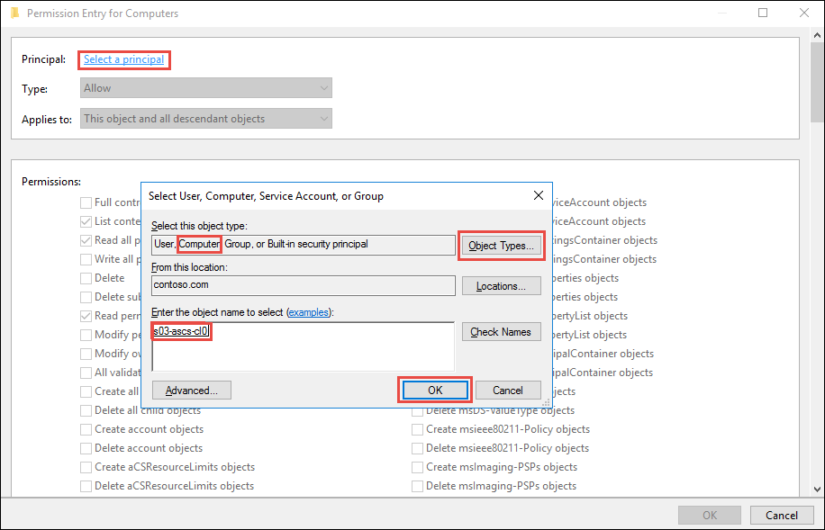

1.  In the **Permission Entry for S03** window, ensure that **Allow** appears in the **Type** drop-down list. Next, in the **Applies to** drop-down list, click **This object and all descendant objects**. In the **Permissions** list, click **Create Computer objects** and click **OK**.

    

1. Back in the **Advanced Security for S03** window, click **OK**.

### Task 2: Install the SAP ASCS components on s03-ascs-0

In this task, you will use SAP Software Provisioning Manager to carry out the distributed installation of ASCS components on the first node of ASCS cluster of MS SQL Server-based SAP NetWeaver 7.5 deployment. Run the installation as the **CONTOSO\\s03-su** account you created in the first exercise. During the installation, address all necessary prerequisites, and specify the following parameters:

-   Destination Drive for Local Instances: **U:**

-   SAP System ID (SAPSID): **S03**

-   DNS Domain Name for SAP Systems: **contoso.com**

-   Windows Domain: **Domain of Current User**

-   Windows Domain for SAP Host Agent: **Local Domain**

-   ASCS Instance Number: **00**

-   ABAP Message Server Port: **3600**

-   Internal ABAP Message Server Port: **3900**

-   Install an SAP Web Dispatcher integrated in the ASCS instance: **Yes**

-   Install a Gateway integrated in the ASCS instance: **Yes**

-   Set SAP Web Dispatcher Encryption Mode: **Never**

-   Set all passwords to **demo\@pass123**

Account for the fact you will be using the virtual names, and configure the following registry entries on both VMs:

-   HKLM\\SYSTEM\\CurrentControlSet\\Control\\LSA

    -   Set DisableLoopbackCheck to 1

-   HKLM:\\SYSTEM\\CurrentControlSet\\Services\\lanmanserver\\parameters

    -   Set DisableStrictNameChecking to 1

1.  Within the Remote Desktop session to s03-ascs-0, download the SAP NetWeaver installation media to the local drive and start SAP Software Provisioning Manager by executing **sapinst.exe**.

    

1.  The installation will automatically launch Internet Explorer and display a notification regarding a problem with the website's security certificate. This is expected. Click **More information** and the **Go on to the web page (not recommended)** links and, when prompted, sign-in with the **CONTOSO\\s03-su** account you created in the first exercise.

1.  On the **Welcome to SAP Installation** page, navigate to **SAP NetWeaver 7.5-\>MS SQL Server-\>Installation-\>Application Server ABAP-\>Distributed System-\>ASCS Instance**, and select **Next**.

    

1.  On the **Parameter Settings** page, select **Custom**, and select **Next**.

    

1.  On the **Warning** page, click **OK**. You will be automatically logged off. Log back on by using the same user credentials (**CONTOSO\\s03-su**), if prompted, in the **Open File - Security Warning** dialog box, click **Run**, and, when prompted, sign-in again with the **CONTOSO\\s03-su** account. Once the Software Provisioning Manager starts automatically, click again the **Continue to this website (not recommended)** link, and then, when prompted, sign-in again with the **CONTOSO\\s03-su**.

    

1.  The Software Provisioning Manager will automatically launch Internet Explorer and display a notification regarding a problem with the website's security certificate again. Click **More information** and the **Go on to the web page (not recommended)** links and, when prompted, sign-in with the **CONTOSO\\s03-su** account you created in the first exercise.

1.  On the **General SAP System Parameters** page, set **SAP System ID (SAPSID)** to **S03**, select the **U:** drive for the **Destination Drive**, and click **Next**.

    

1.  On the **DNS Domain Name** page, accept the default settings, and click **Next**.

    

1.  On the **Master Password** page, set **Password for All Users** to **demo\@pass123**, and click **Next**.

    

1.  On the **Windows Domain** page, accept the default settings and click **Next**.

    

1.  On the **Organizational Units for Windows Domain** page, accept the default settings, and click **Next**.

    

1.  On the **Software Package Browser** page, point to the location of the software packages including the kernel, and click **Next**, and, once the package is found, click **Next** again.

    

1.  On the **Prerequisites Checker Results** page, identify the missing prerequisites.

    

1.  In order to satisfy the prerequisites and allow for the use of virtual names in the ASCS layer, you will run a Windows PowerShell script that adjusts the paging file configuration and creates several Windows registry entries. On s03-ascs-0 VM, start a Windows PowerShell ISE session as Administrator and run the following:

    ```
    $nodes = ('s03-ascs-0','s03-ascs-1')

    Invoke-Command $nodes {
        $computerSystem = Get-WmiObject -Class Win32_ComputerSystem -EnableAllPrivileges
        $computerSystem.AutomaticManagedPagefile = $false
        $computerSystem.Put()
        $pageFile = Get-WmiObject -Query "SELECT * FROM Win32_PageFileSetting WHERE Name LIKE '%pagefile.sys'"
        $pageFile.Delete()
        Set-WmiInstance -Class Win32_PageFileSetting -Arguments @{name="D:\pagefile.sys";InitialSize = 20480;MaximumSize = 20480;}
    }
    ```

1.  From the Windows PowerShell ISE session, run:

    ```
    Invoke-Command $nodes {
        $registryPath = 'HKLM:\SYSTEM\CurrentControlSet\Services\lanmanworkstation\parameters'
        $registryEntry = 'DisableCARetryOnInitialConnect'
        $registryValue = 1
        New-ItemProperty -Path $registryPath -Name $registryEntry -Value $registryValue -PropertyType DWORD -Force
    }

    Invoke-Command $nodes {
        $registryPath = 'HKLM:\SYSTEM\CurrentControlSet\Control\LSA'
        $registryEntry = 'DisableLoopbackCheck'
        $registryValue = 1
        New-ItemProperty -Path $registryPath -Name $registryEntry -Value $registryValue -PropertyType DWORD -Force
    }

    Invoke-Command $nodes {
        $registryPath = 'HKLM:\SYSTEM\CurrentControlSet\Services\lanmanserver\parameters'
        $registryEntry = 'DisableStrictNameChecking'
        $registryValue = 1
        New-ItemProperty -Path $registryPath -Name $registryEntry -Value $registryValue -PropertyType DWORD -Force
    }
    ```

1.  On the **Prerequisites Checker Results** page, click **Next**. When prompted whether to repeat the checks, click **Yes**.

1.  On the **Software Package Browser** page, point to the location of the software packages including the **SAPHOSTAGENT.SAR**, click **Next**, and, once the package is found, click **Next** again.

    

1.  On the **Windows Domain for SAP Host Agent** page, accept the default settings, and click **Next**.

    

1.  On the **SAP Host Agent Operating System Users** page, set the passwords to **demo\@pass123**, and click **Next**.

    

1.  On the **ASCS Instance** page, accept the default settings, and click **Next**.

    

1.  On the **ABAP Message Server Ports** page, accept the default settings, and click **Next**.

    

1.  On the **Additional Components to be Included in the ASCS Instance** page, select the checkboxes **Install SAP Web Dispatcher integrated in the ASCS instance** and **Install a Gateway integrated in the ASCS instance**, and then click **Next**.

    

1.  On the **SAP Web Dispatcher Parameters** page, set the Encryption Mode to **Never**, and click **Next**.

    

1.  On the **ICM User Management for the SAP Web Dispatcher** page, set the password of webadm to **demo\@pass123**, and click **Next**.

    

1.  On the **Parameter Summary** page, click **Next**.

    

1.  Monitor progress of installation.

    

1.  Wait until the installation completes. This might take about 5 minutes. Once the installation completes, click **OK**.

    

1.  On the **Execution of Service has been completed successfully** page, click **Exit**.

    


### Task 3: Install the SAP ASCS components on s03-ascs-1

In this task, you will use SAP Software Provisioning Manager to carry out the distributed installation of ASCS components on the second node of ASCS cluster of MS SQL Server-based SAP NetWeaver 7.5 deployment. Run the installation as the **CONTOSO\\s03-su** account you created in the first exercise. During the installation, address all necessary prerequisites, and specify the following parameters:

-   Destination Drive for Local Instances: **U:**

-   SAP System ID (SAPSID): **S03**

-   DNS Domain Name for SAP Systems: **contoso.com**

-   Windows Domain: **Domain of Current User**

-   Windows Domain for SAP Host Agent: **Local Domain**

-   ASCS Instance Number: **00**

-   ABAP Message Server Port: **3600**

-   Internal ABAP Message Server Port: **3900**

-   Install an SAP Web Dispatcher integrated in the ASCS instance: **Yes**

-   Install a Gateway integrated in the ASCS instance: **Yes**

-   Set SAP Web Dispatcher Encryption Mode: **Never**

-   Set all passwords to **demo\@pass123**

1.  Within the Remote Desktop session to the **s03-adm-0** Azure VM, start a Remote Desktop session to **s03-ascs-1**. When prompted to authenticate, sign in with the **CONTOSO\\s03-su** user account you created in the first exercise.

1.  Within the Remote Desktop session to s03-ascs-1 VM, in Server Manager, click the **Local Server** entry, click the **On** link next to the **IE Enhanced Security Configuration** label, in the **Internet Explorer Enhanced Security Configuration** dialog box, click both **Off** options, and click **OK**.

1.  Within the Remote Desktop session to s03-ascs-1, download the SAP NetWeaver installation media to the local drive and start SAP Software Provisioning Manager by executing **sapinst.exe**.

    

1.  The installation will automatically launch Internet Explorer and display a notification regarding a problem with the website's security certificate. This is expected. Click **More information** and the **Go on to the web page (not recommended)** links and, when prompted, sign-in with the **CONTOSO\\s03-su** account you created in the first exercise.

1.  On the **Welcome to SAP Installation** page, navigate to **SAP NetWeaver 7.5-\>MS SQL Server-\>Installation-\>Application Server ABAP-\>Distributed System-\>ASCS Instance**, and select **Next**.

    

1.  On the **Parameter Settings** page, select **Custom**, and select **Next**.

    

1.  On the **Warning** page, click **OK**. You will be automatically logged off. Log back on by using the same user credentials (**CONTOSO\\s03-su**), if prompted, in the **Open File - Security Warning** dialog box, click **Run**, and, when prompted, sign-in again with the **CONTOSO\\s03-su** account. Once the Software Provisioning Manager starts automatically, click again the **Continue to this website (not recommended)** link, and then, when prompted, sign-in again with the **CONTOSO\\s03-su**.

    

1.  The Software Provisioning Manager will automatically launch Internet Explorer and display a notification regarding a problem with the website's security certificate again. Click **More information** and the **Go on to the web page (not recommended)** links and, when prompted, sign-in with the **CONTOSO\\s03-su** account you created in the first exercise.

1.  On the **General SAP System Parameters** page, set **SAP System ID (SAPSID)** to **S03**, select the **U:** drive for the **Destination Drive**, and click **Next**.

    

1.  On the **DNS Domain Name** page, accept the default settings, and click **Next**.

    

1.  On the **Master Password** page, set **Password for All Users** to **demo\@pass123**, and click **Next**.

    

1.  On the **Windows Domain** page, accept the default settings and click **Next**.

    

1.  On the **Organizational Units for Windows Domain** page, accept the default settings, and click **Next**.

    

1.  On the **Software Package Browser** page, point to the location of the software packages including the kernel, and click **Next**, and, once the package is found, click **Next** again.

    

1.  On the **Software Package Browser** page, point to the location of the software packages including the **SAPHOSTAGENT.SAR**, click **Next**, and, once the package is found, click **Next** again.

    

1.  On the **Windows Domain for SAP Host Agent** page, accept the default settings, and click **Next**.

    

1.  On the **SAP Host Agent Operating System Users** page, set the passwords to **demo\@pass123**, and click **Next**.

    

1.  On the **ASCS Instance** page, accept the default settings, and click **Next**.

    

1.  On the **ABAP Message Server Ports** page, accept the default settings, and click **Next**.

    

1.  On the **Additional Components to be Included in the ASCS Instance** page, select the checkboxes **Install SAP Web Dispatcher integrated in the ASCS instance** and **Install a Gateway integrated in the ASCS instance**, and then click **Next**.

    

1.  On the **SAP Web Dispatcher Parameters** page, set the Encryption Mode to **Never**, and click **Next**.

    

1.  On the **ICM User Management for the SAP Web Dispatcher** page, set the password of webadm to **demo\@pass123**, and click **Next**.

    

1.  On the **Parameter Summary** page, click **Next**.

    

1.  Monitor progress of installation.

    

1.  Wait until the installation completes. This might take about 5 minutes. Once the installation completes, click **OK**.

    

1.  On the **Execution of Service has been completed successfully** page, click **Exit**.

    


### Task 4: Configure SAP ASCS cluster components on s03-ascs-0 and s03-ascs-1

In this task, you will configure SAP ASCS cluster components, including Azure Files to host sapmnt share. These extra steps are necessary since, at the time of authoring this content, Software Provisioning Manager does not yet support clustered installation of ASCS components with Azure Files-based sapmnt share.

1.  Within the Remote Desktop session to s03-ascs-0, in the Windows PowerShell ISE session, remove the sapmnt shares created in the first and the second tasks of this exercise by running the following:

    ```
    $vmNames = @('s03-ascs-0','s03-ascs-1')

    Invoke-Command $vmNames {Remove-SmbShare sapmnt -ScopeName * -Force}
    ```

1.  Within the Remote Desktop session to s03-ascs-0, in the Windows PowerShell ISE session, create the saploc share on both cluster nodes by running the following:

    ```
    $vmNames = @('s03-ascs-0','s03-ascs-1')

    Invoke-Command $vmNames -ScriptBlock {
        $sapSid = "S03"
        $domainName = 'CONTOSO'
        $sapSidGlobalAdminGroupName = "$domainName\SAP_" + $sapSid + "_GlobalAdmin"
        $hostName = $env:computername
        $sapLocalAdminGroupName = "$hostName\SAP_LocalAdmin"
        $sapDisk = "U:"
        $sapUsrSapPath = "$sapDisk\usr\sap"
        New-SmbShare -Name saploc -Path $sapUsrSapPath -FullAccess "BUILTIN\Administrators", $sapSidGlobalAdminGroupName , $sapLocalAdminGroupName   
    }
    ```

1.  Within the Remote Desktop session to s03-ascs-0, in the Windows PowerShell ISE session, create SAP<SID> cluster group, network name and IP by running the following:

    ```
    # Create SAP Cluster Group
    $sapSid = "S03"
    $sapASCSClusterGroupName = "SAP $sapSid"
    $sapASCSIPClusterResourceName = "SAP $sapSid IP"
    $sapASCSNetworkNameClusterResourceName = "s03-ascs-v0"
    $sapASCSIPAddress = "10.0.1.16"
    $sapASCSSubnetMask = "255.255.255.0"

    # Create an SAP ASCS instance virtual IP cluster resource
    Add-ClusterGroup -Name $sapASCSClusterGroupName -Verbose

    #Create an SAP ASCS virtual IP address
    $sapASCSIPClusterResource = Add-ClusterResource -Name $sapASCSIPClusterResourceName -ResourceType "IP Address" -Group $sapASCSClusterGroupName -Verbose
    Stop-ClusterResource -Name $sapASCSIPClusterResource

    # Set a static IP address
    $param1 = New-Object Microsoft.FailoverClusters.PowerShell.ClusterParameter $sapASCSIPClusterResource,Address,$sapASCSIPAddress
    $param2 = New-Object Microsoft.FailoverClusters.PowerShell.ClusterParameter $sapASCSIPClusterResource,SubnetMask,$sapASCSSubnetMask
    $params = $param1,$param2
    $params | Set-ClusterParameter

    # Create a corresponding network name
    $sapASCSNetworkNameClusterResource = Add-ClusterResource -Name $sapASCSNetworkNameClusterResourceName -ResourceType "Network Name" -Group $sapASCSClusterGroupName -Verbose
    Stop-ClusterResource -Name $sapASCSNetworkNameClusterResource 

    # Set a network DNS name
    $sapASCSNetworkNameClusterResource | Set-ClusterParameter -Name Name -Value $sapASCSNetworkNameClusterResourceName

    #Check the updated values
    $sapASCSNetworkNameClusterResource | Get-ClusterParameter

    #Set resource dependencies
    Set-ClusterResourceDependency -Resource $sapASCSNetworkNameClusterResourceName -Dependency "[$sapASCSIPClusterResourceName]" -Verbose

    #Start an SAP <SID> cluster group
    Start-ClusterGroup -Name $sapASCSClusterGroupName -Verbose
    ```

1.  Within the Remote Desktop session to s03-ascs-0, start Command Prompt as Administrator and copy files from the local ASCS instances to the Azure Files-based sapmnt share by running the following (where `<storage_account_name>` designates the name of the storage account you created in the previous exercise):

    ```
    robocopy U:\usr\sap\S03 \\<storage_account_name>.file.core.windows.net\sapmnt\S03 /e /r:1 /w:1
    ```

1.  Within the Remote Desktop session to s03-ascs-0, rename **\\<storage_account_name>.file.core.windows.net\sapmnt\S03\SYS\profile\S03_ASCS00_s03-ascs-0** to **\\<storage_account_name>.file.core.windows.net\sapmnt\S03\SYS\profile\S03_ASCS00_s03-ascs-v0**.

1.  Within the Remote Desktop session to s03-ascs-0, modify the content of **\\<storage_account_name>.file.core.windows.net\sapmnt\S03\SYS\profile\S03_ASCS00_s03-ascs-v0** by replacing the following entries:

    ```
    SAPGLOBALHOST = s03-ascs-0
    DIR_PROFILE = \\s03-ascs-0\sapmnt\S03\SYS\profile
    _PF = $(DIR_PROFILE)\S03_ASCS00_s03-ascs-0
    ```

    with the following ones (where `<storage_account_name>` designates the name of the storage account you created in the previous exercise):

    ```
    SAPLOCALHOST = s03-ascs-v0
    SAPGLOBALHOST = <storage_account_name>
    SAPGLOBALHOSTFULL = <storage_account_name>
    DIR_PROFILE = \\<storage_account_name>.file.core.windows.net\sapmnt\S03\SYS\profile
    _PF = $(DIR_PROFILE)\S03_ASCS00_s03-ascs-v0
    service/check_ha_node = 1
    enque/encni/set_so_keepalive = true
    ```

1.  Within the Remote Desktop session to s03-ascs-0, modify the content of **\\<storage_account_name>.file.core.windows.net\sapmnt\S03\SYS\profile\S03_ASCS00_s03-ascs-v0** by replacing the following entries:

    ```
    #-----------------------------------------------------------------------
    # Start SAP message server
    #-----------------------------------------------------------------------
    _MS = $(DIR_EXECUTABLE)\msg_server$(FT_EXE)
    Restart_Program_02 = local $(_MS) pf=$(_PF)
    #-----------------------------------------------------------------------
    # Start SAP enqueue server
    #-----------------------------------------------------------------------
    _EN = $(DIR_EXECUTABLE)\enserver$(FT_EXE)
    Restart_Program_03 = local $(_EN) pf=$(_PF)
    wdisp/system_0 = SID=S03, MSHOST=s03-ascs-0, MSPORT=8100, SSL_ENCRYPT=0
    ```

    with the following ones:

    ```
    #-----------------------------------------------------------------------
    # Start SAP message server
    #-----------------------------------------------------------------------
    _MS = $(DIR_EXECUTABLE)\msg_server$(FT_EXE)
    Start_Program_02 = local $(_MS) pf=$(_PF)
    #-----------------------------------------------------------------------
    # Start SAP enqueue server
    #-----------------------------------------------------------------------
    _EN = $(DIR_EXECUTABLE)\enserver$(FT_EXE)
    Start_Program_03 = local $(_EN) pf=$(_PF)
    wdisp/system_0 = SID=S03, MSHOST=s03-ascs-v0, MSPORT=8100, SSL_ENCRYPT=0
    ```

1.  Within the Remote Desktop session to s03-ascs-0, modify the content of **\\<storage_account_name>.file.core.windows.net\sapmnt\S03\SYS\profile\DEFAULT.PFL** by replacing the following entries:

    ```
    rdisp/mshost = s03-ascs-0
    enque/serverhost = s03-ascs-0
    ```

    with the following ones:

    ```
    SAPGLOBALHOST = <storage_account_name>
    SAPGLOBALHOSTFULL = <storage_account_name>
    DIR_PROFILE = \\<storage_account_name>.file.core.windows.net\sapmnt\S03\SYS\profile
    rdisp/mshost = s03-ascs-v0
    enque/serverhost = s03-ascs-v0
    ```

1.  Log off from s03-ascs-0 and re-logon by using the following credentials:

    -   Username: **contoso\\s03adm**

    -   Password: **demo\@pass123**

1.  Within the Remote Desktop session to s03-ascs-0, right-click **Start**, click **Run** and from the **Run** dialog box, launch **sysdm.cpl**.

1.  In the **System Properties** window, switch to the **Advanced** tab and click **Environment Variables**.

1.  In the **Environment Variables** window, replace the values of the following user variables (where `<storage_account_name>` designates the name of the storage account you created in the previous exercise):

    ```
    RSEC_SSFS_DATAPATH=\\s03-ascs-0\sapmnt\S03\SYS\global\security\rsecssfs\data
    RSEC_SSFS_KEYPATH=\\s03-ascs-0\sapmnt\S03\SYS\global\security\rsecssfs\key
    SAPEXE=U:\usr\sap\S03\SYS\exe\uc\NTAMD64
    SAPLOCALHOST=s03-ascs-0
    ```

    with: 

    ```
    RSEC_SSFS_DATAPATH=\\<storage_account_name>.file.core.windows.net\sapmnt\S03\SYS\global\security\rsecssfs\data
    RSEC_SSFS_KEYPATH=\\<storage_account_name>.file.core.windows.net\sapmnt\S03\SYS\global\security\rsecssfs\key
    SAPEXE=\\<storage_account_name>.file.core.windows.net\sapmnt\S03\SYS\exe\uc\NTAMD64
    SAPLOCALHOST=s03-ascs-v0
    ```

1.  Log off from s03-ascs-1 and re-logon by using the following credentials:

    -   Username: **contoso\\s03adm**

    -   Password: **demo\@pass123**

1.  Within the Remote Desktop session to s03-ascs-1, right-click **Start**, click **Run** and from the **Run** dialog box, launch **sysdm.cpl**.

1.  In the **System Properties** window, switch to the **Advanced** tab and click **Environment Variables**.

1.  In the **Environment Variables** window, replace the values of the following user variables (where `<storage_account_name>` designates the name of the storage account you created in the previous exercise):

    ```
    RSEC_SSFS_DATAPATH=\\s03-ascs-1\sapmnt\S03\SYS\global\security\rsecssfs\data
    RSEC_SSFS_KEYPATH=\\s03-ascs-1\sapmnt\S03\SYS\global\security\rsecssfs\key
    SAPEXE=U:\usr\sap\S03\SYS\exe\uc\NTAMD64
    SAPLOCALHOST=s03-ascs-1
    ```

    with: 

    ```
    RSEC_SSFS_DATAPATH=\\<storage_account_name>.file.core.windows.net\sapmnt\S03\SYS\global\security\rsecssfs\data
    RSEC_SSFS_KEYPATH=\\<storage_account_name>.file.core.windows.net\sapmnt\S03\SYS\global\security\rsecssfs\key
    SAPEXE=\\<storage_account_name>.file.core.windows.net\sapmnt\S03\SYS\exe\uc\NTAMD64
    SAPLOCALHOST=s03-ascs-v0
    ```

1.  Within the Remote Desktop session to s03-ascs-0, from the Command Prompt, re-register the SAP ASCS/SCS service to point to the new profile and profile path by running the following (where `<storage_account_name>` designates the name of the storage account you created in the previous exercise):

    ```
    U:\usr\sap\S03\ASCS00\exe\sapstartsrv.exe -r -p \\<storage_account_name>.file.core.windows.net\sapmnt\S03\SYS\profile\S03_ASCS00_s03-ascs-v0 -s S03 -n 00 -U CONTOSO\SAPServiceS03 -P demo@pass123 -e CONTOSO\s03adm
    ```

1.  When prompted, in the **SAP Service Install/Uninstall** window, click **OK** and, once the service starts successfully, click **OK** again.

    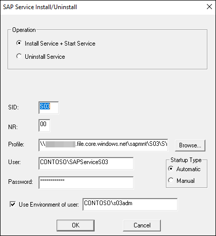

1.  Within the Remote Desktop session to s03-ascs-1, from the Command Prompt, re-register the SAP ASCS/SCS service to point to the new profile and profile path by running the following (where `<storage_account_name>` designates the name of the storage account you created in the previous exercise:

    ```
    U:\usr\sap\S03\ASCS00\exe\sapstartsrv.exe -r -p \\<storage_account_name>.file.core.windows.net\sapmnt\S03\SYS\profile\S03_ASCS00_s03-ascs-v0 -s S03 -n 00 -U CONTOSO\SAPServiceS03 -P demo@pass123 -e CONTOSO\s03adm
    ```

1.  When prompted, in the **SAP Service Install/Uninstall** window, click **OK** and, once the service starts successfully, click **OK** again.

    

1.  Within the Remote Desktop session to s03-ascs-0, start **SAP Management Console** by clicking its icon on the desktop and, in the SAP Management Console, stop the local instance of SAP ASCS service. In the **SAP Instance Shutdown** window, click **OK**.

    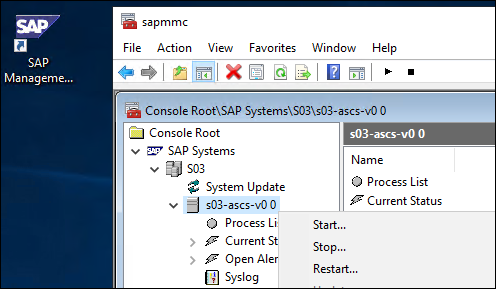

1.  Within the Remote Desktop session to s03-ascs-0 VM, in the Windows PowerShell ISE session, stop the SAPS03_00 service by running the following:

    ```
    Stop-Service -Name SAPS03_00 -Force
    ```

1.  Switch to the Remote Desktop session to s03-ascs-1, start **SAP Management Console** by clicking its icon on the desktop and, in the SAP Management Console, stop the local instance of SAP ASCS service. In the **SAP Instance Shutdown** window, click **OK**.

    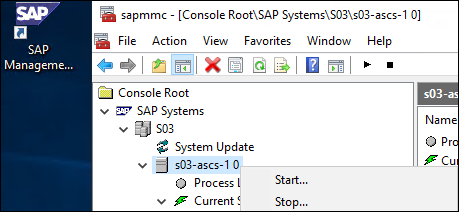

1.  Within the Remote Desktop session to s03-ascs-1, in the Windows PowerShell ISE session, stop the SAPS03_00 service by running the following:

    ```
    Stop-Service -Name SAPS03_00 -Force
    ```

1.  Switch to the Remote Desktop session to s03-ascs-0 VM, and, in the source media folder, extract the content of **NTCLUST.SAR**. This will result in creation of the **NTCLUSTER** folder containing a number of files, including **insapctr.exe** and **saprc.dll**. 

1.  Copy all files from the **NTCLUSTER** folder to **C:\Windows\system32** folder on both **s03-ascs-0** and **s03-ascs-1**. 

1.  Within the Remote Desktop session to s03-ascs-0 VM, from the Command Prompt, register **saprc.dll** by running the following:

    ```
    cd C:\Windows\system32
    insaprct.exe -install
    ```

1.  Within the Remote Desktop session to s03-ascs-0 VM, and in the Windows PowerShell ISE session, create a new instance of SAP service and SAP instance resources by running the following:

    ```
    $sapSID = 'S03'
    $sapInstanceNumber = '00'
    $sapASCSNetworkNameClusterResourceName = 's03-ascs-v0'

    $sapServiceName = "SAP$sapSID"+ "_" + $sapInstanceNumber

    $sapClusterGroupName = "SAP $sapSID"
    $sapServiceClusterResourceName = "SAP $sapSID $sapInstanceNumber Service"

    $sapASCSServiceClusterResource = Add-ClusterResource -Name $sapServiceClusterResourceName -Group $sapClusterGroupName -ResourceType "SAP Service" -SeparateMonitor -Verbose
    $sapASCSServiceClusterResource  | Set-ClusterParameter  -Name ServiceName -Value $sapServiceName

    #Set resource dependencies
    Set-ClusterResourceDependency -Resource $sapASCSServiceClusterResource  -Dependency "[$sapASCSNetworkNameClusterResourceName]" -Verbose

    $sapInstanceClusterResourceName = "SAP $sapSID $sapInstanceNumber Instance"

    # Create SAP instance cluster resource
    $sapASCSServiceClusterResource = Add-ClusterResource -Name $sapInstanceClusterResourceName -Group $sapClusterGroupName -ResourceType "SAP Resource" -SeparateMonitor -Verbose

    #Set SAP instance cluster resource parameters
    $sapASCSServiceClusterResource  | Set-ClusterParameter  -Name SAPSystemName -Value $sapSID -Verbose
    $sapASCSServiceClusterResource  | Set-ClusterParameter  -Name SAPSystem -Value $sapInstanceNumber -Verbose

    #Set resource dependencies
    Set-ClusterResourceDependency -Resource $sapASCSServiceClusterResource -Dependency "[$sapServiceClusterResourceName]" -Verbose
    ```

1.  Within the Remote Desktop session to s03-ascs-0 VM, and in the Windows PowerShell ISE session, set the probe port to **62000** (the probe port must match the port of the **probeascs** of the **s03-lb-ascs** load balancer you deployed in the first exercise of this lab) by running the following (when prompted, type **yes** and press Enter):

    ```
    $SAPSID = "S03"
    $probePort = 62000   # ProbePort of the Azure internal load balancer

    Clear-Host
    $sapClusterRoleName = "SAP $SAPSID"
    $sapIPResourceName = "SAP $SAPSID IP"
    $sapIPResourceClusterParameters =  Get-ClusterResource $sapIPResourceName | Get-ClusterParameter
    $ipAddress = ($sapIPResourceClusterParameters | Where-Object {$_.Name -eq "Address" }).Value
    $networkName = ($sapIPResourceClusterParameters | Where-Object {$_.Name -eq "Network" }).Value
    $subnetMask = ($sapIPResourceClusterParameters | Where-Object {$_.Name -eq "SubnetMask" }).Value
    $overrideAddressMatch = ($sapIPResourceClusterParameters | Where-Object {$_.Name -eq "OverrideAddressMatch" }).Value
    $enableDhcp = ($sapIPResourceClusterParameters | Where-Object {$_.Name -eq "EnableDhcp" }).Value
    $oldProbePort = ($sapIPResourceClusterParameters | Where-Object {$_.Name -eq "ProbePort" }).Value

    $var = Get-ClusterResource | Where-Object {  $_.name -eq $sapIPResourceName  }

    Write-Host "Current configuration parameters for SAP IP cluster resource '$sapIPResourceName' are:" -ForegroundColor Cyan
    Get-ClusterResource -Name $sapIPResourceName | Get-ClusterParameter

    Write-Host
    Write-Host "Current probe port property of the SAP cluster resource '$sapIPResourceName' is '$oldProbePort'." -ForegroundColor Cyan
    Write-Host
    Write-Host "Setting the new probe port property of the SAP cluster resource '$sapIPResourceName' to '$probePort' ..." -ForegroundColor Cyan
    Write-Host

    $var | Set-ClusterParameter -Multiple @{"Address"=$ipAddress;"ProbePort"=$probePort;"Subnetmask"=$subnetMask;"Network"=$networkName;"OverrideAddressMatch"=    $overrideAddressMatch;"EnableDhcp"=$enableDhcp}

    Write-Host

    $ActivateChanges = Read-Host "Do you want to take restart SAP cluster role '$sapClusterRoleName', to activate the changes (yes/no)?"

    if($ActivateChanges -eq "yes"){
    Write-Host
    Write-Host "Activating changes..." -ForegroundColor Cyan

    Write-Host
    Write-Host "Taking SAP cluster IP resource '$sapIPResourceName' offline ..." -ForegroundColor Cyan
    Stop-ClusterResource -Name $sapIPResourceName
    Sleep 5

    Write-Host "Starting SAP cluster role '$sapClusterRoleName' ..." -ForegroundColor Cyan
    Start-ClusterGroup -Name $sapClusterRoleName

    Write-Host "New ProbePort parameter is active." -ForegroundColor Green
    Write-Host

    Write-Host "New configuration parameters for SAP IP cluster resource '$sapIPResourceName':" -ForegroundColor Cyan
    Write-Host
    Get-ClusterResource -Name $sapIPResourceName | Get-ClusterParameter
    } else {
    Write-Host "Changes are not activated."
    }

    ```

1.  Within the Remote Desktop session to s03-ascs-0 VM, and in the Windows PowerShell ISE session, adjust failover detection thresholds by running the following:

    ```
    (Get-Cluster).SameSubNetDelay = 2000
    (Get-Cluster).SameSubNetThreshold = 15
    (Get-Cluster).RoutingHistoryLength = 30
    ```

### Task 5: Install the Enqueue Replication Server instance on both nodes of the cluster

In this task, you will install the Enqueue Replication Server (ERS) instance on both nodes of the cluster.

1.  Within the Remote Desktop session to s03-ascs-0, start SAP Software Provisioning Manager by executing **sapinst.exe**.

    

1.  The installation will automatically launch Internet Explorer and display a notification regarding a problem with the website's security certificate. This is expected. Click **More information** and the **Go on to the web page (not recommended)** links and, when prompted, sign-in with the **CONTOSO\\s03-su** account you created in the first exercise.

1.  On the **Welcome to SAP Installation** page, navigate to **SAP NetWeaver 7.5-\>MS SQL Server-\>Installation-\>Application Server ABAP-\>Additional SAP System Instances-\>Enqueue Replication Server Instance**, and select **Next**.

    

1.  On the **General Parameter Settings** page, accept the default settings, and select **Next**.

    

1.  On the **Operating System Users** page, type the passwords **demo\@pass123** twice, and click **Next**.

    

1.  On the **Enqueue Replication Server Instance** page, accept default settings and click **Next**.

    

1.  On the **Upgrade SAP Host Agent** page, accept the default settings, and click **Next**.

    

1.  On the **Software Package Browser** page, point to the location of the software packages including the **SAPHOSTAGENT.SAR**, click **Next**, and, once the package is found, click **Next** again.

    

1.  On the **Enqueue Replication Server Instance** page, change the name of the **ERS Instance Host** to **s03-ascs-ers0** and click **Next**.

    

1.  On the **Activate Server Instance** page, accept default settings and click **Next**.

    

1.  On the **Parameter Summary** page, click **Next**.

    

1.  Monitor progress of installation.

    

1.  Wait until the installation completes. This might take about 5 minutes. Once the installation completes, click **OK**.

    

1.  On the **Execution of Service has been completed successfully** page, click **Exit**.

    

1.  Within the Remote Desktop session to s03-ascs-1, start SAP Software Provisioning Manager by executing **sapinst.exe**.

    

1.  The installation will automatically launch Internet Explorer and display a notification regarding a problem with the website's security certificate. This is expected. Click **More information** and the **Go on to the web page (not recommended)** links and, when prompted, sign-in with the **CONTOSO\\s03-su** account you created in the first exercise.

1.  On the **Welcome to SAP Installation** page, navigate to **SAP NetWeaver 7.5-\>MS SQL Server-\>Installation-\>Application Server ABAP-\>Additional SAP System Instances-\>Enqueue Replication Server Instance**, and select **Next**.

    

1.  On the **General Parameter Settings** page, accept the default settings, and select **Next**.

    

1.  On the **Operating System Users** page, type the passwords **demo\@pass123** twice, and click **Next**.

    

1.  On the **Enqueue Replication Server Instance** page, accept default settings and click **Next**.

    

1.  On the **Upgrade SAP Host Agent** page, accept the default settings, and click **Next**.

    

1.  On the **Software Package Browser** page, point to the location of the software packages including the **SAPHOSTAGENT.SAR**, click **Next**, and, once the package is found, click **Next** again.

    

1.  On the **Enqueue Replication Server Instance** page, change the name of the **ERS Instance Host** to **s03-ascs-ers1** and click **Next**.

    

1.  On the **Activate Server Instance** page, accept default settings and click **Next**.

    

1.  On the **Parameter Summary** page, click **Next**.

    

1.  Monitor progress of installation.

    

1.  Wait until the installation completes. This might take about 5 minutes. Once the installation completes, click **OK**.

    

1.  On the **Execution of Service has been completed successfully** page, click **Exit**.

    

1.  To verify the installation, start **SAP Management Console** by clicking its icon on the desktop and verify that all SAP components are operational.

    


### Summary

In this exercise, you configured the Azure VMs that constitute the SAP ASCS layer. This included installing and configuring Failover Clustering on both VMs and running the Software Provisioning Manager on each.

## Exercise 3: Configure SAP NetWeaver database servers

Duration: 120 minutes

### Overview

In this exercise, you will configure the SAP NetWeaver database servers. You will start by installing a separate, stand-alone instance of SQL Server 2017 on each VM. Next, you will run SAP Software Provisioning Manager to install HA DB component on the s03-db-0 VM. Afterwards, you will implement high-availability by setting both SQL Server instances as members of the same Always-On Availability Group. Just as in the previous exercise, you will use Cloud Witness to provide the quorum for the Failover Cluster. You will also copy SQL Server logins from the instance hosted on s03-db-0 to the instance hosted on s03-db-1. Finally, you will update the SAP default profile to point to the Always-On Availability Group listener, rather than to an individual SQL Server 2017 instance.

### Task 1: Configure storage of the SAP database layer.

In this task, you will configure the Azure VMs for the database layer by attaching an extra Premium 512 GB data disk to each of them (the template-based deployment resulted in one disk of 128 GB in size already attached to every Azure VM within that deployment). Set the host caching on the 128 GB disk to **None** (since this disk will be used to host logs) and on the 512 GB disk to **Read-only** (since this disk will be used to host data files). To configure a Cloud Witness for the database cluster, you will use the same storage account you created in the second exercise when deploying the SAP Azure infrastructure components, so there is no need to create another storage account for this purpose.

1.  From the Azure portal, navigate to the **s03-db-0** VM blade, and click **Disks**.

1.  From the **s03-db-0 - Disks** blade, add a 512 GB Premium managed data disk named **s03-db-0_disk3**.

1.  Set **HOST CACHING** for the newly added disk to **Read-only**.

1.  Set **HOST CACHING** for the first data disk to **None**.

1.  From the Azure portal, navigate to the **s03-db-1** VM blade, and click **Disks**.

1.  From the **s03-db-0 - Disks** blade, add a 512 GB Premium managed data disk named **s03-db-1_disk3**.

1.  Set **HOST CACHING** for the newly added disk to **Read-only**.

1.  Set **HOST CACHING** for the first data disk to **None**.

### Task 2: Grant elevated user rights to the SQL Server service account

In this task, you will use Group Policy to grant the following user rights to the SQL Server service account (**s03-db-0-sqlsvc** and **s03-db-1-sqlsvc**) on the Window Server 2016 computers hosting their respective SQL Server instances.

-   Perform volume maintenance tasks

-   Lock pages in memory

These options provide potential performance improvements, as documented in <https://docs.microsoft.com/en-us/sql/relational-databases/databases/database-instant-file-initialization?view=sql-server-2016> and <https://docs.microsoft.com/en-us/sql/database-engine/configure-windows/enable-the-lock-pages-in-memory-option-windows?view=sql-server-2016> .

In a production deployment, you should consider using domain-based Group Policy Objects rather than local Group Policy. This approach is used in this lab strictly for simplicity.

1.  Within the Remote Desktop session to s03-adm-0, establish an RDP session to **s03-db-0**. When prompted to authenticate, sign in with the **CONTOSO\\s03-su** user account you created in the first exercise.

1.  Within the Remote Desktop session to s03-db-0, in Server Manager, click the **Local Server** entry, click the **On** link next to the **IE Enhanced Security Configuration** label, in the **Internet Explorer Enhanced Security Configuration** dialog box, select both **Off** options, and click **OK**.

1.  Within the Remote Desktop session to s03-db-0, start Group Policy Editor from the Tools menu in Server Manager.

1.  In the left pane of the Local Security Policy console, expand the **Local Policies** node, and then click **User Rights Assignment**.

1.  In the right pane, double-click **Perform volume maintenance tasks**.

1.  In the **Perform volume maintenance tasks Properties** window, click **Add User or Group**.

1.  In the **Select Users or Groups** dialog box, type **CONTOSO\\s03-db-0-sqlsvc** and click **OK** twice.

1.  Back in the Group Policy Editor console, in the right pane, double-click **Lock pages in memory**.

1.  In the **Lock pages in memory Properties** window, click **Add User or Group**.

1.  In the **Select Users or Groups** dialog box, type **CONTOSO\\s03-db-0-sqlsvc** and click **OK** twice.

1.  Restart s03-db-0.

1.  Repeat steps 1-10 on s03-db-1, but this time assign both user rights to **CONTOSO\\s03-db-1-sqlsvc**.

### Task 3: Install SQL Server 2017 with the SQL\_Latin1\_General\_CP850\_BIN2 collation

In this task, you will configure operating system on s03-db-0 and s03-db-1 and install SQL Server 2017 on s03-db-0 and s03-db-1 Azure VMs. Run the installation as the **CONTOSO\\s03-su** account you created in the first exercise. Start by disabling the Windows firewall for the domain profile and mounting the 128 GB data disk as ReFS-formatted L: drive with the disk label **Logs Disk** and the 512 GB data disk as ReFS-formatted M: drive with the disk label **Data Disk**. Perform the installation of SQL Server 2017 on both s03-db-0 and s03-db-1 with the following settings:

-   Use Microsoft Update to check for updates (recommended): **disabled**

-   Feature Selection:

    -   **Database Engine Services**

    -   **Client Tools Connectivity**

-   Instance Configuration: **Default instance**

-   Service Accounts:

    -   s03-db-0

        -   SQL Server: **contoso\\s03-db-0-sqlsvc**

        -   SQL Server Agent: **contoso\\s03-db-0-sqlsvc**

    -   s03-db-1

        -   SQL Server: **contoso\\s03-db-1-sqlsvc**

        -   SQL Server Agent: **contoso\\s03-db-1-sqlsvc**

-   Collation: **SQL\_Latin1\_General\_CP850\_BIN2**

-   Windows authentication mode:

    -   SQL Server Administrators

        -   **contoso\\s03-su**

        -   **s03-db-0\\Administrators**

-   Data Directories:

    -   **Data root directory: C:\\Program Files\\Microsoft SQL Server**

    -   **User database directory: M:\\Program Files\\Microsoft SQL Server\\MSSQL13.MSSQLSERVER\\MSSQL\\Data**

    -   **User database log directory: L:\\Program Files\\Microsoft SQL Server\\MSSQL13.MSSQLSERVER\\MSSQL\\Data**

    -   **Backup directory: M:\\Program Files\\Microsoft SQL Server\\MSSQL13.MSSQLSERVER\\MSSQL\\Backup**

-   TempDB:

    -   **Data directories: M:\\Program Files\\Microsoft SQL Server\\MSSQL13.MSSQLSERVER\\MSSQL\\Data (note that you'll need to create this directory)**.

    -   **Log directory: L:\\Program Files\\Microsoft SQL Server\\MSSQL13.MSSQLSERVER\\MSSQL\\Data**

    -   **On both s03-db-0 and s03-db-1, download and install SQL Server Management Studio with the default settings**.

    -   **Copy SAP specific logins from s03-db-0 to s03-db-1 with their existing settings, including the default database and the server role**.

1.  Within the Remote Desktop session to s03-adm-0, establish an RDP session to **s03-db-0**. When prompted to authenticate, sign in with the **CONTOSO\\s03-su** user account you created in the first exercise.

1.  Within the Remote Desktop session to s03-db-0, start a Windows PowerShell ISE session as Administrator, and run the following:

    ```
    Set-NetFirewallProfile -Profile Domain -Enabled False
    Clear-Disk -Number 2 -RemoveData -Confirm:$false 
    Get-Disk -Number 2 | Initialize-Disk -PartitionStyle GPT -PassThru | New-Partition -DriveLetter 'L' -UseMaximumSize | Format-Volume -FileSystem ReFS -NewFileSystemLabel 'Logs Disk' -Confirm:$false
    Get-Disk -Number 3 | Initialize-Disk -PartitionStyle GPT -PassThru | New-Partition -DriveLetter 'M' -UseMaximumSize | Format-Volume -FileSystem ReFS -NewFileSystemLabel 'Data Disk' -Confirm:$false
    ```

1.  Within the Remote Desktop session to s03-db-0 VM, copy the SQL Server 2017 installation media to a local drive and start its installation by selecting **New SQL Server stand-alone installation or add features to an existing installation** in **SQL Server Installation Center**.

    

1.  On the Product Key page, accept the default, and click **Next**.

1.  On the **License Terms**, enable the **I accept the license terms** checkbox, and click **Next**.

1.  On the **Microsoft Update** page, leave the **Use Microsoft Update to check for updates (recommended)** checkbox unchecked and click **Next**.

1.  On the **Feature Selection** page, select the following checkboxes:

    -   Database Engine Services

    -   Client Tools Connectivity

        Leave all other settings at their defaults and click **Next**.

    

1.  On the **Instance Configuration** page, leave the default settings in place, and click **Next**.

    

1.  In the **Service Accounts** tab on the **Server Configuration** page, set the account for the SQL Server and SQL Server Agent services to **contoso\\s03-db-0-sqlsvc** with **demo\@pass123** password and click **Next**.

1.  Switch to the **Collation** tab and click **Customize**. In the **Customize the SQL Server 2017 Database Engine Collation** window, in the **SQL collation, used for backward compatibility**, click **SQL\_Latin1\_General\_CP850\_BIN2**, and click **OK**. Back on the **Server Configuration** page, click **Next**.

    

1.  On the **Database Engine Configuration** page, ensure the **Windows authentication mode** option is selected, and click **Add Current User**. Next, click **Add** in the **Select Users, Computers, Service Accounts, and Groups** dialog box, type **s03-db-0\\Administrators**, and click **OK**.

    

1.  Back on the **Database Engine Configuration** page, click **Data Directories**, and specify the following settings:

    -   Data root directory: **C:\\Program Files\\Microsoft SQL Server**

    -   User database directory: **M:\\Program Files\\Microsoft SQL Server\\MSSQL14.MSSQLSERVER\\MSSQL\\Data**

    -   User database log directory: **L:\\Program Files\\Microsoft SQL Server\\MSSQL14.MSSQLSERVER\\MSSQL\\Data**

    -   Backup directory: **M:\\Program Files\\Microsoft SQL Server\\MSSQL14.MSSQLSERVER\\MSSQL\\Backup**

    

1.  Back on the **Database Engine Configuration** page, click **TempDB**, and specify the following settings:

    -   Data directories: **M:\\Program Files\\Microsoft SQL Server\\MSSQL14.MSSQLSERVER\\MSSQL\\Data** *(Note that you will need to create this directory.)*

    -   Log directory: **L:\\Program Files\\Microsoft SQL Server\\MSSQL14.MSSQLSERVER\\MSSQL\\Data**

    

1.  Back on the **Database Engine Configuration** page, click **Next**.

1.  On the **Ready to Install** page, click **Install**.

    

1.  Wait for the installation to complete and, on the **Complete** page, click **Close**.

1.  On s03-db-0, start Internet Explorer, browse to <https://docs.microsoft.com/en-us/sql/ssms/download-sql-server-management-studio-ssms?view=sql-server-2017>, and download/install the current production release of the SQL Server Management Studio with the default settings.

1.  Repeat steps 1-17 on s03-db-1, but in step 9, use the **contoso\\s03-db-1-sqlsvc** account, and in step 11, use **s03-db-1\\Administrators**.

### Task 4: Install the SAP database layer

In this task, you will install the SAP database instance on s03-db-0 Azure VM by using the SAP Software Provisioning Manager. Run the installation as the **CONTOSO\\s03-su** account you created in the first exercise. During the installation, address all necessary prerequisites, and specify the following parameters:

-   Profile Directory: **\\\\<storage_account_name>\\sapmnt\\S03\\SYS\\profile**

-   SAP System User Domain: **Domain of Current User**

-   OU Path: **S03**

-   Database instance: **S03-DB-0**

-   SAP Host Agent User Domain: **Local Domain**

-   MS SQL Server Data Files: **4 for small systems**

-   MS SQL Server Database Files:

    -   **data: M:\\S03DATA1**

    -   **data: M:\\S03DATA2**

    -   **data: M:\\S03DATA3**

    -   **data: M:\\S03DATA4**

    -   **log: L:\\S03LOG1**

-   SAP System Database Import:

    -   **Number of Parallel Jobs: 3**

-   Set all passwords to **demo\@pass123**

1.  Within the Remote Desktop session to s03-db-0, copy the SAP NetWeaver installation media to a local drive on s03-db-0 and start SAP Software Provisioning Manager by double-clicking **sapinst.exe** in the **swpm** folder.

    

1.  The installation will automatically launch Internet Explorer and display a notification regarding a problem with the website's security certificate. This is expected. Click the **Continue to this website (not recommended)** link and, when prompted, sign-in with the **CONTOSO\\s03-su** account you created in the first exercise.

1.  On the **Welcome to SAP Installation** page, navigate to **SAP NetWeaver 7.5-\>MS SQL Server-\>Installation-\>Application Server ABAP-\>High-Availability System-\>Database Instance**, and click **Next**.

    

1.  When prompted, click **OK**. You will be automatically logged off. Log back on by using the same user credentials (**CONTOSO\\s03-su**), if prompted, in the **Open File - Security Warning** dialog box, click **Run**, and, when prompted, sign-in again with the **CONTOSO\\s03-su** account. Once the Software Provisioning Manager starts automatically, click again the **Continue to this website (not recommended)** link, and then, when prompted, sign-in again with the **CONTOSO\\s03-su**.

    

1.  On the **General SAP System Parameters** page, in the **Profile Directory** text box type **\\<storage_account_name>\\\\sapmnt\\S03\\SYS\\profile** (where **<storage_account_name>** designates the name of the storage account you created in earlier in this lab) and click **Next**.

    

1. On the **ABAP Message Server** page, accept the default settings, and click **Next**.

    

1.  On the **Master Password** page, set the password to **demo\@pass123**, and click **Next**.

    

1.  On the **Windows Domain** page, accept the default settings and click **Next**.

    

1.  On the **Organizational Units for Windows Domain** page, select the checkbox **Use Organizational Units**, accept the default settings, and click **Next**.

    

1.  On the **General SAP System Parameters** page, accept the default value of **Unicode** of **SAP System Code Page** and click **Next**.

    

1.  On the **MS SQL Server Database Connection** page, ensure that **Database instance** is set to **S03-DB-0**, and click **Next**.

    

1.  On the **New MS SQL Server Database** page, acknowledge the message stating that a new database will be created, and click **Next**.

    

1.  On the **Software Package Browser** page, point to the location of the software packages including the kernel, click **Next**, and once the package is located, click **Next** again.

    

1.  On the **Prerequisites Checker Results** page, identify the missing prerequisites.

    

1.  In order to satisfy the prerequisites and allow for the use of virtual names in the ASCS layer, you will run a Windows PowerShell script that creates several Windows registry entries. On s03-db-0 VM, start a Windows PowerShell ISE session as Administrator and run the following:

    ```
    $nodes = ('s03-db-0','s03-db-1')

    Invoke-Command $nodes {
        $registryPath = 'HKLM:\SYSTEM\CurrentControlSet\Services\lanmanworkstation\parameters'
        $registryEntry = 'DisableCARetryOnInitialConnect'
        $registryValue = 1
        New-ItemProperty -Path $registryPath -Name $registryEntry -Value $registryValue -PropertyType DWORD -Force
    }

    Invoke-Command $nodes {
        $registryPath = 'HKLM:\SYSTEM\CurrentControlSet\Control\LSA'
        $registryEntry = 'DisableLoopbackCheck'
        $registryValue = 1
        New-ItemProperty -Path $registryPath -Name $registryEntry -Value $registryValue -PropertyType DWORD -Force
    }

    Invoke-Command $nodes {
        $registryPath = 'HKLM:\SYSTEM\CurrentControlSet\Services\lanmanserver\parameters'
        $registryEntry = 'DisableStrictNameChecking'
        $registryValue = 1
        New-ItemProperty -Path $registryPath -Name $registryEntry -Value $registryValue -PropertyType DWORD -Force
    }
    ```

1.  On the **Prerequisites Checker Results** page, click **Next**. When prompted whether to repeat the checks, click **Yes**.

1.  On the **Software Package Browser** page, point to the location of the software packages including the **SAPHOSTAGENT.SAR**, and click **Next**.

    

1.  On the **Windows Domain for SAP Host Agent** page, accept the default settings, and click **Next**.

    

1.  On the **SAP Host Agent Operating System Users** page, set the passwords to **demo\@pass123**, and click **Next**.

    

1.  On the **Media Browser** page, set the **Package Location** entry to the location of the **Installation Export NW750 (folder EXP1)**, and click **Next**.

    

1.  On the **Media Browser** page, set the **Package Location** entry to the location of the **Installation Export NW750 (folder EXP3)**, and click **Next**.

    

1.  On the **Media Browser** page, set the **Package Location** entry to the location of the **Installation Export NW750 (folder EXP2)**, and click **Next**.

    

1.  On the **MS SQL Server Database Schema** page, accept the default settings, and click **Next**.

    

1.  On the **MS SQL Server Data Files** page, select the option **4 for small systems**, and click **Next**.

    

1.  On the **MS SQL Server Database Files** page, change the path of the log file to **L:\\S03LOG1**, accept all other default settings, and click **Next**.

    

1.  On the **SQL Server Memory Configuration** page, accept the default settings, and click **Next**.

    

1.  On the **Declustering/Depooling Option** page, accept the default setting, and click **Next**.

    

1.  On the **SAP System Database Import** page, accept the default settings, and click **Next**.

    

1.  On the **MS SQL Server > Required SAP Notes** page, review the information regarding steps after installation, and click **Next**.

    

    >**Note:** While you must implement the SAP Notes referenced in this step in a production environment, their installation will not be included in this lab for the sake of simplicity. 

1.  On the **Parameter Summary** page, click **Next**.

    

1.  Monitor the progress of the installation on the **Execute Service** page.

    

1.  Wait until the installation completes. This might take about 5 minutes. Once the installation completes, click **OK**.

    

1.  On the **Execution of Service has been completed successfully** page, click **Exit**.

    


### Task 5: Implement Always-On Availability Group

In this task, you will implement a Failover Clustering-based cluster named **s03-db-cl0** with the IP address of **10.0.1.17** on s03-db0 and s03-db-1 Azure VMs with Always-On Availability Group hosting the SAP database. Set up the cluster with a Cloud Witness quorum by using the storage account you created in the second exercise. To prepare for setting up Always-On Availability Group for the SAP database you installed in the previous task, grant the **Create Computer Objects** permissions on the **S03** organizational unit in the contoso.com Active Directory to the newly created **contoso\\s03-db-cl0** account. In addition, create a directory structure on s03-db-1 that matches the directory structure on the M: and L: drives of s03-db-0.

Next, from SQL Server Configuration Manager, enable Always-On Availability Groups, and restart the SQL Server (MSSQLSERVER) service on both s03-db-0 and s03-db-01. On s03-db-0, create a new share **C:\\Backup** named **Backup**. On the share level and on the ReFS level, grant **Read/Write** permissions to **CONTOSO\\s03-db-0-sqlsvc** account and **Read** permissions to the **CONTOSO\\s03-db-1-sqlsvc** account.

From SQL Server Management Studio on s03-db-0, use the New Availability Group Wizard to create a new Availability Group with the following settings:

-   Name: **s03-db-ag0**

-   User database for availability group: **S03**

-   Replicas: **S03-DB-0 and S03-DB-1**

    -   Automatic Failover: **Yes**

    -   Synchronous Commit: **Yes**

    -   Readable Secondary: **No**

    -   Initial Data Synchronization: **Full**

    -   A shared network location accessible by all replicas: [**\\\\S03-DB-0\\Backup**](file://S03-DB-0/Backup)

>**Note:** The majority of customers choose to use Transparent Data Encryption (TDE) when deploying SQL Server databases to Azure. If you use TDE, then you cannot use the Always-On Availability Group wizard. Instead, you have to follow the instructions described in <https://blogs.msdn.microsoft.com/saponsqlserver/2017/04/04/more-questions-from-customers-about-sql-server-transparent-data-encryption-tde-azure-key-vault/> . Alternatively, you can enable TDE after establishing the Always On Availability Group, however this is a tedious and slow process. For the purpose of this lab, you will not enable TDE and use the Always-On Availability Group wizard when setting up the Always-On Availability Group.

In the Failover Cluster Manager, create a new Client Access Point with the following settings:

-   Name: **s03-db-agl0**

-   IP address: **10.0.1.16 (static) --** *make sure it matches the IP address assigned to the s03-lb-db load balancer*

Set the dependency of **s03-db-ag0** on **s03-db-agl0**.

Use Windows PowerShell to set the properties of the IP address resource of the newly created Client Access Point as follows:

-   Address: **10.0.1.16**

-   ProbePort: **62500**

-   SubnetMask: **255.255.255.255**

-   Network: **Cluster Network 1**

-   EnableDhcp: **0**

In the SQL Server Management Studio, set the port of the **s03-db-agl0** listener to **1433**.

Bring the Always-On Availability Group clustered role online.

1.  Within the Remote Desktop session to s03-db-0 VM, in the Windows PowerShell ISE session, install the Windows Failover Clustering feature and its subfeatures on s03-db-0 and s03-db-1 and restart both by running the following:

    ```
    $nodes = ('s03-db-0','s03-db-1')
    Invoke-Command $nodes {Install-WindowsFeature Failover-Clustering -IncludeAllSubFeature -IncludeManagementTools} 
    Restart-Computer -ComputerName 's03-db-1' -Force
    Restart-Computer -ComputerName 's03-db-0' -Force
     ```

1.  From s03-adm-0, connect via Remote Desktop session to s03-db-0 as the **CONTOSO\\s03-su** user account.

1.  Within the Remote Desktop session to s03-db-0, start a Windows PowerShell ISE session as Administrator and create a new failover cluster by running the following:

    ```
    $nodes = ('s03-db-0','s03-db-1')
    New-Cluster -Name s03-db-cl0 -Node $nodes -NoStorage -StaticAddress 10.0.1.17
    ```

1.  Wait for the new cluster to be created. Then from the same Windows PowerShell ISE session, authenticate to your Azure subscription by running the following (when prompted, sign in with the Service Administrator account of your Azure subscription):

    ```
    Install-PackageProvider -Name NuGet -Force
    Install-Module -Name Az -Force
    Add-AzAccount
    ```

1.  From the same Windows PowerShell ISE session, create a Cloud Witness quorum by running the following (when prompted, sign in with the Service Administrator account of your Azure subscription):

    ```
    $cwStorageAccountName = (Get-AzStorageAccount -ResourceGroupName s03-RG)[0].StorageAccountName
    $cwStorageAccountKey = (Get-AzStorageAccountKey -ResourceGroupName s03-RG -Name $cwStorageAccountName).Value[0]
    Set-ClusterQuorum -CloudWitness -AccountName $cwStorageAccountName -AccessKey $cwStorageAccountKey
    ```

1.  From the Remote Desktop session to s03-db-0, start Active Directory Administrative Center.

1.  In the Active Directory Administrative Center, navigate to the **S03** organizational unit of the contoso.com domain, and display its properties.

    

1.  In the **S03** window, navigate to the **Extensions** section, and on the **Security** tab, click **Advanced**.

    

1.  In the **Advanced Security Settings for S03** window, click **Add**.

    

1.  In the **Permission Entry for S03** window, click **Select Principal**. In the **Select User, Service Account or Group** dialog box, click **Object Types**, enable the checkbox next to the **Computers** entry, and click **OK**. Back in the **Select User, Computer, Service Account or Group** dialog box, type **s03-db-cl0** in the **Enter the object name to select**, and click **OK**.

    

1.  In the **Permission Entry for S03** window, ensure that **Allow** appears in the **Type** drop-down list. Next, in the **Applies to** drop-down list, click **This object and all descendant objects**. In the **Permissions** list, select **Create Computer objects** and click **OK**.

    

1.  Back in the **Advanced Security for S03** window, click **OK**.

1.  From the Remote Desktop session to s03-db-0, in the Windows PowerShell ISE session, run:

    ```
    Invoke-Command -ComputerName 's03-db-1' {
        New-Item -ItemType Directory M:\S03DATA1
        New-Item -ItemType Directory M:\S03DATA2
        New-Item -ItemType Directory M:\S03DATA3
        New-Item -ItemType Directory M:\S03DATA4
        New-Item -ItemType Directory L:\S03LOG1
    }
    ```

1.  In the remote Desktop Session to s03-db-0, from the Start menu, start **SQL Server Configuration Manager**.

    

1.  In **SQL Server Configuration Manager**, display the **Properties** window of the **SQL Server (MSSQLSERVER)** service, switch to the **Always-On High Availability** tab, enable the checkbox labeled **Enable Always-On Availability Groups**, and click **OK**.

    

1.  When prompted, click **OK**.

    

1.  Restart the **SQL Server (MSSQLSERVER)** service.

    

1.  Repeat steps 14-17 on **s03-db-1**.

1.  On s03-db-0, create a new share **C:\\Backup** named **Backup**. On the share level and on the NTFS level, grant Read/Write permissions to CONTOSO\\s03-db-0-sqlsvc account and Read permissions to the CONTOSO\\s03-db-1-sqlsvc account.

    

    

1.  On s03-db-0, from the Start menu, start **SQL Server Management Studio**.

    

1.  In SQL Server Management Studio, connect to **S03-DB-0**, and use **Windows Authentication** to authenticate.

    

1.  From **SQL Server Management Studio** on s03-db-0, in the **Object Explorer** pane, expand the **Databases** folder, right-click on the **S03** database, and in the right-click menu, select first **Tasks** and then **Back Up**.

    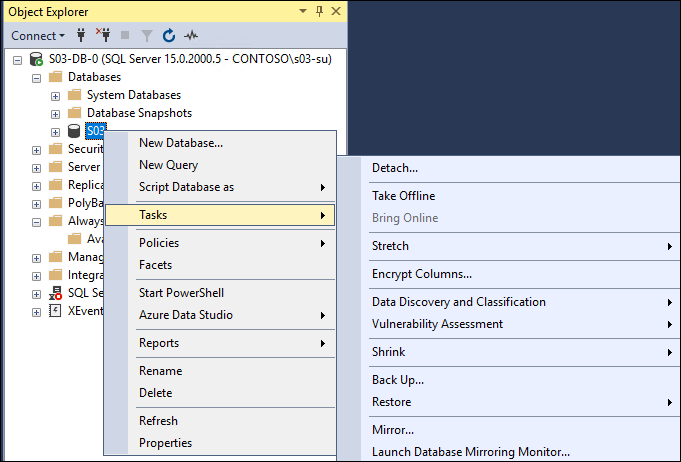

1.  In the **Back Up Database - S03** window, click **Remove** to remove the existing backup path.

    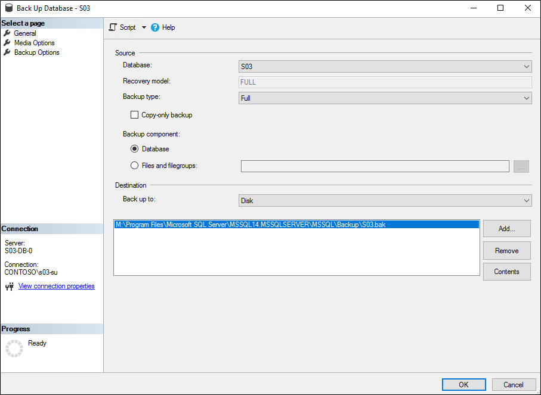

1.  In the **Back Up Database - S03** window, click **Add** and, in the **Select Backup Destination** dialog box, in the **File name** text box, type **C:\\Backup\\S03Full.bak** and click **OK**.

    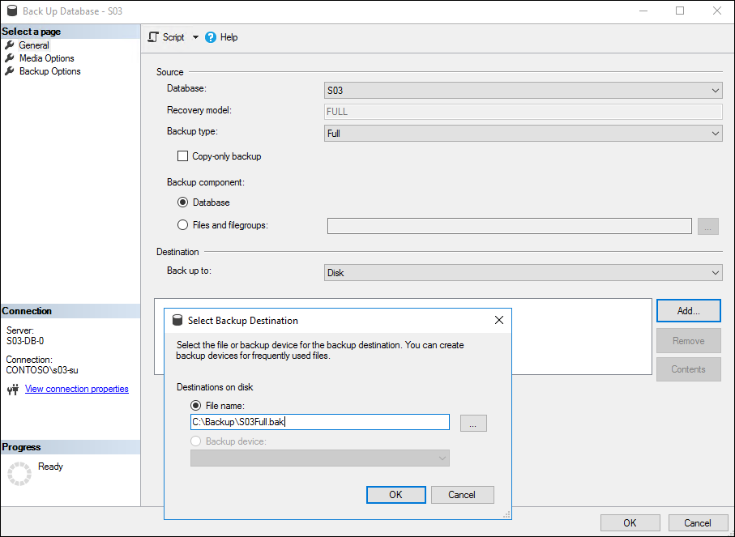

1.  In the **Back Up Database - S03** window, click **OK** to initiate the full backup. 

    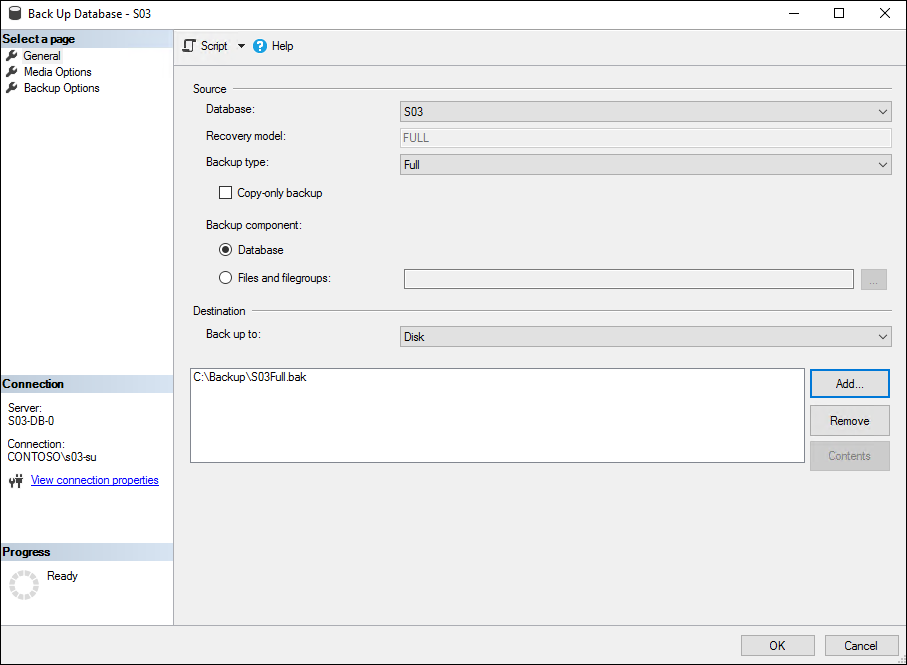

1.  Wait until the backup completes and close the **Back Up Database - S03** window. 

    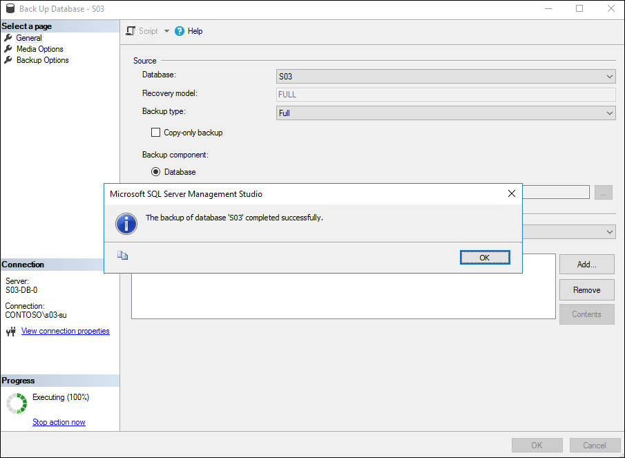

1.  From **SQL Server Management Studio** on s03-db-0, start **New Availability Group Wizard**.

    

1.  On the **Introduction** page of the **New Availability Group** wizard, click **Next**.

1.  On the **Specify an availability group name** page, in the **Availability group name** text box, type **s03-db-ag0**, and click **Next**.

    

1.  On the **Select user database for availability group** page, select the **S03** check box, and click **Next**.

    

1.  On the **Specify Replicas** page, click **Add Replica.** In the **Connect to Server** dialog box **\>** **Server name** text box, type **S03-DB-1** and click **Connect**.

    

1.  On the **Specify Replicas** page, enable automatic failover and synchronous commit.

    

1.  Click the **Endpoints** tab to review the database mirroring endpoints, and click **Next**.

    

1.  On the **Select Initial Data Synchronization** page, ensure the **Full database and log backup** option is selected. In the **Specify the file share path in Windows format** textbox, type **\\\\S03-DB-0\\Backup**, and click **Next**.

    

1.  On the **Validation** page, ensure that all checks completed successfully. Disregard the **Checking the listener configuration** warning, and click **Next**.

    

1.  On the **Summary** page, click **Finish**.

    

1.  On the **Results** page, click **Close**.

    

1.  On s03-db-0, start **Failover Cluster Manager,** click the **Networks** node, and note the network name (**Cluster Network 1**).

    

1.  In the **Failover Cluster Manager** console, navigate to the **Roles** node, and right-click **s03-db-ag0**. In the right-click menu, click **Add Resource** followed by **Client Access Point**.

    

1.  On the **Client Access Point** page of the **New Resource Wizard**, in the **Name** textbox, type **s03-db-agl0**, and click **Next**.

    

1.  On the **Confirmation** page, click **Next**.

    

1.  On the **Summary** page, click **Finish**.

    

1.  In the Failover Cluster Manager console, display the **Properties** dialog box of the IP address resource of the availability group listener resource.

    

1.  In the **IP Address: Address on Cluster Network 1 Properties** dialog box, select the **Static IP Address** option, set the **Address to 10.0.1.25** (to match the IP address assigned to the **frontendsql** frontend IP configuration of the **s03-lb-db** load balancer), and click **OK**.

    

1.  If necessary, back in the **Failover Cluster Manager** console, take the **s03-db-ag0** resource offline.

    

1.  Display the properties of the **s03-db-ag0** resource. In the **s03-db-ag0 Properties** dialog box, switch to the **Dependencies** tab, and add a dependency on **Name: s03-db-agl0**. Click **OK** when completed.

    

1.  From the Windows PowerShell ISE session, run the following:

    ```
    $clusterNetworkName = 'Cluster Network 1' 
    $IPResourceName = 'IP Address 10.0.1.0'
    $ilbIP = '10.0.1.25'
    [int]$probePort = 62500
    Get-ClusterResource $IPResourceName | Set-ClusterParameter -Multiple @{"Address"="$ilbIP";"ProbePort"=$probePort;"SubnetMask"="255.255.255.255";"Network"="$clusterNetworkName";"EnableDhcp"=0}
    ```

1.  From the Failover Cluster Manager console, start the **s03-db-ag0** role.

1.  Switch to **SQL Server Management Studio,** navigate to the **s03-db-agl0** listener, and display its **Properties**.

    

1.  In the **Availability Group Listener Properties -- s03-db-agl0** dialog box, set **Port** to **1433**, and click **OK**.

    

1.  In the SQL Server Management Studio, right-click on the **Always-On High Availability** folder, and click **Show Dashboard**.

    

1.  On Dashboard, verify that Always-On Availability Group s03-db-ag0 is in healthy state.

    

1.  On s03-db-0, from SQL Server Management Studio, open the **New Query** window targeting the **master** database:

    

1.  In the New Query window, paste the following T-SQL script (provided in <https://support.microsoft.com/en-in/help/918992/how-to-transfer-logins-and-passwords-between-instances-of-sql-server>).

    ```
    USE master
    GO
    IF OBJECT_ID ('sp_hexadecimal') IS NOT NULL
      DROP PROCEDURE sp_hexadecimal
    GO
    CREATE PROCEDURE sp_hexadecimal
        @binvalue varbinary(256),
        @hexvalue varchar (514) OUTPUT
    AS
    DECLARE @charvalue varchar (514)
    DECLARE @i int
    DECLARE @length int
    DECLARE @hexstring char(16)
    SELECT @charvalue = '0x'
    SELECT @i = 1
    SELECT @length = DATALENGTH (@binvalue)
    SELECT @hexstring = '0123456789ABCDEF'
    WHILE (@i <= @length)
    BEGIN
      DECLARE @tempint int
      DECLARE @firstint int
      DECLARE @secondint int
      SELECT @tempint = CONVERT(int, SUBSTRING(@binvalue,@i,1))
      SELECT @firstint = FLOOR(@tempint/16)
      SELECT @secondint = @tempint - (@firstint*16)
      SELECT @charvalue = @charvalue +
        SUBSTRING(@hexstring, @firstint+1, 1) +
        SUBSTRING(@hexstring, @secondint+1, 1)
      SELECT @i = @i + 1
    END

    SELECT @hexvalue = @charvalue
    GO
     
    IF OBJECT_ID ('sp_help_revlogin') IS NOT NULL
      DROP PROCEDURE sp_help_revlogin
    GO
    CREATE PROCEDURE sp_help_revlogin @login_name sysname = NULL AS
    DECLARE @name sysname
    DECLARE @type varchar (1)
    DECLARE @hasaccess int
    DECLARE @denylogin int
    DECLARE @is_disabled int
    DECLARE @PWD_varbinary  varbinary (256)
    DECLARE @PWD_string  varchar (514)
    DECLARE @SID_varbinary varbinary (85)
    DECLARE @SID_string varchar (514)
    DECLARE @tmpstr  varchar (1024)
    DECLARE @is_policy_checked varchar (3)
    DECLARE @is_expiration_checked varchar (3)

    DECLARE @defaultdb sysname
     
    IF (@login_name IS NULL)
      DECLARE login_curs CURSOR FOR

          SELECT p.sid, p.name, p.type, p.is_disabled, p.default_database_name, l.hasaccess, l.denylogin FROM 
    sys.server_principals p LEFT JOIN sys.syslogins l
          ON ( l.name = p.name ) WHERE p.type IN ( 'S', 'G', 'U' ) AND p.name <> 'sa'
    ELSE
      DECLARE login_curs CURSOR FOR


          SELECT p.sid, p.name, p.type, p.is_disabled, p.default_database_name, l.hasaccess, l.denylogin FROM 
    sys.server_principals p LEFT JOIN sys.syslogins l
          ON ( l.name = p.name ) WHERE p.type IN ( 'S', 'G', 'U' ) AND p.name = @login_name
    OPEN login_curs

    FETCH NEXT FROM login_curs INTO @SID_varbinary, @name, @type, @is_disabled, @defaultdb, @hasaccess, @denylogin
    IF (@@fetch_status = -1)
    BEGIN
      PRINT 'No login(s) found.'
      CLOSE login_curs
      DEALLOCATE login_curs
      RETURN -1
    END
    SET @tmpstr = '/* sp_help_revlogin script '
    PRINT @tmpstr
    SET @tmpstr = '** Generated ' + CONVERT (varchar, GETDATE()) + ' on ' + @@SERVERNAME + ' */'
    PRINT @tmpstr
    PRINT ''
    WHILE (@@fetch_status <> -1)
    BEGIN
      IF (@@fetch_status <> -2)
      BEGIN
        PRINT ''
        SET @tmpstr = '-- Login: ' + @name
        PRINT @tmpstr
        IF (@type IN ( 'G', 'U'))
        BEGIN -- NT authenticated account/group

          SET @tmpstr = 'CREATE LOGIN ' + QUOTENAME( @name ) + ' FROM WINDOWS WITH DEFAULT_DATABASE = [' + @defaultdb + ']'
        END
        ELSE BEGIN -- SQL Server authentication
            -- obtain password and sid
                SET @PWD_varbinary = CAST( LOGINPROPERTY( @name, 'PasswordHash' ) AS varbinary (256) )
            EXEC sp_hexadecimal @PWD_varbinary, @PWD_string OUT
            EXEC sp_hexadecimal @SID_varbinary,@SID_string OUT
     
            -- obtain password policy state
            SELECT @is_policy_checked = CASE is_policy_checked WHEN 1 THEN 'ON' WHEN 0 THEN 'OFF' ELSE NULL END FROM sys.sql_logins WHERE name = @name
            SELECT @is_expiration_checked = CASE is_expiration_checked WHEN 1 THEN 'ON' WHEN 0 THEN 'OFF' ELSE NULL END FROM sys.sql_logins WHERE name = @name
     
                SET @tmpstr = 'CREATE LOGIN ' + QUOTENAME( @name ) + ' WITH PASSWORD = ' + @PWD_string + ' HASHED, SID = ' + @SID_string + ', DEFAULT_DATABASE = [' + @defaultdb + ']'

            IF ( @is_policy_checked IS NOT NULL )
            BEGIN
              SET @tmpstr = @tmpstr + ', CHECK_POLICY = ' + @is_policy_checked
            END
            IF ( @is_expiration_checked IS NOT NULL )
            BEGIN
              SET @tmpstr = @tmpstr + ', CHECK_EXPIRATION = ' + @is_expiration_checked
            END
        END
        IF (@denylogin = 1)
        BEGIN -- login is denied access
          SET @tmpstr = @tmpstr + '; DENY CONNECT SQL TO ' + QUOTENAME( @name )
        END
        ELSE IF (@hasaccess = 0)
        BEGIN -- login exists but does not have access
          SET @tmpstr = @tmpstr + '; REVOKE CONNECT SQL TO ' + QUOTENAME( @name )
        END
        IF (@is_disabled = 1)
        BEGIN -- login is disabled
          SET @tmpstr = @tmpstr + '; ALTER LOGIN ' + QUOTENAME( @name ) + ' DISABLE'
        END
        PRINT @tmpstr
      END

      FETCH NEXT FROM login_curs INTO @SID_varbinary, @name, @type, @is_disabled, @defaultdb, @hasaccess, @denylogin
       END
    CLOSE login_curs
    DEALLOCATE login_curs
    RETURN 0
    GO
    ````

1.  Execute the script, and ensure that it completed successfully:

    

1.  Open another **New Query** window and from that window, run the following:

    ```
    EXEC sp_help_revlogin
    ```

1.  Ensure that the stored procedure completed successfully:

    

1.  Copy the resulting T-SQL script into Clipboard.

1.  From the SQL Server Management Studio, connect to s03-db-1.

    

1.  From the SQL Server Management Studio, open the **New Query** window targeting the **master** database of S03-DB-1.

    

1.  In the New Query window, paste the content of Clipboard. Remove all lines except for those that reference the **s03**, **CONTOSO\\s03adm**, and **CONTOSO\\SAPService03** logins and execute the resulting T-SQL script.

    

1.  In the SQL Server Management Studio, expand the **Server Roles** folder, right-click **sysadmin**, and click **Properties**.

    

1.  In the **Server Role Properties -- sysadmin** window, click **Add**.

    

1.  In the **Select Server Login or Role** dialog box, click **Browse**.

    

1.  In the **Browse for Objects** dialog box, select the three logins you created earlier, and click **OK**.

    

1.  Click **OK** twice to finalize the change.

### Task 6: Modify the SAP Default Profile

In this task, you will modify the SAP default profile in order to ensure the application tier communicates with the database tier via the newly created Always-On Availability Group listener. To accomplish this, set the value of the **dbs/mss/server** parameter to the name of the newly created Availability Group listener (**s03-db-agl0**) in the default profile of the S03 SAP system (hosted on the shared disk of the ASCS layer). In order for the change to take effect, restart the VMs that constitute the SAP ASCS layer.

1.  Within the Remote Desktop session to s03-db-0 VM, open the file **\\<storage_account_name>.file.core.windows.net\\sapmnt\\S03\\SYS\\profile\\DEFAULT.PFL** in Notepad (where **<storage_account_name>** designates the name of the storage account you created earlier in this lab).

1.  Change the following entries from:

    ```
    SAPDBHOST = S03-DB-0
    dbs/mss/server = S03-DB-0
    ```

    to:

    ```
    SAPDBHOST = S03-DB-AGL0
    dbs/mss/server = S03-DB-AGL0
    ```

1.  Save the file.

### Summary

In this exercise, you have configured the SAP NetWeaver database servers. You started by first installing a separate, stand-alone instance of SQL Server 2017 on each VM. Next, you ran SAP Software Provisioning Manager to install HA DB component on the s03-db-0 VM. Afterwards, you implemented high-availability by setting both SQL Server instances as members of the same Always-On Availability Group. Just as in the previous exercise, you used Cloud Witness to provide the quorum for the Failover Cluster. You also copied SQL Server logins from the instance hosted on s03-db-0 to the instance hosted on s03-db-1. Finally, you updated the SAP default profile to point to the Always-On Availability Group listener, rather than to an individual SQL Server 2017 instance.

## Exercise 4: Configure SAP NetWeaver Application servers

Duration: 50 minutes

### Overview

In this exercise, you will configure the SAP NetWeaver application servers. You will start by installing Microsoft ODBC Driver for SQL Server on s03-di-0 and s03-di-1 Azure VMs. Next, you will use SAP Software Provisioning Manager to install the Primary Application Server (PAS) instance on s03-di-0 and follow with the installation of an Additional Application Server (AAS) instance on s03-di-1. In addition, you will install SAP Enhanced Monitoring Extension for SAP on Azure VMs included in your SAP deployment. Optionally, you might want to also consider disabling Internet Explorer by following these instructions: <https://support.microsoft.com/en-us/help/4013567/how-to-disable-internet-explorer-on-windows>.

### Task 1: Configure storage and software prerequisites of the SAP Application layer

In this task, you will configure the Azure VMs in the Application layer by mounting the 128 GB data disk as ReFS-formatted U: drive with the disk label **SAP Local FS**. On both VMs, disable Windows firewall for the domain profile. You will also install on both Microsoft ODBC Driver for SQL Server (available from <https://www.microsoft.com/en-us/download/confirmation.aspx?id=53339> ) to facilitate connectivity to the database tier.

1.  Within the Remote Desktop session to **s03-adm-0** Azure VM, in the Azure portal, start a Remote Desktop session to s03-di-0. When prompted to authenticate, sign in with the **CONTOSO\\s03-su** user account you created in the first exercise.

1.  Within the Remote Desktop session to s03-di-0, in Server Manager, select the **Local Server** entry, click the **On** link next to the **IE Enhanced Security Configuration** label, in the **Internet Explorer Enhanced Security Configuration** dialog box, select both **Off** options, and click **OK**.

1.  Within the Remote Desktop session to s03-di-0 VM, start a Windows PowerShell ISE session as Administrator, and run the following:

    ```
    $nodes = @('s03-di-0','s03-di-1')
    Invoke-Command $nodes {
    Set-NetFirewallProfile -Profile Domain -Enabled False
    Clear-Disk -Number 2 -RemoveData -Confirm:$false 
    Get-Disk -Number 2 | Initialize-Disk -PartitionStyle GPT -PassThru | New-Partition -DriveLetter 'U' -UseMaximumSize | Format-Volume -FileSystem ReFS -NewFileSystemLabel 'SAP Local FS' -Confirm:$false
    }
    ```

1.  Within the Remote Desktop session to s03-id-0 VM, start installation of Microsoft ODBC Driver for SQL Server (available from <https://www.microsoft.com/en-us/download/confirmation.aspx?id=53339>).

    

1.  On the **License Agreement** page, select **I accept the terms in the license agreement**, and click **Next**.

    

1.  On the **Feature Selection** page, select all features, and click **Next**.

    

1.  On the **Ready to install the Program** page, click **Next**.

    

1.  On the **Completing the ODBC Driver 13 for SQL Server Installation** page, click **Finish**. If prompted, restart s03-di-0 and, following the restart, reconnect to it via Remote Desktop.

    

1.  Connect via RDP to **s03-di-1** and run the steps 2 and 4-8.

### Task 2: Install the SAP Primary Application Server (PAS) layer

In this task, you will install the SAP PAS of HA deployment of MS SQL Server-based SAP NetWeaver 7.5 HA deployment on s03-di-0 Azure VM by using the SAP Software Provisioning Manager. Run the installation as the **CONTOSO\\s03-su** account you created in the first exercise. During the installation, address all necessary prerequisites, and specify the following parameters:

-   Profile Directory: **\\\\<storage_account_name>.file.core.windows.net\\sapmnt\\S03\\SYS\\profile** (where **<storage_account_name>** designates the name of the storage account you created earlier in this lab)

-   Drive for Local Instances: **U:**

-   Windows Domain: **Domain of current user**

-   Database instance: **S03-DB-AGL0**

-   Existing MS SQL Server Database: **S03**

-   Windows Domain for SAP Host Agent: **Local Domain**

-   PAS Instance Host Name: **s03-di-v0**

-   ABAP Message Server Ports: **3600**

-   Internal ABAP Message Server Ports: **3900**

-   SLD Destination for the SAP System OS Level: **No SLD destination**

-   Message Server Access Control List: **Do not create Message Server Access Control List**

-   Secure Storage Key Generation: **Default Key**

-   Set all passwords to **demo\@pass123**

Account for the fact you are using the virtual names and configure the following registry entries on both VMs:

-   HKLM\\SYSTEM\\CurrentControlSet\\Control\\LSA

    -   Set DisableLoopbackCheck to 1

-   HKLM:\\SYSTEM\\CurrentControlSet\\Services\\lanmanserver\\parameters

    -   Set DisableStrictNameChecking to 1

1.  Within the Remote Desktop session to s03-di-0, copy the SAP NetWeaver installation media to a local drive and start SAP Software Provisioning Manager by double-clicking **sapinst.exe** in the **swpm** folder.

    

1.  The installation will automatically launch Internet Explorer and display a notification regarding a problem with the website's security certificate. This is expected. Click the **Continue to this website (not recommended)** link and, when prompted, sign-in with the **CONTOSO\\s03-su** account you created in the first exercise of this lab.

1.  On the **Welcome to SAP Installation** page, navigate to **SAP NetWeaver 7.5-\>MS SQL Server-\>Installation-\>Application Server ABAP-\>High-Availability System-\>Primary Application Server Instance**, and click **Next**.

    

1.  When prompted, click **OK**. You will be automatically logged off. Log back on by using the same user credentials (**CONTOSO\\s03-su**), if prompted, in the **Open File - Security Warning** dialog box, click **Run**, and, when prompted, sign-in again with the **CONTOSO\\s03-su** account. Once the Software Provisioning Manager starts automatically, click again the **Continue to this website (not recommended)** link, and then, when prompted, sign-in again with the **CONTOSO\\s03-su**.

    

1.  Once you log back on, the **Software Provisioning** wizard will automatically restart. On the **General SAP System Parameters** page, in the **Profile Directory** textbox, type **\\\\<storage_account_name>.file.core.windows.net\\sapmnt\\S03\\SYS\\profile** (where **<storage_account_name>** designates the name of the storage account you created earlier in this lab), ensure that **U:** appears in the **Destination Drive** drop down list, and click **Next**.

    

1.  On the **ABAP Message Server** page, leave the default settings in place and click **Next**.

    

1.  On the **Master Password** page, set the password to **demo\@pass123**, and click **Next**.

    

1.  On the **Windows Domain** page, accept the default settings and click **Next**.

    

1.  On the **General SAP System Parameters** page, accept the default value of **Unicode** of **SAP System Code Page** and click **Next**.

    

1.  On the **Existing MS SQL Server Database** page, accept the default value of **Database ID (DBSID)** of **S03** and click **Next**.

    

1.  On the **Software Package Browser** page, point to the location of **SAPEXE.SAR**, **SAPEXEDB.SAR**, **IGSEXE.SAR**, and **IGSHELPER.SAR** and click **Next**.

    

1.  Click **Next** again once the location of the software packages has been identified.

1.  On the **Prerequisites Checker Results** page, identify the missing prerequisites.

    

1.  In order to satisfy the prerequisites, and allow for the use of virtual names in the Application layer, you will run a Windows PowerShell script that adjusts the paging file configuration and creates several Windows registry entries. On s03-di-0 VM, start a Windows PowerShell ISE session as Administrator and run the following:

    ```
    $nodes = ('s03-di-0','s03-di-1')

    Invoke-Command $nodes {
        $computerSystem = Get-WmiObject -Class Win32_ComputerSystem -EnableAllPrivileges
        $computerSystem.AutomaticManagedPagefile = $false
        $computerSystem.Put()
        $pageFile = Get-WmiObject -Query "SELECT * FROM Win32_PageFileSetting WHERE Name LIKE '%pagefile.sys'"
        $pageFile.Delete()
        Set-WmiInstance -Class Win32_PageFileSetting -Arguments @{name="D:\pagefile.sys";InitialSize = 20480;MaximumSize = 20480;}
    }
    ```

1.  From the Windows PowerShell ISE session, run:

    ```
    Invoke-Command $nodes {
        $registryPath = 'HKLM:\SYSTEM\CurrentControlSet\Services\lanmanworkstation\parameters'
        $registryEntry = 'DisableCARetryOnInitialConnect'
        $registryValue = 1
        New-ItemProperty -Path $registryPath -Name $registryEntry -Value $registryValue -PropertyType DWORD -Force
    }

    Invoke-Command $nodes {
        $registryPath = 'HKLM:\SYSTEM\CurrentControlSet\Control\LSA'
        $registryEntry = 'DisableLoopbackCheck'
        $registryValue = 1
        New-ItemProperty -Path $registryPath -Name $registryEntry -Value $registryValue -PropertyType DWORD -Force
    }

    Invoke-Command $nodes {
        $registryPath = 'HKLM:\SYSTEM\CurrentControlSet\Services\lanmanserver\parameters'
        $registryEntry = 'DisableStrictNameChecking'
        $registryValue = 1
        New-ItemProperty -Path $registryPath -Name $registryEntry -Value $registryValue -PropertyType DWORD -Force
    }
    ```

1.  On the **Prerequisites Checker Results** page, click **Next**. When prompted whether to repeat the checks, click **Yes**.

    

1.  On the **Software Package Browser** page, point to the location of the software packages including the **SAPHOSTAGENT.SAR**, and click **Next**.

    

1.  On the **Windows Domain for SAP Host Agent** page, accept the default settings, and click **Next**.

    

1.  On the **SAP Host Agent Operating System Users** page, set the passwords to **demo\@pass123**, and click **Next**.

    

1.  On the **Primary Application Server Instance** page, set **PAS Instance Host Name** to **s03-di-v0**, and click **Next**.

    

1.  On the **ABAP Message Server Ports and Transport Host** page, accept the default settings, and click **Next**.

    

1.  On the **SLD Destination for the SAP System OS Level** page, accept the default settings, and click **Next**.

    

1.  On the **Message Server Access Control List** page, accept the default settings, and click **Next**.

    

1.  On the **Media Browser** page, set the **Package Location** entry to the location of the **Installation Export NW750 (folder EXP1)**, and click **Next**.

    

1.  On the **SAP System DDIC Users** page, accept the default settings, and click **Next**.

    

1.  On the **Secure Storage Key Generation** page, enable the **Default Key** option, and click **Next**.

    

1.  On the **Parameter Summary** page, click **Next**.

    

1.  Monitor the progress of the installation on the **Execute Service** page.

    

1.  Wait until the installation completes (this might take about 30 minutes). Once the installation completes, click **OK** (if during installation you encounter an error message referencing the DIR_PROFILE entry in DEFAULT.PFL, open \\\\<storage_account_name>.file.core.windows.net\\sapmnt\\S03\SYS\\profile\\DEFAULT.PFL and comment out the DIR_PROFILE = \\\\<storage_account_name>.file.core.windows.net\\sapmnt\\S03\\SYS\\profile entry by adding ## at the beginning of the line). 

    

1.  On the **Execution of Service has been completed successfully** page, click **Exit**.

    

1.  On s03-di-0, start **SAP Management Console**.

    

1.  In the SAP Management Console, verify the SAP deployment is operational.

    

### Task 3: Install the SAP Additional Application Server (AAS) layer

In this task, you will install the SAP AAS of HA deployment of MS SQL Server-based SAP NetWeaver 7.5 HA deployment on s03-di-1 Azure VM by using the SAP Software Provisioning Manager. Run the installation as the **CONTOSO\\s03-su** account you created in the first exercise. During the installation, address all necessary prerequisites and specify the following parameters:

-   Profile Directory: **\\\\<storage_account_name>.file.core.windows.net\\sapmnt\\S03\\SYS\\profile** (Where **<storage_account_name>** designates the name of the storage account you created earlier in this lab.)

-   Drive for Local Instances: **U:**

-   Windows Domain: **Domain of current user**

-   Database instance: **S03-DB-AGL0**

-   Existing MS SQL Server Database: **S03**

-   Windows Domain for SAP Host Agent: **Local Domain**

-   AAS Instance Host Name: **s03-di-v1**

-   Message Server Access Control List: **Do not create Message Server Access Control List**

-   Set all passwords to **demo\@pass123**

1.  Within the Remote Desktop session to s03-di-1, copy the SAP NetWeaver installation media to a local drive and start SAP Software Provisioning Manager by double-clicking **sapinst.exe** in the **swpm** folder.

    

1.  The installation will automatically launch Internet Explorer and display a notification regarding a problem with the website's security certificate. This is expected. Click the **Continue to this website (not recommended)** link and, when prompted, sign-in with the **CONTOSO\\s03-su** account you created in the first exercise.

1.  On the **Welcome to SAP Installation** page, navigate to **SAP NetWeaver 7.5-\>MS SQL Server-\>Installation-\>Application Server ABAP-\>High-Availability System-\>Additional Application Server Instance**, and click **Next**.

    

1.  When prompted, click **OK**. You will be automatically logged off. Log back on by using the same user credentials (**CONTOSO\\s03-su**), if prompted, in the **Open File - Security Warning** dialog box, click **Run**, and, when prompted, sign-in again with the **CONTOSO\\s03-su** account. Once the Software Provisioning Manager starts automatically, click again the **Continue to this website (not recommended)** link, and then, when prompted, sign-in again with the **CONTOSO\\s03-su**.

    

1.  Once you log back on, the **Software Provisioning** wizard will automatically restart. On the **General SAP System Parameters** page, in the **Profile Directory** textbox, type **\\\\<storage_account_name>.file.core.windows.net\\sapmnt\\S03\\SYS\\profile** (where **<storage_account_name>** designates the name of the storage account you created earlier in this lab), in the **Destination Drive** drop down list, select **U:** and click **Next**.

    

1.  On the **ABAP Message Server** page, leave the default settings in place and click **Next**.

    

1.  On the **Master Password** page, set the password to **demo\@pass123**, and click **Next**.

    

1.  On the **Windows Domain** page, accept the default settings and click **Next**.

    

1.  On the **General SAP System Parameters** page, accept the default value of **Unicode** of **SAP System Code Page** and click **Next**.

    

1.  On the **Existing MS SQL Server Database** page, accept the default value of **Database ID (DBSID)** of **S03** and click **Next**.

    

1.  On the **Software Package Browser** page, point to the location of the software packages including the **SAPHOSTAGENT.SAR**, and click **Next**.

    

1.  Click **Next** again once the location of the software packages has been identified.

1.  On the **Windows Domain for SAP Host Agent** page, accept the default settings, and click **Next**.

    

1.  On the **SAP Host Agent Operating System Users** page, set the passwords to **demo\@pass123**, and click **Next**.

    

1.  On the **Additional Application Server Instance** page, set **AAS Instance Host Name** to **s03-di-v1**, and click **Next**.

    

1.  On the **Message Server Access Control List** page, accept the default settings, and click **Next**.

    

1.  On the **Parameter Summary** page, click **Next**.

    

1.  Monitor the progress of the installation on the **Execute Service** page.

    

1.  Wait until the installation completes (this might take about 30 minutes). Once the installation completes, click **OK**.

1.  On the **Execution of Service has been completed successfully** page, click **Exit**.

1.  On s03-di-1, start **SAP Management Console**.

    

1.  In the SAP Management Console, verify the SAP deployment is operational.

    


### Task 4: Install the SAP Enhanced Monitoring Extension for SAP

In this task, you will install SAP Enhanced Monitoring Extension for SAP on Azure VMs included in your SAP deployment.

1.  From the lab computer, start a Windows PowerShell ISE window as Administrator.

1.  In the Script pane, type the following script, and press F5 to execute it. When prompted to sign in after typing the first command, type in the credentials you used to authenticate to your Azure subscription.

    ```
    Add-AzAccount

    $resourceGroupName = 's03-RG'

    $resourceGroup = Get-AzResourceGroup -Name $resourceGroupName

    $saType = 'Standard_LRS'

    $saPrefix = 'saplab'

    $uniqueNumber = (Get-Date).Ticks.ToString().Substring(8)

    $saName = $saPrefix + $uniqueNumber 

    If ((Get-AzStorageAccountNameAvailability -Name $saName).NameAvailable -ne $true) { 
        Do { 
           $uniqueNumber = (Get-Date).Ticks.ToString().Substring(8)
           $saName = $saPrefix + $uniqueNumber
        } Until ((Get-AzStorageAccountNameAvailability -Name $saName).NameAvailable -eq $True)
    } 

    New-AzStorageAccount -ResourceGroupName $resourceGroupName -Name $saName -Type $saType -Location $resourceGroup.Location

    $vmNames = @('s03-di-0','s03-di-1','s03-db-0','s03-db-1','s03-ascs-0','s03-ascs-1')

    foreach ($vmName in $vmNames) {
        Set-AzVMAEMExtension -ResourceGroupName $resourceGroupName -VMName $vmName -EnableWAD -WADStorageAccountName $saName
    }
    ```

### Summary

In this exercise, you configured the SAP NetWeaver application servers. You started by installing Microsoft ODBC Driver for SQL Server on the s03-di-0 and s03-di-1 Azure VMs. Next, you used SAP Software Provisioning Manager to install the Primary Application Server (PAS) instance on s03-di-0 and followed with the installation of an Additional Application Server (AAS) instance on s03-di-1.

## Lab summary

In this lab, you stepped through a process of provisioning a highly available, Windows Server 2017-based SAP NetWeaver deployment on Azure, with SAP ABAP stack and SQL Server 2017 as the database tier. To provide high-availability of the ABAP SAP Central Services (ASCS) components, you implemented an instance of a Failover Cluster that leveraged a Storage Spaces Direct (S2D) cluster, hosting highly-available shared storage hosting the sapmnt share. To provide high-availability of the database tier, you implemented an instance of SQL Server Always-On Availability Group. In both cases, you will use a Cloud Witness quorum introduced in Windows Server 2017 Failover Clustering. To provide resiliency of the SAP application server instances, you deployed the Primary Application Server (PAS) and an Additional Application Server (AAS) in the same availability set.


## After the hands-on lab

Duration: 20 Minutes

### Task 1: Delete resources

1.  Now that the HOL is complete, go ahead and delete all the Resource Groups created for this HOL. You will no longer need those resources, and it will be beneficial to clean up your Azure Subscription.

You should follow all steps provided *after* attending the Hands-on lab.
