<div class="MCWHeader1">
SAP NetWeaver on Azure
</div>

<div class="MCWHeader2">
Hands-on lab step-by-step
</div>

<div class="MCWHeader3">
March 2020
</div>


Information in this document, including URL and other Internet Web site references, is subject to change without notice. Unless otherwise noted, the example companies, organizations, products, domain names, e-mail addresses, logos, people, places, and events depicted herein are fictitious, and no association with any real company, organization, product, domain name, e-mail address, logo, person, place or event is intended or should be inferred. Complying with all applicable copyright laws is the responsibility of the user. Without limiting the rights under copyright, no part of this document may be reproduced, stored in or introduced into a retrieval system, or transmitted in any form or by any means (electronic, mechanical, photocopying, recording, or otherwise), or for any purpose, without the express written permission of Microsoft Corporation.

Microsoft may have patents, patent applications, trademarks, copyrights, or other intellectual property rights covering subject matter in this document. Except as expressly provided in any written license agreement from Microsoft, the furnishing of this document does not give you any license to these patents, trademarks, copyrights, or other intellectual property.

The names of manufacturers, products, or URLs are provided for informational purposes only and Microsoft makes no representations and warranties, either expressed, implied, or statutory, regarding these manufacturers or the use of the products with any Microsoft technologies. The inclusion of a manufacturer or product does not imply endorsement of Microsoft of the manufacturer or product. Links may be provided to third party sites. Such sites are not under the control of Microsoft and Microsoft is not responsible for the contents of any linked site or any link contained in a linked site, or any changes or updates to such sites. Microsoft is not responsible for webcasting or any other form of transmission received from any linked site. Microsoft is providing these links to you only as a convenience, and the inclusion of any link does not imply endorsement of Microsoft of the site or the products contained therein.

© 2019 Microsoft Corporation. All rights reserved.

Microsoft and the trademarks listed at <https://www.microsoft.com/en-us/legal/intellectualproperty/Trademarks/Usage/General.aspx> are trademarks of the Microsoft group of companies. All other trademarks are property of their respective owners.

**Contents**

<!-- TOC -->

- [SAP NetWeaver on Azure hands-on lab step-by-step](#sap-netweaver-on-azure-hands-on-lab-step-by-step)
    - [Abstract and learning objectives](#abstract-and-learning-objectives)
    - [Overview](#overview)
    - [Solution architecture](#solution-architecture)
    - [Exercise 1: Deploy the SAP on Azure infrastructure components](#exercise-1-deploy-the-sap-on-azure-infrastructure-components)
        - [Task 1: Deploy Active Directory domain controller VMs](#task-1-deploy-active-directory-domain-controller-vms)
        - [Task 2: Configure Azure virtual network](#task-2-configure-azure-virtual-network)
        - [Task 3: Deploy SAP NetWeaver application and database tier VMs](#task-3-deploy-sap-netweaver-application-and-database-tier-vms)
        - [Task 4: Prepare the Azure virtual network and Contoso Active Directory for deployment of SAP NetWeaver](#task-4-Prepare-the-Azure-virtual-network-and-Contoso-Active-Directory-for-deployment-of-SAP-NetWeaver)
        - [Task 5: Configure IP addresses of Azure VMs and internal load balancers](#task-5-configure-ip-addresses-of-azure-vms-and-internal-load-balancers)
        - [Task 6: Join SAP NetWeaver application and database VMs to the domain](#task-6-join-sap-netweaver-application-and-database-vms-to-the-domain)
        - [Task 7: Configure SAP NetWeaver application and database VMs](#task-7-Configure-SAP-NetWeaver-application-and-database-VMs)
        - [Task 8: Install and configure Azure AD Connect](#task-8-Install-and-configure-Azure-AD-Connect)
        - [Task 9: Create an Azure storage account to host the sapmnt share](#task-9-Create-an-Azure-storage-account-to-host-the-sapmnt-share)
        - [Task 10: Configure Active Directory authentication for Azure file shares](#task-10-Configure-Active-Directory-authentication-for-Azure-file-shares)
        - [Summary](#summary)
    - [Exercise 2: Configure the SAP NetWeaver ASCS servers](#exercise-2-configure-the-sap-netweaver-ascs-servers)
        - [Overview](#overview-1)
        - [Task 1: Set up Failover Clustering on the ASCS VMs](#task-1-set-up-failover-clustering-on-the-ascs-vms)
        - [Task 2: Install the SAP ASCS components on s03-ascs-0](#task-2-install-the-sap-ascs-components-on-s03-ascs-0)
        - [Task 3: Install the SAP ASCS components on s03-ascs-1](#task-3-install-the-sap-ascs-components-on-s03-ascs-1)
        - [Task 4: Configure SAP ASCS cluster components on s03-ascs-0 and s03-ascs-1](#task-4-configure-sap-ascs-cluster-components-on-s03-ascs-0-and-s03-ascs-1)
        - [Task 5: Install the Enqueue Replication Server instance on both nodes of the cluster](#task-5-install-the-enqueue-replication-server-instance-on-both-nodes-of-the-cluster)
        - [Summary](#summary-1)
    - [Exercise 3: Configure SAP NetWeaver database servers](#exercise-3-configure-sap-netweaver-database-servers)
        - [Overview](#overview-2)
        - [Task 1: Configure storage of the SAP database layer](#task-1-configure-storage-of-the-sap-database-layer)
        - [Task 2: Grant elevated user rights to the SQL Server service account](#task-2-grant-elevated-user-rights-to-the-sql-server-service-account)
        - [Task 3: Install SQL Server 2017 with the SQL\_Latin1\_General\_CP850\_BIN2 collation](#task-3-install-sql-server-2017-with-the-sql\_latin1\_general\_cp850\_bin2-collation)
        - [Task 4: Install the SAP database layer](#task-4-install-the-sap-database-layer)
        - [Task 5: Implement Always-On Availability Group](#task-5-implement-always-on-availability-group)
        - [Task 6: Modify the SAP Default Profile](#task-6-modify-the-sap-default-profile)
        - [Summary](#summary-2)
    - [Exercise 4: Configure SAP NetWeaver Application servers](#exercise-4-configure-sap-netweaver-application-servers)
        - [Overview](#overview-3)
        - [Task 1: Configure storage and software prerequisites of the SAP Application layer](#task-1-configure-storage-and-software-prerequisites-of-the-sap-application-layer)
        - [Task 2: Install the SAP Primary Application Server (PAS) layer](#task-2-install-the-sap-primary-application-server-pas-layer)
        - [Task 3: Install the SAP Additional Application Server (AAS) layer](#task-3-install-the-sap-additional-application-server-aas-layer)
        - [Task 4: Install the SAP Enhanced Monitoring Extension for SAP](#task-4-install-the-sap-enhanced-monitoring-extension-for-sap)
        - [Summary](#summary-3)
    - [Lab summary](#lab-summary)
    - [After the hands-on lab](#after-the-hands-on-lab)
        - [Task 1: Delete resources](#task-1-delete-resources)

<!-- /TOC -->

# SAP NetWeaver on Azure hands-on lab step-by-step 

## Abstract and learning objectives 

In this hands-on lab you will setup and configure SAP NetWeaver by using a combination of Azure Infrastructure as a Service (IaaS) and Platform as a Service (PaaS) components. You will setup identity management by using Active Directory Domain Services (AD DS) integrated with Azure Active Directory (Azure AD), file sharing by using Azure Files service, as well as deploy NetWeaver application and database tiers by using Azure virtual machines (VMs). You will then setup highly available SAP ASCS components hosted on Azure VMs by configuring failover clustering, implement the database tier by using SQL Server 2019 Always On Availability Group, and provision NetWeaver Primary and Secondary Application Servers in a redundant configuration.

As you step through the hands-on-lab, you will learn how to optimize deployment of SAP on Azure, including configuration of SAP NetWeaver ASCS servers, SAP NetWeaver database servers, and SAP NetWeaver Application servers.

## Overview

Contoso has asked you to develop a process of provisioning a highly available, Windows Server 2019-based SAP NetWeaver deployment on Azure, with SAP Advanced Business Application Programming (ABAP) stack and SQL Server 2019 as the database tier. To provide high-availability of the ABAP SAP Central Services (ASCS) components, you will implement an instance of a failover cluster. The ASCS component will leverage Azure Files to host highly-available sapmnt share. To provide high-availability of the database tier, you will implement an instance of SQL Server Always-On Availability Group. In both cases, you will use a Cloud Witness quorum, introduced in Windows Server 2016 Failover Clustering. All Azure VMs will be using managed disks. To streamline deployment, you will take advantage of Azure Resource Manager templates and PowerShell scripts.

## Solution architecture

From the architectural standpoint, the deployment will consist of the following layers:

-   Authentication layer -- two Active Directory domain controllers

-   Shared storage -- Azure Files

-   SAP ASCS layer -- two servers configured as members of a two-node Windows Failover Clustering cluster

    -   Failover Clustering will rely on Cloud Witness-based quorum

    -   An Azure Standard Internal Load Balancer will provide a front-end IP address of the ASCS Failover Clustering role

-   SAP Application instances layer -- two SAP application servers:

    -   Primary Application Server (PAS)

    -   Additional Application Server (AAS)

-   SAP Database layer -- two servers hosting separate instances of SQL Server 2019 configured as nodes of a SQL Server Always-On Availability Group cluster

    -   Failover Clustering will rely on Cloud Witness-based quorum

    -   An Azure Standard Internal Load Balancer will provide a front-end IP address of the Always-On Availability Group listener

To facilitate high-availability on the platform level, each pair of Azure virtual machines (VMs) in each layer will belong to the same managed availability set.

![Solution architecture to setup SAP NetWeaver on Azure consisting of the authentication layer (with two Active Directory domain controllers), highly available sapmnt share (hosted by using Azure Files service), SAP ASCS layer (with two servers configured as members of a two-node Windows Failover Clustering cluster), SAP Application instances layer (with two SAP application servers), SAP Database layer (two servers hosting separate instances of SQL Server 2019 configured as nodes of a SQL Server Always-On Availability Group cluster).](images/Hands-onlabstep-bystep-SAPonAzureimages/media/image1.png  "Solution architecture diagram")

## Exercise 1: Deploy the SAP on Azure infrastructure components 

Duration: 175 minutes

In this exercise, you will deploy Azure infrastructure prerequisites for implementing SAP NetWeaver on Azure Virtual Machines (VMs). This will include creating such resources as an Azure Virtual Network, Azure VMs and Azure load balancers. In addition, you will create an Active Directory (AD) environment, integrate it with Azure Active Directory (Azure AD), and configure AD-based authentication of an Azure Storage acocunt that will host the sapmnt file share.


### Task 1: Deploy Active Directory domain controller VMs

In this task, you will deploy two Azure VMs hosting Active Directory domain controllers in the single-domain forest contoso.com by using an Azure Resource Manager QuickStart template from GitHub available at <https://github.com/Azure/azure-quickstart-templates/tree/master/active-directory-new-domain-ha-2-dc>. You will use the following settings during deployment:

-   Resource group name: **s03-RG**

-   Admin Username: **demouser**

-   Admin Password: **demo\@pass123**

-   Domain Name: **contoso.com**

1.  From the lab computer, start a web browser, and navigate to the Azure portal at <https://portal.azure.com>

1.  When prompted, sign in to the Azure subscription you will be using in this lab.

1.  From the lab computer, open another web browser window and navigate to <https://github.com/Azure/azure-quickstart-templates/tree/master/active-directory-new-domain-ha-2-dc>

1.  On the **Create 2 new Windows VMs, create a new AD Forest, Domain and 2 DCs in an availability set** page, select **Deploy to Azure**

1.  The Web browser will automatically open the Azure portal and display the **Create a new AD Domain with 2 Domain Controllers** blade.

1.  On the **Create a new AD Domain with 2 Domain Controllers** blade, select **Edit template**.

1.  On the **Edit template**, scroll down to the variables section, modify the values of the following variables, and select **Save**:

    -   adVMSize: **Standard\_D4s\_v3**

    -   imageSKU: **2019-Datacenter**

    -   virtualNetworkName: **s03-RG-vnet**

    -   virtualNetworkAddressRange: **10.0.0.0/22**

    -   adSubnetName: **adSubnet**

    -   adSubnet: **10.0.2.0/24**

    -   adPDCNicIPAddress: **10.0.2.4**

    -   adBDCNicIPAddress: **10.0.2.5**

1.  Back on the **Create a new AD Domain with 2 Domain Controllers** blade, specify the following settings:

    -   Subscription: the name of the Azure subscription you are using for this lab.

    -   Resource group: **(New) s03-RG**

    -   Location: the name of the Azure region you are using for this lab

    -   Admin Username: **demouser**

    -   Admin Password: **demo\@pass123**

    -   Domain Name: **contoso.com**

    -   Dns Prefix: any unique valid DNS name

    -   Pdc RDP Port: **3389**

    -   Bdc RDP Port: **13389**

    -   \_artifacts Location: **https://raw.githubusercontent.com/Azure/azure-quickstart-templates/master/active-directory-new-domain-ha-2-dc/**

    -   \_artifacts Location Sas Token: the default value

    > **Note**: Ensure that the value of the **\_artifacts Location** variable includes the trailing forward slash **/**.

1.  Select the checkbox labeled **I agree to the terms and conditions stated above**, and select **Purchase**

1.  Wait for the deployment to complete. This might take about 25 minutes.


### Task 2: Configure Azure virtual network

In this task, you will add a subnet to the Azure virtual network, which will host the SAP implementation. You will use the following settings during deployment:

-   Resource group name: **s03-RG**

-   Virtual network name: **s03-RG-vnet**

-   Virtual network IP address space: **10.0.0.0/22**

-   Subnet: 

    -   Subnet name: **sapSubnet**

    -   Subnet IP address range: **10.0.1.0/24**

1.  On the lab computer, in the Azure portal, navigate to the blade of the **s03-RG-vnet** virtual network blade and select **Subnets**. 

1.  On the **s03-RG-vnet** blade, select **+ Subnet**.

1.  On the **Add subnet** blade, specify the following settings and select **OK** (leave all other settings with their default values):

    -   Subnet name: **sapSubnet**

    -   Subnet address range: **10.0.1.0/24**


### Task 3: Deploy SAP NetWeaver application and database tier VMs 

In this task, you will deploy Azure VMs that will be hosting your SAP implementation by using an Azure Resource Manager QuickStart template from GitHub available at <https://github.com/Azure/azure-quickstart-templates/tree/master/sap-3-tier-marketplace-image-md>. You will use the following settings during deployment:

-   Resource group: **s03-RG**

-   Sap System Id: **s03**

-   Stack Type: **ABAP**

-   OS Type: **Windows Server 2019 Datacenter**

-   Sap System Size: **Demo**

-   System Availability: **HA**

-   vmSizes:

    -   dbserversize: **Standard\_D8s\_v3**

    -   ascsserversize: **Standard\_D4s\_v3**

    -   diserversize: **Standard\_D4s\_v3**

-   Admin Username: **demouser**

-   Admin Password: **demo\@pass123**

-   New Or Existing Subnet: **existing**

-   Subnet Id: **Id of the sapSubnet**

1.  From the lab computer, start another instance of the Web browser, and navigate to <https://github.com/Azure/azure-quickstart-templates/tree/master/sap-3-tier-marketplace-image-md>.

1.  On the **SAP NetWeaver 3-tier compatible template using a Marketplace image - MD** page, select **Deploy to Azure**.

    

1.  The Web browser window should automatically get redirected to the Azure portal and display the **SAP NetWeaver 3-tier (managed disk)** blade.

1.  Select **Edit template**.

    

1.  On the **Edit template** blade, expand the **Variables** node, and scroll down to the **sizes** subnode.

    

1.  In the editor window, navigate to the **Demo** section, scroll down to the **SQL** section, and modify the values of the **dbvmSize** key as per the following screenshot:

    

1.  In the editor window, navigate to the **osType** parameter subsection of the **Parameters** section. Add an entry for **Windows Server 2019** and configure it as the default value of the parameter as per the following screenshot:

    

1.  In the editor window, navigate to the **images** variable of the **Variables** section. Add an entry for **Windows Server 2019** as per the following screenshot:

    

1.  Select **Save** to save your changes.

    

1.  Back on the **SAP NetWeaver 3-tier compatible Marketplace image** blade, specify the following settings:

    -   Subscription: the name of the Azure subscription you are using for this lab.

    -   Resource group: **s03-RG**

    -   Location: accept the default value. 

    -   Sap System Id: **s03**

    -   Stack Type: **ABAP**

    -   OS Type: **Windows Server 2019 Datacenter**

    -   Dbtype: **SQL**

    -   Sap System Size: **Demo**

    -   System Availability: **HA**

    -   Admin Username: **demouser**

    -   Authentication Type: **password**

    -   Admin Password or Key: **demo\@pass123**

    -   Subnet Id: the value returned when running the following commands from a PowerShell session of Cloud Shell:

    ```powershell
    $vnet = Get-AzVirtualNetwork -ResourceGroupName s03-RG -Name s03-RG-vnet

    $subnet = Get-AzVirtualNetworkSubnetConfig -Name 'sapSubnet' -VirtualNetwork $vnet

    $subnet.Id
    ```

    

    -   Availability Zones: the default value

    -   Location: the default value

    -   Artifacts Location: the default value

    -   Artifacts Location Sas Token: the default value

1.  Enable the checkbox labeled **I agree to the terms and conditions stated above** and select **Purchase**.

    

1.  Wait for the deployment to complete. This should take no more than 10 minutes. You can verify the deployment completed successfully by viewing the **Deployments** entry of the s03-RG resource group blade in the Azure portal.

    

    > **Note**: If the deployment fails with CustomScriptExtension errors, navigate to the **s03-RG** blade, select **Deployments**, on the **s03-RG | Deployments** blade, select the failed deployment, and, on the **Microsoft.Template | Overview** blade, select **Redeploy**. Then, on the **Custom deployment** blade, ensure that **s03-RG** appears in the **Resource group** drop-down list (ignore the message *The resource group is in a location that is not supported by one or more resources in the template*), in the **Admin Password or Key** textbox, type **demo\@pass123**, enable the checkbox labeled **I agree to the terms and conditions stated above** and select **Purchase**. This time, the deployment should complete successfully within less than 1 minute.


### Task 4: Prepare the Azure virtual network and Contoso Active Directory for deployment of SAP NetWeaver

In this task, you will prepare Azure virtual network and Contoso Active Directory for deployment of SAP Netweaver. In particular, you will:

-   Create an organizational unit in the root of the contoso.com domain named **S03** that will host SAP-specific computer, users, and group objects.

-   Create the following SAP-specific group objects in the **S03** organizational unit:

    -   Group Name: **SAP_S03_GlobalAdmin**

        -   Member of:

            -   **Administrators**

-   Create the following SAP-specific user objects in the **S03** organizational unit:

    -   Full name: **SAPServiceS03**

        -   User UPN logon: [SAPServiceS03\@contoso.com](mailto:%SAPServiceS03@contoso.com)

        -   User SamAccountName: **contoso\\SAPServiceS03**

        -   Password: **demo\@pass123**

        -   Password options:

            -   Password never expires

        -   Member of:

            -   **SAP_S03_GlobalAdmin**

    -   Full name: **s03adm**

        -   User UPN logon: [s03-db-1-sqlsvc\@contoso.com](mailto:%20s03-db-1-sqlsvc@contoso.com)

        -   User SamAccountName: **contoso\\s03-db-1-sqlsvc**

        -   Password: **demo\@pass123**

        -   Password options:

            -   Password never expires

        -   Member of:

            -   **SAP_S03_GlobalAdmin**

    -   Full name: s03-su

        -   User UPN logon: <s03-su@contoso.com>

        -   User SamAccountName: contoso\\s03-su

        -   Password: demo\@pass123

        -   Password options:

            -   Password never expires

        -   Member of:

            -   Domain Admins

            -   Administrators

        -   Full name: **s03-db-0-sqlsvc**

            -   User UPN logon: [s03-db-0-sqlsvc\@contoso.com](mailto:s03-su@contoso.com)

            -   User SamAccountName: **contoso\\s03-db-0-sqlsvc**

            -   Password: **demo\@pass123** 

            -   Password options:

                -   Password never expires

        -   Full name: **s03-db-1-sqlsvc**

            -   User UPN logon: [s03-db-1-sqlsvc\@contoso.com](mailto:%20s03-db-1-sqlsvc@contoso.com)

            -   User SamAccountName: **contoso\\s03-db-1-sqlsvc**

            -   Password: **demo\@pass123**

            -   Password options:

                -   Password never expires

-   Create the following DNS Host (A) records in the contoso.com DNS zone:

    -   **s03-ascs-v0 10.0.1.16** (this IP address must match the IP address that will be assigned to the **frontendascs** front end IP configuration of the ASCS-layer internal load balancer)

    -   **s03-ascs-ers-v0 10.0.1.17** (this IP address must match the IP address that will be assigned to the **frontendaers** front end IP configuration of the ASCS-layer internal load balancer)

    -   **s03-ascs-ers0 10.0.1.18** (this IP address must match the IP address that will be assigned to the **s03-ascs-0**)

    -   **s03-ascs-ers1 10.0.1.19** (this IP address must match the IP address that will be assigned to the **s03-ascs-1**)

    -   **s03-di-v0 10.0.1.38** (this IP address must match the IP address that will be assigned to the SAP Primary Application Server s0-di-0)

    -   **s03-di-v1 10.0.1.39** (this IP address must match the IP address that will be assigned to the SAP Additional Application Server s0-di-1)

1.  On the lab computer, in the Azure portal, navigate to the blade of the **adPDC** Azure virtual machine, select **Connect**, and, in the drop-down menu, select **RDP**. 

1.  On the **adPDC | Connect** blade, in the **IP address** drop-down list, select the **Load balancer public IP address** entry, and select **Download RDP File**. Follow the prompts to initiate a Remote Desktop session and authenticate by using the following credentials:

    -   Username: **contoso\\demouser**

    -   Password: **demo\@pass123**

1.  Witin the Remote Desktop session to adPDC, from the **Start** menu, navigate to **Administrative Tools** and start **Active Directory Administrative Center**.

1.  In the Active Directory Administrative Center, create an organizational unit named **S03** directly in the root of the domain.

    

1.  In the Active Directory Administrative Center, in the newly created organizational unit **S03**, create the following group account:

    -   Group name: **SAP_S03_GlobalAdmin**

        -   Member of:

            -   **Administrators**

1.  In the Active Directory Administrative Center, in the newly created organizational unit **S03**, create the following user accounts:

    -   Full name: **SAPServiceS03**

        -   User UPN logon: [SAPServiceS03\@contoso.com](mailto:%SAPServiceS03@contoso.com)

        -   User SamAccountName: **contoso\\SAPServiceS03**

        -   Password: **demo\@pass123**

        -   Password options:

            -   Password never expires

        -   Member of:

            -   **SAP_S03_GlobalAdmin**

    -   Full name: **s03adm**

        -   User UPN logon: [s03-db-1-sqlsvc\@contoso.com](mailto:%20s03-db-1-sqlsvc@contoso.com)

        -   User SamAccountName: **contoso\\s03-db-1-sqlsvc**

        -   Password: **demo\@pass123**

        -   Password options:

            -   Password never expires

        -   Member of:

            -   **SAP_S03_GlobalAdmin**

    -   Full name: s03-su

        -   User UPN logon: <s03-su@contoso.com>

        -   User SamAccountName: contoso\\s03-su

        -   Password: demo\@pass123

        -   Password options:

            -   Password never expires

        -   Member of:

            -   **Domain Admins**

            -   **Administrators**

            -   **SAP_S03_GlobalAdmin**

    -   Full name: s03-db-0-sqlsvc

        -   User UPN logon: [s03-db-0-sqlsvc\@contoso.com](mailto:s03-su@contoso.com)

        -   User SamAccountName: contoso\\s03-db-0-sqlsvc

        -   Password: demo\@pass123

        -   Password options:

            -   Password never expires

    -   Full name: s03-db-1-sqlsvc

        -   User UPN logon: [s03-db-1-sqlsvc\@contoso.com](mailto:%20s03-db-1-sqlsvc@contoso.com)

        -   User SamAccountName: contoso\\s03-db-1-sqlsvc

        -   Password: demo\@pass123

        -   Password options:

            -   Password never expires

1.  Within the Remote Desktop session to adPDC, from the **Start** menu, navigate to **Administrative Tools**, select **DNS** to start the DNS Manager console. 

1.  In the DNS Manager console, expand the **adPDC**, **Forward Lookup Zones**, and **contoso.com** nodes, and, in the **contoso.com** zone, create Host (A) records with the following settings:

    -   Name: **s03-ascs-v0**

        -   Data: **10.0.1.16** - this IP address must match the IP address assigned to the **frontendascs** front end IP configuration of the ASCS-layer internal load balancer (that will be configured in the next task of this exercise).

            

    -   Name: **s03-ascs-ers-v0**

        -   Data: **10.0.1.17** - this IP address must match the IP address assigned to the **frontendaers** front end IP configuration of the ASCS-layer internal load balancer (that will be configured in the next task of this exercise).

            

    -   Name: **s03-ascs-ers0**

        -   Data: **10.0.1.18** - this IP address must match the IP address that will be assigned to the **s03-ascs-0** (that will be configured in the next task of this exercise).

            

    -   Name: **s03-ascs-ers1**

        -   Data: **10.0.1.19** - this IP address must match the IP address that will be assigned to the **s03-ascs-1** (that will be configured in the next task of this exercise).

            

    -   Name: **s03-di-v0**

        -   Data: **10.0.1.38** - this IP address must match the IP address that will be assigned to the SAP Primary Application Server s0-di-0.

            

    -   Name: **s03-di-v1**

        -   Data: **10.0.1.39** - this IP address must match the IP address that will be assigned to the SAP Additional Application Server s0-di-1.

            


### Task 5: Configure IP addresses of Azure VMs and internal load balancers

In this task, you will configure private IP addresses assigned to the Azure VMs and front end IP configuration of load balancers deployed in the previous task by using an Azure Resource Manager template. 

>**Note:** At this point, each of the Azure VMs you have deployed in the previous task has a dynamically assigned Private IP address.

Configure the private IP addresses of Azure VMs and frontend IP configuration of load balancers in the following manner:

-   s03-nic-ascs-0: 10.0.1.18

-   s03-nic-ascs-1: 10.0.1.19

-   s03-nic-db-0: 10.0.1.28

-   s03-nic-db-1: 10.0.1.29

-   s03-nic-di-0: 10.0.1.38

-   s03-nic-di-1: 10.0.1.39

-   s03-lb-db:

    -   frontendsql: 10.0.1.25

    -   frontendsqlcl: 10.0.1.26

-   s03-lb-ascs:

    -   frontendascscl: 10.0.1.15

    -   frontendascs: 10.0.1.16

    -   frontendaers: 10.0.1.17

1.  Switch to the lab computer and, in the web browser window displaying the Azure portal interface, start a PowerShell session in Cloud Shell. 

1.  In the Azure portal, in the **Cloud Shell**, at the PowerShell prompt, run the following to assign private static IP addresses to Azure VMs and to the front end IP configuration of Azure load balancers:

    ```powershell
    $resourceGroupName = 's03-RG'

    $resourceGroup = Get-AzResourceGroup -Name $resourceGroupName

    $ilbName = 's03-lb-ascs'
    $ilb = Get-AzLoadBalancer -ResourceGroupName $resourceGroupName -Name $ilbName
    $ilbConfigurations = @('frontendascsl','frontendascs','frontendaers')
    $ilbIPAddresses = @('10.0.1.15','10.0.1.16','10.0.1.17') 

    for ($count=0; $count -le $ilbConfigurations.Count-1; $count++) {
        $ilb.FrontendIpConfigurations[$count].PrivateIpAllocationMethod = 'Static'
        $ilb.FrontendIpConfigurations[$count].PrivateIpAddress = $ilbIPAddresses[$count]
        $ilb | Set-AzLoadBalancer
    }

    $ilbName = 's03-lb-db'
    $ilb = Get-AzLoadBalancer -ResourceGroupName $resourceGroupName -Name $ilbName
    $ilbConfigurations = @('frontendsql','frontendsqlcl')
    $ilbIPAddresses = @('10.0.1.25','10.0.1.26') 

    for ($count=0; $count -le $ilbConfigurations.Count-1; $count++) {
        $ilb.FrontendIpConfigurations[$count].PrivateIpAllocationMethod = 'Static'
        $ilb.FrontendIpConfigurations[$count].PrivateIpAddress = $ilbIPAddresses[$count]
        $ilb | Set-AzLoadBalancer
    }

    $vmNicNames = @('s03-nic-di-0','s03-nic-di-1','s03-nic-db-0','s03-nic-db-1','s03-nic-ascs-0','s03-nic-ascs-1')

    $vmIPAddresses = @('10.0.1.38','10.0.1.39','10.0.1.28','10.0.1.29','10.0.1.18','10.0.1.19')

    for ($count=0; $count -le $vmNicNames.Count-1; $count++) {
        $nic = Get-AzNetworkInterface -ResourceGroupName $resourceGroupName -Name $vmNicNames[$count]
        $nic.IpConfigurations[0].PrivateIpAllocationMethod = 'Static'
        $nic.IpConfigurations[0].PrivateIpAddress = $vmIPAddresses[$count]
        Set-AzNetworkInterface -NetworkInterface $nic 
        $nicIP = $nic.IpConfigurations[0].PrivateIpAddress
    }
    ```

1.  Wait until the script completes. This may take about 10 minutes.


### Task 6: Join SAP NetWeaver application and database VMs to the domain

In this task, you will join all of the Windows Server 2019 Azure VMs that will be hosting your SAP implementation to the Active Directory domain contoso.com.

1.  From the lab computer, in the Azure portal, in the **Cloud Shell**, at the PowerShell prompt, run the following to join Azure VMs that will host SAP NetWeaver deployment to the contoso.com Active Directory domain.

    ```powershell
    $settingString = '{
    	"Name": "contoso.com",
    	"User": "contoso.com\\demouser",
    	"Restart": "true",
    	"Options": "3"
    }'

    $protectedSettingString = '{"Password": "demo@pass123"}'

    $location = (Get-AzureRmResourceGroup -Name s03-RG).Location

    $vmNames = @('s03-ascs-0','s03-ascs-1','s03-db-0','s03-db-1','s03-di-0','s03-di-1')

    Foreach ($vmName in $vmNames) {
    Set-AzureRmVMExtension -ResourceGroupName 's03-RG' -ExtensionType 'JsonADDomainExtension' -Name 'joindomain' -Publisher "Microsoft.Compute" -TypeHandlerVersion "1.0" -Vmname $vmName -Location $location -SettingString $settingString -ProtectedSettingString $protectedSettingString
    }
    ```

1.  Wait until the script completes. This might take about 5 minutes.


### Task 7: Configure SAP NetWeaver application and database VMs

In this task, you will install Remote Server Administration Tools on all of the Windows Server 2019 Azure VMs you deployed earlier in this exercise. You will also disable User Account Control on the Windows Server 2019 Azure VMs that will be hosting your SAP deployment and move the computer objects of **s03-ascs-0**, **s03-ascs-1**, **s03-db-0**, **s03-db-1**, **s03-di-0**, and **s03-di-1** domain member servers to the **S03** organizational unit.

> **Note**: Disabling User Account Control is a temporary measure. You should re-enable User Account Control once you complete the setup.

1.  From the lab computer, switch to the Remote Desktop session to adPDC Azure VM. 

1.  Within the Remote Desktop session to adPDC, start a Windows PowerShell ISE as Administrator and install Remote Administrative tools features by running the following:

    ```powershell
    $vmNames = @('s03-ascs-0','s03-ascs-1','s03-db-0','s03-db-1','s03-di-0','s03-di-1')

    Invoke-Command $vmNames {Install-WindowsFeature RSAT -IncludeAllSubFeature} 
    ```

1.  Within the Remote Desktop session to adPDC, from the Windows PowerShell ISE console, disable User Account Control on all Windows Server 2019 Azure VMs by running the following:

    ```powershell
    Invoke-Command $vmNames {Set-ItemProperty -Path REGISTRY::HKEY_LOCAL_MACHINE\Software\Microsoft\Windows\CurrentVersion\Policies\System -Name EnableLUA -Value 0}
    ```

1.  Within the Remote Desktop session to adPDC, from the Windows PowerShell ISE console, restart all servers by running the following:

    ```powershell
    Invoke-Command $vmNames {Restart-Computer -Force}
    ```

1.  Within the Remote Desktop session to adPDC, switch to the Active Directory Administrative Center console, navigate to the **Computers** container, and move the computer objects **s03-ascs-0**, **s03-ascs-1**, **s03-db-0**, **s03-db-1**, **s03-di-0**, and **s03-di-1** to the **S03** organizational unit.

    


### Task 8: Install and configure Azure AD Connect

In this task, you will create a new Azure AD user named **aadcadmin** with non-expiring password **demo/@pass123** and the Global Administrator role. Next, you will use this account during installation of Azure AD Connect.

> **Note**: Integrating AD with Azure AD is required in order to implement AD-based authentication of Azure File shares, which you will use to implement highly available sapmnt file share.

1.  Within the Remote Desktop session to adPDC, in Server Manager, select **Local Server**, select the **On** link to the right of the **IE Enhanced Security Configuration** label, set the **Administrators** settings to **Off**, and select **OK**.

1.  Within the Remote Desktop session to adPDC, start Internet Explorer, navigate to the Azure portal at <https://portal.azure.com>, and sign in using your credentials.

1.  In the Azure Portal, start a PowerShell session in Cloud Shell.

1.  In the Azure portal, in the Cloud Shell, at the PowerShell prompt, run the following to create a new Azure AD user named s03-su:

    ```powershell
    $passwordProfile = New-Object -TypeName Microsoft.Open.AzureAD.Model.PasswordProfile

    $passwordProfile.Password = 'demo@pass123'

    $passwordProfile.ForceChangePasswordNextLogin = $false

    $passwordProfile.EnforceChangePasswordPolicy = $false

    $userName = 'aadcadmin'

    Connect-AzureAD

    $domainName = (Get-AzureADDomain).Name[0]

    $user = New-AzureADUser -DisplayName $userName -userPrincipalName "$userName@$domainName" -PasswordProfile $passwordProfile -AccountEnabled $true -MailNickName $userName
    ```

1.  In the Azure portal, search for and select **Azure Active Directory** to navigate to the blade of the Azure Active Directory tenant associated with your subscription.

1.  On the **Contoso - Overview** blade, select **Users** in the **Manage** section.

1.  On the **Users | All users** blade, select **aadcadmin**.

    >**Note**: On the **aadcadmin | Profile** blade, identify the name of the user, including the UPN suffix. You will need it later in this task.

1.  On the **aadcadmin | Profile** blade, select **Assigned roles**.

1.  On the **aadcadmin | Assigned roles** blade select **+ Add assignments**.

1.  On the **Directory roles** blade, select **Global administrator** and select **Add**.

1.  Navigate back to the **Contoso - Overview** blade and select **Azure AD Connect** in the **Manage** section.

1.  On the **Azure AD Connect** blade, select the **Download Azure AD Connect** link.

    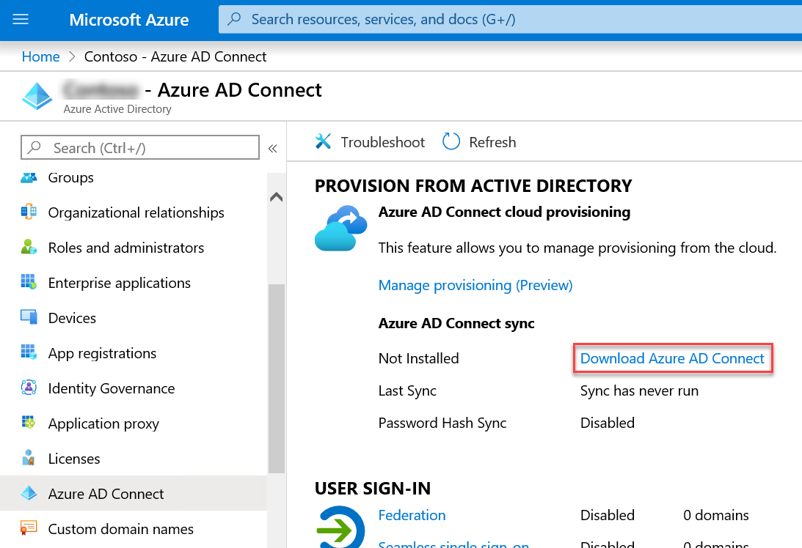

1.  On the **Microsoft Azure Active Directory Connect** web page of the Microsoft Downloads site, select **Download**.

1.  When prompted whether to run or save **AzureADConnect.msi**, select **Run**. This will download the file and automatically start the **Microsoft Azure Active Directory Connect** wizard. 

1.  On the **Welcome to Azure AD Connect** page, select the **I agree to the license terms and privacy notice** checkbox and select **Continue**.

1.  On the **Express Settings** page, select the **Customize** button.

1.  On the **Install required components** page, leave all optional configuration options deselected and select **Install**.

1.  On the **User sign-in** page, leave the default **Password Hash Synchronization** option selected along with all other default settings and select **Next**.

    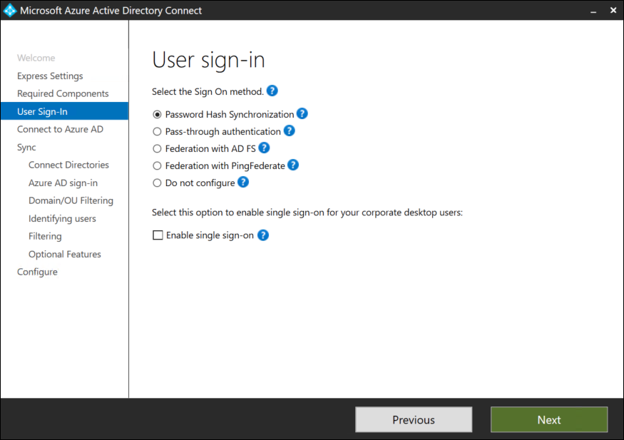

1.  On the **Connect to Azure AD** page, sign in by using the credentials of the **aadcadmin** account and select **Next**.

1.  On the **Connect your directories** page, ensure that the **contoso.com** entry appears in the **FOREST** drop-down list and select **Add Directory**. Next, in the **AD forest account**, ensure that the **Create new AD account** option is selected, in the **ENTERPRISE ADMIN USERNAME** textbox, type **CONTOSO\\demouser**, in the **PASSWORD** textbox, type **demo\@pass123**, and select **OK**.

    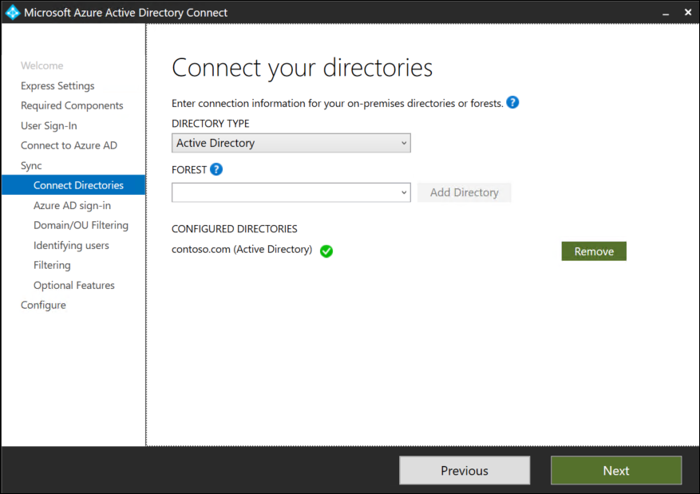

1.  Back on the **Connect your directories** page, select **Next**.

1.  On the **Azure AD sign-in configuration** page, note the warning stating **Users will not be able to sign-in to Azure AD with on-premises credentials if the UPN suffix does not match a verified domain name**. Enable the checkbox **Continue without matching all UPN suffixes to verified domain** and select **Next**. 

    >**Note**: This is expected, since the on-premises UPN suffix (contoso.com) does not match the Azure the domain name of an Azure AD tenant.

    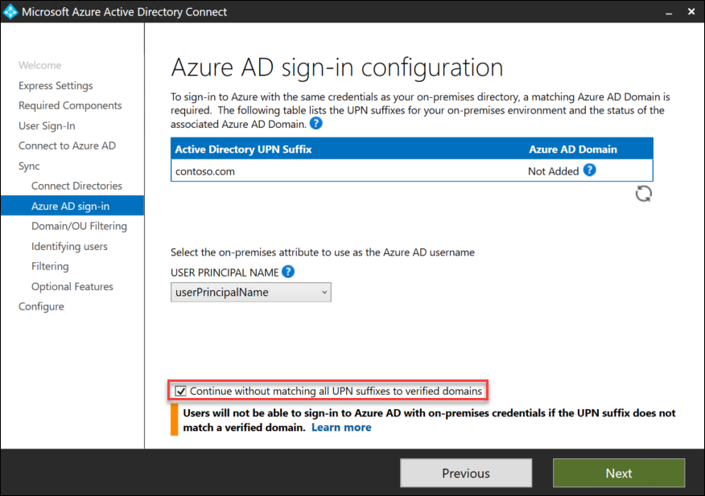

1.  On the **Domain and OU filtering** page, ensure that only the **S03** OU is selected and select **Next**. 

    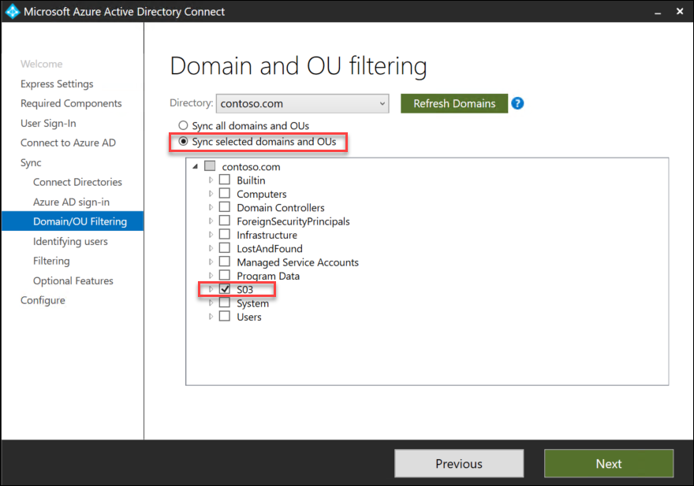

1.  On the **Uniquely identifying your users** page, accept the default settings and select **Next**. 

    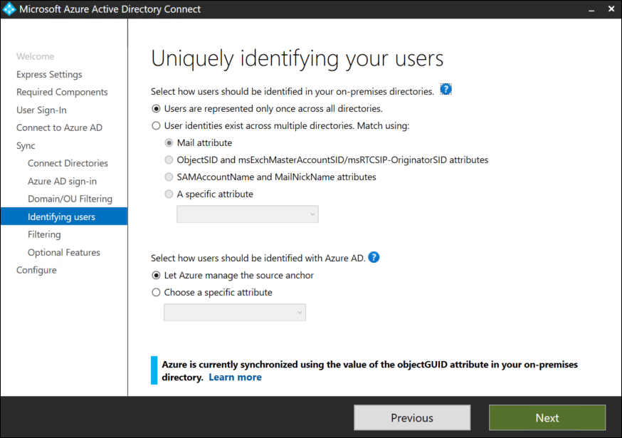

1.  On the **Filter users and devices** page, accept the default settings and select **Next**. 

    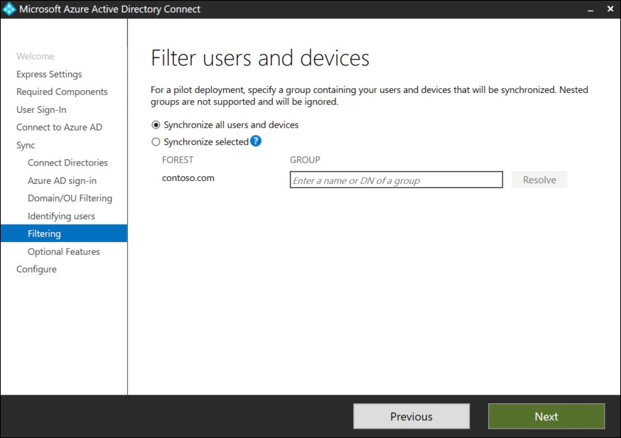

1.  On the **Optional features** page, accept the default settings and select **Next**.

    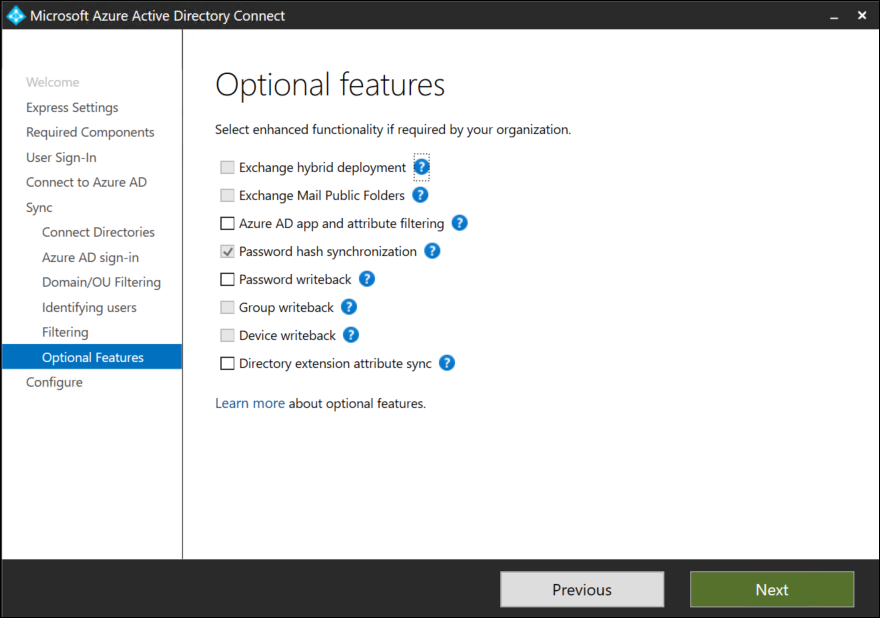

1.  On the **Ready to configure** page, ensure that the **Start the synchronization process when configuration completes** checkbox is selected and select **Install**.

    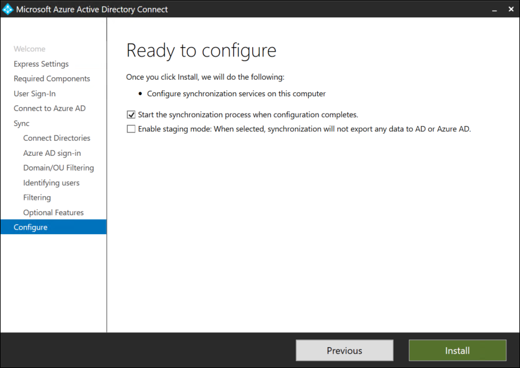

1.  On the **Configuration complete** page, select **Exit**.

    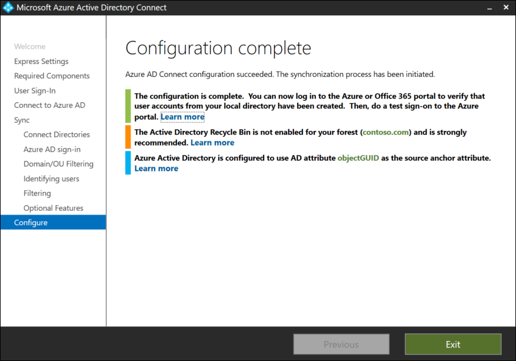


### Task 9: Create an Azure storage account to host the sapmnt share

In this task, you will create an Azure Storage account and the sapmnt file share.

1.  Within the Remote Desktop session to adPDC, in the Azure portal, select **+ Create a resource**.

1.  On the **New** blade, in the **Search the Marketplace** text box, type **Storage account** and, in the list of results, select **Storage account - blob, file, table queue**.

1.  On the **Storage account - blob, file, table queue** blade, select **Create**.

1.  On the **Basics** tab of the **Create storage account** blade, specify the following settings and select **Next: Networking >**:

    -   Subscription: the name of the Azure subscription you are using for this lab

    -   Resource group: **s03-RG**

    -   Storage account name: any valid storage account name

    -   Location: the name of the same Azure region which you used earlier in this exercise

    -   Performance: **Standard**

    -   Account kind: **StorageV2 (general purpose v2)**

    -   Replication: **Locally-redundant storage (LRS)**

    -   Access tier: **Hot**

    > **Note**: Record the name of the storage account you are creating. You will need it later in this lab.

1.  On the **Networking** tab of the **Create storage account** blade, accept the default **Connectivity method** of **Public endpoint (all networks)** and select **Next: Advanced >**:

1.  On the **Advanced** tab of the **Create storage account** blade, specify the following settings and select **Review + create**:

    -   Secure transfer required: **Enabled**

    -   Large file shares: **Disabled**

    -   Blob soft delete: **Disabled**

    -   Hierarchical namespace: **Disabled**

1.  On the **Review + create** tab of the **Create storage account** blade, select **Create**:

1.  Wait for the provisioning of the storage account to complete and then navigate to its blade in the Azure portal.

1.  On the storage account blade, in the **File service** section, select **File shares**.

1.  On the files blade, select **+ File share**.

1.  On the **New file share** blade, in the **Name** text box, type **sapmnt** and select **Create**.


### Task 10: Configure Active Directory authentication for Azure file shares

In this task, you will configure the Azure Storage account File service to use Active Directory authentication.

> **Note**: This functionality is in public preview at the time of authoring this content.

1.  Within the Remote Desktop session to adPDC, start a web browser, navigate to the Github Azure Files samples repository at <https://github.com/Azure-Samples/azure-files-samples/releases>, download the latest version of AzFilesHybrid.zip file, and extract its content into the Downloads folder.

1.  Within the Remote Desktop session to adPDC, from the Windows PowerShell ISE console, run the following to import the downloaded PowerShell module:

    ```powershell
    Set-Location $env:USERPROFILE\Downloads

    Get-ChildItem -File | Unblock-File

    .\CopyToPSPath.ps1   

    Import-Module -name AzFilesHybrid
    ```

1.  When prompted to download the required PowerShellGet module, select **Yes to All**. 

1.  Close and re-open **Administrator: Windows PowerShell ISE** window.

1.  From the Windows PowerShell ISE console, run the following to import the required Azure PowerShell modules:

    ```powershell
    Set-Location $env:USERPROFILE\Downloads

    Import-Module -name AzFilesHybrid
    ```

1.  When prompted to download the required Azure PowerShell and Az.Storage modules, select **Yes to All**. 

    ```powershell
    Install-Module -Name Az -Force
    ```

    >**Note:** When prompted whether to install NuGet provider, select **Yes**

1.  From the Windows PowerShell ISE console, run the following to authenticate to your Azure AD tenant:

    ```powershell
    Connect-AzAccount
    ```

    >**Note:** When prompted, authenticate by using your Azure AD credentials.

1.  If your account has access to multiple subscriptions, from the Windows PowerShell ISE console, run the following to identify these subscriptions:

    ```powershell
    Get-AzContext -ListAvailable | Select-Object Name, Subscription
    ```

1.  If your account has access to multiple subscriptions, from the Windows PowerShell ISE console, run the following to select the Azure subscription that you are using for this lab (replace the placeholder `[subscriptionId]` with the value of the target subscription you identified in the previous step):

    ```powershell
    Set-AzContext -SubscriptionId [subscriptionId]
    ```

1.  From the Windows PowerShell ISE console, run the following to enable Active Directory authentication for all the shares of the Azure Storage account you created in the previous task:

    ```powershell
    $resourceGroupName = 's03-RG'

    $storageAccount = Get-AzStorageAccount -ResourceGroupName $resourceGroupName

    join-AzStorageAccountForAuth -ResourceGroupName $resourceGroupName -Name $storageAccount.StorageAccountName -DomainAccountType 'ComputerAccount' -OrganizationalUnitName 'S03'
    ```

1.  In the Azure Portal, start a PowerShell session in Cloud Shell.

1.  In the Azure portal, in the Cloud Shell, at the PowerShell prompt, run the following to assign Storage File Data SMB Share Elevated Contributor to the members of the Contoso **SAP_S03_GlobalAdmin** group:

    ```powershell
    $resourceGroupName = 's03-RG'

    $storageAccount = Get-AzStorageAccount -ResourceGroupName $resourceGroupName

    $FileShareElevatedContributorRole = Get-AzRoleDefinition 'Storage File Data SMB Share Elevated Contributor'

    $subscriptionId = (Get-AzContext).Subscription.Id

    $scope = "/subscriptions/$subscriptionId/resourceGroups/$resourceGroupName/providers/Microsoft.Storage/storageAccounts/$($storageAccount.StorageAccountName)"

    Connect-AzureAD

    $user = Get-AzureADUser -Filter "displayName eq 's03-su'"

    New-AzRoleAssignment -SignInName $user.userPrincipalName -RoleDefinitionName $FileShareElevatedContributorRole.Name -Scope $scope

    $user = Get-AzureADUser -Filter "displayName eq 's03adm'"

    New-AzRoleAssignment -SignInName $user.userPrincipalName -RoleDefinitionName $FileShareElevatedContributorRole.Name -Scope $scope

    $user = Get-AzureADUser -Filter "displayName eq 'SAPServiceS03'"

    New-AzRoleAssignment -SignInName $user.userPrincipalName -RoleDefinitionName $FileShareElevatedContributorRole.Name -Scope $scope
    ```

1.  Within the Remote Desktop session to adPDC, in the web browser displaying the Azure portal, navigate to the **sapmnt** file share blade and select **Connect**.

1.  On the **Connect** blade, copy to Clipboard the PowerShell script that creates a peristent Z: drive mapping to the target share.

1.  Paste the content of Clipboard into the script pane of the Administrator: Windows PowerShell ISE window and execute it.

1.  Within the Remote Desktop session to adPDC, start **File Explorer**, browse to the **Z:** drive, display its **Properties** window, within the **Properties** window, switch to the **Security** tab, select **Edit**, in the **Permissions for sapmnt** window, select **Add**, in the **Enter the object names to select** text box of the **Select Users, Computers, Service Accounts, and Groups** dialog box, type **s03-su;s03adm;SAPServiceS03;SAP_S03_GlobalAdmin;Domain Admins** and select **OK**.

1.  Back in the **Permissions for sapmnt** window, select each of the accounts you specified in the previous step, select the **Full Control** checkbox in the **Allow** column for each, select **OK**, and back in the **sapmnt** properties window, select **OK** again.

### Summary

In this exercise, you deployed Azure infrastructure prerequisites for implementing SAP NetWeaver on Azure IaaS virtual machines (VMs). This included creation of such resources as an Azure Virtual Network, Azure VMs, Azure load balancers and Azure Storage accounts. You also created Active Directory environment to provide authentication, authorization, and highly available file sharing capabilities by leveraging Azure Files.


## Exercise 2: Configure the SAP NetWeaver ASCS servers

Duration: 90 minutes

### Overview

In this exercise, you will configure the Azure VMs that constitute the SAP ASCS layer. This will include installing Failover Clustering on s03-ascs-0 and s03-ascs-1. You will also use SAP Software Provisioning Manager to perform distributed installation of the ASCS components on the s03-ascs-0 and s03-ascs-1 VMs. 


### Task 1: Set up Failover Clustering on the ASCS VMs

In this task, you will start by configuring operating system on s03-ascs-0 and s03-ascs-1. On both VMs, you will mount the 128 GB data disk as NTFS-formatted U: drive. On both VMs, you will also disable Windows Defender Firewall with Advanced Security for the domain profile. Next, you will implement a Windows Failover Clustering-based cluster named **s03-ascs-cl0** with the IP address of **10.0.1.11** consisting of s03-ascs-0 and s03-ascs-1 Azure VMs. Afterwards, you will set up the cluster with a Cloud Witness quorum by using the storage account that was provisioned in the previous exercise when you implemented Azure Files. Finally, you will grant permissions to the **s03-ascs-cl0** cluster computer account to create computer objects in the **S03** organizational unit.

1.  Within the Remote Desktop session to the **adPDC** Azure VM, in the Azure portal, navigate to the blade of the **s03-ascs-0** VM and use the **Connect** icon in the toolbar to establish an Remote Desktop session to that VM. When prompted to authenticate, sign in with the **CONTOSO\\s03-su** user account you created in the first exercise.

1.  Within the Remote Desktop session to s03-ascs-0 VM, in Server Manager, select the **Local Server** entry, select the **On** link to the right of the **IE Enhanced Security Configuration** label, in the **Internet Explorer Enhanced Security Configuration** dialog box, select both **Off** options, and select **OK**.

1.  Within the Remote Desktop session to s03-ascs-0 VM, start a Windows PowerShell ISE session as Administrator, and run the following to mount the U: drive, disable Windows Defender Firewall with Advanced Security for the domain profile, and install Windows Failover Clustering on **s03-ascs-0** and **s03-ascs-1** Azure VMs:

    ```powershell
    $nodes = ('s03-ascs-0','s03-ascs-1')
    Invoke-Command $nodes {Get-Partition -DiskNumber 2 -PartitionNumber 2 | Set-Partition -NewDriveLetter U}
    Invoke-Command $nodes {Set-NetFirewallProfile -Profile Domain -Enabled False}
    Invoke-Command $nodes {Install-WindowsFeature Failover-Clustering -IncludeAllSubFeature -IncludeManagementTools} 
    ```

1.  Within the Remote Desktop session to s03-ascs-0 VM, run the following to restart **s03-ascs-0** and **s03-ascs-1** Azure VMs:

    ```powershell
    Restart-Computer -ComputerName 's03-ascs-1' -Force
    Restart-Computer -ComputerName 's03-ascs-0' -Force
    ```

    > **Note**: This will terminate the current Remote Desktop session to **s03-ascs-0**.

1.  Back within the Remote Desktop session to the **adPDC** Azure VM, start again a Remote Desktop session to **s03-ascs-0**. When prompted to authenticate, sign again in with the **CONTOSO\\s03-su** user account.

1.  Within the Remote Desktop session to s03-ascs-0 VM, start a Windows PowerShell ISE session as Administrator, and run the following:

    ```powershell
    $nodes = ('s03-ascs-0','s03-ascs-1')
    New-Cluster -Name s03-ascs-cl0 -Node $nodes -NoStorage -StaticAddress 10.0.1.11
    ```

1.  Wait for the new cluster to be created. Then, in the same Windows PowerShell ISE session, install the Az PowerShell module by running the following (when prompted to install NuGet provider, select **Yes** and when prompted to install modules from PSGallery, select **Yes to All**):

    ```powershell
    Install-Module -Name Az -Force
    ```

1.  In the same Windows PowerShell ISE session, sign in to the Azure subscription you are using in this lab by running the following:

    ```powershell
    Add-AzAccount
    ```

    >**Note:** When prompted, authenticate by using your Azure AD credentials.

1.  If your account has access to multiple subscriptions, from the Windows PowerShell ISE console, run the following to identify these subscriptions:

    ```powershell
    Get-AzContext -ListAvailable | Select-Object Name, Subscription
    ```

1.  If your account has access to multiple subscriptions, from the Windows PowerShell ISE console, run the following to select the Azure subscription that you are using for this lab (replace the placeholder `[subscriptionId]` with the value of the target subscription you identified in the previous step):

    ```powershell
    Set-AzContext -SubscriptionId [subscriptionId]
    ```

1.  Within the Remote Desktop session to adPDC, from the Windows PowerShell ISE console, configure a Cloud Witness quorum by running the following:

    ```powershell
    $resourceGroupName = 's03-RG'

    $storageAccountName = (Get-AzStorageAccount -ResourceGroupName $resourceGroupName)[0].StorageAccountName

    $storageAccountKey = (Get-AzStorageAccountKey -ResourceGroupName $resourceGroupName -Name $storageAccountName).Value[0]

    Set-ClusterQuorum -CloudWitness -AccountName $storageAccountName -AccessKey $storageAccountKey
    ```

1.  In the Remote Desktop session to s03-ascs-0, start Active Directory Administrative Center.

1.  In the Active Directory Administrative Center, navigate to the **S03** organizational unit of the contoso.com domain, and display its properties.

    

1.  In the **S03** window, navigate to the **Extensions** section, and on the **Security** tab, select **Advanced**.

    

1.  In the **Advanced Security Settings for S03** window, select **Add**.

    

1.  In the **Permission Entry for S03** window, select **Select Principal**. In the **Select User, Service Account or Group** dialog box, select **Object Types**, enable the checkbox next to the **Computers** entry, and select **OK**. Back in the **Select User, Computer, Service Account or Group** dialog box, type **s03-ascs-cl0** in the **Enter the object name to select** and select **OK**.

    

1.  In the **Permission Entry for S03** window, ensure that **Allow** appears in the **Type** drop-down list. Next, in the **Applies to** drop-down list, select **This object and all descendant objects**. In the **Permissions** list, select **Create Computer objects** and select **OK**.

    

1. Back in the **Advanced Security for S03** window, select **OK**.


### Task 2: Install the SAP ASCS components on s03-ascs-0

In this task, you will use SAP Software Provisioning Manager to perform distributed installation of ASCS components on the first node of ASCS cluster of MS SQL Server-based SAP NetWeaver 7.5 deployment. You will run the installation by using the **CONTOSO\\s03-su** account you created in the first exercise. During the installation, you will address all necessary prerequisites and specify the following parameters:

-   Destination Drive for Local Instances: **U:**

-   SAP System ID (SAPSID): **S03**

-   DNS Domain Name for SAP Systems: **contoso.com**

-   Windows Domain: **Domain of Current User**

-   Organizational Units for Windows Domain: **S03**

-   Windows Domain for SAP Host Agent: **Local Domain**

-   ASCS Instance Number: **00**

-   ABAP Message Server Port: **3600**

-   Internal ABAP Message Server Port: **3900**

-   Install an SAP Web Dispatcher integrated in the ASCS instance: **Yes**

-   Install a Gateway integrated in the ASCS instance: **Yes**

-   Set SAP Web Dispatcher Encryption Mode: **Never**

-   Set all passwords to **demo\@pass123**

You will also account for the fact you will be using the virtual names and configure the following registry entries on both VMs:

-   HKLM\\SYSTEM\\CurrentControlSet\\Control\\LSA

    -   Set DisableLoopbackCheck to 1

-   HKLM:\\SYSTEM\\CurrentControlSet\\Services\\lanmanserver\\parameters

    -   Set DisableStrictNameChecking to 1

1.  Within the Remote Desktop session to s03-ascs-0, download the SAP NetWeaver installation media you identified in the **Before the hands-on lab** document to the **C:\Media** folder.

1.  Start Command Prompt and change the current directory to the file system location into which you downloaded SOFTWARE PROVISIONING MGR SWPM 1.0 SP28 for NW higher than 7.0x (SWPM10SP28_3-20009707.SAR) and Support Package SAPCAR 7.21 Windows on x64 64bit (SAPCAR_1311-80000938.EXE). 

1.  From the Command Prompt, extract content of SWPM10SP28_3-20009707.SAR into a new folder named **SWPM** by running the following:

    ```
    SAPCAR_1311-80000938.EXE -xvf SWPM10SP28_3-20009707.SAR -R .\SWPM
    ```

1.  Start File Explorer, navigate to the **c:\Media\SWPM** folder, and double-click the SAP Software Provisioning Manager executable **sapinst.exe**.

    

1.  The **sapinst.exe** installer will automatically launch Internet Explorer and display a page with the notification **This site is not secure**, regarding a problem with the website's security certificate. This is expected. Select **More information** and the **Go on to the webpage (not recommended)** link and, when prompted, sign-in with the **CONTOSO\\s03-su** account you created in the first exercise and select the checkbox **Remember my credentials**.

1.  On the **Welcome to SAP Installation** page, navigate to **SAP NetWeaver 7.5-\>MS SQL Server-\>Installation-\>Application Server ABAP-\>Distributed System-\>ASCS Instance**, and select **Next**.

    

1.  On the **Parameter Settings** page, select **Custom**, and select **Next**.

    

1.  On the **Warning** page, select **OK**. You will be automatically logged off. 

    

1.  Within the Remote Desktop session to adPDC, initiate a Remote Desktop session to s03-ascs-0 and log back on by using the same user credentials  as previously (**CONTOSO\\s03-su**). The Software Provisioning Manager will starts automatically. In the Internet Explorer window, on the **This site is not secure** page, select **More information**, select the **Go on to the webpage (not recommended)** link and, when prompted, sign-in with the **CONTOSO\\s03-su** account.

1.  On the **General SAP System Parameters** page, set **SAP System ID (SAPSID)** to **S03**, select the **U:** drive as the **Destination Drive**, and select **Next**.

    

1.  On the **DNS Domain Name** page, accept the default settings, and select **Next**.

    

1.  On the **Master Password** page, set **Password for All Users** to **demo\@pass123**, and select **Next**.

    

1.  On the **Windows Domain** page, accept the default settings and select **Next**.

    

1.  On the **Organizational Units for Windows Domain** page, in the **OU Path** text box, type **S03** and select **Next**.

    

1.  On the **Software Package Browser** page, point to the location of the software packages including Kernel Part I (753) ; OS: Windows on x64 64bit ; DB: Database independent; Support Package SAP KERNEL 7.53 64-BIT UNICODE Windows on x64 64bit #Database independent (SAPEXE_401-80002612.SAR), select **Next**, and, once the package is found, select **Next** again.

    

1.  On the **Prerequisites Checker Results** page, review the missing prerequisites.

    

1.  Start a Windows PowerShell ISE session as Administrator and run the following to allow for the use of virtual names in the ASCS layer, which satisfies the first of the prerequisites:

    ```powershell
    $nodes = ('s03-ascs-0','s03-ascs-1')

    Invoke-Command $nodes {
        $registryPath = 'HKLM:\SYSTEM\CurrentControlSet\Services\lanmanworkstation\parameters'
        $registryEntry = 'DisableCARetryOnInitialConnect'
        $registryValue = 1
        New-ItemProperty -Path $registryPath -Name $registryEntry -Value $registryValue -PropertyType DWORD -Force
    }

    Invoke-Command $nodes {
        $registryPath = 'HKLM:\SYSTEM\CurrentControlSet\Control\LSA'
        $registryEntry = 'DisableLoopbackCheck'
        $registryValue = 1
        New-ItemProperty -Path $registryPath -Name $registryEntry -Value $registryValue -PropertyType DWORD -Force
    }

    Invoke-Command $nodes {
        $registryPath = 'HKLM:\SYSTEM\CurrentControlSet\Services\lanmanserver\parameters'
        $registryEntry = 'DisableStrictNameChecking'
        $registryValue = 1
        New-ItemProperty -Path $registryPath -Name $registryEntry -Value $registryValue -PropertyType DWORD -Force
    }
    ```

1.  From the Windows PowerShell ISE session, run the following to adjusts the paging file configuration, which satisfies the second of the prerequisites

    ```powershell
    Invoke-Command $nodes {
        $computerSystem = Get-WmiObject -Class Win32_ComputerSystem -EnableAllPrivileges
        $computerSystem.AutomaticManagedPagefile = $false
        $computerSystem.Put()
        $pageFile = Get-WmiObject -Query "SELECT * FROM Win32_PageFileSetting WHERE Name LIKE '%pagefile.sys'"
        $pageFile.Delete()
        Set-WmiInstance -Class Win32_PageFileSetting -Arguments @{name="D:\pagefile.sys";InitialSize = 20480;MaximumSize = 20480;}
    }
    ```

1.  On the **Prerequisites Checker Results** page, select **Next**. 

1.  On the **Question** page, when prompted whether to repeat the checks, select **Yes**.

1.  On the **Software Package Browser** page, point to the location of the software packages including the **SAPHOSTAGENT.SAR**, select **Next**, and, once the package is found, select **Next** again.

    

1.  On the **Windows Domain for SAP Host Agent** page, accept the default settings, and select **Next**.

    

1.  On the **SAP Host Agent Operating System Users** page, accept the default password **demo\@pass123** you set earlier and select **Next**.

    

1.  On the **ASCS Instance** page, accept the default settings, and select **Next**.

    

1.  On the **ABAP Message Server Ports** page, accept the default settings, and select **Next**.

    

1.  On the **Additional Components to be Included in the ASCS Instance** page, select the checkboxes **Install SAP Web Dispatcher integrated in the ASCS instance** and **Install a Gateway integrated in the ASCS instance**, and then select **Next**.

    

1.  On the **SAP Web Dispatcher Parameters** page, set the Encryption Mode to **Never**, and select **Next**.

    

1.  On the **ICM User Management for the SAP Web Dispatcher** page, accept the default password **demo\@pass123** you set earlier and select **Next**.

    

1.  On the **Parameter Summary** page, select **Next**.

    

1.  Monitor progress of installation.

    

1.  Wait until the installation completes. This should take no more than 5 minutes. Once the installation completes, select **OK**.

    

1.  On the **Execution of Service has been completed successfully** page, select **Exit**.

    


### Task 3: Install the SAP ASCS components on s03-ascs-1

In this task, you will use SAP Software Provisioning Manager to carry out the distributed installation of ASCS components on the second node of ASCS cluster of MS SQL Server-based SAP NetWeaver 7.5 deployment. You will run the installation using the **CONTOSO\\s03-su** account you created in the first exercise. During the installation, you will address all necessary prerequisites and specify the following parameters:

-   Destination Drive for Local Instances: **U:**

-   SAP System ID (SAPSID): **S03**

-   DNS Domain Name for SAP Systems: **contoso.com**

-   Windows Domain: **Domain of Current User**

-   Organizational Units for Windows Domain: **S03**

-   Windows Domain for SAP Host Agent: **Local Domain**

-   ASCS Instance Number: **00**

-   ABAP Message Server Port: **3600**

-   Internal ABAP Message Server Port: **3900**

-   Install an SAP Web Dispatcher integrated in the ASCS instance: **Yes**

-   Install a Gateway integrated in the ASCS instance: **Yes**

-   Set SAP Web Dispatcher Encryption Mode: **Never**

-   Set all passwords to **demo\@pass123**

1.  Within the Remote Desktop session to the **adPDC** Azure VM, start a Remote Desktop session to **s03-ascs-1**. When prompted to authenticate, sign in with the **CONTOSO\\s03-su** user account you created in the first exercise.

1.  Within the Remote Desktop session to s03-ascs-0 VM, in Server Manager, select the **Local Server** entry, select the **On** link to the right of the **IE Enhanced Security Configuration** label, in the **Internet Explorer Enhanced Security Configuration** dialog box, select both **Off** options, and select **OK**.

1.  Within the Remote Desktop session to s03-ascs-1, start **Command Prompt** and, from the Command Prompt, run the following to copy the content of the **C:\Media** folder from s03-ascs-0 to the local **C:\Media** folder:

    ```
    robocopy \\s03-ascs-0\c$\Media c:\Media /e /r:1 /w:1
    ```

1.  Start File Explorer, navigate to the **c:\Media\SWPM** folder, and double-click the SAP Software Provisioning Manager executable **sapinst.exe**.

    

1.  The **sapinst.exe** installer will automatically launch Internet Explorer and display a page with the notification **This site is not secure**, regarding a problem with the website's security certificate. This is expected. Select **More information** and the **Go on to the webpage (not recommended)** link and, when prompted, sign-in with the **CONTOSO\\s03-su** account you created in the first exercise and select the checkbox **Remember my credentials**.

1.  On the **Welcome to SAP Installation** page, navigate to **SAP NetWeaver 7.5-\>MS SQL Server-\>Installation-\>Application Server ABAP-\>Distributed System-\>ASCS Instance**, and select **Next**.

    

1.  On the **Parameter Settings** page, select **Custom**, and select **Next**.

    

1.  On the **Warning** page, select **OK**. You will be automatically logged off. 

    

1.  Within the Remote Desktop session to adPDC, initiate a Remote Desktop session to s03-ascs-0 and log back on by using the same user credentials  as previously (**CONTOSO\\s03-su**). The Software Provisioning Manager will starts automatically. In the Internet Explorer window, on the **This site is not secure** page, select **More information**, select the **Go on to the webpage (not recommended)** link and, when prompted, sign-in with the **CONTOSO\\s03-su** account.

1.  On the **General SAP System Parameters** page, set **SAP System ID (SAPSID)** to **S03**, select the **U:** drive for the **Destination Drive**, and select **Next**.

    

1.  On the **DNS Domain Name** page, accept the default settings, and select **Next**.

    

1.  On the **Master Password** page, set **Password for All Users** to **demo\@pass123**, and select **Next**.

    

1.  On the **Windows Domain** page, accept the default settings and select **Next**.

    

1.  On the **Organizational Units for Windows Domain** page, in the **OU Path** text box, type **S03** and select **Next**.

    

1.  On the **Software Package Browser** page, point to the location of the software packages including the kernel, and select **Next**, and, once the package is found, select **Next** again.

    

1.  On the **Software Package Browser** page, point to the location of the software packages including the **SAPHOSTAGENT.SAR**, select **Next**, and, once the package is found, select **Next** again.

    

1.  On the **Windows Domain for SAP Host Agent** page, accept the default settings, and select **Next**.

    

1.  On the **SAP Host Agent Operating System Users** page, accept the default passwords of **demo\@pass123** you set earlier and select **Next**.

    

1.  On the **ASCS Instance** page, accept the default settings, and select **Next**.

    

1.  On the **ABAP Message Server Ports** page, accept the default settings, and select **Next**.

    

1.  On the **Additional Components to be Included in the ASCS Instance** page, select the checkboxes **Install SAP Web Dispatcher integrated in the ASCS instance** and **Install a Gateway integrated in the ASCS instance**, and then select **Next**.

    

1.  On the **SAP Web Dispatcher Parameters** page, set the Encryption Mode to **Never**, and select **Next**.

    

1.  On the **ICM User Management for the SAP Web Dispatcher** page, accept the default password **demo\@pass123** you set earlier and select **Next**.

    

1.  On the **Parameter Summary** page, select **Next**.

    

1.  Monitor progress of installation.

    

1.  Wait until the installation completes. This should take no more than 5 minutes. Once the installation completes, select **OK**.

    

1.  On the **Execution of Service has been completed successfully** page, select **Exit**.

    


### Task 4: Configure SAP ASCS cluster components on s03-ascs-0 and s03-ascs-1

In this task, you will configure SAP ASCS cluster components, including Azure Files to host sapmnt share. These extra steps are necessary since, at the time of authoring this content, Software Provisioning Manager does not yet support clustered installation of ASCS components with Azure Files-based sapmnt share.

1.  Switch to the Remote Desktop session to s03-ascs-0 and, in the Windows PowerShell ISE session, remove the sapmnt shares created in the first and the second tasks of this exercise by running the following:

    ```powershell
    $vmNames = @('s03-ascs-0','s03-ascs-1')

    Invoke-Command $vmNames {Remove-SmbShare sapmnt -ScopeName * -Force}
    ```

1.  Within the Remote Desktop session to s03-ascs-0, in the Windows PowerShell ISE session, create the saploc share on both cluster nodes by running the following:

    ```powershell
    $vmNames = @('s03-ascs-0','s03-ascs-1')

    Invoke-Command $vmNames -ScriptBlock {
        $sapSid = "S03"
        $domainName = 'CONTOSO'
        $sapSidGlobalAdminGroupName = "$domainName\SAP_" + $sapSid + "_GlobalAdmin"
        $hostName = $env:computername
        $sapLocalAdminGroupName = "$hostName\SAP_LocalAdmin"
        $sapDisk = "U:"
        $sapUsrSapPath = "$sapDisk\usr\sap"
        New-SmbShare -Name saploc -Path $sapUsrSapPath -FullAccess "BUILTIN\Administrators", $sapSidGlobalAdminGroupName , $sapLocalAdminGroupName   
    }
    ```

1.  Within the Remote Desktop session to s03-ascs-0, in the Windows PowerShell ISE session, create SAP<SID> cluster group, network name and IP by running the following:

    ```powershell
    # Create SAP Cluster Group
    $sapSid = "S03"
    $sapASCSClusterGroupName = "SAP $sapSid"
    $sapASCSIPClusterResourceName = "SAP $sapSid IP"
    $sapASCSNetworkNameClusterResourceName = "s03-ascs-v0"
    $sapASCSIPAddress = "10.0.1.16"
    $sapASCSSubnetMask = "255.255.255.0"

    # Create an SAP ASCS instance virtual IP cluster resource
    Add-ClusterGroup -Name $sapASCSClusterGroupName -Verbose

    #Create an SAP ASCS virtual IP address
    $sapASCSIPClusterResource = Add-ClusterResource -Name $sapASCSIPClusterResourceName -ResourceType "IP Address" -Group $sapASCSClusterGroupName -Verbose
    Stop-ClusterResource -Name $sapASCSIPClusterResource

    # Set a static IP address
    $param1 = New-Object Microsoft.FailoverClusters.PowerShell.ClusterParameter $sapASCSIPClusterResource,Address,$sapASCSIPAddress
    $param2 = New-Object Microsoft.FailoverClusters.PowerShell.ClusterParameter $sapASCSIPClusterResource,SubnetMask,$sapASCSSubnetMask
    $params = $param1,$param2
    $params | Set-ClusterParameter

    # Create a corresponding network name
    $sapASCSNetworkNameClusterResource = Add-ClusterResource -Name $sapASCSNetworkNameClusterResourceName -ResourceType "Network Name" -Group $sapASCSClusterGroupName -Verbose
    Stop-ClusterResource -Name $sapASCSNetworkNameClusterResource 

    # Set a network DNS name
    $sapASCSNetworkNameClusterResource | Set-ClusterParameter -Name Name -Value $sapASCSNetworkNameClusterResourceName

    #Check the updated values
    $sapASCSNetworkNameClusterResource | Get-ClusterParameter

    #Set resource dependencies
    Set-ClusterResourceDependency -Resource $sapASCSNetworkNameClusterResourceName -Dependency "[$sapASCSIPClusterResourceName]" -Verbose

    #Start an SAP <SID> cluster group
    Start-ClusterGroup -Name $sapASCSClusterGroupName -Verbose
    ```

1.  Within the Remote Desktop session to s03-ascs-0, start Command Prompt as Administrator and run the following to map a drive to the sapmnt Azure File share (where `<storage_account_name>` designates the name of the storage account you created in the previous exercise):

    ```
    net use S: \\<storage_account_name>.file.core.windows.net\sapmnt
    ```

1.  Within the Remote Desktop session to s03-ascs-0, from the Command Propmt, copy files from the local ASCS instances to the Azure Files-based sapmnt share by running the following (where `<storage_account_name>` designates the name of the storage account you created in the previous exercise):

    ```
    robocopy U:\usr\sap\S03 S:\S03 /e /r:1 /w:1
    ```

1.  Within the Remote Desktop session to s03-ascs-0, run the following to rename **\\<storage_account_name>.file.core.windows.net\sapmnt\S03\SYS\profile\S03_ASCS00_s03-ascs-0** to **\\<storage_account_name>.file.core.windows.net\sapmnt\S03\SYS\profile\S03_ASCS00_s03-ascs-v0**

    ```
    ren S:\S03\SYS\profile\S03_ASCS00_s03-ascs-0 S03_ASCS00_s03-ascs-v0
    ```

1.  Within the Remote Desktop session to s03-ascs-0, start File Explorer, navigate to the **S:\S03\SYS\profile** folder, open the file **S03_ASCS00_s03-ascs-v0** in Notepad, and modify its content by removing the following entries:

    ```
    SAPGLOBALHOST = s03-ascs-0

    DIR_PROFILE = \\s03-ascs-0\sapmnt\S03\SYS\profile

    _PF = $(DIR_PROFILE)\S03_ASCS00_s03-ascs-0
    ```

    and adding the following ones (where `<storage_account_name>` designates the name of the storage account you created in the previous exercise):

    ```
    SAPLOCALHOST = s03-ascs-v0
    SAPGLOBALHOST = <storage_account_name>.file.core.windows.net
    SAPGLOBALHOSTFULL = <storage_account_name>.file.core.windows.net
    DIR_PROFILE = \\<storage_account_name>.file.core.windows.net\sapmnt\S03\SYS\profile
    _PF = $(DIR_PROFILE)\S03_ASCS00_s03-ascs-v0
    service/check_ha_node = 1
    enque/encni/set_so_keepalive = true
    ```

1.  Within the Remote Desktop session to s03-ascs-0, modify the content of **\\<storage_account_name>.file.core.windows.net\sapmnt\S03\SYS\profile\S03_ASCS00_s03-ascs-v0** by replacing the following entries:

    ```
    #-----------------------------------------------------------------------
    # Start SAP message server
    #-----------------------------------------------------------------------
    _MS = $(DIR_EXECUTABLE)\msg_server$(FT_EXE)
    Restart_Program_02 = local $(_MS) pf=$(_PF)
    #-----------------------------------------------------------------------
    # Start SAP enqueue server
    #-----------------------------------------------------------------------
    _EN = $(DIR_EXECUTABLE)\enserver$(FT_EXE)
    Restart_Program_03 = local $(_EN) pf=$(_PF)
    wdisp/system_0 = SID=S03, MSHOST=s03-ascs-0, MSPORT=8100, SSL_ENCRYPT=0
    ```

    with the following ones:

    ```
    #-----------------------------------------------------------------------
    # Start SAP message server
    #-----------------------------------------------------------------------
    _MS = $(DIR_EXECUTABLE)\msg_server$(FT_EXE)
    Start_Program_02 = local $(_MS) pf=$(_PF)
    #-----------------------------------------------------------------------
    # Start SAP enqueue server
    #-----------------------------------------------------------------------
    _EN = $(DIR_EXECUTABLE)\enserver$(FT_EXE)
    Start_Program_03 = local $(_EN) pf=$(_PF)
    wdisp/system_0 = SID=S03, MSHOST=s03-ascs-v0, MSPORT=8100, SSL_ENCRYPT=0
    ```

1.  Within the Remote Desktop session to s03-ascs-0, modify the content of **\\<storage_account_name>.file.core.windows.net\sapmnt\S03\SYS\profile\DEFAULT.PFL** by replacing the following entries:

    ```
    rdisp/mshost = s03-ascs-0
    enque/serverhost = s03-ascs-0
    ```

    with the following ones:

    ```
    SAPGLOBALHOST = <storage_account_name>.file.core.windows.net
    SAPGLOBALHOSTFULL = <storage_account_name>.file.core.windows.net
    DIR_PROFILE = \\<storage_account_name>.file.core.windows.net\sapmnt\S03\SYS\profile
    rdisp/mshost = s03-ascs-v0
    enque/serverhost = s03-ascs-v0
    ```

1.  Within the Remote Desktop session to s03-ascs-0, from the Command Prompt, run the following to remove the drive mapping to the sapmnt Azure File share:

    ```
    net use S: /d
    ```

1.  Log off from s03-ascs-0 and re-logon by using the following credentials:

    -   Username: **contoso\\s03adm**

    -   Password: **demo\@pass123**

1.  Within the Remote Desktop session to s03-ascs-0, right-select **Start**, select **Run** and from the **Run** dialog box, launch **sysdm.cpl**.

1.  In the **System Properties** window, switch to the **Advanced** tab and select **Environment Variables**.

1.  In the **Environment Variables** window, replace the values of the following user variables (where `<storage_account_name>` designates the name of the storage account you created in the previous exercise):

    ```
    RSEC_SSFS_DATAPATH=\\s03-ascs-0\sapmnt\S03\SYS\global\security\rsecssfs\data
    RSEC_SSFS_KEYPATH=\\s03-ascs-0\sapmnt\S03\SYS\global\security\rsecssfs\key
    SAPEXE=U:\usr\sap\S03\SYS\exe\uc\NTAMD64
    SAPLOCALHOST=s03-ascs-0
    ```

    with: 

    ```
    RSEC_SSFS_DATAPATH=\\<storage_account_name>.file.core.windows.net\sapmnt\S03\SYS\global\security\rsecssfs\data
    RSEC_SSFS_KEYPATH=\\<storage_account_name>.file.core.windows.net\sapmnt\S03\SYS\global\security\rsecssfs\key
    SAPEXE=\\<storage_account_name>.file.core.windows.net\sapmnt\S03\SYS\exe\uc\NTAMD64
    SAPLOCALHOST=s03-ascs-v0
    ```

1.  Log off from s03-ascs-1 and re-logon by using the following credentials:

    -   Username: **contoso\\s03adm**

    -   Password: **demo\@pass123**

1.  Within the Remote Desktop session to s03-ascs-1, right-select **Start**, select **Run** and from the **Run** dialog box, launch **sysdm.cpl**.

1.  In the **System Properties** window, switch to the **Advanced** tab and select **Environment Variables**.

1.  In the **Environment Variables** window, replace the values of the following user variables (where `<storage_account_name>` designates the name of the storage account you created in the previous exercise):

    ```
    RSEC_SSFS_DATAPATH=\\s03-ascs-1\sapmnt\S03\SYS\global\security\rsecssfs\data
    RSEC_SSFS_KEYPATH=\\s03-ascs-1\sapmnt\S03\SYS\global\security\rsecssfs\key
    SAPEXE=U:\usr\sap\S03\SYS\exe\uc\NTAMD64
    SAPLOCALHOST=s03-ascs-1
    ```

    with: 

    ```
    RSEC_SSFS_DATAPATH=\\<storage_account_name>.file.core.windows.net\sapmnt\S03\SYS\global\security\rsecssfs\data
    RSEC_SSFS_KEYPATH=\\<storage_account_name>.file.core.windows.net\sapmnt\S03\SYS\global\security\rsecssfs\key
    SAPEXE=\\<storage_account_name>.file.core.windows.net\sapmnt\S03\SYS\exe\uc\NTAMD64
    SAPLOCALHOST=s03-ascs-v0
    ```

1.  Switch to the Remote Desktop session to s03-ascs-0 and, from the Command Prompt, re-register the SAP ASCS/SCS service to point to the new profile and profile path by running the following (where `<storage_account_name>` designates the name of the storage account you created in the previous exercise):

    ```
    U:\usr\sap\S03\ASCS00\exe\sapstartsrv.exe -r -p \\<storage_account_name>.file.core.windows.net\sapmnt\S03\SYS\profile\S03_ASCS00_s03-ascs-v0 -s S03 -n 00 -U CONTOSO\SAPServiceS03 -P demo@pass123 -e CONTOSO\s03adm
    ```

1.  In the **SAP Service Install/Uninstall** window, select **OK**, if prompted, select **Yes**, and, once the service installs and starts successfully, select **OK** again.

    

1.  Switch to the Remote Desktop session to s03-ascs-1, from the Command Prompt, re-register the SAP ASCS/SCS service to point to the new profile and profile path by running the following (where `<storage_account_name>` designates the name of the storage account you created in the previous exercise:

    ```
    U:\usr\sap\S03\ASCS00\exe\sapstartsrv.exe -r -p \\<storage_account_name>.file.core.windows.net\sapmnt\S03\SYS\profile\S03_ASCS00_s03-ascs-v0 -s S03 -n 00 -U CONTOSO\SAPServiceS03 -P demo@pass123 -e CONTOSO\s03adm
    ```

1.  In the **SAP Service Install/Uninstall** window, select **OK**, if prompted, select **Yes**, and, once the service installs and starts successfully, select **OK** again. 

    

1.  Switch back to the Remote Desktop session to s03-ascs-0, start **SAP Management Console** by selecting its icon on the desktop and, in the SAP Management Console, stop the local instance of SAP ASCS service. In the **SAP Instance Shutdown** window, select **OK**. If prompted, provide the password of the **CONTOSO\\s03adm** account and click **OK**.

    

1.  Within the Remote Desktop session to s03-ascs-0 VM, start Windows PowerShell ISE as Administrator, and within the **Administrator: Windows PowerShell ISE** console pane, run the following to stop the SAPS03_00 service:

    ```
    Stop-Service -Name SAPS03_00 -Force
    ```

1.  Switch to the Remote Desktop session to s03-ascs-1, start **SAP Management Console** by selecting its icon on the desktop and, in the SAP Management Console, stop the local instance of SAP ASCS service. In the **SAP Instance Shutdown** window, select **OK**. If prompted, provide the password of the **CONTOSO\\s03adm** account and click **OK**.

    

1.  Within the Remote Desktop session to s03-ascs-1 VM, start Windows PowerShell ISE as Administrator, and within the **Administrator: Windows PowerShell ISE** console pane, run the following to stop the SAPS03_00 service:

    ```
    Stop-Service -Name SAPS03_00 -Force
    ```

1.  Switch to the Remote Desktop session to s03-ascs-0 VM, start **Command Prompt**, from the Command Prompt, change the current directory to **c:\Media\SWPM**, and run the following to extract the content of **NTCLUST.SAR**:

    ```
    C:\Media\SAPCAR_1311-80000938.EXE -xvf NTCLUST.SAR
    ```

    >**Note:** This will result in creation of the **NTCLUSTER** folder containing a number of files, including **insapctr.exe** and **saprc.dll**. 

1.  From the Command Prompt, run the following to copy all files from the **NTCLUSTER** folder to the **c:\Temp** folder on **s03-ascs-0** and to the **c:\Windows\System32** folder on both **s03-ascs-0** and **s03-ascs-1**:

    ```
    robocopy c:\Media\SWPM\NTCLUSTER \\s03-ascs-0\c$\Temp
    robocopy c:\Media\SWPM\NTCLUSTER \\s03-ascs-0\c$\Windows\system32
    robocopy c:\Media\SWPM\NTCLUSTER \\s03-ascs-1\c$\Windows\system32
    ```

1.  Within the Remote Desktop session to s03-ascs-0 VM, from the Command Prompt, register **saprc.dll** by running the following (confirm when prompted whether to continue):

    ```
    cd c:\Temp
    insaprct.exe -install
    ```

1.  Within the Remote Desktop session to s03-ascs-0 VM, in the Windows PowerShell ISE session, create a new instance of SAP service and SAP instance resources by running the following:

    ```powershell
    $sapSID = 'S03'
    $sapInstanceNumber = '00'
    $sapASCSNetworkNameClusterResourceName = 's03-ascs-v0'

    $sapServiceName = "SAP$sapSID"+ "_" + $sapInstanceNumber

    $sapClusterGroupName = "SAP $sapSID"
    $sapServiceClusterResourceName = "SAP $sapSID $sapInstanceNumber Service"

    $sapASCSServiceClusterResource = Add-ClusterResource -Name $sapServiceClusterResourceName -Group $sapClusterGroupName -ResourceType "SAP Service" -SeparateMonitor -Verbose
    $sapASCSServiceClusterResource  | Set-ClusterParameter  -Name ServiceName -Value $sapServiceName

    #Set resource dependencies
    Set-ClusterResourceDependency -Resource $sapASCSServiceClusterResource  -Dependency "[$sapASCSNetworkNameClusterResourceName]" -Verbose

    $sapInstanceClusterResourceName = "SAP $sapSID $sapInstanceNumber Instance"

    # Create SAP instance cluster resource
    $sapASCSServiceClusterResource = Add-ClusterResource -Name $sapInstanceClusterResourceName -Group $sapClusterGroupName -ResourceType "SAP Resource" -SeparateMonitor -Verbose

    #Set SAP instance cluster resource parameters
    $sapASCSServiceClusterResource  | Set-ClusterParameter  -Name SAPSystemName -Value $sapSID -Verbose
    $sapASCSServiceClusterResource  | Set-ClusterParameter  -Name SAPSystem -Value $sapInstanceNumber -Verbose

    #Set resource dependencies
    Set-ClusterResourceDependency -Resource $sapASCSServiceClusterResource -Dependency "[$sapServiceClusterResourceName]" -Verbose
    ```

1.  Within the Remote Desktop session to s03-ascs-0 VM, in the Windows PowerShell ISE session, set the probe port to **62000** (the probe port must match the port of the **probeascs** of the **s03-lb-ascs** load balancer you deployed in the first exercise of this lab) by running the following (confirm when prompted whether to proceed):

    ```powershell
    $SAPSID = "S03"
    $probePort = 62000   # ProbePort of the Azure internal load balancer

    Clear-Host
    $sapClusterRoleName = "SAP $SAPSID"
    $sapIPResourceName = "SAP $SAPSID IP"
    $sapIPResourceClusterParameters =  Get-ClusterResource $sapIPResourceName | Get-ClusterParameter
    $ipAddress = ($sapIPResourceClusterParameters | Where-Object {$_.Name -eq "Address" }).Value
    $networkName = ($sapIPResourceClusterParameters | Where-Object {$_.Name -eq "Network" }).Value
    $subnetMask = ($sapIPResourceClusterParameters | Where-Object {$_.Name -eq "SubnetMask" }).Value
    $overrideAddressMatch = ($sapIPResourceClusterParameters | Where-Object {$_.Name -eq "OverrideAddressMatch" }).Value
    $enableDhcp = ($sapIPResourceClusterParameters | Where-Object {$_.Name -eq "EnableDhcp" }).Value
    $oldProbePort = ($sapIPResourceClusterParameters | Where-Object {$_.Name -eq "ProbePort" }).Value

    $var = Get-ClusterResource | Where-Object {  $_.name -eq $sapIPResourceName  }

    Write-Host "Current configuration parameters for SAP IP cluster resource '$sapIPResourceName' are:" -ForegroundColor Cyan
    Get-ClusterResource -Name $sapIPResourceName | Get-ClusterParameter

    Write-Host
    Write-Host "Current probe port property of the SAP cluster resource '$sapIPResourceName' is '$oldProbePort'." -ForegroundColor Cyan
    Write-Host
    Write-Host "Setting the new probe port property of the SAP cluster resource '$sapIPResourceName' to '$probePort' ..." -ForegroundColor Cyan
    Write-Host

    $var | Set-ClusterParameter -Multiple @{"Address"=$ipAddress;"ProbePort"=$probePort;"Subnetmask"=$subnetMask;"Network"=$networkName;"OverrideAddressMatch"=    $overrideAddressMatch;"EnableDhcp"=$enableDhcp}

    Write-Host

    $ActivateChanges = Read-Host "Do you want to take restart SAP cluster role '$sapClusterRoleName', to activate the changes (yes/no)?"

    if($ActivateChanges -eq "yes"){
    Write-Host
    Write-Host "Activating changes..." -ForegroundColor Cyan

    Write-Host
    Write-Host "Taking SAP cluster IP resource '$sapIPResourceName' offline ..." -ForegroundColor Cyan
    Stop-ClusterResource -Name $sapIPResourceName
    Sleep 5

    Write-Host "Starting SAP cluster role '$sapClusterRoleName' ..." -ForegroundColor Cyan
    Start-ClusterGroup -Name $sapClusterRoleName

    Write-Host "New ProbePort parameter is active." -ForegroundColor Green
    Write-Host

    Write-Host "New configuration parameters for SAP IP cluster resource '$sapIPResourceName':" -ForegroundColor Cyan
    Write-Host
    Get-ClusterResource -Name $sapIPResourceName | Get-ClusterParameter
    } else {
    Write-Host "Changes are not activated."
    }
    ```

1.  Within the Remote Desktop session to s03-ascs-0 VM, and in the Windows PowerShell ISE session, adjust failover detection thresholds by running the following:

    ```powershell
    (Get-Cluster).SameSubNetDelay = 2000
    (Get-Cluster).SameSubNetThreshold = 15
    (Get-Cluster).RouteHistoryLength = 30
    ```

1.  Sign out from both s03-ascs-0 and s03-ascs-1.


### Task 5: Install the Enqueue Replication Server instance on both nodes of the cluster

In this task, you will install the Enqueue Replication Server (ERS) instance on both nodes of the cluster.

1.  Back within the Remote Desktop session to the **adPDC** Azure VM, start again a Remote Desktop session to **s03-ascs-0**. When prompted to authenticate, sign again in with the **CONTOSO\\s03-su** user account.

1.  Within the Remote Desktop session to s03-ascs-0, start Command Prompt and, from the Command Prompt, change the current directory to **c:\Media** and run the following to delete the c:\Media\SWPM folder and its content.

    ```
    rd SWPM /s /q
    ```

1.  From the Command Prompt, run the following to extract content of SWPM10SP28_3-20009707.SAR into the **SWPM** folder:

    ```
    SAPCAR_1311-80000938.EXE -xvf SWPM10SP28_3-20009707.SAR -R .\SWPM
    ```

1.  From the Command Prompt, run the following to launch the SAP Software Provisioning Manager executable **sapinst.exe**:

    ```
    .\SWPM\sapinst.exe
    ```

1.  The installation will automatically launch Internet Explorer and display the **This site is not secure** page. This is expected. Select **More information** and the **Go on to the web page (not recommended)** links and, when prompted, sign-in with the **CONTOSO\\s03-su**.

1.  On the **Welcome to SAP Installation** page, navigate to **SAP NetWeaver 7.5-\>MS SQL Server-\>Installation-\>Additional SAP System Instances-\>Enqueue Replication Server Instance**, and select **Next**.

    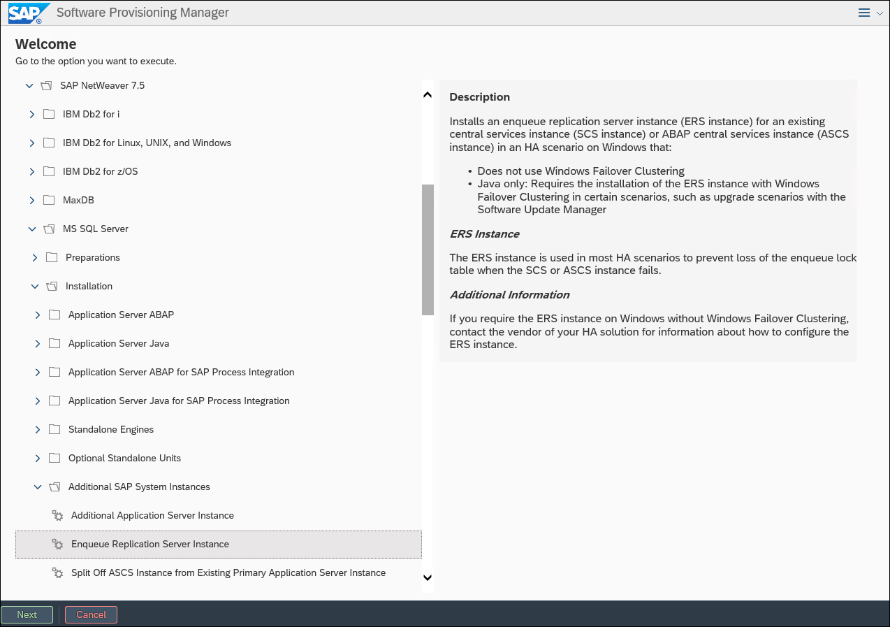

1.  On the **General Parameter Settings** page, accept the default settings, and select **Next**.

    

1.  On the **Operating System Users** page, type the passwords **demo\@pass123** twice, and select **Next**.

    

1.  On the **Enqueue Replication Server Instance** page, accept default settings and select **Next**.

    

1.  On the **Upgrade SAP Host Agent** page, accept the default settings, and select **Next**.

    

1.  On the **Software Package Browser** page, point to the location of the software packages including the **SAPHOSTAGENT.SAR**, select **Next**, and, once the package is found, select **Next** again.

    

1.  On the **Enqueue Replication Server Instance** page, change the name of the **ERS Instance Host** to **s03-ascs-ers0** and select **Next**.

    

1.  On the **Activate Server Instance** page, accept default settings and select **Next**.

    

1.  On the **Parameter Summary** page, select **Next**.

    

1.  Monitor progress of installation.

    

1.  Wait until the installation completes. This might take about 5 minutes. Once the installation completes, select **OK**.

    

1.  On the **Execution of Service has been completed successfully** page, select **Exit**.

    

    >**Note:** If you receive a error at the end of the installation process regarding shutdown of instance **S03/ASCS00**, start **SAP Management Console** by selecting its icon on the desktop and, in the SAP Management Console, restart the local instance of SAP ASCS service. Then switch back to the web browser page displaying the Software Provisioning Manager interface and click **Retry**.

1.  Switch back to the Remote Desktop session to the **adPDC** Azure VM and start a Remote Desktop session to **s03-ascs-0**. When prompted to authenticate, sign again in with the **CONTOSO\\s03-su** user account.

1.  Switch to the Remote Desktop session to s03-ascs-1 and start SAP Software Provisioning Manager by executing **sapinst.exe**.

    

1.  The installation will automatically launch Internet Explorer and display the **This site is not secure** page. This is expected. Select **More information** and the **Go on to the web page (not recommended)** links and, when prompted, sign-in with the **CONTOSO\\s03-su**.

1.  On the **Welcome to SAP Installation** page, navigate to **SAP NetWeaver 7.5-\>MS SQL Server-\>Installation-\>Additional SAP System Instances-\>Enqueue Replication Server Instance**, and select **Next**.

    

1.  On the **General Parameter Settings** page, accept the default settings, and select **Next**.

    

1.  On the **Operating System Users** page, type the passwords **demo\@pass123** twice, and select **Next**.

    

1.  On the **Enqueue Replication Server Instance** page, accept default settings and select **Next**.

    

1.  On the **Upgrade SAP Host Agent** page, accept the default settings, and select **Next**.

    

1.  On the **Software Package Browser** page, point to the location of the software packages including the **SAPHOSTAGENT.SAR**, select **Next**, and, once the package is found, select **Next** again.

    

1.  On the **Enqueue Replication Server Instance** page, change the name of the **ERS Instance Host** to **s03-ascs-ers1** and select **Next**.

    

1.  On the **Activate Server Instance** page, accept default settings and select **Next**.

    

1.  On the **Parameter Summary** page, select **Next**.

    

1.  Monitor progress of installation.

    

1.  Wait until the installation completes. This might take about 5 minutes. Once the installation completes, select **OK**.

    

1.  On the **Execution of Service has been completed successfully** page, select **Exit**.

    

    >**Note:** If you receive a error at the end of the installation process regarding shutdown of instance **S03/ASCS00**, start **SAP Management Console** by selecting its icon on the desktop and, in the SAP Management Console, restart the local instance of SAP ASCS service. Then switch back to the web browser page displaying the Software Provisioning Manager interface and click **Retry**.

1.  To verify the installation, start **SAP Management Console** by selecting its icon on the desktop and verify that all SAP components are operational.

    


### Summary

In this exercise, you configured the Azure VMs that constitute the SAP ASCS layer. This included installing and configuring Failover Clustering on both VMs and running the Software Provisioning Manager-based installation of the ASCS and ERS components on each.

## Exercise 3: Configure SAP NetWeaver database servers

Duration: 120 minutes

### Overview

In this exercise, you will configure the SAP NetWeaver database servers. You will start by installing a separate, stand-alone instance of SQL Server 2017 on each VM. Next, you will run SAP Software Provisioning Manager to install HA DB component on the s03-db-0 VM. Afterwards, you will implement high-availability by setting both SQL Server instances as members of the same Always-On Availability Group. Just as in the previous exercise, you will use Cloud Witness to provide the quorum for the Failover Cluster. You will also copy SQL Server logins from the instance hosted on s03-db-0 to the instance hosted on s03-db-1. Finally, you will update the SAP default profile to point to the Always-On Availability Group listener, rather than to an individual SQL Server 2017 instance.

### Task 1: Configure storage of the SAP database layer

In this task, you will configure the Azure VMs for the database layer by attaching an extra Premium 512 GB data disk to each of them (the template-based deployment resulted in one disk of 128 GB in size already attached to every Azure VM within that deployment). Set the host caching on the 128 GB disk to **None** (since this disk will be used to host logs) and on the 512 GB disk to **Read-only** (since this disk will be used to host data files). Next, you will configure the 128 GB data disk as ReFS formatted L: drive to host log files and the 512 GB data disk as ReFS formatted M: drive to host database files.

1.  On the lab computer, in the web browser displaying the Azure portal, navigate to the **s03-db-0** VM blade, and select **Disks**.

1.  From the **s03-db-0 | Disks** blade, add a 512 GB Premium managed data disk named **s03-db-0_disk3**.

1.  On the **s03-db-0 | Disks** blade, set **HOST CACHING** for the newly added disk to **Read-only**.

1.  On the **s03-db-0 | Disks** blade, set **HOST CACHING** for the first data disk to **None**.

1.  On the **s03-db-0 | Disks** blade, click **Save** to save the changes.

1.  From the Azure portal, navigate to the **s03-db-1** VM blade, and select **Disks**.

1.  From the **s03-db-0 | Disks** blade, add a 512 GB Premium managed data disk named **s03-db-1_disk3**.

1.  On the **s03-db-1 | Disks** blade, set **HOST CACHING** for the newly added disk to **Read-only**.

1.  On the **s03-db-1 | Disks** blade, set **HOST CACHING** for the first data disk to **None**.

1.  On the **s03-db-1 | Disks** blade, click **Save** to save the changes.

1.  Switch to the Remote Desktop session to adPDC and initiate a Remote Desktop session to **s03-db-0**. When prompted to authenticate, sign in with the **CONTOSO\\s03-su** user account you created in the first exercise.

1.  Within the Remote Desktop session to s03-db-0, start a Windows PowerShell ISE session as Administrator and run the following to configure the attached disks:

    ```powershell
    mountvol c:\sql\data /D
    mountvol c:\sql\log /D
    Clear-Disk -Number 2 -RemoveData -Confirm:$false 
    Get-Disk -Number 2 | Initialize-Disk -PartitionStyle GPT -PassThru | New-Partition -DriveLetter 'L' -UseMaximumSize | Format-Volume -FileSystem ReFS -NewFileSystemLabel 'Logs Disk' -Confirm:$false
    Get-Disk -Number 3 | Initialize-Disk -PartitionStyle GPT -PassThru | New-Partition -DriveLetter 'M' -UseMaximumSize | Format-Volume -FileSystem ReFS -NewFileSystemLabel 'Data Disk' -Confirm:$false
    ```

1.  Switch to the Remote Desktop session to adPDC and initiate a Remote Desktop session to **s03-db-1**. When prompted to authenticate, sign in with the **CONTOSO\\s03-su** user account you created in the first exercise.

1.  Within the Remote Desktop session to s03-db-0, start a Windows PowerShell ISE session as Administrator and run the following to configure the attached disks:

    ```powershell
    mountvol c:\sql\data /D
    mountvol c:\sql\log /D
    Clear-Disk -Number 2 -RemoveData -Confirm:$false 
    Get-Disk -Number 2 | Initialize-Disk -PartitionStyle GPT -PassThru | New-Partition -DriveLetter 'L' -UseMaximumSize | Format-Volume -FileSystem ReFS -NewFileSystemLabel 'Logs Disk' -Confirm:$false
    Get-Disk -Number 3 | Initialize-Disk -PartitionStyle GPT -PassThru | New-Partition -DriveLetter 'M' -UseMaximumSize | Format-Volume -FileSystem ReFS -NewFileSystemLabel 'Data Disk' -Confirm:$false
    ```

### Task 2: Grant elevated user rights to the SQL Server service account

In this task, you will use Group Policy to grant the following user rights to the SQL Server service account (**s03-db-0-sqlsvc** and **s03-db-1-sqlsvc**) on the Window Server 2016 computers hosting their respective SQL Server instances.

-   Perform volume maintenance tasks

-   Lock pages in memory

These options provide potential performance improvements, as documented in <https://docs.microsoft.com/en-us/sql/relational-databases/databases/database-instant-file-initialization?view=sql-server-2016> and <https://docs.microsoft.com/en-us/sql/database-engine/configure-windows/enable-the-lock-pages-in-memory-option-windows?view=sql-server-2016> .

In a production deployment, you should consider using domain-based Group Policy Objects rather than local Group Policy. This approach is used in this lab strictly for simplicity.

1.  Within the Remote Desktop session to s03-db-0, start Group Policy Editor from the Tools menu in Server Manager.

1.  In the left pane of the Local Security Policy console, expand the **Local Policies** node, and then select **User Rights Assignment**.

1.  In the right pane, double-click **Perform volume maintenance tasks**.

1.  In the **Perform volume maintenance tasks Properties** window, select **Add User or Group**.

1.  In the **Select Users or Groups** dialog box, type **CONTOSO\\s03-db-0-sqlsvc** and select **OK** twice.

1.  Back in the Group Policy Editor console, in the right pane, double-click **Lock pages in memory**.

1.  In the **Lock pages in memory Properties** window, select **Add User or Group**.

1.  In the **Select Users or Groups** dialog box, type **CONTOSO\\s03-db-0-sqlsvc** and select **OK** twice.

1.  Restart s03-db-0.

1.  Repeat steps 1-10 on s03-db-1, but this time assign both user rights to **CONTOSO\\s03-db-1-sqlsvc**.


### Task 3: Install SQL Server 2017 with the SQL\_Latin1\_General\_CP850\_BIN2 collation

In this task, you will configure operating system on s03-db-0 and s03-db-1 and install SQL Server 2017 on s03-db-0 and s03-db-1 Azure VMs. Run the installation as the **CONTOSO\\s03-su** account you created in the first exercise. Start by disabling the Windows firewall for the domain profile. Perform the installation of SQL Server 2017 on both s03-db-0 and s03-db-1 with the following settings:

-   Use Microsoft Update to check for updates (recommended): **disabled**

-   Feature Selection:

    -   **Database Engine Services**

    -   **Client Tools Connectivity**

-   Instance Configuration: **Default instance**

-   Service Accounts:

    -   s03-db-0

        -   SQL Server: **contoso\\s03-db-0-sqlsvc**

        -   SQL Server Agent: **contoso\\s03-db-0-sqlsvc**

    -   s03-db-1

        -   SQL Server: **contoso\\s03-db-1-sqlsvc**

        -   SQL Server Agent: **contoso\\s03-db-1-sqlsvc**

-   Collation: **SQL\_Latin1\_General\_CP850\_BIN2**

-   Windows authentication mode:

    -   SQL Server Administrators

        -   **contoso\\s03-su**

        -   **s03-db-0\\Administrators**

-   Data Directories:

    -   **Data root directory: C:\\Program Files\\Microsoft SQL Server**

    -   **User database directory: M:\\Program Files\\Microsoft SQL Server\\MSSQL13.MSSQLSERVER\\MSSQL\\Data**

    -   **User database log directory: L:\\Program Files\\Microsoft SQL Server\\MSSQL13.MSSQLSERVER\\MSSQL\\Data**

    -   **Backup directory: M:\\Program Files\\Microsoft SQL Server\\MSSQL13.MSSQLSERVER\\MSSQL\\Backup**

-   TempDB:

    -   **Data directories: M:\\Program Files\\Microsoft SQL Server\\MSSQL13.MSSQLSERVER\\MSSQL\\Data (note that you'll need to create this directory)**.

    -   **Log directory: L:\\Program Files\\Microsoft SQL Server\\MSSQL13.MSSQLSERVER\\MSSQL\\Data**

    -   **On both s03-db-0 and s03-db-1, download and install SQL Server Management Studio with the default settings**.

    -   **Copy SAP specific logins from s03-db-0 to s03-db-1 with their existing settings, including the default database and the server role**.

1.  Within the Remote Desktop session to adPDC, establish an Remote Desktop session to **s03-db-0**. When prompted to authenticate, sign in with the **CONTOSO\\s03-su** user account you created in the first exercise.

1.  Within the Remote Desktop session to s03-db-0 VM, in Server Manager, select the **Local Server** entry, select the **On** link next to the **IE Enhanced Security Configuration** label, in the **Internet Explorer Enhanced Security Configuration** dialog box, select both **Off** options, and select **OK**.

1.  Within the Remote Desktop session to s03-db-0, start a Windows PowerShell ISE session as Administrator, and run the following to disable Windows Defender Firewall:

    ```powershell
    Set-NetFirewallProfile -Profile Domain -Enabled False
    ```

1.  Within the Remote Desktop session to s03-db-0 VM, start Internet Explorer, navigate to <https://www.microsoft.com/en-us/sql-server/sql-server-downloads>, download SQL Server 2019 Evaluation Edition ISO to the local c:\Media folder (you will need to create it), mount it, and run **setup.exe** to open **SQL Server Installation Center**. In **SQL Server Installation Center**, select **Installation** and then, select **New SQL Server stand-alone installation or add features to an existing installation**.

    

1.  On the Product Key page, accept the default, and select **Next**.

1.  On the **License Terms**, enable the **I accept the license terms** checkbox, and select **Next**.

1.  On the **Microsoft Update** page, leave the **Use Microsoft Update to check for updates (recommended)** checkbox unchecked and select **Next**.

1.  On the **Feature Selection** page, select the following checkboxes:

    -   Database Engine Services

    -   Client Tools Connectivity

        Leave all other settings at their defaults and select **Next**.

    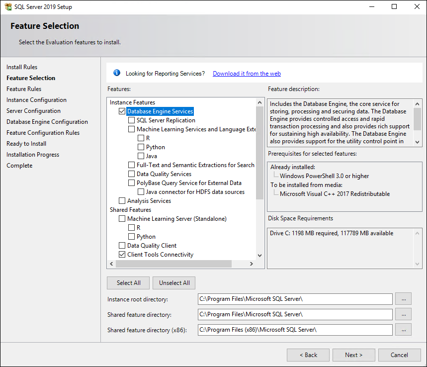

1.  On the **Instance Configuration** page, leave the default settings in place, and select **Next**.

    

1.  In the **Service Accounts** tab on the **Server Configuration** page, set the account for the SQL Server and SQL Server Agent services to **contoso\\s03-db-0-sqlsvc** with **demo\@pass123** password and switch to the **Collation** tab.

1.  On the **Collation** tab and select **Customize**. In the **Customize the SQL Server 2019 Database Engine Collation** window, in the **SQL collation, used for backward compatibility**, select **SQL\_Latin1\_General\_CP850\_BIN2**, and select **OK**. Back on the **Server Configuration** page, select **Next**.

    

1.  On the **Database Engine Configuration** page, ensure the **Windows authentication mode** option is selected, and select **Add Current User**. Next, select **Add** in the **Select Users, Computers, Service Accounts, and Groups** dialog box, type **s03-db-0\\Administrators**, and select **OK**.

    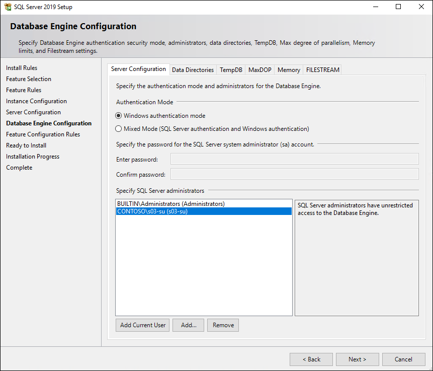

1.  Back on the **Database Engine Configuration** page, select **Data Directories**, and specify the following settings:

    -   Data root directory: **C:\\Program Files\\Microsoft SQL Server**

    -   User database directory: **M:\\Program Files\\Microsoft SQL Server\\MSSQL14.MSSQLSERVER\\MSSQL\\Data**

    -   User database log directory: **L:\\Program Files\\Microsoft SQL Server\\MSSQL14.MSSQLSERVER\\MSSQL\\Data**

    -   Backup directory: **M:\\Program Files\\Microsoft SQL Server\\MSSQL14.MSSQLSERVER\\MSSQL\\Backup**

    

1.  Back on the **Database Engine Configuration** page, select **TempDB**, and specify the following settings:

    -   Data directories: **M:\\Program Files\\Microsoft SQL Server\\MSSQL14.MSSQLSERVER\\MSSQL\\Data** *(Note that you will need to create this directory.)*

    -   Log directory: **L:\\Program Files\\Microsoft SQL Server\\MSSQL14.MSSQLSERVER\\MSSQL\\Data**

    

1.  On the **Database Engine Configuration** page, select **Next**.

1.  On the **Ready to Install** page, select **Install**.

    

1.  Wait for the installation to complete and, on the **Complete** page, select **Close**.

1.  On s03-db-0, start Internet Explorer, browse to <https://docs.microsoft.com/en-us/sql/ssms/download-sql-server-management-studio-ssms?view=sql-server-ver15>, download the current production release of the SQL Server Management Studio and install it with the default settings.

1.  Repeat all previous steps in this task on s03-db-1, but in step 10, use the **contoso\\s03-db-1-sqlsvc** account, and in step 12, use **s03-db-1\\Administrators**.

1.  Restart s03-db-0 and s03-db-1.


### Task 4: Install the SAP database layer

In this task, you will install the SAP database instance on s03-db-0 Azure VM by using the SAP Software Provisioning Manager. Run the installation as the **CONTOSO\\s03-su** account you created in the first exercise. During the installation, address all necessary prerequisites, and specify the following parameters:

-   Profile Directory: **\\\\<storage_account_name>\\sapmnt\\S03\\SYS\\profile**

-   SAP System User Domain: **Domain of Current User**

-   OU Path: **S03**

-   Database instance: **S03-DB-0**

-   SAP Host Agent User Domain: **Local Domain**

-   MS SQL Server Data Files: **4 for small systems**

-   MS SQL Server Database Files:

    -   **data: M:\\S03DATA1**

    -   **data: M:\\S03DATA2**

    -   **data: M:\\S03DATA3**

    -   **data: M:\\S03DATA4**

    -   **log: L:\\S03LOG1**

-   SAP System Database Import:

    -   **Number of Parallel Jobs: 3**

-   Set all passwords to **demo\@pass123**

1.  From within the Remote Desktop session to adPDC, establish an Remote Desktop session to **s03-db-0**. When prompted to authenticate, sign in with the **CONTOSO\\s03-su** user account you created in the first exercise.

1.  Within the Remote Desktop session to s03-db-0, run the following to copy the content of the **C:\Media** folder from s03-ascs-0 to the local **C:\Media** folder:

    ```
    robocopy \\s03-ascs-0\c$\Media c:\Media /e /r:1 /w:1
    ```

1.  Start File Explorer and extract the content of NW 7.5 Installation Export **c:\Media\51050829_3.ZIP** into the new folder **c:\Media\51050829_3**.

1.  In File Explorer, navigate to the **c:\Media\SWPM** folder, and double-click the SAP Software Provisioning Manager executable **sapinst.exe**.

    

1.  The **sapinst.exe** installer will automatically launch Internet Explorer and display a page with the notification **This site is not secure**, regarding a problem with the website's security certificate. This is expected. Select **More information** and the **Go on to the webpage (not recommended)** link and, when prompted, sign-in with the **CONTOSO\\s03-su** account you created in the first exercise and select the checkbox **Remember my credentials**.

1.  On the **Welcome to SAP Installation** page, navigate to **SAP NetWeaver 7.5-\>MS SQL Server-\>Installation-\>Application Server ABAP-\>High-Availability System-\>Database Instance**, and select **Next**.

    

1.  On the **Warning** page, select **OK**. You will be automatically logged off. 

    

1.  Back within the Remote Desktop session to adPDC, start a Remote Desktop session to s03-db-0 and log back on by using the same user credentials (**CONTOSO\\s03-su**). The Software Provisioning Manager will starts automatically. In the Internet Explorer window, on the **This site is not secure** page, select **More information**, select the **Go on to the webpage (not recommended)** link and, when prompted, sign-in with the **CONTOSO\\s03-su** account.

1.  On the **General SAP System Parameters** page, in the **Profile Directory** text box type **\\<storage_account_name>\\\\sapmnt\\S03\\SYS\\profile** (where **<storage_account_name>** designates the name of the storage account hosting the sapmnt share you created in earlier in this lab) and select **Next**.

    

1. On the **ABAP Message Server** page, accept the default settings, and select **Next**.

    

1.  On the **Master Password** page, set the password to **demo\@pass123**, and select **Next**.

    

1.  On the **Windows Domain** page, accept the default settings and select **Next**.

    

1.  On the **Organizational Units for Windows Domain** page, select the checkbox **Use Organizational Units**, accept the default settings, and select **Next**.

    

1.  On the **General SAP System Parameters** page, accept the default value of **Unicode** of **SAP System Code Page** and select **Next**.

    

1.  On the **MS SQL Server Database Connection** page, ensure that **Database instance** is set to **S03-DB-0**, and select **Next**.

    

1.  On the **New MS SQL Server Database** page, acknowledge the message stating that a new database will be created, and select **Next**.

    

1.  On the **Software Package Browser** page, point to the location of the software packages including the kernel, select **Next**, and once the package is located, select **Next** again.

    

1.  On the **Prerequisites Checker Results** page, identify the missing prerequisites.

    

1.  In order to satisfy the prerequisites and allow for the use of virtual names in the ASCS layer, you will run a Windows PowerShell script that creates several Windows registry entries. On s03-db-0 VM, start a Windows PowerShell ISE session as Administrator and run the following:

    ```powershell
    $nodes = ('s03-db-0','s03-db-1')

    Invoke-Command $nodes {
        $registryPath = 'HKLM:\SYSTEM\CurrentControlSet\Services\lanmanworkstation\parameters'
        $registryEntry = 'DisableCARetryOnInitialConnect'
        $registryValue = 1
        New-ItemProperty -Path $registryPath -Name $registryEntry -Value $registryValue -PropertyType DWORD -Force
    }

    Invoke-Command $nodes {
        $registryPath = 'HKLM:\SYSTEM\CurrentControlSet\Control\LSA'
        $registryEntry = 'DisableLoopbackCheck'
        $registryValue = 1
        New-ItemProperty -Path $registryPath -Name $registryEntry -Value $registryValue -PropertyType DWORD -Force
    }

    Invoke-Command $nodes {
        $registryPath = 'HKLM:\SYSTEM\CurrentControlSet\Services\lanmanserver\parameters'
        $registryEntry = 'DisableStrictNameChecking'
        $registryValue = 1
        New-ItemProperty -Path $registryPath -Name $registryEntry -Value $registryValue -PropertyType DWORD -Force
    }
    ```

1.  On the **Prerequisites Checker Results** page, select **Next**. 

1.  On the **Question** page, When prompted whether to repeat the checks, select **Yes**.

1.  On the **Software Package Browser** page, point to the location of the software packages including the **SAPHOSTAGENT.SAR**, and select **Next**.

    

1.  On the **Windows Domain for SAP Host Agent** page, accept the default settings, and select **Next**.

    

1.  On the **SAP Host Agent Operating System Users** page, accept the default password of **demo\@pass123** you set earlier and select **Next**.

    

1.  On the **Media Browser** page, set the **Installation Export NW750 (folder EXP1)** **Package Location** entry to **C:\Media\51050829_3\DATA_UNITS\EXP1** and select **Next**.

    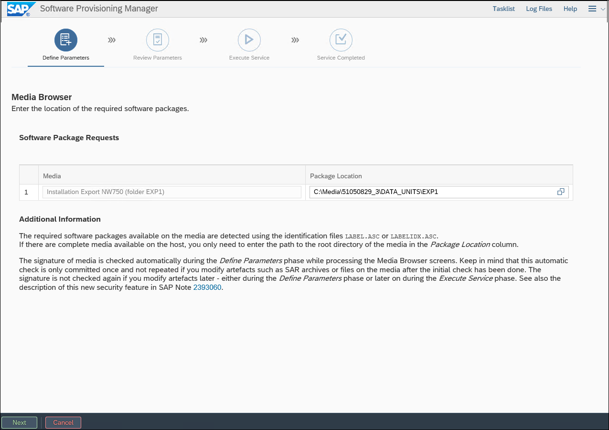

1.  On the **Media Browser** page, set the **Installation Export NW750 (folder EXP3)** **Package Location** entry to **C:\Media\51050829_3\DATA_UNITS\EXP3** and select **Next**.

    

1.  On the **Media Browser** page, set the **Installation Export NW750 (folder EXP2)** **Package Location** entry to and select **Next**.

    

1.  On the **MS SQL Server Database Schema** page, accept the default settings, and select **Next**.

    

1.  On the **MS SQL Server Data Files** page, select the option **4 for small systems**, and select **Next**.

    

1.  On the **MS SQL Server Database Files** page, change the path of the log file to **L:\\S03LOG1**, accept all other default settings, and select **Next**.

    

1.  On the **MS SQL Server Tempdb Configuration** page, in the **New Tempdb Files** section, set the location of **templog** to **L:\TEMPDB\templog.ldf** and select **Next**.

    

1.  On the **SQL Server Memory Configuration** page, accept the default settings, and select **Next**.

    

1.  On the **SQL Server MAXDOP configuiration** page, accept the default setting, and select **Next**.

    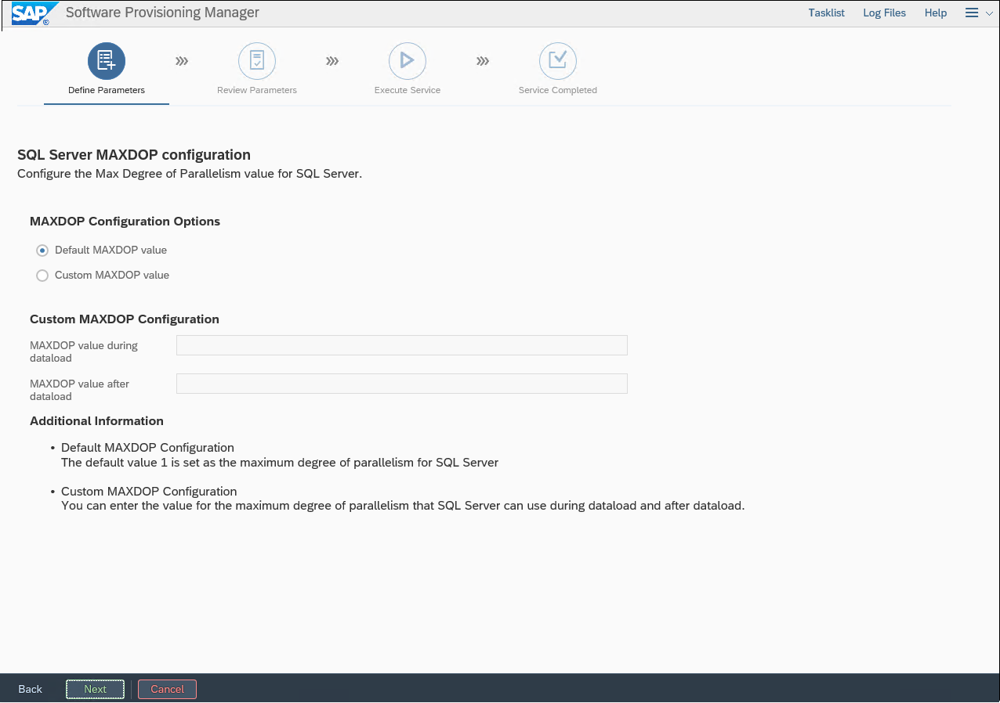

1.  On the **Declustering/Depooling Option** page, accept the default setting, and select **Next**.

    

1.  On the **SAP System Database Import** page, accept the default settings, and select **Next**.

    

1.  On the **MS SQL Server > Required SAP Notes** page, review the information regarding steps after installation, and select **Next**.

    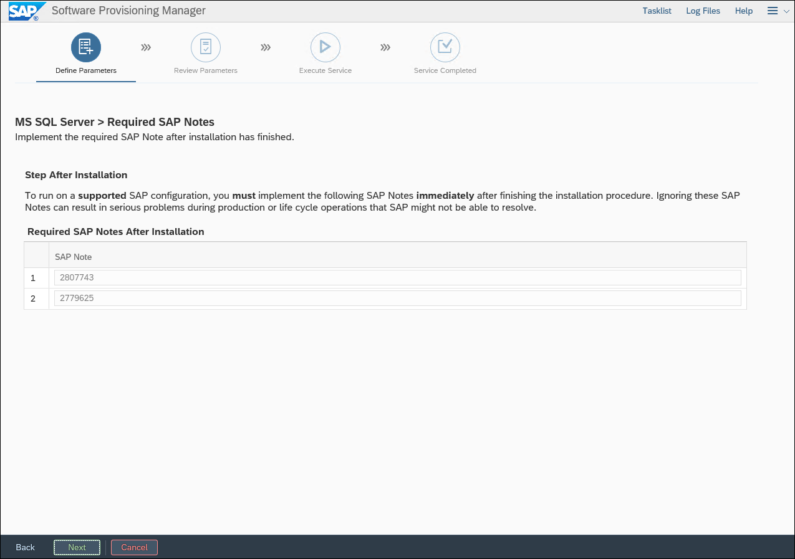

    >**Note:** While you must implement the SAP Notes referenced in this step in a production environment, their installation will not be included in this lab for the sake of simplicity. 

1.  On the **Parameter Summary** page, select **Next**.

    

1.  Monitor the progress of the installation on the **Execute Service** page.

    

1.  Wait until the installation completes. This might take about 30 minutes. Once the installation completes, select **OK**.

    

1.  On the **Execution of Service has been completed successfully** page, select **Exit**.

    


### Task 5: Implement Always-On Availability Group

In this task, you will implement a Failover Clustering-based cluster named **s03-db-cl0** with the IP address of **10.0.1.17** on s03-db0 and s03-db-1 Azure VMs with Always-On Availability Group hosting the SAP database. Set up the cluster with a Cloud Witness quorum by using the storage account you created in the second exercise. To prepare for setting up Always-On Availability Group for the SAP database you installed in the previous task, grant the **Create Computer Objects** permissions on the **S03** organizational unit in the contoso.com Active Directory to the newly created **contoso\\s03-db-cl0** account. In addition, create a directory structure on s03-db-1 that matches the directory structure on the M: and L: drives of s03-db-0.

Next, from SQL Server Configuration Manager, enable Always-On Availability Groups, and restart the SQL Server (MSSQLSERVER) service on both s03-db-0 and s03-db-01. On s03-db-0, create a new share **C:\\Backup** named **Backup**. On the share level and on the ReFS level, grant **Read/Write** permissions to **CONTOSO\\s03-db-0-sqlsvc** account and **Read** permissions to the **CONTOSO\\s03-db-1-sqlsvc** account.

From SQL Server Management Studio on s03-db-0, use the New Availability Group Wizard to create a new Availability Group with the following settings:

-   Name: **s03-db-ag0**

-   User database for availability group: **S03**

-   Replicas: **S03-DB-0 and S03-DB-1**

    -   Automatic Failover: **Yes**

    -   Synchronous Commit: **Yes**

    -   Readable Secondary: **No**

    -   Initial Data Synchronization: **Full**

    -   A shared network location accessible by all replicas: [**\\\\S03-DB-0\\Backup**](file://S03-DB-0/Backup)

>**Note:** The majority of customers choose to use Transparent Data Encryption (TDE) when deploying SQL Server databases to Azure. If you use TDE, then you cannot use the Always-On Availability Group wizard. Instead, you have to follow the instructions described in <https://blogs.msdn.microsoft.com/saponsqlserver/2017/04/04/more-questions-from-customers-about-sql-server-transparent-data-encryption-tde-azure-key-vault/> . Alternatively, you can enable TDE after establishing the Always On Availability Group, however this is a tedious and slow process. For the purpose of this lab, you will not enable TDE and use the Always-On Availability Group wizard when setting up the Always-On Availability Group.

In the Failover Cluster Manager, create a new Client Access Point with the following settings:

-   Name: **s03-db-agl0**

-   IP address: **10.0.1.16 (static) --** *make sure it matches the IP address assigned to the s03-lb-db load balancer*

Set the dependency of **s03-db-ag0** on **s03-db-agl0**.

Use Windows PowerShell to set the properties of the IP address resource of the newly created Client Access Point as follows:

-   Address: **10.0.1.16**

-   ProbePort: **62500**

-   SubnetMask: **255.255.255.255**

-   Network: **Cluster Network 1**

-   EnableDhcp: **0**

In the SQL Server Management Studio, set the port of the **s03-db-agl0** listener to **1433**.

Bring the Always-On Availability Group clustered role online.

1.  Within the Remote Desktop session to s03-db-0 VM, in the Windows PowerShell ISE session, run the following to install the Windows Failover Clustering feature and its subfeatures on s03-db-0 and s03-db-1 VMs:

    ```powershell
    $nodes = ('s03-db-0','s03-db-1')
    Invoke-Command $nodes {Install-WindowsFeature Failover-Clustering -IncludeAllSubFeature -IncludeManagementTools} 
    ```

1.  Within the Remote Desktop session to s03-db-0 VM, in the Windows PowerShell ISE session, run the following to restart s03-db-0 and s03-db-1 VMs:

    ```powershell
    Restart-Computer -ComputerName 's03-db-1' -Force
    Restart-Computer -ComputerName 's03-db-0' -Force
     ```

1.  From within the Remote Desktop session to adPDC, reconnect via Remote Desktop to **s03-db-0**. When prompted to authenticate, sign in with the **CONTOSO\\s03-su** user account.

1.  Within the Remote Desktop session to s03-db-0, start a Windows PowerShell ISE session as Administrator and run the following to create a new failover cluster:

    ```powershell
    $nodes = ('s03-db-0','s03-db-1')
    New-Cluster -Name s03-db-cl0 -Node $nodes -NoStorage -StaticAddress 10.0.1.17
    ```

    >**Note:** Wait until the cluster is provisioned.

1.  From the same Windows PowerShell ISE session, run the following to install Azure PowerShell module and authenticate to your Azure subscription (when prompted, sign in by using your Azure AD account):

    ```powershell
    Install-PackageProvider -Name NuGet -Force
    Install-Module -Name Az -Force
    Add-AzAccount
    ```

1.  If your account has access to multiple subscriptions, from the Windows PowerShell ISE console, run the following to identify these subscriptions:

    ```powershell
    Get-AzContext -ListAvailable | Select-Object Name, Subscription
    ```

1.  If your account has access to multiple subscriptions, from the Windows PowerShell ISE console, run the following to select the Azure subscription that you are using for this lab (replace the placeholder `[subscriptionId]` with the value of the target subscription you identified in the previous step):

    ```powershell
    Set-AzContext -SubscriptionId [subscriptionId]
    ```
1.  From the same Windows PowerShell ISE session, create a Cloud Witness quorum by running the following (when prompted, sign in with the Service Administrator account of your Azure subscription):

    ```powershell
    $storageAccountName = (Get-AzStorageAccount -ResourceGroupName s03-RG)[0].StorageAccountName
    $storageAccountKey = (Get-AzStorageAccountKey -ResourceGroupName s03-RG -Name $storageAccountName).Value[0]
    Set-ClusterQuorum -CloudWitness -AccountName $storageAccountName -AccessKey $storageAccountKey
    ```

1.  Within the Remote Desktop session to s03-db-0, in the Start Menu, navigate to the **Windows Administrative Tools** and start Active Directory Administrative Center.

1.  In the Active Directory Administrative Center, navigate to the **S03** organizational unit of the contoso.com domain, and display its properties.

    

1.  In the **S03** window, navigate to the **Extensions** section and, on the **Security** tab, select **Advanced**.

    

1.  In the **Advanced Security Settings for S03** window, select **Add**.

    

1.  In the **Permission Entry for S03** window, select **Select Principal**. In the **Select User, Service Account or Group** dialog box, select **Object Types**, enable the checkbox next to the **Computers** entry, and select **OK**. Back in the **Select User, Computer, Service Account or Group** dialog box, type **s03-db-cl0** in the **Enter the object name to select**, and select **OK**.

    

1.  In the **Permission Entry for S03** window, ensure that **Allow** appears in the **Type** drop-down list. Next, in the **Applies to** drop-down list, select **This object and all descendant objects**. In the **Permissions** list, select **Create Computer objects** and select **OK**.

    

1.  Back in the **Advanced Security for S03** window, select **OK**.

1.  From the Remote Desktop session to s03-db-0, in the Windows PowerShell ISE session, run:

    ```powershell
    Invoke-Command -ComputerName 's03-db-1' {
        New-Item -ItemType Directory M:\S03DATA1
        New-Item -ItemType Directory M:\S03DATA2
        New-Item -ItemType Directory M:\S03DATA3
        New-Item -ItemType Directory M:\S03DATA4
        New-Item -ItemType Directory L:\S03LOG1
    }
    ```

1.  In the remote Desktop Session to s03-db-0, in the Start menu, navigate to the **Microsoft SQL Server 2019** folder and select **SQL Server Configuration Manager**.

1.  In **SQL Server Configuration Manager**, display the **Properties** window of the **SQL Server (MSSQLSERVER)** service, switch to the **Always-On High Availability** tab, enable the checkbox labeled **Enable Always-On Availability Groups**, and select **OK**.

    

1.  When prompted, select **OK**.

    

1.  Restart the **SQL Server (MSSQLSERVER)** service.

    

1.  Switch to the Remote Desktop session to adPDC and connect via Remote Desktop to **s03-db-1**. When prompted to authenticate, sign in with the **CONTOSO\\s03-su** user account.

1.  Within the Remote Desktop session to s03-db-1, repeat steps 17-20.

1.  Switch back to the Remote Desktop session to s03-db-0 and create a new share **C:\\Backup** named **Backup**. Grant the Change share level permission and Modify NTFS level permission to CONTOSO\\s03-db-0-sqlsvc account. Grant the Read share level permissions and Read & execute NTFS level permissions to the CONTOSO\\s03-db-1-sqlsvc account.

    

    

1.  On s03-db-0, in the Start menu, navigate to the **Microsoft SQL Server Tools 18** folder and select **Microsoft SQL Server Management Studio**.

    

1.  In SQL Server Management Studio, use Windows Authentication to access **S03-DB-0**.

    

1.  From **SQL Server Management Studio** on s03-db-0, in the **Object Explorer** pane, expand the **Databases** folder, right-click on the **S03** database, and in the right-click menu, select first **Tasks** and then **Back Up**.

    

1.  In the **Back Up Database - S03** window, select **Remove** to remove the existing backup path.

    

1.  In the **Back Up Database - S03** window, select **Add** and, in the **Select Backup Destination** dialog box, in the **File name** text box, type **C:\\Backup\\S03Full.bak** and select **OK**.

    

1.  In the **Back Up Database - S03** window, select **OK** to initiate the full backup. 

    

1.  Wait until the backup completes and close the **Back Up Database - S03** window. 

    

1.  From **SQL Server Management Studio** on s03-db-0, start **New Availability Group Wizard**.

    

1.  On the **Introduction** page of the **New Availability Group** wizard, select **Next**.

1.  On the **Specify an availability group name** page, in the **Availability group name** text box, type **s03-db-ag0**, and select **Next**.

    

1.  On the **Select user database for availability group** page, select the **S03** check box, and select **Next**.

    

1.  On the **Specify Replicas** page, select **Add Replica.** In the **Connect to Server** dialog box **\>** **Server name** text box, type **S03-DB-1** and select **Connect**.

    

1.  On the **Specify Replicas** page, enable automatic failover and synchronous commit.

    

1.  Select the **Endpoints** tab to review the database mirroring endpoints, and select **Next**.

    

1.  On the **Select Initial Data Synchronization** page, ensure the **Full database and log backup** option is selected. In the **Specify the file share path in Windows format** textbox, type **\\\\S03-DB-0\\Backup**, and select **Next**.

    

1.  On the **Validation** page, ensure that all checks completed successfully. Disregard the **Checking the listener configuration** warning, and select **Next**.

    

1.  On the **Summary** page, select **Finish**.

    

1.  On the **Results** page, select **Close**.

    

1.  On s03-db-0, start **Failover Cluster Manager,** select the **Networks** node, and note the network name (**Cluster Network 1**).

    

1.  In the **Failover Cluster Manager** console, navigate to the **Roles** node, and right-click **s03-db-ag0**. In the right-click menu, select **Add Resource** followed by **Client Access Point**.

    

1.  On the **Client Access Point** page of the **New Resource Wizard**, in the **Name** textbox, type **s03-db-agl0**, and select **Next**.

    

1.  On the **Confirmation** page, select **Next**.

    

1.  On the **Summary** page, select **Finish**.

    

1.  In the Failover Cluster Manager console, display the **Properties** dialog box of the IP address resource of the availability group listener resource.

    

1.  In the **IP Address: Address on Cluster Network 1 Properties** dialog box, select the **Static IP Address** option, set the **Address to 10.0.1.25** (to match the IP address assigned to the **frontendsql** frontend IP configuration of the **s03-lb-db** load balancer), and select **OK**.

    

1.  If necessary, back in the **Failover Cluster Manager** console, take the **s03-db-ag0** resource offline.

    

1.  Display the properties of the **s03-db-ag0** resource. In the **s03-db-ag0 Properties** dialog box, switch to the **Dependencies** tab, and add a dependency on **Name: s03-db-agl0**. Select **OK** when completed.

    

1.  From the Windows PowerShell ISE session, run the following:

    ```powershell
    $clusterNetworkName = 'Cluster Network 1' 
    $IPResourceName = 'IP Address 10.0.1.0'
    $ilbIP = '10.0.1.25'
    [int]$probePort = 62500
    Get-ClusterResource $IPResourceName | Set-ClusterParameter -Multiple @{"Address"="$ilbIP";"ProbePort"=$probePort;"SubnetMask"="255.255.255.255";"Network"="$clusterNetworkName";"EnableDhcp"=0}
    ```

1.  From the Failover Cluster Manager console, start the **s03-db-ag0** role.

1.  Switch to **SQL Server Management Studio,** navigate to the **s03-db-agl0** listener, and display its **Properties**.

    

1.  In the **Availability Group Listener Properties -- s03-db-agl0** dialog box, set **Port** to **1433**, and select **OK**.

    

1.  In the SQL Server Management Studio, right-click on the **Always-On High Availability** folder, and select **Show Dashboard**.

    

1.  On Dashboard, verify that Always-On Availability Group s03-db-ag0 is in healthy state.

    

1.  On s03-db-0, from SQL Server Management Studio, open the **New Query** window targeting the **master** database:

    

1.  In the New Query window, paste the following T-SQL script (provided in <https://support.microsoft.com/en-in/help/918992/how-to-transfer-logins-and-passwords-between-instances-of-sql-server>).

    ```
    USE master
    GO
    IF OBJECT_ID ('sp_hexadecimal') IS NOT NULL
      DROP PROCEDURE sp_hexadecimal
    GO
    CREATE PROCEDURE sp_hexadecimal
        @binvalue varbinary(256),
        @hexvalue varchar (514) OUTPUT
    AS
    DECLARE @charvalue varchar (514)
    DECLARE @i int
    DECLARE @length int
    DECLARE @hexstring char(16)
    SELECT @charvalue = '0x'
    SELECT @i = 1
    SELECT @length = DATALENGTH (@binvalue)
    SELECT @hexstring = '0123456789ABCDEF'
    WHILE (@i <= @length)
    BEGIN
      DECLARE @tempint int
      DECLARE @firstint int
      DECLARE @secondint int
      SELECT @tempint = CONVERT(int, SUBSTRING(@binvalue,@i,1))
      SELECT @firstint = FLOOR(@tempint/16)
      SELECT @secondint = @tempint - (@firstint*16)
      SELECT @charvalue = @charvalue +
        SUBSTRING(@hexstring, @firstint+1, 1) +
        SUBSTRING(@hexstring, @secondint+1, 1)
      SELECT @i = @i + 1
    END

    SELECT @hexvalue = @charvalue
    GO
     
    IF OBJECT_ID ('sp_help_revlogin') IS NOT NULL
      DROP PROCEDURE sp_help_revlogin
    GO
    CREATE PROCEDURE sp_help_revlogin @login_name sysname = NULL AS
    DECLARE @name sysname
    DECLARE @type varchar (1)
    DECLARE @hasaccess int
    DECLARE @denylogin int
    DECLARE @is_disabled int
    DECLARE @PWD_varbinary  varbinary (256)
    DECLARE @PWD_string  varchar (514)
    DECLARE @SID_varbinary varbinary (85)
    DECLARE @SID_string varchar (514)
    DECLARE @tmpstr  varchar (1024)
    DECLARE @is_policy_checked varchar (3)
    DECLARE @is_expiration_checked varchar (3)

    DECLARE @defaultdb sysname
     
    IF (@login_name IS NULL)
      DECLARE login_curs CURSOR FOR

          SELECT p.sid, p.name, p.type, p.is_disabled, p.default_database_name, l.hasaccess, l.denylogin FROM 
    sys.server_principals p LEFT JOIN sys.syslogins l
          ON ( l.name = p.name ) WHERE p.type IN ( 'S', 'G', 'U' ) AND p.name <> 'sa'
    ELSE
      DECLARE login_curs CURSOR FOR


          SELECT p.sid, p.name, p.type, p.is_disabled, p.default_database_name, l.hasaccess, l.denylogin FROM 
    sys.server_principals p LEFT JOIN sys.syslogins l
          ON ( l.name = p.name ) WHERE p.type IN ( 'S', 'G', 'U' ) AND p.name = @login_name
    OPEN login_curs

    FETCH NEXT FROM login_curs INTO @SID_varbinary, @name, @type, @is_disabled, @defaultdb, @hasaccess, @denylogin
    IF (@@fetch_status = -1)
    BEGIN
      PRINT 'No login(s) found.'
      CLOSE login_curs
      DEALLOCATE login_curs
      RETURN -1
    END
    SET @tmpstr = '/* sp_help_revlogin script '
    PRINT @tmpstr
    SET @tmpstr = '** Generated ' + CONVERT (varchar, GETDATE()) + ' on ' + @@SERVERNAME + ' */'
    PRINT @tmpstr
    PRINT ''
    WHILE (@@fetch_status <> -1)
    BEGIN
      IF (@@fetch_status <> -2)
      BEGIN
        PRINT ''
        SET @tmpstr = '-- Login: ' + @name
        PRINT @tmpstr
        IF (@type IN ( 'G', 'U'))
        BEGIN -- NT authenticated account/group

          SET @tmpstr = 'CREATE LOGIN ' + QUOTENAME( @name ) + ' FROM WINDOWS WITH DEFAULT_DATABASE = [' + @defaultdb + ']'
        END
        ELSE BEGIN -- SQL Server authentication
            -- obtain password and sid
                SET @PWD_varbinary = CAST( LOGINPROPERTY( @name, 'PasswordHash' ) AS varbinary (256) )
            EXEC sp_hexadecimal @PWD_varbinary, @PWD_string OUT
            EXEC sp_hexadecimal @SID_varbinary,@SID_string OUT
     
            -- obtain password policy state
            SELECT @is_policy_checked = CASE is_policy_checked WHEN 1 THEN 'ON' WHEN 0 THEN 'OFF' ELSE NULL END FROM sys.sql_logins WHERE name = @name
            SELECT @is_expiration_checked = CASE is_expiration_checked WHEN 1 THEN 'ON' WHEN 0 THEN 'OFF' ELSE NULL END FROM sys.sql_logins WHERE name = @name
     
                SET @tmpstr = 'CREATE LOGIN ' + QUOTENAME( @name ) + ' WITH PASSWORD = ' + @PWD_string + ' HASHED, SID = ' + @SID_string + ', DEFAULT_DATABASE = [' + @defaultdb + ']'

            IF ( @is_policy_checked IS NOT NULL )
            BEGIN
              SET @tmpstr = @tmpstr + ', CHECK_POLICY = ' + @is_policy_checked
            END
            IF ( @is_expiration_checked IS NOT NULL )
            BEGIN
              SET @tmpstr = @tmpstr + ', CHECK_EXPIRATION = ' + @is_expiration_checked
            END
        END
        IF (@denylogin = 1)
        BEGIN -- login is denied access
          SET @tmpstr = @tmpstr + '; DENY CONNECT SQL TO ' + QUOTENAME( @name )
        END
        ELSE IF (@hasaccess = 0)
        BEGIN -- login exists but does not have access
          SET @tmpstr = @tmpstr + '; REVOKE CONNECT SQL TO ' + QUOTENAME( @name )
        END
        IF (@is_disabled = 1)
        BEGIN -- login is disabled
          SET @tmpstr = @tmpstr + '; ALTER LOGIN ' + QUOTENAME( @name ) + ' DISABLE'
        END
        PRINT @tmpstr
      END

      FETCH NEXT FROM login_curs INTO @SID_varbinary, @name, @type, @is_disabled, @defaultdb, @hasaccess, @denylogin
       END
    CLOSE login_curs
    DEALLOCATE login_curs
    RETURN 0
    GO
    ````

1.  Execute the script, and ensure that it completed successfully:

    

1.  Open another **New Query** window and from that window, run the following:

    ```
    EXEC sp_help_revlogin
    ```

1.  Ensure that the stored procedure completed successfully:

    

1.  Copy the resulting T-SQL script into Clipboard.

1.  From the SQL Server Management Studio, connect to s03-db-1.

    

1.  From the SQL Server Management Studio, open the **New Query** window targeting the **master** database of S03-DB-1.

    

1.  In the New Query window, paste the content of Clipboard. Remove all lines except for those that reference the **s03**, **CONTOSO\\s03adm**, and **CONTOSO\\SAPService03** logins and execute the resulting T-SQL script.

    

1.  In the SQL Server Management Studio, expand the **Server Roles** folder, right-click **sysadmin**, and select **Properties**.

    

1.  In the **Server Role Properties -- sysadmin** window, select **Add**.

    

1.  In the **Select Server Login or Role** dialog box, select **Browse**.

    

1.  In the **Browse for Objects** dialog box, select the three logins you created earlier, and select **OK**.

    

1.  Select **OK** twice to finalize the change.

### Task 6: Modify the SAP Default Profile

In this task, you will modify the SAP default profile in order to ensure the application tier communicates with the database tier via the newly created Always-On Availability Group listener. To accomplish this, set the value of the **dbs/mss/server** parameter to the name of the newly created Availability Group listener (**s03-db-agl0**) in the default profile of the S03 SAP system (hosted on the shared disk of the ASCS layer). In order for the change to take effect, restart the VMs that constitute the SAP ASCS layer.

1.  Within the Remote Desktop session to s03-db-0 VM, start Command Prompt and run the following to map a drive to the sapmnt Azure File share (where `<storage_account_name>` designates the name of the storage account you created in the first exercise of this lab):

    ```
    net use S: \\<storage_account_name>.file.core.windows.net\sapmnt
    ```

1.  Start File Explorer, navigate to the **S:\\S03\\SYS\\profile** folder and open the file **DEFAULT.PFL** in Notepad.

1.  Change the following entries from:

    ```
    SAPDBHOST = S03-DB-0
    dbs/mss/server = S03-DB-0
    ```

    to:

    ```
    SAPDBHOST = S03-DB-AGL0
    dbs/mss/server = S03-DB-AGL0
    ```

1.  Save the file.

### Summary

In this exercise, you have configured the SAP NetWeaver database servers. You started by first installing a separate, stand-alone instance of SQL Server 2017 on each VM. Next, you ran SAP Software Provisioning Manager to install HA DB component on the s03-db-0 VM. Afterwards, you implemented high-availability by setting both SQL Server instances as members of the same Always-On Availability Group. Just as in the previous exercise, you used Cloud Witness to provide the quorum for the Failover Cluster. You also copied SQL Server logins from the instance hosted on s03-db-0 to the instance hosted on s03-db-1. Finally, you updated the SAP default profile to point to the Always-On Availability Group listener, rather than to an individual SQL Server 2017 instance.

## Exercise 4: Configure SAP NetWeaver Application servers

Duration: 50 minutes

### Overview

In this exercise, you will configure the SAP NetWeaver application servers. You will start by installing Microsoft ODBC Driver for SQL Server on s03-di-0 and s03-di-1 Azure VMs. Next, you will use SAP Software Provisioning Manager to install the Primary Application Server (PAS) instance on s03-di-0 and follow with the installation of an Additional Application Server (AAS) instance on s03-di-1. In addition, you will install SAP Enhanced Monitoring Extension for SAP on Azure VMs included in your SAP deployment. Optionally, you might want to also consider disabling Internet Explorer by following these instructions: <https://support.microsoft.com/en-us/help/4013567/how-to-disable-internet-explorer-on-windows>.

### Task 1: Configure storage and software prerequisites of the SAP Application layer

In this task, you will configure the Azure VMs in the Application layer by mounting the 128 GB data disk as ReFS-formatted U: drive with the disk label **SAP Local FS**. On both VMs, disable Windows firewall for the domain profile. You will also install on both Visual Studio C++ 2017 Redistributable (available from <https://aka.ms/vs/15/release/vc_redist.x64.exe>) and Microsoft ODBC Driver for SQL Server (available from <https://go.microsoft.com/fwlink/?linkid=2120137> ) to facilitate connectivity to the database tier.

1.  From the Remote Desktop session to adPDC Azure VM, start a Remote Desktop session to s03-di-0. When prompted to authenticate, sign in with the **CONTOSO\\s03-su** user account you created in the first exercise.

1.  Within the Remote Desktop session to s03-di-0, in Server Manager, select the **Local Server** entry, select the **On** link next to the **IE Enhanced Security Configuration** label, in the **Internet Explorer Enhanced Security Configuration** dialog box, select both **Off** options, and select **OK**.

1.  Within the Remote Desktop session to s03-di-0 VM, start a Windows PowerShell ISE session as Administrator, and run the following to disable the Windows Defender Firewall and configure local disk on s03-di-0 and s03-di-1 VMs:

    ```powershell
    $nodes = @('s03-di-0','s03-di-1')
    Invoke-Command $nodes {
    Set-NetFirewallProfile -Profile Domain -Enabled False
    Clear-Disk -Number 2 -RemoveData -Confirm:$false 
    Get-Disk -Number 2 | Initialize-Disk -PartitionStyle GPT -PassThru | New-Partition -DriveLetter 'U' -UseMaximumSize | Format-Volume -FileSystem ReFS -NewFileSystemLabel 'SAP Local FS' -Confirm:$false
    }
    ```

1.  Within the Remote Desktop session to s03-id-0 VM, start Internet Explorer, download Visual Studio C++ 2017 Redistributable from <https://aka.ms/vs/15/release/vc_redist.x64.exe> and install it with default settings.

1.  Within the Remote Desktop session to s03-id-0 VM, download Microsoft ODBC Driver for SQL Server (version 17.5.2) from <https://go.microsoft.com/fwlink/?linkid=2120137>, and start its installation.

    

1.  On the **License Agreement** page, select **I accept the terms in the license agreement**, and select **Next**.

1.  On the **Feature Selection** page, select all features, and select **Next**.

    

1.  On the **Ready to install the Program** page, select **Install**.

1.  On the **Completing the ODBC Driver 17 for SQL Server Installation** page, select **Finish**. If prompted, restart s03-di-0 and, following the restart, reconnect to it via Remote Desktop.

1.  Connect via Remote Desktop to **s03-di-1** and run the steps 2 and 4-9.

1.  Restart both **s03-di-0** and **s03-di-1**.

### Task 2: Install the SAP Primary Application Server (PAS) layer

In this task, you will install the SAP PAS of HA deployment of MS SQL Server-based SAP NetWeaver 7.5 HA deployment on s03-di-0 Azure VM by using the SAP Software Provisioning Manager. Run the installation as the **CONTOSO\\s03-su** account you created in the first exercise. During the installation, address all necessary prerequisites, and specify the following parameters:

-   Profile Directory: **\\\\<storage_account_name>.file.core.windows.net\\sapmnt\\S03\\SYS\\profile** (where **<storage_account_name>** designates the name of the storage account you created earlier in this lab)

-   Drive for Local Instances: **U:**

-   Windows Domain: **Domain of current user**

-   Database instance: **S03-DB-AGL0**

-   Existing MS SQL Server Database: **S03**

-   Windows Domain for SAP Host Agent: **Local Domain**

-   PAS Instance Host Name: **s03-di-v0**

-   ABAP Message Server Ports: **3600**

-   Internal ABAP Message Server Ports: **3900**

-   SLD Destination for the SAP System OS Level: **No SLD destination**

-   Message Server Access Control List: **Do not create Message Server Access Control List**

-   Secure Storage Key Generation: **Default Key**

-   Set all passwords to **demo\@pass123**

Account for the fact you are using the virtual names and configure the following registry entries on both VMs:

-   HKLM\\SYSTEM\\CurrentControlSet\\Control\\LSA

    -   Set DisableLoopbackCheck to 1

-   HKLM:\\SYSTEM\\CurrentControlSet\\Services\\lanmanserver\\parameters

    -   Set DisableStrictNameChecking to 1

1.  From the Remote Desktop session to adPDC Azure VM, start a Remote Desktop session to s03-di-0. When prompted to authenticate, sign in with the **CONTOSO\\s03-su** user account you created in the first exercise.

1.  Within the Remote Desktop session to s03-di-0, start **Command Prompt** and, from the Command Prompt, run the following to copy the content of the **C:\Media** folder from s03-ascs-0 to the local **C:\Media** folder:

    ```
    robocopy \\s03-ascs-0\c$\Media c:\Media /e /r:1 /w:1
    ```

1.  Start File Explorer and extract the content of NW 7.5 Installation Export **c:\Media\51050829_3.ZIP** into the new folder **c:\Media\51050829_3**.

1.  In File Explorer, navigate to the **c:\Media\SWPM** folder, and double-click the SAP Software Provisioning Manager executable **sapinst.exe**.

    

1.  The **sapinst.exe** installer will automatically launch Internet Explorer and display a page with the notification **This site is not secure**, regarding a problem with the website's security certificate. This is expected. Select **More information** and the **Go on to the webpage (not recommended)** link and, when prompted, sign-in with the **CONTOSO\\s03-su** account you created in the first exercise and select the checkbox **Remember my credentials**.

1.  On the **Welcome to SAP Installation** page, navigate to **SAP NetWeaver 7.5-\>MS SQL Server-\>Installation-\>Application Server ABAP-\>High-Availability System-\>Primary Application Server Instance**, and select **Next**.

    

1.  On the **Warning** page, select **OK**. You will be automatically logged off. 

    

1.  Within the Remote Desktop session to adPDC, start a Remote Desktop session to s03-di-0 and log back on by using the same user credentials (**CONTOSO\\s03-su**). The Software Provisioning Manager will starts automatically. In the Internet Explorer window, on the **This site is not secure** page, select **More information**, select the **Go on to the webpage (not recommended)** link and, when prompted, sign-in with the **CONTOSO\\s03-su** account.

1.  On the **General SAP System Parameters** page, in the **Profile Directory** textbox, type **\\\\<storage_account_name>.file.core.windows.net\\sapmnt\\S03\\SYS\\profile** (where **<storage_account_name>** designates the name of the storage account you created earlier in this lab), ensure that **U:** appears in the **Destination Drive** drop down list, and select **Next**.

    

1.  On the **ABAP Message Server** page, leave the default settings in place and select **Next**.

    

1.  On the **Master Password** page, set the password to **demo\@pass123**, and select **Next**.

    

1.  On the **Windows Domain** page, accept the default settings and select **Next**.

    

1.  On the **General SAP System Parameters** page, accept the default value of **Unicode** of **SAP System Code Page** and select **Next**.

    

1.  On the **Existing MS SQL Server Database** page, accept the default value of **Database ID (DBSID)** of **S03** and select **Next**.

    

1.  On the **Software Package Browser** page, point to the location of **SAPEXE.SAR**, **SAPEXEDB.SAR**, **IGSEXE.SAR**, and **IGSHELPER.SAR** and select **Next**.

    

1.  Select **Next** again once the location of the software packages has been identified.

1.  On the **Prerequisites Checker Results** page, identify the missing prerequisites.

    

1.  In order allow for the use of virtual names, which is the first prerequisite, within the Remote Desktop session to s03-di-0 VM, start a Windows PowerShell ISE session as Administrator and run the following:

    ```powershell
    $nodes = ('s03-di-0','s03-di-1')

    Invoke-Command $nodes {
        $computerSystem = Get-WmiObject -Class Win32_ComputerSystem -EnableAllPrivileges
        $computerSystem.AutomaticManagedPagefile = $false
        $computerSystem.Put()
        $pageFile = Get-WmiObject -Query "SELECT * FROM Win32_PageFileSetting WHERE Name LIKE '%pagefile.sys'"
        $pageFile.Delete()
        Set-WmiInstance -Class Win32_PageFileSetting -Arguments @{name="D:\pagefile.sys";InitialSize = 20480;MaximumSize = 20480;}
    }
    ```

1.  In order to adjusts the paging file configuration, which is the second prerequisite, from the same Windows PowerShell ISE session, run:

    ```powershell
    Invoke-Command $nodes {
        $registryPath = 'HKLM:\SYSTEM\CurrentControlSet\Services\lanmanworkstation\parameters'
        $registryEntry = 'DisableCARetryOnInitialConnect'
        $registryValue = 1
        New-ItemProperty -Path $registryPath -Name $registryEntry -Value $registryValue -PropertyType DWORD -Force
    }

    Invoke-Command $nodes {
        $registryPath = 'HKLM:\SYSTEM\CurrentControlSet\Control\LSA'
        $registryEntry = 'DisableLoopbackCheck'
        $registryValue = 1
        New-ItemProperty -Path $registryPath -Name $registryEntry -Value $registryValue -PropertyType DWORD -Force
    }

    Invoke-Command $nodes {
        $registryPath = 'HKLM:\SYSTEM\CurrentControlSet\Services\lanmanserver\parameters'
        $registryEntry = 'DisableStrictNameChecking'
        $registryValue = 1
        New-ItemProperty -Path $registryPath -Name $registryEntry -Value $registryValue -PropertyType DWORD -Force
    }
    ```

1.  On the **Prerequisites Checker Results** page, select **Next**. 

1.  On the **Question** page, When prompted whether to repeat the checks, select **Yes**.

1.  On the **Software Package Browser** page, point to the location of the software packages including the **SAPHOSTAGENT.SAR**, select **Next**, and, once the package is found, select **Next** again.

    

1.  On the **Windows Domain for SAP Host Agent** page, accept the default settings, and select **Next**.

    

1.  On the **SAP Host Agent Operating System Users** page, accept the default password **demo\@pass123** you set earlier and select **Next**.

    

1.  On the **Primary Application Server Instance** page, set **PAS Instance Host Name** to **s03-di-v0**, and select **Next**.

    

1.  On the **ABAP Message Server Ports and Transport Host** page, accept the default settings, and select **Next**.

    

1.  On the **SLD Destination for the SAP System OS Level** page, accept the default settings, and select **Next**.

    

1.  On the **Message Server Access Control List** page, accept the default settings, and select **Next**.

    

1.  On the **Media Browser** page, set the **Installation Export NW750 (folder EXP1)** **Package Location** entry to **C:\Media\51050829_3\DATA_UNITS\EXP1** and select **Next**.

    

1.  On the **SAP System DDIC Users** page, accept the default settings, and select **Next**.

    

1.  On the **Secure Storage Key Generation** page, enable the **Default Key** option, and select **Next**.

    

1.  On the **Parameter Summary** page, select **Next**.

    

1.  Monitor the progress of the installation on the **Execute Service** page.

    

    >**Note:** If you receive an error message during creation of DDL views, select **OK** to continue. For details regarding this issue, refer to the SAP Note 2562635.

1.  Wait until the installation completes (this might take about 30 minutes). Once the installation completes, select **OK** (if during installation you encounter an error message referencing the DIR_PROFILE entry in DEFAULT.PFL, open \\\\<storage_account_name>.file.core.windows.net\\sapmnt\\S03\SYS\\profile\\DEFAULT.PFL and comment out the DIR_PROFILE = \\\\<storage_account_name>.file.core.windows.net\\sapmnt\\S03\\SYS\\profile entry by adding ## at the beginning of the line). 

    

1.  On the **Execution of Service has been completed successfully** page, select **Exit**.

    

1.  On s03-di-0, start **SAP Management Console**.

    

1.  In the SAP Management Console, verify the SAP deployment is operational.

    

### Task 3: Install the SAP Additional Application Server (AAS) layer

In this task, you will install the SAP AAS of HA deployment of MS SQL Server-based SAP NetWeaver 7.5 HA deployment on s03-di-1 Azure VM by using the SAP Software Provisioning Manager. Run the installation as the **CONTOSO\\s03-su** account you created in the first exercise. During the installation, address all necessary prerequisites and specify the following parameters:

-   Profile Directory: **\\\\<storage_account_name>.file.core.windows.net\\sapmnt\\S03\\SYS\\profile** (Where **<storage_account_name>** designates the name of the storage account you created earlier in this lab.)

-   Drive for Local Instances: **U:**

-   Windows Domain: **Domain of current user**

-   Database instance: **S03-DB-AGL0**

-   Existing MS SQL Server Database: **S03**

-   Windows Domain for SAP Host Agent: **Local Domain**

-   AAS Instance Host Name: **s03-di-v1**

-   Message Server Access Control List: **Do not create Message Server Access Control List**

-   Set all passwords to **demo\@pass123**

1.  From the Remote Desktop session to adPDC Azure VM, start a Remote Desktop session to s03-di-1. When prompted to authenticate, sign in with the **CONTOSO\\s03-su** user account you created in the first exercise.

1.  Within the Remote Desktop session to s03-di-1, start **Command Prompt** and, from the Command Prompt, run the following to copy the content of the **C:\Media** folder from s03-di-0 to the local **C:\Media** folder:

    ```
    robocopy \\s03-di-0\c$\Media c:\Media /e /r:1 /w:1
    ```

1.  Within the Remote Desktop session to s03-di-1, start File Explorer, navigate to the **c:\Media\SWPM** folder, and double-click the SAP Software Provisioning Manager executable **sapinst.exe**.

    

1.  The **sapinst.exe** installer will automatically launch Internet Explorer and display a page with the notification **This site is not secure**, regarding a problem with the website's security certificate. This is expected. Select **More information** and the **Go on to the webpage (not recommended)** link and, when prompted, sign-in with the **CONTOSO\\s03-su** account you created in the first exercise and select the checkbox **Remember my credentials**.

1.  On the **Welcome to SAP Installation** page, navigate to **SAP NetWeaver 7.5-\>MS SQL Server-\>Installation-\>Application Server ABAP-\>High-Availability System-\>Additional Application Server Instance**, and select **Next**.

    

1.  On the **Warning** page, select **OK**. You will be automatically logged off. 

    

1.  Within the Remote Desktop session to adPDC, start a Remote Desktop session to s03-di-1 and log back on by using the same user credentials (**CONTOSO\\s03-su**). The Software Provisioning Manager will starts automatically. In the Internet Explorer window, on the **This site is not secure** page, select **More information**, select the **Go on to the webpage (not recommended)** link and, when prompted, sign-in with the **CONTOSO\\s03-su** account.

1.  On the **General SAP System Parameters** page, in the **Profile Directory** textbox, type **\\\\<storage_account_name>.file.core.windows.net\\sapmnt\\S03\\SYS\\profile** (where **<storage_account_name>** designates the name of the storage account you created earlier in this lab), in the **Destination Drive** drop down list, select **U:** and select **Next**.

    

1.  On the **ABAP Message Server** page, leave the default settings in place and select **Next**.

    

1.  On the **Master Password** page, set the password to **demo\@pass123**, and select **Next**.

    

1.  On the **Windows Domain** page, accept the default settings and select **Next**.

    

1.  On the **General SAP System Parameters** page, accept the default value of **Unicode** of **SAP System Code Page** and select **Next**.

    

1.  On the **Existing MS SQL Server Database** page, accept the default value of **Database ID (DBSID)** of **S03** and select **Next**.

    

1.  On the **Software Package Browser** page, point to the location of the software packages including the **SAPHOSTAGENT.SAR**, and select **Next**.

    

1.  Select **Next** again once the location of the software packages has been identified.

1.  On the **Windows Domain for SAP Host Agent** page, accept the default settings, and select **Next**.

    

1.  On the **SAP Host Agent Operating System Users** page, set the passwords to **demo\@pass123**, and select **Next**.

    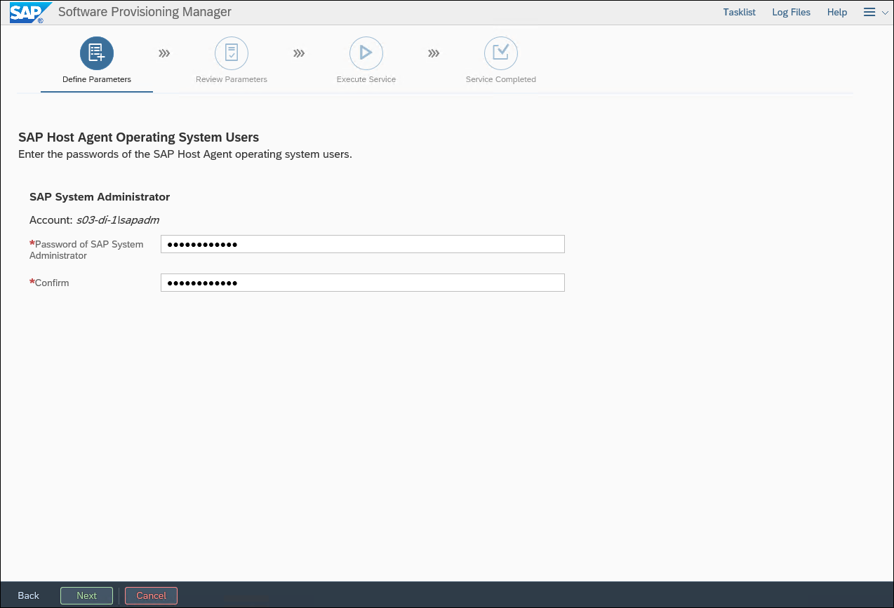

1.  On the **Additional Application Server Instance** page, set **AAS Instance Host Name** to **s03-di-v1**, and select **Next**.

    

1.  On the **Message Server Access Control List** page, accept the default settings, and select **Next**.

    

1.  On the **Parameter Summary** page, select **Next**.

    

1.  Monitor the progress of the installation on the **Execute Service** page.

    

1.  Wait until the installation completes (this might take about 30 minutes). Once the installation completes, select **OK**.

1.  On the **Execution of Service has been completed successfully** page, select **Exit**.

1.  On s03-di-1, start **SAP Management Console**.

    

1.  In the SAP Management Console, verify the SAP deployment is operational.

    


### Task 4: Install the SAP Enhanced Monitoring Extension for SAP

In this task, you will install SAP Enhanced Monitoring Extension for SAP on Azure VMs included in your SAP deployment.

1.  Within the Remote Desktop session to adPDC, from the Windows PowerShell ISE console, run the following to authenticate to your Azure AD tenant:

    ```powershell
    Connect-AzAccount
    ```

> **Note**: When prompted, authenticate by using your Azure AD credentials.

1.  If your account has access to multiple subscriptions, from the Windows PowerShell ISE console, run the following to identify these subscriptions:

    ```powershell
    Get-AzContext -ListAvailable | Select-Object Name, Subscription
    ```

1.  If your account has access to multiple subscriptions, from the Windows PowerShell ISE console, run the following to select the Azure subscription that you are using for this lab (replace the placeholder `[subscriptionId]` with the value of the target subscription you identified in the previous step):

    ```powershell
    Set-AzContext -SubscriptionId [subscriptionId]
    ```

1.  From the Windows PowerShell ISE console, run the following to install SAP Enhanced Monitoring Extension for SAP on Azure VMs included in your SAP deployment:

    ```powershell
    $resourceGroupName = 's03-RG'

    $resourceGroup = Get-AzResourceGroup -Name $resourceGroupName

    $storageAccount = Get-AzStorageAccount -ResourceGroupName $resourceGroupName

    $vmNames = @('s03-di-0','s03-di-1','s03-db-0','s03-db-1','s03-ascs-0','s03-ascs-1')

    foreach ($vmName in $vmNames) {
        Set-AzVMAEMExtension -ResourceGroupName $resourceGroupName -VMName $vmName -EnableWAD -WADStorageAccountName $storageAccount[0].StorageAccountName
    }
    ```

### Summary

In this exercise, you configured the SAP NetWeaver application servers. You started by installing Microsoft ODBC Driver for SQL Server on the s03-di-0 and s03-di-1 Azure VMs. Next, you used SAP Software Provisioning Manager to install the Primary Application Server (PAS) instance on s03-di-0 and followed with the installation of an Additional Application Server (AAS) instance on s03-di-1.

## Lab summary

In this lab, you stepped through a process of provisioning a highly available, Windows Server 2017-based SAP NetWeaver deployment on Azure, with SAP ABAP stack and SQL Server 2017 as the database tier. To provide high-availability of the ABAP SAP Central Services (ASCS) components, you implemented an instance of a Failover Cluster that leveraged a Storage Spaces Direct (S2D) cluster, hosting highly-available shared storage hosting the sapmnt share. To provide high-availability of the database tier, you implemented an instance of SQL Server Always-On Availability Group. In both cases, you will use a Cloud Witness quorum introduced in Windows Server 2017 Failover Clustering. To provide resiliency of the SAP application server instances, you deployed the Primary Application Server (PAS) and an Additional Application Server (AAS) in the same availability set.


## After the hands-on lab

Duration: 20 Minutes

### Task 1: Delete resources

1.  Now that the HOL is complete, go ahead and delete all the Resource Groups created for this HOL. You will no longer need those resources, and it will be beneficial to clean up your Azure Subscription.

You should follow all steps provided *after* attending the Hands-on lab.
