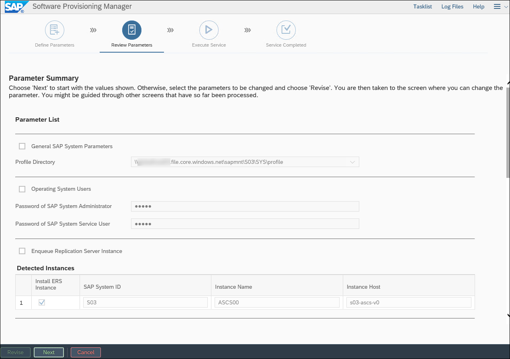
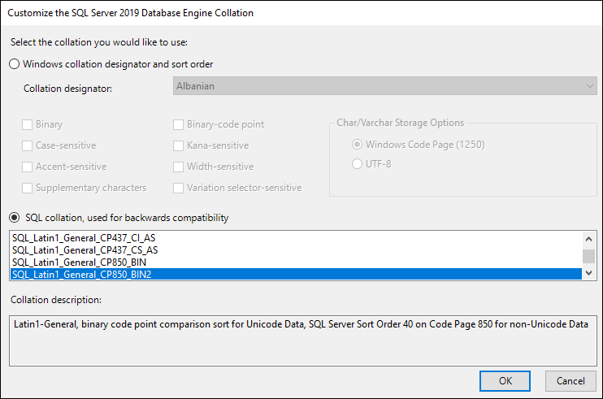
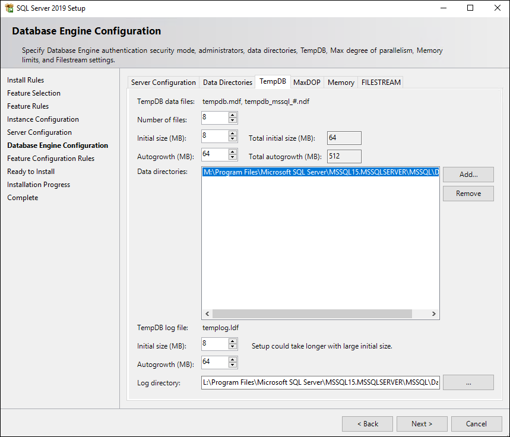
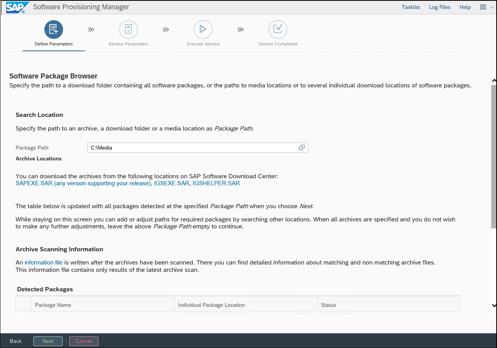
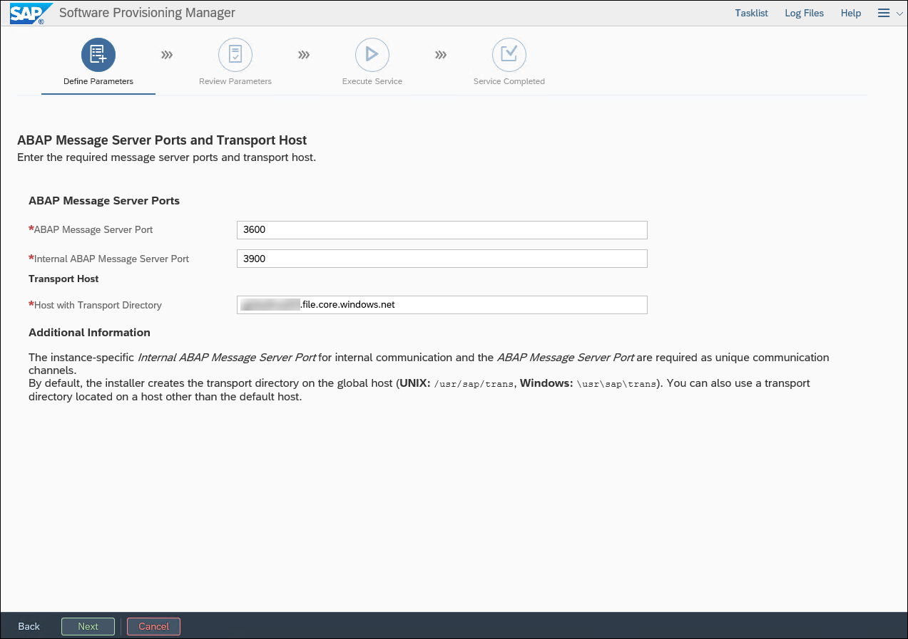

<div class="MCWHeader1">
SAP Netweaver on Azure
</div>

<div class="MCWHeader2">
Hands-on lab step-by-step
</div>

<div class="MCWHeader3">
March 2018
</div>


Information in this document, including URL and other Internet Web site references, is subject to change without notice. Unless otherwise noted, the example companies, organizations, products, domain names, e-mail addresses, logos, people, places, and events depicted herein are fictitious, and no association with any real company, organization, product, domain name, e-mail address, logo, person, place or event is intended or should be inferred. Complying with all applicable copyright laws is the responsibility of the user. Without limiting the rights under copyright, no part of this document may be reproduced, stored in or introduced into a retrieval system, or transmitted in any form or by any means (electronic, mechanical, photocopying, recording, or otherwise), or for any purpose, without the express written permission of Microsoft Corporation.

Microsoft may have patents, patent applications, trademarks, copyrights, or other intellectual property rights covering subject matter in this document. Except as expressly provided in any written license agreement from Microsoft, the furnishing of this document does not give you any license to these patents, trademarks, copyrights, or other intellectual property.

The names of manufacturers, products, or URLs are provided for informational purposes only and Microsoft makes no representations and warranties, either expressed, implied, or statutory, regarding these manufacturers or the use of the products with any Microsoft technologies. The inclusion of a manufacturer or product does not imply endorsement of Microsoft of the manufacturer or product. Links may be provided to third party sites. Such sites are not under the control of Microsoft and Microsoft is not responsible for the contents of any linked site or any link contained in a linked site, or any changes or updates to such sites. Microsoft is not responsible for webcasting or any other form of transmission received from any linked site. Microsoft is providing these links to you only as a convenience, and the inclusion of any link does not imply endorsement of Microsoft of the site or the products contained therein.

© 2018 Microsoft Corporation. All rights reserved.

Microsoft and the trademarks listed at <https://www.microsoft.com/en-us/legal/intellectualproperty/Trademarks/Usage/General.aspx> are trademarks of the Microsoft group of companies. All other trademarks are property of their respective owners.

**Contents**

<!-- TOC -->

- [SAP on Azure hands-on lab step-by-step](#sap-on-azure-hands-on-lab-step-by-step)
    - [Abstract and learning objectives](#abstract-and-learning-objectives)
    - [Overview](#overview)
    - [Solution architecture](#solution-architecture)
    - [Exercise 1: Deploy the SAP on Azure infrastructure components](#exercise-1-deploy-the-sap-on-azure-infrastructure-components)
        - [Task 1: Deploy Active Directory domain controller VMs](#task-1-deploy-active-directory-domain-controller-vms)
        - [Task 2: Prepare the Azure Virtual Network and Active Directory hosted on Azure VMs for deployment of SAP NetWeaver application and database tier VMs](#task-2-prepare-the-azure-virtual-network-and-active-directory-hosted-on-azure-vms-for-deployment-of-sap-netweaver-application-and-database-tier-vms)
        - [Task 3: Deploy the Scale-Out File Server (SOFS) cluster](#task-3-deploy-the-scale-out-file-server-sofs-cluster)
        - [Task 4: Deploy SAP NetWeaver application and database tier VMs](#task-4-deploy-sap-netweaver-application-and-database-tier-vms)
        - [Task 5: Configure IP addresses of Azure VMs and internal load balancers](#task-5-configure-ip-addresses-of-azure-vms-and-internal-load-balancers)
        - [Task 6: Join SAP NetWeaver application and database VMs to the domain](#task-6-join-sap-netweaver-application-and-database-vms-to-the-domain)
        - [Task 7: Configure User Account Control on application and the database VMs](#task-7-configure-user-account-control-on-application-and-the-database-vms)
        - [Summary](#summary)
    - [Exercise 2: Configure the SAP NetWeaver ASCS servers](#exercise-2-configure-the-sap-netweaver-ascs-servers)
        - [Overview](#overview-1)
        - [Task 1: Set up Failover Clustering on the ASCS VMs](#task-1-set-up-failover-clustering-on-the-ascs-vms)
        - [Task 2: Install the SAP ASCS components on s03-ascs-0](#task-2-install-the-sap-ascs-components-on-s03-ascs-0)
        - [Task 3: Install the SAP ASCS components on s03-ascs-1](#task-3-install-the-sap-ascs-components-on-s03-ascs-1)
        - [Task 4: Configure the SAP NetWeaver cluster with SOFS-based file share](#task-4-configure-the-sap-netweaver-cluster-with-sofs-based-file-share)
        - [Summary](#summary-1)
    - [Exercise 3: Configure SAP NetWeaver database servers](#exercise-3-configure-sap-netweaver-database-servers)
        - [Overview](#overview-2)
        - [Task 1: Configure storage of the SAP database layer.](#task-1-configure-storage-of-the-sap-database-layer)
        - [Task 2: Grant elevated user rights to the SQL Server service account](#task-2-grant-elevated-user-rights-to-the-sql-server-service-account)
        - [Task 3: Install SQL Server 2016 with the SQL\_Latin1\_General\_CP850\_BIN2 collation](#task-3-install-sql-server-2016-with-the-sql\_latin1\_general\_cp850\_bin2-collation)
        - [Task 4: Install the SAP database layer](#task-4-install-the-sap-database-layer)
        - [Task 5: Implement Always-On Availability Group](#task-5-implement-always-on-availability-group)
        - [Task 6: Modify the SAP Default Profile](#task-6-modify-the-sap-default-profile)
        - [Summary](#summary-2)
    - [Exercise 4: Configure SAP NetWeaver Application servers](#exercise-4-configure-sap-netweaver-application-servers)
        - [Overview](#overview-3)
        - [Task 1: Configure storage and software prerequisites of the SAP Application layer](#task-1-configure-storage-and-software-prerequisites-of-the-sap-application-layer)
        - [Task 2: Install the SAP Primary Application Server (PAS) layer](#task-2-install-the-sap-primary-application-server-pas-layer)
        - [Task 3: Install the SAP Additional Application Server (AAS) layer](#task-3-install-the-sap-additional-application-server-aas-layer)
        - [Task 4: Install the SAP Enhanced Monitoring Extension for SAP](#task-4-install-the-sap-enhanced-monitoring-extension-for-sap)
        - [Summary](#summary-3)
    - [Lab summary](#lab-summary)
    - [After the hands-on lab](#after-the-hands-on-lab)
        - [Task 1: Delete resources](#task-1-delete-resources)

<!-- /TOC -->

# SAP on Azure hands-on lab step-by-step 

## Abstract and learning objectives 

In this hands-on lab you will setup and configure SAP NetWeaver on Azure infrastructure as a service component. You will setup identity management, Scale-Out File Server (SOFS), NetWeaver application and database tiers and configure them all in a domain. You will then setup high-availability by configuring failover clustering for the SAP ASCS servers. Finally, you will configure the database tier with Always-On Availability Groups and configure the NetWeaver application servers for redundancy and enhanced monitoring.

At the end of the hands-on-lab, you will be better able to deploy SAP on Azure infrastructure components, configure SAP NetWeaver ASCS servers, configure SAP NetWeaver database servers, and configure SAP NetWeaver Application servers.

## Overview

Contoso has asked you to develop a process of provisioning a highly available, Windows Server 2016-based SAP NetWeaver deployment on Azure, with SAP Advanced Business Application Programming (ABAP) stack and SQL Server 2016 as the database tier. To provide high-availability of the ABAP SAP Central Services (ASCS) components, you will implement an instance of a failover cluster. The ASCS component will leverage a Storage Spaces Direct (S2D) cluster, providing support for highly-available shared storage hosting the sapmnt share. To provide high-availability of the database tier, you will implement an instance of SQL Server Always-On Availability Group. In both cases, you will use a Cloud Witness quorum, introduced in Windows Server 2016 Failover Clustering. All Azure VMs will be using managed disks. To streamline deployment, you will take advantage of Azure Resource Manager templates and Windows PowerShell scripts.

## Solution architecture

From the architectural standpoint, the deployment will consist of the following layers:

-   Authentication layer -- two Active Directory domain controllers

-   Shared storage -- two servers configured as a Storage Spaces Direct (S2D) cluster

    -   Failover Clustering will rely on Cloud Witness-based quorum

    -   The cluster will host a Scale Out File Server (SOFS) containing the highly available sapmnt share

-   SAP ASCS layer -- two servers configured as members of a two-node Windows Failover Clustering cluster

    -   Failover Clustering will rely on Cloud Witness-based quorum

    -   An Azure internal load balancer will provide a front-end IP address of the ASCS Failover Clustering role

-   SAP Application instances layer -- two SAP application servers:

    -   Primary Application Server (PAS)

    -   Additional Application Server (AAS)

-   SAP Database layer -- two servers hosting separate instances of SQL Server 2016 configured as nodes of a SQL Server Always-On Availability Group cluster

    -   Failover Clustering will rely on Cloud Witness-based quorum

    -   An Azure internal load balancer will provide a front-end IP address of the Always-On Availability Group listener

To facilitate high-availability on the platform level, each pair of Azure virtual machines (VMs) in each layer will belong to the same managed availability set.

## Exercise 1: Deploy the SAP on Azure infrastructure components 

Duration: 130 minutes

In this exercise, you will deploy Azure infrastructure prerequisites for implementing SAP NetWeaver on Azure Virtual Machines (VMs). This will include creating such resources as an Azure Virtual Network, Azure VMs and Azure load balancers. You will also use this infrastructure to deploy Active Directory domain controllers to Azure VMs, and subsequently, join all remaining Azure VMs to the same Active Directory domain.

### Task 1: Deploy Active Directory domain controller VMs

In this task, you will deploy two Azure VMs hosting Active Directory domain controllers of the domain contoso.com by using an Azure Resource Manager QuickStart template from GitHub available at <https://github.com/Azure/azure-quickstart-templates/tree/master/active-directory-new-domain-ha-2-dc>. You will use the following settings during deployment:

-   Resource group name: **s03-RG**

-   Admin Username: **demouser**

-   Admin Password: **demo\@pass123**

-   Domain Name: **contoso.com**

1.  From the lab computer, start a Web browser, and navigate to the Azure portal at <https://portal.azure.com>

2.  When prompted, sign in to the Azure subscription you will be using in this lab

3.  From the lab computer, start another instance of the Web browser, and navigate to <https://github.com/Azure/azure-quickstart-templates/tree/master/active-directory-new-domain-ha-2-dc>

4.  On the **Create 2 new Windows VMs, create a new AD Forest, Domain and 2 DCs in an availability set** page, and select **Deploy to Azure**

5.  The Web browser window should automatically be redirected to the Azure portal, and display the **Create a new AD Domain with 2 Domain Controllers** blade.

6.  On the **Create a new AD Domain with 2 Domain Controllers** blade, specify the following settings:

    -   Subscription: *your Azure subscription name*

    -   Resource group: **s03-RG**

    -   Location: *Azure region close to your physical location*

    -   Admin Username: **demouser**

    -   Admin Password: **demo\@pass123**

    -   Domain Name: **contoso.com**

    -   Dns Prefix: *a unique DNS name*

    -   Pdc RDP Port: **3389**

    -   Bdc RDP Port: **13389**

    -   \_artifacts Location: *accept the default entry*

    -   \_artifacts Location Sas Token: *Leave blank*

7.  Enable the checkbox labeled **I agree to the terms and conditions stated above**, and select **Purchase**

8.  Wait for the deployment to complete. This might take about 30 minutes.

### Task 2: Prepare the Azure Virtual Network and Active Directory hosted on Azure VMs for deployment of SAP NetWeaver application and database tier VMs 

In this task, you will configure Azure Virtual Network and Active Directory hosted on Azure VMs to prepare for deployment of additional Azure VMs that will be hosting your SAP implementation. On the Azure management layer, this will include adding an extra subnet named **sapSubnet** with the IP address range **10.0.1.0/24**, and assigning the DNS server representing the newly deployed domain controllers to the adVNET Virtual Network. From the DNS name resolution and Active Directory standpoint, you will perform the following steps:

-   In the contoso.com DNS zone:

    -   Enable non-secure updates

    -   Create the following DNS Host (A) records:

        -   **s03-ascs-v0 10.0.1.6** (this IP address must match the IP address that will be assigned to the front end of the ASCS-layer internal load balancer)

        -   **s03-ascs-ers0 10.0.1.8** (this IP address must match the IP address that will be assigned to the first Azure VM of the ASCS-layer)

        -   **s03-ascs-ers1 10.0.1.9** (this IP address must match the IP address that will be assigned to the second Azure VM of the ASCS-layer)

        -   **s03-di-v0 10.0.1.28** (this IP address must match the IP address that will be assigned to the SAP Primary Application Server s0-di-0)

        -   **s03-di-v1 10.0.1.29** (this IP address must match the IP address that will be assigned to the SAP Additional Application Server s0-di-1)

-   In the contoso.com Active Directory:

    -   Create an organizational unit in the root of the contoso.com domain named **S03** that will host SAP-specific users and groups

    -   Create the following user accounts with non-expiring password set to **demo\@pass123** that will be used to facilitate the SAP implementation:

        -   **s03-su**: member of contoso\\Domain Admins and contoso\\Administrators. You will use this account to perform all operating system level configuration tasks, including installation of all SAP components

        -   **s03-db-0-sqlsvc**: you will use this account to configure SQL Server 2016 services on the first SQL Server VM

        -   **s03-db-1-sqlsvc**: you will use this account to configure SQL Server 2016 services on the second SQL Server VM

1.  In the Azure portal, navigate to the newly created resource group

2.  In the Overview section, in the list of resource group resources, select **adVNET**

3.  On the **adVNET** blade, select **Subnets**

4.  From the **adVNET -- Subnets** blade, add a subnet named **sapSubnet** with the IP address range **10.0.1.0/24**, and select **OK**

5.  From the **adVNET -- Subnets** blade, add a subnet named **s2dSubnet** with the IP address range **10.0.2.0/24**, and select **OK**

6.  On the **adVNET** blade, select **DNS servers**

7.  On the **adVNET -- DNS servers** blade, verify your DNS configuration shows a custom DNS server with the IP addresses of **10.0.0.4 and 10.0.0.5**

8.  In the s03-RG Resource Group Overview section and in the list of resource group resources, select **adPDC**

9.  On the **adPDC** blade, select **Connect** to connect to the **adPDC** VM via RDP

10. When prompted, sign in with the Active Directory Domain Admin account credentials (**contoso\\demouser** username and **demo\@pass123** password)

11. Once connected to the adPDC VM, start DNS Manager console, **expand adPDC, Forward Lookup Zones, contoso.com**, and create Host (A) records with the following settings:

    -   Name: **s03-ascs-v0**

        -   Data: **10.0.1.6** - this IP address must match the IP address that will be assigned to the front end of the s03-lb-ascs internal load balancer (that will be deployed in the next task of this exercise)

            

    -   Name: **s03-ascs-ers0**

        -   Data: **10.0.1.8** - this IP address must match the IP address that will be assigned to s03-ascs-0 Azure VM (that will be deployed in the next task of this exercise)

            

    -   Name: **s03-ascs-ers1**

        -   Data: **10.0.1.9** - this IP address must match the IP address that will be assigned to s03-ascs-1 Azure VM (that will be deployed in the next task of this exercise)

            

    -   Name: **s03-di-v0**

        -   Data: **10.0.1.28** - this IP address must match the IP address that will be assigned to the SAP Primary Application Server s0-di-0

> 

-   Name: **s03-di-v1**

    -   Data: **10.0.1.29** - this IP address must match the IP address that will be assigned to the SAP Additional Application Server s0-di-1

> 

12. From a Windows PowerShell prompt, run:

```
    dsac
```

13. Create an organizational unit named **s03** directly in the root of the domain

    

14. In the Active Directory Administrative Center, create the following user accounts:

    -   Full name: s03-su

        -   User UPN logon: <s03-su@contoso.com>

        -   User SamAccountName: contoso\\s03-su

        -   Password: demo\@pass123

        -   Password options:

            -   Password never expires

        -   Member of:

            -   Domain Admins

            -   Administrators

    -   Full name: s03-db-0-sqlsvc

        -   User UPN logon: [s03-db-0-sqlsvc\@contoso.com](mailto:s03-su@contoso.com)

        -   User SamAccountName: contoso\\s03-db-0-sqlsvc

        -   Password: demo\@pass123

        -   Password options:

            -   Password never expires

    -   Full name: s03-db-1-sqlsvc

        -   User UPN logon: [s03-db-1-sqlsvc\@contoso.com](mailto:%20s03-db-1-sqlsvc@contoso.com)

        -   User SamAccountName: contoso\\s03-db-1-sqlsvc

        -   Password: demo\@pass123

        -   Password options:

            -   Password never expires

### Task 3: Deploy the Scale-Out File Server (SOFS) cluster

In this task, you will deploy the scale-out file server (SOFS) cluster that will be hosting a file share for the SAP ASCS servers by using an Azure Resource Manager QuickStart template from GitHub available at <https://github.com/robotechredmond/301-storage-spaces-direct-md> . You will use the following settings during deployment:

-   Resource group: **s2d-RG**

-   Name prefix: **s03**

-   Vm Size: **Standard DS3\_v2**

-   Enable Accelerated Networking: **true**

> Note: Accelerated networking is supported on Azure VM sizes with 2 or more vCPUs

-   Image Sku: **2016-Datacenter-Server-Core**

-   VM Count: **2**

-   VM Disk Size: **128**

-   VM Disk Count: **3**

-   Existing Domain Name: **contoso.com**

-   Admin Username: **demouser**

-   Admin Password: **demo\@pass123**

-   Existing Virtual Network RG Name: **s03-RG**

-   Existing Virtual Network Name: **adVNet**

-   Existing Subnet Name: **s2dSubnet**

-   Sofs Name: **sapglobalhost**

-   Share Name: **sapmnt**

-   Scheduled Update Day: **Sunday**

-   Scheduled Update Time: **3:00 AM**

-   Realtime Antimalware Enabled: **false**

-   Scheduled Antimalware Enabled: **false**

-   Scheduled Antimalware Time: **120**

-   \_artifacts Location: accept the default value

-   \_artifacts Location Sas Token: leave the default value

1.  From the lab computer, start another instance of the Web browser, and navigate to <https://github.com/robotechredmond/301-storage-spaces-direct-md>

2.  On the **Use Managed Disks to Create a Storage Spaces Direct (S2D) Scale-Out File Server (SOFS) Cluster with Windows Server 2016** page, select **Deploy to Azure**

    

3.  The Web browser window should automatically get redirected to the Azure portal and display the **Custom deployment** blade

4.  On the **Custom deployment** blade, specify the following settings:

    -   Subscription: *your Azure subscription name*

    -   Resource group: **s2d-RG** (create new)

    -   Location: *specify the same Azure region that you selected in the previous task*

    -   Name Prefix: **s03**

    -   Vm Size: **Standard DS3\_v2**

    -   Enable Accelerated Networking: **true**

> Note: Accelerated networking is supported on Azure VM sizes with 2 or more vCPUs.

-   Image Sku: **2016-Datacenter-Server-Core**

-   VM Count: **2**

-   VM Disk Size: **128**

-   VM Disk Count: **3**

-   Existing Domain Name: **contoso.com**

-   Admin Username: **demouser**

-   Admin Password: **demo\@pass123**

-   Existing Virtual Network RG Name: **s03-RG**

-   Existing Virtual Network Name: **adVNet**

-   Existing Subnet Name: **s2dSubnet**

-   Sofs Name: **sapglobalhost**

-   Share Name: **sapmnt**

-   Scheduled Update Day: **Sunday**

-   Scheduled Update Time: **3:00 AM**

-   Realtime Antimalware Enabled: **false**

-   Scheduled Antimalware Enabled: **false**

-   Scheduled Antimalware Time: **120**

-   \_artifacts Location: accept the default value

-   \_artifacts Location Sas Token: leave the default value

5.  Enable the checkbox labeled **I agree to the terms and conditions stated above**, and select **Purchase**

    

6.  Wait for the deployment to complete. This might take about 25 minutes. You can verify the deployment completed successfully by viewing the **Deployments** entry of the s2d-RG resource group blade in the Azure portal.

    

7.  Switch to the RDP session to adPDC and, within the Remote Desktop session, switch to the Active Directory Administrative Center. Note that the Computers container contains five additional computer accounts. Two of them represent two notes of the Storage Spaces Direct cluster and the remaining three are failover cluster virtual network name accounts. You will rely on the **sapglobalhost** and its **sapmnt** share when installing ASCS components.

    

### Task 4: Deploy SAP NetWeaver application and database tier VMs 

In this task, you will deploy additional Azure VMs that will be hosting your SAP implementation by using an Azure Resource Manager QuickStart template from GitHub available at <https://github.com/Azure/azure-quickstart-templates/tree/master/sap-3-tier-marketplace-image-md> . You will use the following settings during deployment:

-   Resource group: **s03-RG**

-   Sap System Id: **s03**

-   OS Type: **Windows Server 2016 Datacenter**

-   Sap System Size: **Demo**

-   System Availability: **HA**

-   vmSizes:

    -   dbserversize: **Standard\_DS4\_v2**

    -   ascsserversize: **Standard\_DS2\_v2**

    -   diserversize: **Standard\_DS2\_v2**

-   internalStorageTypeASCS: **Premium\_LRS**

-   internalStorageTypeDB: **Premium\_LRS**

-   internalStorageTypeDI: **Premium\_LRS**

-   Admin Username: **demouser**

-   Admin Password: **demo\@pass123**

-   New Or Existing Subnet: **existing**

-   Subnet Id: *id of the **sapSubnet***

-   Health Probe port of s03-lb-ascs load balancer: **3900**

-   Health Probe port of s03-lb-db load balancer: **59999**

8.  From the lab computer, start another instance of the Web browser, and navigate to <https://github.com/Azure/azure-quickstart-templates/tree/master/sap-3-tier-marketplace-image-md>

9.  On the **SAP NetWeaver 3-tier compatible template using a Marketplace image - MD** page, select **Deploy to Azure**

    

10. The Web browser window should automatically get redirected to the Azure portal and display the **SAP NW 3-tier (managed disk)** blade

11. Select **Edit template**

    

12. On the **Edit template** blade, expand the **Variables** node, and scroll down to the **vmSizes** subnode

    

13. In the editor window, navigate to the **HA** subsection of the **Demo** section, and modify the values of **dbserversize, ascsserversize** and **diserversize** keys per the following screenshot:

    

14. Select **Save** to save your changes

    

15. Back on the **SAP NW 3-tier compatible Marketplace image** blade, specify the following settings:

    -   Subscription: *your Azure subscription name*

    -   Resource group: **s03-RG** (use existing)

    -   Location: *accept the default value*

    -   Sap System Id: **s03**

    -   OS Type: **Windows Server 2016 Datacenter**

    -   Sap System Size: **Demo**

    -   System Availability: **HA**

    -   Admin Username: **demouser**

    -   Admin Password: **demo\@pass123**

    -   Subnet Id: *Run the following four commands from the Windows PowerShell prompt to identify the value to enter here (when prompted to sign in after typing the first command, type in the credentials you used to authenticate to your Azure subscription). See example below.*

    ```
        Add-AzureRmAccount

        $vnet = Get-AzureRmVirtualNetwork -ResourceGroupName s03-RG

        $subnet = Get-AzureRmVirtualNetworkSubnetConfig -Name 'sapSubnet' -VirtualNetwork $vnet

        $subnet.Id 
    ```

    

16. Enable the checkbox labeled **I agree to the terms and conditions stated above**, and select **Purchase**

    

17. Wait for the deployment to complete. This might take about 25 minutes. You can verify the deployment completed successfully by viewing the **Deployments** entry of the s03-RG resource group blade in the Azure portal.

    > Note: Disregard any custom script extension errors generated by the template deployment

    

18. In the Azure portal, navigate to the internal load balancer **s03-lb-ascs**. On the load balancer blade, select **Health probes**, and in the list of probes, select **lb00ProbePortxSCS**.

    

19. Change the value of **Port** from **62000** to **3900**, and select **Save**

    

20. In the Azure portal, navigate to the internal load balancer **s03-lb-db**. On the load balancer blade, select **Health probes**, and in the list of probes, select **lb00ProbePortDB**.

    

21. Change the value of **Port** from **62503** to **59999**, and select **Save**

    

### Task 5: Configure IP addresses of Azure VMs and internal load balancers

In this exercise, you will configure Public and Private IP addressing for the Azure VMs and internal load balancers deployed in the previous task by using an Azure Resource Manager template. You will assign to each VM a designated, static Private IP address and a dynamic Public IP address. You will also assign a designated, static Private IP address to each load balancer.

**Note:** At this point, each of the Azure VMs we have deployed in the previous task has a dynamically assigned Private IP address and no Public IP address. The lack of Public IP addresses is the result of using the SAP NW 3-tier compatible Marketplace image template which is intended to work this way when deploying it into an existing Azure Virtual Network. When operating in a production environment, you should connect to VMs via their Private IP address (e.g. by leveraging an existing Site-to-Site VPN or ExpressRoute from an on-premises location). You will add a Public IP to each VM in order to simplify the setup process. We will also assign a designated static Private IP address to each VM and each internal load balancer in order to be able to reference specific IP addresses throughout this lab.

Configure the Private IP addresses of VMs and load balancers in the following manner:

-   s03-nic-ascs-0: 10.0.1.8

-   s03-nic-ascs-1: 10.0.1.9

-   s03-nic-db-0: 10.0.1.18

-   s03-nic-db-1: 10.0.1.19

-   s03-nic-di-0: 10.0.1.28

-   s03-nic-di-1: 10.0.1.29

-   s03-lb-db: 10.0.1.16

-   s03-lb-ascs: 10.0.1.6

1.  From the lab computer, start a Windows PowerShell ISE window as Administrator

2.  In the Script pane, type the following script, and press F5 to execute it. When prompted to sign in after typing the first command, type in the credentials you used to authenticate your Azure subscription. 

```
    Add-AzureRmAccount

    $rgName = 's03-RG'

    $rg = Get-AzureRmResourceGroup -Name $rgName

    $lbNames = @('s03-lb-db')

    $lbIPAddresses = @('10.0.1.16')

    for ($count=0; $count -le $lbNames.Count-1; $count++) {
        $ilb = Get-AzureRmLoadBalancer -ResourceGroupName $rgName -Name $lbNames[$count]
        $ilb.FrontendIpConfigurations[0].PrivateIpAllocationMethod = 'Static'
        $ilb.FrontendIpConfigurations[0].PrivateIpAddress = $lbIPAddresses[$count]
        $ilb | Set-AzureRmLoadBalancer
        $ilbIP = $ilb.FrontendIpConfigurations[0].PrivateIpAddress
    }

    $vmNicNames = @('s03-nic-di-0','s03-nic-di-1','s03-nic-db-0','s03-nic-db-1','s03-nic-ascs-0','s03-nic-ascs-1')

    $vmIPAddresses = @('10.0.1.28','10.0.1.29','10.0.1.18','10.0.1.19','10.0.1.8','10.0.1.9')

    $vmPIPNames = @('s03-pip-di-0','s03-pip-di-1','s03-pip-db-0','s03-pip-db-1','s03-pip-ascs-0','s03-pip-ascs-1')

    for ($count=0; $count -le $vmNicNames.Count-1; $count++) {
        $nic = Get-AzureRmNetworkInterface -ResourceGroupName $rgName -Name $vmNicNames[$count]
        $nic.IpConfigurations[0].PrivateIpAllocationMethod = 'Static'
        $nic.IpConfigurations[0].PrivateIpAddress = $vmIPAddresses[$count]
        $pip = New-AzureRmPublicIpAddress -Name $vmPIPNames[$count] -ResourceGroupName $rgName -AllocationMethod Dynamic -Location $rg.Location
        $nic.IpConfigurations[0].PublicIpAddress = $pip
        Set-AzureRmNetworkInterface -NetworkInterface $nic 
        $nicIP = $nic.IpConfigurations[0].PrivateIpAddress
    }

    $lbNames = @('s03-lb-ascs')

    $lbIPAddresses = @('10.0.1.6')

    for ($count=0; $count -le $lbNames.Count-1; $count++) {
        $ilb = Get-AzureRmLoadBalancer -ResourceGroupName $rgName -Name $lbNames[$count]
        $ilb.FrontendIpConfigurations[0].PrivateIpAllocationMethod = 'Static'
        $ilb.FrontendIpConfigurations[0].PrivateIpAddress = $lbIPAddresses[$count]
        $ilb | Set-AzureRmLoadBalancer
        $ilbIP = $ilb.FrontendIpConfigurations[0].PrivateIpAddress
    }
```

3.  Wait until the script completes. This may take up to 10 minutes.

### Task 6: Join SAP NetWeaver application and database VMs to the domain

In this task, you will join all of the Windows Server 2016 Azure VMs that will be hosting your SAP implementation to the Active Directory domain contoso.com.

1.  From the lab computer, start a Windows PowerShell ISE window as an Administrator

2.  In the Script pane, type the following script, and press F5 to execute it. When prompted to sign in after typing the first command, type in the credentials you used to authenticate to your Azure subscription

```
    Add-AzureRmAccount
    $settingString = '{
    	"Name": "contoso.com",
    	"User": "contoso.com\\demouser",
    	"Restart": "true",
    	"Options": "3"
    }'

    $protectedSettingString = '{"Password": "demo@pass123"}'

    $location = (Get-AzureRmResourceGroup -Name s03-RG).Location

    $vmNames = @('s03-ascs-0','s03-ascs-1','s03-db-0','s03-db-1','s03-di-0','s03-di-1')

    Foreach ($vmName in $vmNames) {
    Set-AzureRmVMExtension ???ResourceGroupName 's03-RG' ???ExtensionType 'JsonADDomainExtension' ???Name 'joindomain' ???Publisher "Microsoft.Compute" ???TypeHandlerVersion "1.0" ???Vmname $vmName ???Location $location ???SettingString $settingString ???ProtectedSettingString $protectedSettingString
    }
```

3.  Wait until the script completes. This might take a few minutes.

### Task 7: Configure User Account Control on application and the database VMs

In this task, you will disable User Account Control on the Windows Server 2016 Azure VMs that will be hosting your SAP implementation to the Active Directory domain contoso.com.

> Note: This is a temporary measure. You should re-enable User Account Control once you complete the setup.

1.  From the lab computer, start a Windows PowerShell ISE window as an Administrator.

2.  In the Script pane, type the following script, and press F5 to execute it:

```
    $vmNames = @('s03-ascs-0','s03-ascs-1','s03-db-0','s03-db-1','s03-di-0','s03-di-1')

    Invoke-Command $vmNames {Set-ItemProperty -Path REGISTRY::HKEY_LOCAL_MACHINE\Software\Microsoft\Windows\CurrentVersion\Policies\System -Name EnableLUA -Value 0}
```

3.  After the script completes, restart all servers

### Summary

In this exercise, you deployed Azure infrastructure prerequisites for implementing SAP NetWeaver on Azure IaaS virtual machines (VMs). This included creation of such resources as an Azure Virtual Network, Azure VMs, Azure load balancers and Azure Storage accounts. You also used this infrastructure to deploy Active Directory domain controllers to Azure VMs and subsequently joined all remaining Azure VMs to the same Active Directory domain.

## Exercise 2: Configure the SAP NetWeaver ASCS servers

Duration: 90 minutes

### Overview

In this exercise, you will configure the Azure VMs that constitute the SAP ASCS layer. This will include installing Failover Clustering on s03-ascs-0 and s03-ascs-1. You will also run the SAP Software Provisioning Manager to perform distributed installation of the ASCS components on the s03-ascs-0 and s03-ascs-1 VMs. Afterwards, you will configure the SOFS-based sapmnt share and create SAP NetWeaver ASCS cluster resources by following instructions described in <https://docs.microsoft.com/en-us/azure/virtual-machines/workloads/sap/sap-high-availability-installation-wsfc-file-share> .

### Task 1: Set up Failover Clustering on the ASCS VMs

In this task, you will start by configuring operating system on s03-ascs-0 and s03-ascs-1. On both VMs, mount the 128 GB data disk as ReFS-formatted U: drive with the disk label **SAP Local FS**. On both VMs, disable Windows firewall for the domain profile. Next, implement a Failover Clustering-based cluster named **s03-ascs-cl0** with the IP address of **10.0.1.7** consisting of **s03-ascs-0** and **s03-ascs-1** Azure VMs. Set up the cluster with a Cloud Witness quorum by using the storage account that was auto-provisioned in the previous exercise when you deployed Storage Spaces Direct (S2D) cluster.

1.  Navigate to the **s03-ascs-0** VM blade in the Azure portal, and use the **Connect** icon in the toolbar to establish an RDP session to that VM. When prompted to authenticate, sign in with the **CONTOSO\\s03-su** user account you created in the first exercise.

2.  Within the RDP session to s03-ascs-0 VM, start a Windows PowerShell ISE session as Administrator, and run the following:

```
    $nodes = ('s03-ascs-0','s03-ascs-1')

    Invoke-Command $nodes {Get-Disk -Number 2 | Initialize-Disk -PartitionStyle MBR -PassThru | New-Partition -DriveLetter 'U' -UseMaximumSize | Format-Volume -FileSystem ReFS -NewFileSystemLabel 'SAP Local FS' -Confirm:$false}

    Invoke-Command $nodes {Set-NetFirewallProfile -Profile Domain -Enabled False}

    Invoke-Command $nodes {Install-WindowsFeature Failover-Clustering -IncludeAllSubFeature -IncludeManagementTools} 
```

3.  From the Windows PowerShell ISE session, run:

```
    New-Cluster -Name s03-ascs-cl0 -Node $nodes ???NoStorage ???StaticAddress 10.0.1.7
```

4.  Wait for the new cluster to be created. Then from the same Windows PowerShell ISE session, run:

```
    Install-PackageProvider ???Name NuGet ???Force

    Install-Module ???Name AzureRM -Force

    Add-AzureRmAccount

    $cwStorageAccountName = (Get-AzureRmStorageAccount -ResourceGroupName s2d-RG)[0].StorageAccountName

    $cwStorageAccountKey = (Get-AzureRmStorageAccountKey -ResourceGroupName s2d-RG -Name $cwStorageAccountName).Value[0]

    Set-ClusterQuorum ???CloudWitness ???AccountName $cwStorageAccountName -AccessKey $cwStorageAccountKey
```

    When prompted, sign in with the Service Administrator account of your Azure subscription (if the sign-in fails, rerun the script). Wait for the configuration of the Cloud Witness quorum completes.

### Task 2: Install the SAP ASCS components on s03-ascs-0

In this task, you will use SAP Software Provisioning Manager to carry out the distributed installation of ASCS components on the second node of ASCS cluster of MS SQL Server-based SAP NetWeaver 7.5 deployment. Run the installation as the **CONTOSO\\s03-su** account you created in the first exercise. During the installation, address all necessary prerequisites, and specify the following parameters:

-   Drive for Local Instances: **U:**

-   SAP System ID (SAPSID): **S03**

-   DNS Domain Name for SAP Systems: **contoso.com**

-   SAP System User Domain: **Domain of Current User**

-   OU Path: **S03**

-   Windows Domain for SAP Host Agent: **Local Domain**

-   ABAP Message Server Ports: **3600**

-   Internal ABAP Message Server Ports: **3900**

-   Install SAP Web Dispatcher integrated: **Yes**

-   Set SAP Web Dispatcher Encryption Mode: **Never**

-   Set all passwords to **demo\@pass123**

Account for the fact you will be using the virtual names, and configure the following registry entries on both VMs:

-   HKLM\\SYSTEM\\CurrentControlSet\\Control\\LSA

    -   Set DisableLoopbackCheck to 1

-   HKLM:\\SYSTEM\\CurrentControlSet\\Services\\lanmanserver\\parameters

    -   Set DisableStrictNameChecking to 1

1.  Start SAP Software Provisioning Manager by double-clicking **sapinst.exe** in the **swpm** folder in the source media

    

2.  On the **Welcome to SAP Installation** page, navigate to **SAP NetWeaver 7.5-\>MS SQL Server-\>SAP Systems-\>Application Server ABAP-\>Distributed System-\>ASCS/SCS Instance**, and select **Next**

    

3.  On the **Parameter Settings** page, select **Custom** and then select **Next**

    

4.  When prompted, select **OK**. You will be automatically logged off. Log back on by using the same user credentials (**CONTOSO\\s03-su**)

    

5.  Once you log back on, the **Software Provisioning** wizard will automatically restart. On the **General SAP System Parameters** page, set **SAP System ID (SAPSID)** to **S03**, accept the default setting for the **Destination Drive**, and select **Next**.

    

6.  On the **DNS Domain Name** page, accept the default settings, and select **Next**

    

7.  On the **Master Password** page, in the **Password for All Users** and **Confirm** text boxes, type **demo\@pass123** and select **Next**

    

8.  On the **Windows Domain** page, accept the default settings and select **Next**

    

9.  On the **Windows Domain \> Organizational Units** page, set **OU Path** to **S03**, and select **Next**

    

10. On the **Software Package Browser** page, point to **SAP\\Kernel\_51050826\_10\\DATA\_UNITS\\K\_745\_U\_WINDOWS\_X86\_64**, and select **Next**

    

11. Select **Next** again once the location of the software packages has been identified.

    

12. On the **Prerequisites Checker Results** page, identify the missing prerequisites

    

13. In order to satisfy the prerequisites and allow for the use of virtual names in the ASCS layer, you will run a Windows PowerShell script that adjusts the paging file configuration and creates several Windows registry entries. On s03-ascs-0 VM, start a Windows PowerShell ISE session as Administrator and run the following:

```
    $nodes = ('s03-ascs-0','s03-ascs-1')

    Invoke-Command $nodes {
        $computerSystem = Get-WmiObject -Class Win32_ComputerSystem -EnableAllPrivileges
        $computerSystem.AutomaticManagedPagefile = $false
        $computerSystem.Put()
        $pageFile = Get-WmiObject -Query "SELECT * FROM Win32_PageFileSetting WHERE Name LIKE '%pagefile.sys'"
        $pageFile.Delete()
        Set-WmiInstance -Class Win32_PageFileSetting -Arguments @{name="D:\pagefile.sys";InitialSize = 20480;MaximumSize = 20480;}
    }
```

14. From the Windows PowerShell ISE session, run:

```
    Invoke-Command $nodes {
        $registryPath = 'HKLM:\SYSTEM\CurrentControlSet\Services\lanmanworkstation\parameters'
        $registryEntry = 'DisableCARetryOnInitialConnect'
        $registryValue = 1
        New-ItemProperty -Path $registryPath -Name $registryEntry -Value $registryValue -PropertyType DWORD -Force
    }

    Invoke-Command $nodes {
        $registryPath = 'HKLM:\SYSTEM\CurrentControlSet\Control\LSA'
        $registryEntry = 'DisableLoopbackCheck'
        $registryValue = 1
        New-ItemProperty -Path $registryPath -Name $registryEntry -Value $registryValue -PropertyType DWORD -Force
    }

    Invoke-Command $nodes {
        $registryPath = 'HKLM:\SYSTEM\CurrentControlSet\Services\lanmanserver\parameters'
        $registryEntry = 'DisableStrictNameChecking'
        $registryValue = 1
        New-ItemProperty -Path $registryPath -Name $registryEntry -Value $registryValue -PropertyType DWORD -Force
    }
```

15. On the **Prerequisites Checker Results** page, select **Next**. When prompted whether to repeat the checks, select **Yes**.

    

16. On the **Windows Domain for SAP Host Agent** page, accept the default settings, and select **Next**

    

17. On the **Operating System Users** page, type **demo\@pass123** as the password, and select **Next**

    

18. On the **ASCS Instance** page, accept the default settings, and select **Next**

    

19. On the **ABAP Message Server Ports** page, accept the default settings, and select **Next**

    

20. On the **Additional Components to be Included in the ASCS Instance** page, select the checkbox **Install SAP Web Dispatcher integrated**, and then select **Next**

    

21. On the **SAP Web Dispatcher Parameters** page, set the Encryption Mode to **Never**, and select **Next**

    

22. On the **ICM User Management for the SAP Web Dispatcher** page, set the password of webadm to **demo\@pass123**, and select **Next**

    

23. On the **Parameter Summary** page, select **Next**

    

24. Monitor progress of installation on the **Task Progress** page.

    

25. Wait until the installation completes. This might take about 5 minutes. Once the installation completes, select **OK**.

    

### Task 3: Install the SAP ASCS components on s03-ascs-1

In this task, you will use SAP Software Provisioning Manager to carry out the distributed installation of ASCS components on the second node of ASCS cluster of MS SQL Server-based SAP NetWeaver 7.5 deployment. Run the installation as the **CONTOSO\\s03-su** account you created in the first exercise. During the installation, address all necessary prerequisites and specify the following parameters:

-   Drive for Local Instances: **U:**

-   SAP System ID (SAPSID): **S03**

-   DNS Domain Name for SAP Systems: **contoso.com**

-   SAP System User Domain: **Domain of Current User**

-   OU Path: **S03**

-   Windows Domain for SAP Host Agent: **Local Domain**

-   ABAP Message Server Ports: **3600**

-   Internal ABAP Message Server Ports: **3900**

-   Install SAP Web Dispatcher integrated: **Yes**

-   Set SAP Web Dispatcher Encryption Mode: **Never**

-   Set all passwords to **demo\@pass123**

1.  Start SAP Software Provisioning Manager by double-clicking **sapinst.exe** in the **swpm** folder in the source media

    

2.  On the **Welcome to SAP Installation** page, navigate to **SAP NetWeaver 7.5-\>MS SQL Server-\>SAP Systems-\>Application Server ABAP-\>Distributed System-\>ASCS/SCS Instance**, and select **Next**

    

3.  On the **Parameter Settings** page, select **Custom** and then select **Next**

    

4.  When prompted, select **OK**. You will be automatically logged off. Log back on by using the same user credentials (**CONTOSO\\s03-su**).

    

5.  Once you log back on, the **Software Provisioning** wizard will automatically restart. On the **General SAP System Parameters** page, set **SAP System ID (SAPSID)** to **S03**, accept the default setting for the **Destination Drive**, and select **Next**.

    

6.  On the **DNS Domain Name** page, accept the default settings, and select **Next**

    

7.  On the **Master Password** page, in the **Password for All Users** and **Confirm** text boxes, type **demo\@pass123** and select **Next**

    

8.  On the **Windows Domain** page, accept the default settings and select **Next**

    

9.  On the **Windows Domain \> Organizational Units** page, set **OU Path** to **S03**, and select **Next**

    

10. On the **Software Package Browser** page, point to **SAP\\Kernel\_51050826\_10\\DATA\_UNITS\\K\_745\_U\_WINDOWS\_X86\_64**, and select **Next**

    

11. Select **Next** again once the location of the software packages has been identified.

    

12. On the **Windows Domain for SAP Host Agent** page, accept the default settings, and select **Next**

    

13. On the **Operating System Users** page, type **demo\@pass123** as the password, and select **Next**

    

14. On the **ASCS Instance** page, accept the default settings, and select **Next**

    

15. On the **ABAP Message Server Ports** page, accept the default settings, and select **Next**

    

16. On the **Additional Components to be Included in the ASCS Instance** page, select the checkbox **Install SAP Web Dispatcher integrated**, and select **Next**

    

17. On the **SAP Web Dispatcher Parameters** page, set the Encryption Mode to **Never**, and select **Next**

    

18. On the **ICM User Management for the SAP Web Dispatcher** page, set the password of webadm to **demo\@pass123**, and select **Next**

    

19. On the **Parameter Summary** page, select **Next**

    

20. Monitor the progress of the installation on the **Task Progress** page.

    

21. Wait until the installation completes. This might take about 5 minutes. Once the installation completes, select **OK**.

    

### Task 4: Configure the SAP NetWeaver cluster with SOFS-based file share

In this task, you will configure the ASCS cluster with the sapmnt share hosted on the SOFS you installed in the previous exercise. To accomplish this, you will follow the procedure documented at <https://docs.microsoft.com/en-us/azure/virtual-machines/workloads/sap/sap-high-availability-installation-wsfc-file-share>

1.  From the RDP session to s03-ascs-1, start **SAP Management Console**

    

2.  From the SAP Management Console, right-click the **s03-ascs-1 0** node and select **Stop**

    

3.  In the **SAP Instance Shutdown** dialog box, accept the default options and select **OK**

    

4.  When prompted to authenticate, in the **Password** text box, type **demo\@pass123** and select **OK**

    

5.  Use Server Manager on s03-ascs-0 to stop the ASCS Windows service SAPS03\_00 on s03-ascs-1

    

6.  Switch to the RDP session to s03-ascs-0 and repeat the steps 2-5

7.  To remove the SAPMNT file share on both ASCS cluster nodes, switch back to the Remote Desktop session to s03-ascs-0 and from the Windows PowerShell ISE window, run the following:

```
    $nodes = ('s03-ascs-0','s03-ascs-1')

    Invoke-Command $nodes {
    Remove-SmbShare sapmnt -ScopeName * -Force
    }
```

8.  To create SAPLOC, share one on both ASCS cluster nodes, and from the same Windows PowerShell ISE window, run the following:

```
    $nodes = ('s03-ascs-0','s03-ascs-1')

    Invoke-Command $nodes {
    $SAPSID = 'S03'
    $DomainName = 'CONTOSO'
    $SAPSIDGlobalAdminGroupName = "$DomainName\SAP_" + $SAPSID + '_GlobalAdmin'
    $HostName = $env:computername
    $SAPLocalAdminGroupName = "$HostName\SAP_LocalAdmin"
    $SAPDisk = 'C:'
    $SAPusrSapPath = "$SAPDisk\usr\sap"
    New-SmbShare -Name saploc -Path $SAPusrSapPath -FullAccess 'BUILTIN\Administrators', $SAPSIDGlobalAdminGroupName, $SAPLocalAdminGroupName
    }
```

9.  From s03-ascs-0, from the Windows PowerShell ISE session run the following:

```
    $SAPSID = 'S03'
    $DomainName = 'CONTOSO'
    $SAPSIDGlobalAdminGroupName = "$DomainName\SAP_" + $SAPSID + '_GlobalAdmin'

    $ASCSClusterObjectNode1 = 's03-ascs-0$'
    $ASCSClusterObjectNode2 = 's03-ascs-1$'

    $sapmnt = Get-SmbShare -Name 'sapmnt'

    Grant-SmbShareAccess -Name $sapmnt.Name -AccountName 'BUILTIN\Administrators', $SAPSIDGlobalAdminGroupName, $ASCSClusterObjectNode1, $ASCSClusterObjectNode2 -AccessRight Full ???Force

    $Acl = Get-Acl $sapmnt.Path

    $Ar = New-Object System.Security.AccessControl.FileSystemAccessRule($SAPSIDGlobalAdminGroupName,'FullControl', 'ContainerInherit,ObjectInherit', 'None', 'Allow')

    $Acl.SetAccessRule($Ar)

    $Ar = New-Object  System.Security.AccessControl.FileSystemAccessRule($ASCSClusterObjectNode1,'FullControl','ContainerInherit,ObjectInherit', 'None', 'Allow')

    $Acl.SetAccessRule($Ar)

    $Ar = New-Object  System.Security.AccessControl.FileSystemAccessRule($ASCSClusterObjectNode2,'FullControl','ContainerInherit,ObjectInherit', 'None', 'Allow')

    $Acl.SetAccessRule($Ar)

    Set-Acl $sapmnt.Path $Acl -Verbose
```

10. Start a Command Prompt as Administrator on s03-ascs-0 and run the following to copy the content of U:\\usr\\sap\\SYS folder from s03-ascs-0 to the \\\\sapglobalhost\\sapmnt\\S03\\SYS folder:

```
    robocopy U:\usr\sap\S03\SYS \\sapglobalhost\sapmnt\S03\SYS /e /r:1 /w:1
```

11. From the Command Prompt on s03-ascs-0, run the following delete the U:\\usr\\sap\\SYS folder from both ASCS cluster nodes:

```
    rd U:\usr\sap\S03\SYS /s /q
    rd \\s03-ascs-1\U$\usr\sap\S03\SYS /s /q
```

12. To update the cluster security setting on the SAP ASCS cluster, from the Windows PowerShell ISE window on s03-ascs-0, run the following:

```
    $SAPSID = 'S03'
    $DomainName = 'CONTOSO'
    $SAPSIDGlobalAdminGroupName = "$DomainName\SAP_" + $SAPSID + '_GlobalAdmin'

    Grant-ClusterAccess -User $SAPSIDGlobalAdminGroupName -Full
```

13. To update instance profiles to reference the virtual name of the ASCS cluster, from s03-ascs-0, start Internet Explorer and navigate to <https://github.com/Azure-Samples/sap-powershell> . On the **SAP PowerShell Scripts** page, select **SAPScripts.psm1** and then select **Raw**.

14. Copy the content of the web page into Clipboard

15. From the Windows PowerShell ISE window on s03-ascs-0, run the following (make sure that when you invoke the script, Clipboard contains copy of the SAPScripts.psm1 module):

```
    New-Item -ItemType Directory -Path 'C:\Temp' -ErrorAction SilentlyContinue
    Get-Clipboard | Out-File -FilePath 'C:\Temp\SAPScripts.psm1' -Force

    Set-Location -Path 'C:\Temp'
    Import-Module '.\SAPScripts.psm1'

    Update-SAPASCSSCSProfile -PathToAscsScsInstanceProfile \\sapglobalhost\sapmnt\S03\SYS\profile\S03_ASCS00_s03-ascs-0 -NewASCSHostName s03-ascs-v0 -NewSAPGlobalHostName sapglobalhost -Verbose
```

16. To update the user environment variables of the **CONTOSO\\s03adm** user account on both ASCS cluster nodes, log on to each by using the **CONTOSO\\s03adm** user account with the password **demo\@pass123**, start the Regedit.exe tool, navigate to the HKEY\_CURRENT\_USER registry hive, open the **Environment** key, and set the values of the following registry entries:

    -   RSEC\_SSFS\_DATAPATH: **\\\\sapglobalhost\\sapmnt\\S03\\SYS\\global\\security\\rsecssfs\\data **

    -   RSEC\_SSFS\_KEYPATH: **\\\\sapglobalhost\\sapmnt\\S03\\SYS\\global\\security\\rsecssfs\\key **

    -   SAPEXE: **\\\\sapglobalhost\\sapmnt\\S03\\SYS\\exe\\uc\\NTAMD64 **

    -   SAPLOCALHOST: **s03-ascs-v0**

17. To install the updated saprc.dll file, use the following steps:

    a.  Download the latest NTCLUST.SAR package from the SAP Service Marketplace to the Downloads folder on s03-ascs-0

    b.  From the Downloads folder on s03-ascs-0, unpack NTCLUS.SAR

    c.  From the Command Prompt running on s03-ascs-0, set the current directory to the location where you unpacked the content of the NTCLUS.SAR archive, and run the following:

>     .\NTCLUSTER\insaprct.exe -yes -install

18. To create a SAP cluster group, network name, and IP resources, from the Windows PowerShell ISE window on s03-ascs-0, run the following:

```
    # Create SAP Cluster Group
    $SAPSID = 'S03'
    $SAPClusterGroupName = "SAP $SAPSID"
    $SAPIPClusterResourceName = "SAP $SAPSID IP"
    $SAPASCSNetworkName = 's03-ascs-v0'
    $SAPASCSIPAddress = '10.0.1.6'
    $SAPASCSSubnetMask = '255.255.255.0'

    # Create an SAP ASCS instance virtual IP cluster resource
    Add-ClusterGroup -Name $SAPClusterGroupName -Verbose

    #Create an SAP ASCS virtual IP address
    $SAPIPClusterResource = Add-ClusterResource -Name $SAPIPClusterResourceName -ResourceType "IP Address" -Group $SAPClusterGroupName -Verbose

    # Set a static IP address
    $param1 = New-Object Microsoft.FailoverClusters.PowerShell.ClusterParameter $SAPIPClusterResource,Address,$SAPASCSIPAddress
    $param2 = New-Object Microsoft.FailoverClusters.PowerShell.ClusterParameter $SAPIPClusterResource,SubnetMask,$SAPASCSSubnetMask
    $params = $param1,$param2
    $params | Set-ClusterParameter

    # Create a corresponding network name
    $SAPNetworkNameClusterResourceName = $SAPASCSNetworkName
    Add-ClusterResource -Name $SAPNetworkNameClusterResourceName -ResourceType "Network Name" -Group $SAPClusterGroupName -Verbose

    # Set a network DNS name
    $SAPNetworkNameClusterResource = Get-ClusterResource $SAPNetworkNameClusterResourceName
    $SAPNetworkNameClusterResource | Set-ClusterParameter -Name Name -Value $SAPASCSNetworkName

    #Check the updated values
    $SAPNetworkNameClusterResource | Get-ClusterParameter

    #Set resource dependencies
    Set-ClusterResourceDependency -Resource $SAPNetworkNameClusterResourceName -Dependency "[$SAPIPClusterResourceName]" -Verbose

    #Start an SAP <SID> cluster group
    Start-ClusterGroup -Name $SAPClusterGroupName -Verbose
```

19. From s03-ascs-0, start Failover Cluster Manager and verify that the s03-ascs-v0 resource is online

    

20. Configure the SAP service on s03-ascs-0 by running from the Command Prompt on each node of the ASCS cluster the following:

```
    U:\usr\sap\S03\ASCS00\exe\sapstartsrv.exe -r -p \\sapglobalhost\sapmnt\S03\SYS\profile\S03_ASCS00_s03-ascs-v0 -s S03 -n 00 -U CONTOSO\SAPServiceS03 -P demo@pass123 -e CONTOSO\s03adm
```

21. This will open the **SAP Service Install/Uninstall** dialog box. Make sure that the parameters are correct, set the **Startup Type** option to **Manual**, and select **OK**.

    

22. Ensure that you get the confirmation that the service was successfully installed and select **OK**

    

23. Repeat the steps 20-22 on s03-ascs-1

24. To finalize configuration of the SAP S03 cluster group, create the SAP S03 00 service and the corresponding instance by running the following from the PowerShell ISE window on s03-ascs-0:

```
    $SAPSID = 'S03'
    $SAPInstanceNumber = '00'
    $SAPNetworkNameClusterResourceName = 's03-ascs-v0'

    $SAPServiceName = "SAP$SAPSID"+ '_' + $SAPInstanceNumber

    $SAPClusterGroupName = "SAP $SAPSID"
    $SAPServiceClusterResourceName = "SAP $SAPSID $SAPInstanceNumber Service"

    $SAPASCSServiceClusterResource = Add-ClusterResource -Name $SAPServiceClusterResourceName -Group $SAPClusterGroupName -ResourceType 'SAP Service' -SeparateMonitor -Verbose
    $SAPASCSServiceClusterResource  | Set-ClusterParameter  -Name ServiceName -Value $SAPServiceName

    #Set resource dependencies
    Set-ClusterResourceDependency -Resource $SAPASCSServiceClusterResource  -Dependency "[$SAPNetworkNameClusterResourceName]" -Verbose

    $SAPInstanceClusterResourceName = "SAP $SAPSID $SAPInstanceNumber Instance"

    # Create SAP instance cluster resource
    $SAPASCSServiceClusterResource = Add-ClusterResource -Name $SAPInstanceClusterResourceName -Group $SAPClusterGroupName -ResourceType 'SAP Resource' -SeparateMonitor -Verbose

    #Set SAP instance cluster resource parameters
    $SAPASCSServiceClusterResource  | Set-ClusterParameter  -Name SAPSystemName -Value $SAPSID -Verbose
    $SAPASCSServiceClusterResource  | Set-ClusterParameter  -Name SAPSystem -Value $SAPInstanceNumber -Verbose

    #Set resource dependencies
    Set-ClusterResourceDependency -Resource $SAPASCSServiceClusterResource  -Dependency "[$SAPServiceClusterResourceName]" -Verbose
```

25. To install an instance of the Enqueue Replication Server (ERS) on s03-ascs-0, start SAP Software Provisioning Manager by double-clicking sapinst.exe in the swpm folder in the source media

26. On the **Welcome to SAP Installation** page, navigate to **SAP NetWeaver 7.5-\>MS SQL Server-\>Additional SAP System Instances-\>Enqueue Replication Server Instance**, and select **Next**

    

27. On the **General SAP System Parameters** page, accept the default settings and select **Next**

    

28. On the **Operating System Users** page, provide the password **demo\@pass123** for the **CONTOSO\\s03adm** and **CONTOSO\\SAPServiceS03** accounts and select **Next**

    

29. On the **Software Package Browser** page, set the **PackagePath** to the location of the **SAPHostAgent\_721** files and select **Next**

    

30. On the **Software Package Browser** page, verify that the status of the missing package changes to available and select **Next**

    

31. On the **Enqueue Replication Server Instance** page, accept the default settings and select **Next**

    

32. On the **Enqueue Replication Server Instance** page, set the name of the ERS instance to **s03-ascs-ers0**

    

33. On the **Parameter Summary** page, select **Next**

    

34. Wait for the installation to complete. This should take only a few minutes.

35. Repeat the steps 25-34 on s03-ascs-1. Set the name of the ERS instance to **s03-ascs-ers1**.

26. Verify the Failover Cluster is operational by viewing the **SAP S03** role in the **Failover Cluster Manager** console

    

27. On s03-ascs-0, in the SAP Management Console, verify the SAP deployment is operational

    

### Summary

In this exercise, you will configure the Azure VMs that constitute the SAP ASCS layer. This included installing and configuring Failover Clustering on both VMs. You also used the procedure described at <https://docs.microsoft.com/en-us/azure/virtual-machines/workloads/sap/sap-high-availability-installation-wsfc-file-share> to configure the ASCS cluster with the sapmnt share hosted on the SOFS you installed in the previous exercise.

## Exercise 3: Configure SAP NetWeaver database servers

Duration: 120 minutes

### Overview

In this exercise, you will configure the SAP NetWeaver database servers. You will start by installing a separate, stand-alone instance of SQL Server 2016 on each VM. Next, you will run SAP Software Provisioning Manager to install HA DB component on the s03-db-0 VM. Afterwards, you will implement high-availability by setting both SQL Server instances as members of the same Always-On Availability Group. Just as in the previous exercise, you will use Cloud Witness to provide the quorum for the Failover Cluster. You will also copy SQL Server logins from the instance hosted on s03-db-0 to the instance hosted on s03-db-1. Finally, you will update the SAP default profile to point to the Always-On Availability Group listener, rather than to an individual SQL Server 2016 instance.

### Task 1: Configure storage of the SAP database layer.

In this task, you will configure the Azure VMs for the database layer by attaching an extra Premium 512 GB data disk to each of them (the template-based deployment resulted in one disk of 128 GB in size already attached to every Azure VM within that deployment). Set the host caching on the 128 GB disk to **None** (since this disk will be used to host logs) and on the 512 GB disk to **Read**-**only** (since this disk will be used to host data files). To configure a Cloud Witness for the database cluster, you will use the same storage account you created in the second exercise when deploying the SAP Azure infrastructure components, so there is no need to create another storage account for this purpose.

1.  From the Azure portal, navigate to the **s03-db-0** VM blade, and select **Disks**

2.  From the **s03-db-0 - Disks** blade, add a 512 GB Premium managed data disk

3.  Set **Host caching** to **Read-only**

4.  Repeat steps from 1-3 for **s03-db-1**

### Task 2: Grant elevated user rights to the SQL Server service account

In this task, you will use Group Policy to grant the following user rights to the SQL Server service account (**s03-db-0-sqlsvc** and **s03-db-1-sqlsvc**) on the Window Server 2016 computers hosting their respective SQL Server instances.

-   Perform volume maintenance tasks

-   Lock pages in memory

These options provide potential performance improvements, as documented in <https://docs.microsoft.com/en-us/sql/relational-databases/databases/database-instant-file-initialization?view=sql-server-2016> and <https://docs.microsoft.com/en-us/sql/database-engine/configure-windows/enable-the-lock-pages-in-memory-option-windows?view=sql-server-2016> .

In a production deployment, you should consider using domain-based Group Policy Objects rather than local Group Policy. This approach is used in this lab strictly for simplicity.

1.  Navigate to the **s03-db-0** VM blade in the Azure portal, and use the **Connect** icon in the toolbar to establish an RDP session to that VM. When prompted to authenticate, sign in with the **CONTOSO\\s03-su** user account you created in the first exercise.

2.  Within the RDP session to s03-db-0 VM, start Group Policy Editor from the Tools menu in Server Manager

3.  In the left pane of the Group Policy Editor console, expand **Local Computer Policy -\> Computer Configuration -\> Windows Settings -\> Security Settings -\> Local Policies**, and then select **User Rights Assignment**

4.  In the right pane, double-click **Perform volume maintenance tasks**

5.  In the **Perform volume maintenance tasks Properties** window, select **Add User or Group**

6.  In the **Select Users or Groups** dialog box, type **CONTOSO\\s03-db-0-sqlsvc** and select **OK** twice

7.  Back in the Group Policy Editor console, in the right pane, double-click **Lock pages in memory**

8.  In the **Lock pages in memory Properties** window, select **Add User or Group**

9.  In the **Select Users or Groups** dialog box, type **CONTOSO\\s03-db-0-sqlsvc** and select **OK** twice

10. Restart **s03-db-0**

11. Repeat steps 1-10 on s03-db-1, but this time assign both user rights to **CONTOSO\\s03-db-1-sqlsvc**

### Task 3: Install SQL Server 2016 with the SQL\_Latin1\_General\_CP850\_BIN2 collation

In this task, you will configure operating system on s03-db-0 and s03-db-1, and install SQL Server 2016 with the latest Service Pack and Cumulative Update on s03-db-0 and s03-db-1 Azure VMs. Run the installation as the **CONTOSO\\s03-su** account you created in the first exercise. Start by disabling the Windows firewall for the domain profile and mounting the 128 GB data disk as ReFS-formatted L: drive with the disk label **Logs Disk** and the 512 GB data disk as ReFS-formatted M: drive with the disk label **Data Disk**. Perform the installation of SQL Server 2016 on both s03-db-0 and s03-db-1 with the following settings:

-   Use Microsoft Update to check for updates (recommended): **disabled**

-   Feature Selection:

    -   **Database Engine Services**

    -   **Client Tools Connectivity **

-   Instance Configuration: **Default instance**

-   Service Accounts:

    -   s03-db-0

        -   SQL Server: **contoso\\s03-db-0-sqlsvc**

        -   SQL Server Agent: **contoso\\s03-db-0-sqlsvc**

    -   s03-db-1

        -   SQL Server: **contoso\\s03-db-1-sqlsvc**

        -   SQL Server Agent: **contoso\\s03-db-1-sqlsvc**

-   Collation: **SQL\_Latin1\_General\_CP850\_BIN2**

-   Windows authentication mode:

    -   SQL Server Administrators

        -   **contoso\\s03-su**

        -   **s03-db-0\\Administrators**

-   Data Directories:

    -   **Data root directory: C:\\Program Files\\Microsoft SQL Server**

    -   **User database directory: M:\\Program Files\\Microsoft SQL Server\\MSSQL13.MSSQLSERVER\\MSSQL\\Data**

    -   **User database log directory: L:\\Program Files\\Microsoft SQL Server\\MSSQL13.MSSQLSERVER\\MSSQL\\Data**

    -   **Backup directory: M:\\Program Files\\Microsoft SQL Server\\MSSQL13.MSSQLSERVER\\MSSQL\\Backup**

-   TempDB:

    -   **Data directories: M:\\Program Files\\Microsoft SQL Server\\MSSQL13.MSSQLSERVER\\MSSQL\\Data (note that you'll need to create this directory)**

    -   **Log directory: L:\\Program Files\\Microsoft SQL Server\\MSSQL13.MSSQLSERVER\\MSSQL\\Data\**

    -   **On both s03-db-0 and s03-db-1, download and install SQL Server Management Studio with the default settings**

    -   **Copy SAP specific logins from s03-db-0 to s03-db-1 with their existing settings, including the default database and the server role**

12. Navigate to the **s03-db-0** VM blade in the Azure portal, and use the **Connect** icon in the toolbar to establish an RDP session to that VM. When prompted to authenticate, sign in with the **CONTOSO\\s03-su** user account you created in the first exercise.

13. Within the RDP session to s03-db-0 VM, start a Windows PowerShell ISE session as Administrator, and run the following:

```
    Set-NetFirewallProfile -Profile Domain -Enabled False

    Get-Disk -Number 2 | Initialize-Disk -PartitionStyle MBR -PassThru | New-Partition -DriveLetter 'L' -UseMaximumSize | Format-Volume -FileSystem ReFS -NewFileSystemLabel 'Logs Disk' -Confirm:$false

    Get-Disk -Number 3 | Initialize-Disk -PartitionStyle MBR -PassThru | New-Partition -DriveLetter 'M' -UseMaximumSize | Format-Volume -FileSystem ReFS -NewFileSystemLabel 'Data Disk' -Confirm:$false
```

14. Start installation of SQL Server 2016 by selecting **New SQL Server stand-alone installation or add features to an existing installation** in **SQL Server Installation Center**

    

15. On the Product Key page, accept the default, and select **Next**

16. On the **License Terms**, enable the **I accept the license terms** checkbox, and select **Next**

17. On the **Microsoft Update** page, ensure the **Use Microsoft Update to check for updates (recommended)** checkbox is enabled, and select **Next**

18. On the **Product Updates** page, accept the default settings, and select **Next**

19. On the **Install Setup Files** page, select **Next**

20. On the **Install Rules** page, select **Next**

21. On the **Feature Selection** page, select the following checkboxes:

    -   Database Engine Services

    -   Client Tools Connectivity

        Leave all other settings at their defaults, and select **Next**

        

22. On the **Instance Configuration** page, leave the default settings in place, and select **Next**

    

23. In the **Service Accounts** tab on the **Server Configuration** page, set the account for the SQL Server and SQL Server Agent services to **contoso\\s03-db-0-sqlsvc** with **demo\@pass123** password

24. Switch to the **Collation** tab, and select **Customize**. In the **Customize the SQL Server 2016 Database Engine Collation** window, in the **SQL collation, used for backward compatibility**, select **SQL\_Latin1\_General\_CP850\_BIN2**, and select **OK**. Back on the **Server Configuration** page, select **Next**.

    

25. On the **Database Engine Configuration** page, ensure the **Windows authentication mode** option is selected, and select **Add Current User**. Next, select **Add** in the **Select Users, Computers, Service Accounts, and Groups** dialog box, type **s03-db-0\\Administrators**, and select **OK**.

    

26. Back on the **Database Engine Configuration** page, select **Data Directories**, and specify the following settings:

    -   Data root directory: **C:\\Program Files\\Microsoft SQL Server**

    -   User database directory: **M:\\Program Files\\Microsoft SQL Server\\MSSQL13.MSSQLSERVER\\MSSQL\\Data**

    -   User database log directory: **L:\\Program Files\\Microsoft SQL Server\\MSSQL13.MSSQLSERVER\\MSSQL\\Data**

    -   Backup directory: **M:\\Program Files\\Microsoft SQL Server\\MSSQL13.MSSQLSERVER\\MSSQL\\Backup**

        

27. Back on the **Database Engine Configuration** page, select **TempDB**, and specify the following settings:

    -   Data directories: **M:\\Program Files\\Microsoft SQL Server\\MSSQL13.MSSQLSERVER\\MSSQL\\Data** *(note that you will need to create this directory)*

    -   Log directory: **L:\\Program Files\\Microsoft SQL Server\\MSSQL13.MSSQLSERVER\\MSSQL\\Data**

        

28. Back on the **Database Engine Configuration** page, select **Next**

29. On the **Ready to Install** page, select **Install**

    

30. On the **Complete** page, select **Close**

    

31. On s03-db-0, start Internet Explorer, browse to <https://docs.microsoft.com/en-us/sql/ssms/download-sql-server-management-studio-ssms>, and download/install the current production release of the SQL Server Management Studio with the default settings

32. Repeat steps 1-19 on s03-db-1

### Task 4: Install the SAP database layer

In this task, you will install the SAP database instance on s03-db-0 Azure VM by using the SAP Software Provisioning Manager. Run the installation as the **CONTOSO\\s03-su** account you created in the first exercise. During the installation, address all necessary prerequisites, and specify the following parameters:

-   Profile Directory: **\\\\s03-ascs-v0\\sapmnt\\S03\\SYS\\profile**

-   SAP System User Domain: **Domain of Current User**

-   OU Path: **S03**

-   Database instance: **S03-DB-0**

-   SAP Host Agent User Domain: **Local Domain**

-   MS SQL Server Data Files: **4 for small systems**

-   MS SQL Server Database Files:

    -   **data: M:\\S03DATA1**

    -   **data: M:\\S03DATA2**

    -   **data: M:\\S03DATA3**

    -   **data: M:\\S03DATA4**

    -   **log: L:\\S03LOG1**

-   SAP System Database Import:

    -   **Number of Parallel Jobs: 3**

-   Set all passwords to **demo\@pass123**

1.  Start SAP Software Provisioning Manager by double-clicking **sapinst.exe** in the **swpm** folder in the source media

    

2.  On the **Welcome to SAP Installation** page, navigate to **SAP NetWeaver 7.5-\>MS SQL Server-\>SAP Systems-\>Application Server ABAP-\>High Availability System-\>Database Instance**, and select **Next**

    

3.  When prompted, select **OK**. You will be automatically logged off. Log back on by using the same user credentials (**CONTOSO\\s03-su**).

    

4.  Once you log back on, the **Software Provisioning** wizard will automatically restart. On the **General SAP System Parameters** page, in the **Profile Directory** textbox, type **\\\\s03-ascs-v0\\sapmnt\\S03\\SYS\\profile**, and select **Next**.

    

5.  On the **Master Password** page, set the password to **demo\@pass123**, and select **Next**

    

6.  On the **Windows Domain** page, accept the default settings, and select **Next**

    

7.  On the **Windows Domain \> Organizational Units** page, set **OU Path** to **S03**, and select **Next**

    

8.  On the **MS SQL Server Database Connection** page, ensure that **Database instance** is set to **S03-DB-0**, and select **Next**

    

9.  On the **MS SQL Server Database Connection** page, acknowledge the message stating that a new database will be created, and select **Next**

    

10. On the **Software Package Browser** page, point to **SAP\\Kernel\_51050826\_10\\DATA\_UNITS\\K\_745\_U\_WINDOWS\_X86\_64** and select **Next**

    

11. On the **Software Package Browser** page, point to **SAP\\SAPDBEXE**, and select **Next**

    

12. Select **Next** again once the location of the software packages has been identified.

    

13. On the **Windows Domain for SAP Host Agent** page, accept the default settings, and select **Next**

    

14. On the **Operating System Users** page, accept the default settings, and select **Next**

    

15. On the **Media Browser** page, set the **Package Location** entry to the file system path of the **nw75\_osindep\_51050829\_3\\data\_units\\exp1** folder, and select **Next**

    

16. On the **MS SQL Server Database Schema** page, accept the default settings, and select **Next**

    

17. On the **MS SQL Server Data Files** page, select the option **4 for small systems**, and select **Next**

    

18. On the **MS SQL Server Database Files** page, change the path of the log file to **L:\\S03LOG1**, accept all other default settings, and select **Next**

    

19. On the **SQL Server Memory Configuration** page, accept the default settings, and select **Next**

    

20. On the **Declustering/Depooling Option** page, accept the default setting, and select **Next**

    

21. On the **SAP System Database Import** page, accept the default settings, and select **Next**

    

22. On the **Parameter Summary** page, select **Next**

    

23. Monitor the progress of the installation on the **Task Progress** page

    

24. Wait until the installation completes (this might take about 60 minutes). Once the installation completes, select **OK**.

    

### Task 5: Implement Always-On Availability Group

In this task, you will implement a Failover Clustering-based cluster named **s03-db-cl0** with the IP address of **10.0.1.17** on s03-db0 and s03-db-1 Azure VMs with Always-On Availability Group hosting the SAP database. Set up the cluster with a Cloud Witness quorum by using the storage account you created in the second exercise. To prepare for setting up Always-On Availability Group for the SAP database you installed in the previous task, grant the **Create Computer Objects** permissions on the **Computers** container in the contoso.com Active Directory to the newly created **contoso\\s03-db-cl0** account. In addition, create a directory structure on s03-db-1 that matches the directory structure on the M: and L: drives of s03-db-0.

Next, from SQL Server Configuration Manager, enable Always-On Availability Groups, and restart the SQL Server (MSSQLSERVER) service on both s03-db-0 and s03-db-01. On s03-db-0, create a new share **C:\\Backup** named **Backup**. On the share level and on the ReFS level, grant **Read/Write** permissions to **CONTOSO\\s03-db-0-sqlsvc** account and **Read** permissions to the **CONTOSO\\s03-db-1-sqlsvc** account.

From SQL Server Management Studio on s03-db-0, use the New Availability Group Wizard to create a new Availability Group with the following settings:

-   Name: **s03-db-ag0**

-   User database for availability group: **S03**

-   Replicas: **S03-DB-0 and S03-DB-1**

    -   Automatic Failover: **Yes**

    -   Synchronous Commit: **Yes**

    -   Readable Secondary: **No**

    -   Initial Data Synchronization: **Full**

    -   A shared network location accessible by all replicas: [**\\\\S03-DB-0\\Backup**](file://S03-DB-0/Backup)

**Note:** The majority of customers choose to use Transparent Data Encryption (TDE) when deploying SQL Server databases to Azure. If you use TDE, then you cannot use the Always-On Availability Group wizard. Instead, you have to follow the instructions described in <https://blogs.msdn.microsoft.com/saponsqlserver/2017/04/04/more-questions-from-customers-about-sql-server-transparent-data-encryption-tde-azure-key-vault/> . Alternatively, you can enable TDE after establishing the Always On Availability Group, however this is a tedious and slow process. For the purpose of this lab, you will not enable TDE and use the Always-On Availability Group wizard when setting up the Always-On Availability Group.

In the Failover Cluster Manager, create a new Client Access Point with the following settings:

-   Name: **s03-db-agl0**

-   IP address: **10.0.1.16 (static) --** *make sure it matches the IP address assigned to the s03-lb-db load balancer*

Set the dependency of **s03-db-ag0** on **s03-db-agl0**.

Use Windows PowerShell to set the properties of the IP address resource of the newly created Client Access Point as follows:

-   Address: **10.0.1.16**

-   ProbePort: **59999**

-   SubnetMask: **255.255.255.255**

-   Network: **Cluster Network 1**

-   EnableDhcp: **0**

In the SQL Server Management Studio, set the port of the **s03-db-agl0** listener to **1433**.

Bring the Always-On Availability Group clustered role online.

1.  Within the RDP session to s03-db-0 VM, start a Windows PowerShell ISE session as Administrator, and run the following:

```
    $nodes = ('s03-db-0','s03-db-1')

    Invoke-Command $nodes {Install-WindowsFeature Failover-Clustering -IncludeAllSubFeature -IncludeManagementTools} 
```

2.  From the Windows PowerShell ISE session, run:

```
    New-Cluster -Name s03-db-cl0 -Node $nodes ???NoStorage ???StaticAddress 10.0.1.17
```

3.  Wait for the new cluster to be created. Then from the same Windows PowerShell ISE session, run:

```
    Install-PackageProvider ???Name NuGet ???Force

    Install-Module ???Name AzureRM -Force

    Add-AzureRmAccount

    $cwStorageAccountName = (Get-AzureRmStorageAccount -ResourceGroupName s2d-RG)[0].StorageAccountName

    $cwStorageAccountKey = (Get-AzureRmStorageAccountKey -ResourceGroupName s2d-RG -Name $cwStorageAccountName).Value[0]

    Set-ClusterQuorum ???CloudWitness ???AccountName $cwStorageAccountName -AccessKey $cwStorageAccountKey
```

    When prompted, sign in with the Service Administrator account of your Azure subscription (if the sign-in fails, rerun the script). Wait for the configuration of the Cloud Witness quorum completes

4.  From the Remote Desktop session to adPDC, start Active Directory Administrative Center

5.  In the Active Directory Administrative Center, navigate to the Computers container of the contoso.com domain, and display its properties

    

6.  In the **Computers** window, navigate to the **Extensions** section, and on the **Security** tab, select **Advanced**

    

7.  In the **Advanced Security Settings for Computers** window, select **Add**

    

8.  In the **Permission Entry for Computers** window, select **Select Principal**. In the **Select User, Service Account or Group** dialog box, select **Object Types**, enable the checkbox next to the **Computers** entry, and select **OK**. Back in the **Select User, Computer, Service Account or Group** dialog box, type **s03-db-cl0** in the **Enter the object name to select**, and select **OK**.

    

9.  In the **Permission Entry for Computers** window, ensure that **Allow** appears in the **Type** drop-down list. Next, in the **Applies to** drop-down list, select **This object and all descendant objects**. In the **Permissions** list, select **Create Computer objects** and select **OK**.

    

10. Back in the **Advanced Security for Computers** window, select **OK**

11. From the Windows PowerShell ISE session, run:

```
    Invoke-Command -ComputerName 's03-db-1' {
        New-Item -ItemType Directory M:\S03DATA1
        New-Item -ItemType Directory M:\S03DATA2
        New-Item -ItemType Directory M:\S03DATA3
        New-Item -ItemType Directory M:\S03DATA4
        New-Item -ItemType Directory L:\S03LOG1
    }
```

12. On s03-db-0, from the Start menu, start **SQL Server Configuration Manager**

    

13. In **SQL Server Configuration Manager**, display the **Properties** window of the **SQL Server (MSSQLSERVER)** service, switch to the **Always-On High Availability** tab, and enable the checkbox labeled **Enable Always-On Availability Groups**

    

14. When prompted, select **OK**

    

15. Restart the **SQL Server (MSSQLSERVER)** service

    

16. Repeat steps 6-8 on **s03-db-1**

17. On s03-db-0, create a new share **C:\\Backup** named **Backup**. On the share level and on the ReFS level, grant Read/Write permissions to CONTOSO\\s03-db-0-sqlsvc account and Read permissions to the CONTOSO\\s03-db-1-sqlsvc account.

    

    

18. On s03-db-0, from the Start menu, start **SQL Server Management Studio**

    

19. In SQL Server Management Studio, connect to **S03-DB-0**, and use **Windows Authentication** to authenticate

    

20. From **SQL Server Management Studio** on s03-db-0, start **New Availability Group Wizard**

    

21. On the **Introduction** page of the **New Availability Group** wizard, select **Next**

22. On the **Specify an availability group name** page, in the **Availability group name** text box, type **s03-db-ag0**, and select **Next**

    

23. On the **Select user database for availability group** page, select the **S03** check box, and select **Next**

    

24. On the **Specify Replicas** page, select **Add Replica.** In the **Connect to Server** dialog box **\>** **Server name** text box, type **S03-DB-1** and select **Connect**.

    

25. On the **Specify Replicas** page, enable automatic failover and synchronous commit

    

26. Select the **Endpoints** tab to review the database mirroring endpoints, and select **Next**

    

27. On the **Select Initial Data Synchronization** page, ensure the **Full** option is selected. In the **Specify a shared network location accessible by all replicas** textbox, type **\\\\S03-DB-0\\Backup**, and select **Next**.

    

28. On the **Validation** page, ensure that all checks completed successfully. Disregard the **Checking the listener configuration** warning, and select **Next**.

    

29. On the **Summary** page, select **Finish**.

    

30. On the **Results** page, select **Close**.

    

31. On s03-db-0, start **Failover Cluster Manager,** select the **Networks** node, and note the network name (**Cluster Network 1**).

    

32. In the **Failover Cluster Manager** console, navigate to the **Roles** node, and right-click **s03-db-ag**. In the right-click menu, select **Add Resource** followed by **Client Access Point**.

    

33. On the **Client Access Point** page of the **New Resource Wizard**, in the **Name** textbox, type **s03-db-agl0**, and select **Next**

    

34. On the **Confirmation** page, select **Next**

    

35. On the **Summary** page, select **Finish**

    

36. In the Failover Cluster Manager console, display the **Properties** dialog box of the IP address resource of the availability group listener resource

    

37. In the **IP Address: Address on Cluster Network 1 Properties** dialog box, select the **Static IP Address** option, set the **Address to 10.0.1.16** (to match the IP address assigned to the s03-lb-db load balancer), and select **OK**

    

38. If necessary, back in the **Failover Cluster Manager** console, take the **s03-db-ag0** resource offline

    

39. Display the properties of the **s03-db-ag0** resource. In the **s03-db-ag0 Properties** dialog box, switch to the **Dependencies** tab, and add a dependency on **Name: s03-db-agl0**. Select **OK** when completed

    

40. From the Windows PowerShell ISE session, run the following:

```
    $clusterNetworkName = 'Cluster Network 1' 

    $IPResourceName = 'IP Address 10.0.1.0'

    $ilbIP = '10.0.1.16'

    [int]$probePort = 59999

    Get-ClusterResource $IPResourceName | Set-ClusterParameter -Multiple @{"Address"="$ilbIP";"ProbePort"=$probePort;"SubnetMask"="255.255.255.255";"Network"="$clusterNetworkName";"EnableDhcp"=0}
```

41. From the Failover Cluster Manager console, bring the **s03-db-agl0** resource online

42. Switch to **SQL Server Management Studio,** navigate to the **s03-db-agl0** listener, and display its **Properties**

    

43. In the **Availability Group Listener Properties -- s03-db-agl0** dialog box, set **Port** to **1433**, and select **OK**

    

44. In the Failover Cluster Manager, bring the Always-On Availability Group clustered role **s03-db-ag0** online

45. In the SQL Server Management Studio, right-click on the **Always-On High Availability** folder, and select **Show Dashboard**

    

46. On Dashboard, select the **s03-db-ag0** link

    

47. Verify that Always-On Availability Group s03-db-ag0 is in healthy state

    

48. On s03-db-0, from SQL Server Management Studio, open the **New Query** window targeting the **master** database:

    

49. In the New Query window, paste the following T-SQL script (provided in <https://support.microsoft.com/en-in/help/918992/how-to-transfer-logins-and-passwords-between-instances-of-sql-server>).

```
    USE master
    GO
    IF OBJECT_ID ('sp_hexadecimal') IS NOT NULL
      DROP PROCEDURE sp_hexadecimal
    GO
    CREATE PROCEDURE sp_hexadecimal
        @binvalue varbinary(256),
        @hexvalue varchar (514) OUTPUT
    AS
    DECLARE @charvalue varchar (514)
    DECLARE @i int
    DECLARE @length int
    DECLARE @hexstring char(16)
    SELECT @charvalue = '0x'
    SELECT @i = 1
    SELECT @length = DATALENGTH (@binvalue)
    SELECT @hexstring = '0123456789ABCDEF'
    WHILE (@i <= @length)
    BEGIN
      DECLARE @tempint int
      DECLARE @firstint int
      DECLARE @secondint int
      SELECT @tempint = CONVERT(int, SUBSTRING(@binvalue,@i,1))
      SELECT @firstint = FLOOR(@tempint/16)
      SELECT @secondint = @tempint - (@firstint*16)
      SELECT @charvalue = @charvalue +
        SUBSTRING(@hexstring, @firstint+1, 1) +
        SUBSTRING(@hexstring, @secondint+1, 1)
      SELECT @i = @i + 1
    END

    SELECT @hexvalue = @charvalue
    GO
     
    IF OBJECT_ID ('sp_help_revlogin') IS NOT NULL
      DROP PROCEDURE sp_help_revlogin
    GO
    CREATE PROCEDURE sp_help_revlogin @login_name sysname = NULL AS
    DECLARE @name sysname
    DECLARE @type varchar (1)
    DECLARE @hasaccess int
    DECLARE @denylogin int
    DECLARE @is_disabled int
    DECLARE @PWD_varbinary  varbinary (256)
    DECLARE @PWD_string  varchar (514)
    DECLARE @SID_varbinary varbinary (85)
    DECLARE @SID_string varchar (514)
    DECLARE @tmpstr  varchar (1024)
    DECLARE @is_policy_checked varchar (3)
    DECLARE @is_expiration_checked varchar (3)

    DECLARE @defaultdb sysname
     
    IF (@login_name IS NULL)
      DECLARE login_curs CURSOR FOR

          SELECT p.sid, p.name, p.type, p.is_disabled, p.default_database_name, l.hasaccess, l.denylogin FROM 
    sys.server_principals p LEFT JOIN sys.syslogins l
          ON ( l.name = p.name ) WHERE p.type IN ( 'S', 'G', 'U' ) AND p.name <> 'sa'
    ELSE
      DECLARE login_curs CURSOR FOR


          SELECT p.sid, p.name, p.type, p.is_disabled, p.default_database_name, l.hasaccess, l.denylogin FROM 
    sys.server_principals p LEFT JOIN sys.syslogins l
          ON ( l.name = p.name ) WHERE p.type IN ( 'S', 'G', 'U' ) AND p.name = @login_name
    OPEN login_curs

    FETCH NEXT FROM login_curs INTO @SID_varbinary, @name, @type, @is_disabled, @defaultdb, @hasaccess, @denylogin
    IF (@@fetch_status = -1)
    BEGIN
      PRINT 'No login(s) found.'
      CLOSE login_curs
      DEALLOCATE login_curs
      RETURN -1
    END
    SET @tmpstr = '/* sp_help_revlogin script '
    PRINT @tmpstr
    SET @tmpstr = '** Generated ' + CONVERT (varchar, GETDATE()) + ' on ' + @@SERVERNAME + ' */'
    PRINT @tmpstr
    PRINT ''
    WHILE (@@fetch_status <> -1)
    BEGIN
      IF (@@fetch_status <> -2)
      BEGIN
        PRINT ''
        SET @tmpstr = '-- Login: ' + @name
        PRINT @tmpstr
        IF (@type IN ( 'G', 'U'))
        BEGIN -- NT authenticated account/group

          SET @tmpstr = 'CREATE LOGIN ' + QUOTENAME( @name ) + ' FROM WINDOWS WITH DEFAULT_DATABASE = [' + @defaultdb + ']'
        END
        ELSE BEGIN -- SQL Server authentication
            -- obtain password and sid
                SET @PWD_varbinary = CAST( LOGINPROPERTY( @name, 'PasswordHash' ) AS varbinary (256) )
            EXEC sp_hexadecimal @PWD_varbinary, @PWD_string OUT
            EXEC sp_hexadecimal @SID_varbinary,@SID_string OUT
     
            -- obtain password policy state
            SELECT @is_policy_checked = CASE is_policy_checked WHEN 1 THEN 'ON' WHEN 0 THEN 'OFF' ELSE NULL END FROM sys.sql_logins WHERE name = @name
            SELECT @is_expiration_checked = CASE is_expiration_checked WHEN 1 THEN 'ON' WHEN 0 THEN 'OFF' ELSE NULL END FROM sys.sql_logins WHERE name = @name
     
                SET @tmpstr = 'CREATE LOGIN ' + QUOTENAME( @name ) + ' WITH PASSWORD = ' + @PWD_string + ' HASHED, SID = ' + @SID_string + ', DEFAULT_DATABASE = [' + @defaultdb + ']'

            IF ( @is_policy_checked IS NOT NULL )
            BEGIN
              SET @tmpstr = @tmpstr + ', CHECK_POLICY = ' + @is_policy_checked
            END
            IF ( @is_expiration_checked IS NOT NULL )
            BEGIN
              SET @tmpstr = @tmpstr + ', CHECK_EXPIRATION = ' + @is_expiration_checked
            END
        END
        IF (@denylogin = 1)
        BEGIN -- login is denied access
          SET @tmpstr = @tmpstr + '; DENY CONNECT SQL TO ' + QUOTENAME( @name )
        END
        ELSE IF (@hasaccess = 0)
        BEGIN -- login exists but does not have access
          SET @tmpstr = @tmpstr + '; REVOKE CONNECT SQL TO ' + QUOTENAME( @name )
        END
        IF (@is_disabled = 1)
        BEGIN -- login is disabled
          SET @tmpstr = @tmpstr + '; ALTER LOGIN ' + QUOTENAME( @name ) + ' DISABLE'
        END
        PRINT @tmpstr
      END

      FETCH NEXT FROM login_curs INTO @SID_varbinary, @name, @type, @is_disabled, @defaultdb, @hasaccess, @denylogin
       END
    CLOSE login_curs
    DEALLOCATE login_curs
    RETURN 0
    GO
````

50. Execute the script, and ensure that it completed successfully:

    

51. Open another **New Query** window and from that window, run the following:

```
    EXEC sp_help_revlogin
```

52. Ensure that the stored procedure completed successfully:

    

53. Copy the resulting T-SQL script into Clipboard

54. From the SQL Server Management Studio, connect to s03-db-1

    

55. From the SQL Server Management Studio, open the **New Query** window targeting the **master** database of S03-DB-1

    

56. In the New Query window, paste the content of Clipboard. Remove all lines except for those that reference the **s03**, **CONTOSO\\s03-adm**, and **CONTOSO\\SAPService03** logins and execute the resulting T-SQL script

    

57. In the SQL Server Management Studio, expand the **Server Roles** folder, right-click **sysadmin**, and select **Properties**.

    

58. In the **Server Role Properties -- sysadmin** window, select **Add**

    

59. In the **Select Server Login or Role** dialog box, select **Browse**

    

60. In the **Browse for Objects** dialog box, select the three logins you created earlier, and select **OK**

    

61. Select **OK** twice to finalize the change

### Task 6: Modify the SAP Default Profile

In this task, you will modify the SAP default profile in order to ensure the application tier communicates with the database tier via the newly created Always-On Availability Group listener. To accomplish this, set the value of the **dbs/mss/server** parameter to the name of the newly created Availability Group listener (**s03-db-agl0**) in the default profile of the S03 SAP system (hosted on the shared disk of the ASCS layer). In order for the change to take effect, restart the VMs that constitute the SAP ASCS layer.

1.  Within the RDP session to s03-ascs-0 VM, open the file **S:\\usr\\sap\\S03\\SYS\\profile\\DEFAULT.PFL** in Notepad

2.  Change the entry **dbs/mss/server** from:

```
    dbs/mss/server = S03-DB-0
```

to:

```
    dbs/mss/server = S03-DB-AGL0
```

3.  Save the file

### Summary

In this exercise, you have configured the SAP NetWeaver database servers. You started by first installing a separate, stand-alone instance of SQL Server 2016 on each VM. Next, you ran SAP Software Provisioning Manager to install HA DB component on the s03-db-0 VM. Afterwards, you implemented high-availability by setting both SQL Server instances as members of the same Always-On Availability Group. Just as in the previous exercise, you used Cloud Witness to provide the quorum for the Failover Cluster. You also copied SQL Server logins from the instance hosted on s03-db-0 to the instance hosted on s03-db-1. Finally, you updated the SAP default profile to point to the Always-On Availability Group listener, rather than to an individual SQL Server 2016 instance.

## Exercise 4: Configure SAP NetWeaver Application servers

Duration: 50 minutes

### Overview

In this exercise, you will configure the SAP NetWeaver application servers. You will start by installing Microsoft ODBC Driver for SQL Server on s03-di-0 and s03-di-1 Azure VMs. Next, you will use SAP Software Provisioning Manager to install the Primary Application Server (PAS) instance on s03-di-0 and follow with the installation of an Additional Application Server (AAS) instance on s03-di-1. In addition, you will install SAP Enhanced Monitoring Extension for SAP on Azure VMs included in your SAP deployment. Optionally, you might want to also consider disabling Internet Explorer by following these instructions: <https://support.microsoft.com/en-us/help/4013567/how-to-disable-internet-explorer-on-windows>.

### Task 1: Configure storage and software prerequisites of the SAP Application layer

In this task, you will configure the Azure VMs in the Application layer by mounting the 128 GB data disk as ReFS-formatted U: drive with the disk label **SAP Local FS**. On both VMs, disable Windows firewall for the domain profile. You will also install on both Microsoft ODBC Driver for SQL Server (available from <https://www.microsoft.com/en-us/download/confirmation.aspx?id=53339> ) to facilitate connectivity to the database tier.

1.  In the Azure portal, navigate to the **s03-di-0** VM blade, and use the **Connect** icon in the toolbar to establish an RDP session to that VM. When prompted to authenticate, sign in with the **CONTOSO\\s03-su** user account you created in the first exercise.

2.  Within the RDP session to s03-di-0 VM, start a Windows PowerShell ISE session as Administrator, and run the following:

```
    $nodes = @('s03-di-0','s03-di-1')

    Invoke-Command $nodes {

    Set-NetFirewallProfile -Profile Domain -Enabled False

    Get-Disk -Number 2 | Initialize-Disk -PartitionStyle MBR -PassThru | New-Partition -DriveLetter 'U' -UseMaximumSize | Format-Volume -FileSystem ReFS -NewFileSystemLabel 'SAP Local FS' -Confirm:$false
    }
```

3.  Within the RDP session to s03-id-0 VM, start installation of Microsoft ODBC Driver for SQL Server (available from <https://www.microsoft.com/en-us/download/confirmation.aspx?id=53339>)

    

4.  On the **License Agreement** page, select **I accept the terms in the license agreement**, and select **Next**

    

5.  On the **Feature Selection** page, select all features, and select **Next**

    

6.  On the **Ready to install the Program** page, select **Next**

    

7.  On the **Completing the ODBC Driver 13 for SQL Server Installation** page, select **Finish**

    

8.  Repeat steps from 5-9 on **s03-di-1**

### Task 2: Install the SAP Primary Application Server (PAS) layer

In this task, you will install the SAP PAS of HA deployment of MS SQL Server-based SAP NetWeaver 7.5 HA deployment on s03-di-0 Azure VM by using the SAP Software Provisioning Manager. Run the installation as the **CONTOSO\\s03-su** account you created in the first exercise. During the installation, address all necessary prerequisites, and specify the following parameters:

-   Drive for Local Instances: **U:**

-   Windows Domain: **Domain of current user**

-   Database instance: **S03-DB-AGL0**

-   Existing MS SQL Server Database: **S03**

-   Windows Domain for SAP Host Agent: **Local Domain**

-   PAS Instance Host Name: **s03-di-v0**

-   ABAP Message Server Ports: **3600**

-   Internal ABAP Message Server Ports: **3900**

-   SLD Destination for the SAP System OS Level: **No SLD destination**

-   Message Server Access Control List: **Do not create Message Server Access Control List**

-   Secure Storage Key Generation: **Default Key**

-   Set all passwords to **demo\@pass123**

Account for the fact you are using the virtual names and configure the following registry entries on both VMs:

-   HKLM\\SYSTEM\\CurrentControlSet\\Control\\LSA

    -   Set DisableLoopbackCheck to 1

-   HKLM:\\SYSTEM\\CurrentControlSet\\Services\\lanmanserver\\parameters

    -   Set DisableStrictNameChecking to 1

1.  From a Remote Desktop session to s03-di-0, start SAP Software Provisioning Manager by double-clicking **sapinst.exe** in the **swpm** folder in the source media

    

2.  On the **Welcome to SAP Installation** page, navigate to **SAP NetWeaver 7.5-\>MS SQL Server-\>SAP Systems-\>Application Server ABAP-\>High Availability System-\>Primary Application Server instance**, and select **Next**

    

3.  When prompted, select **OK**. You will be automatically logged off. Log back on by using the same user credentials (**CONTOSO\\s03-su**)

    

4.  Once you log back on, the **Software Provisioning** wizard will automatically restart. On the **General SAP System Parameters** page, in the **Profile Directory** textbox, type **\\\\s03-ascs-v0\\sapmnt\\S03\\SYS\\profile**, and select **Next**

    

5.  On the **Master Password** page, set the password to **demo\@pass123**, and select **Next**

    

6.  On the **Windows Domain** page, accept the default settings, and select **Next**

    

7.  On the **MS SQL Server Database Connection** page, ensure that **Database instance** is set to **S03-DB-AGL0**, and select **Next**

    

8.  On the **Existing MS SQL Server Database** page, accept the default settings, and select **Next**

    

9.  On the **Software Package Browser** page, point to **SAP\\Kernel\_51050826\_10\\DATA\_UNITS\\K\_745\_U\_WINDOWS\_X86\_64**, and select **Next**

    

10. On the **Software Package Browser** page, point to **SAP\\SAPDBEXE**, and select **Next**

    

11. Select **Next** again once the location of the software packages has been identified

    

12. On the **Prerequisites Checker Results** page, identify the missing prerequisites

    

13. In order to satisfy the prerequisites, and allow for the use of virtual names in the Application layer, you will run a Windows PowerShell script that adjusts the paging file configuration and creates several Windows registry entries. On s03-di-0 VM, start a Windows PowerShell ISE session as Administrator and run the following:

```
    $nodes = ('s03-di-0','s03-di-1')

    Invoke-Command $nodes {
        $computerSystem = Get-WmiObject -Class Win32_ComputerSystem -EnableAllPrivileges
        $computerSystem.AutomaticManagedPagefile = $false
        $computerSystem.Put()
        $pageFile = Get-WmiObject -Query "SELECT * FROM Win32_PageFileSetting WHERE Name LIKE '%pagefile.sys'"
        $pageFile.Delete()
        Set-WmiInstance -Class Win32_PageFileSetting -Arguments @{name="D:\pagefile.sys";InitialSize = 20480;MaximumSize = 20480;}
    }
```

14. From the Windows PowerShell ISE session, run:

```
    Invoke-Command $nodes {
        $registryPath = 'HKLM:\SYSTEM\CurrentControlSet\Services\lanmanworkstation\parameters'
        $registryEntry = 'DisableCARetryOnInitialConnect'
        $registryValue = 1
        New-ItemProperty -Path $registryPath -Name $registryEntry -Value $registryValue -PropertyType DWORD -Force
    }

    Invoke-Command $nodes {
        $registryPath = 'HKLM:\SYSTEM\CurrentControlSet\Control\LSA'
        $registryEntry = 'DisableLoopbackCheck'
        $registryValue = 1
        New-ItemProperty -Path $registryPath -Name $registryEntry -Value $registryValue -PropertyType DWORD -Force
    }

    Invoke-Command $nodes {
        $registryPath = 'HKLM:\SYSTEM\CurrentControlSet\Services\lanmanserver\parameters'
        $registryEntry = 'DisableStrictNameChecking'
        $registryValue = 1
        New-ItemProperty -Path $registryPath -Name $registryEntry -Value $registryValue -PropertyType DWORD -Force
    }
```

15. On the **Prerequisites Checker Results** page, select **Next**. When prompted whether to repeat the checks, select **Yes**.

    

16. On the **Windows Domain for SAP Host Agent** page, accept the default settings, and select **Next**

    

17. On the **Operating System Users** page, type **demo\@pass123** as the password, and select **Next**

    

18. On the **Primary Application Server Instance** page, set **PAS Instance Host Name** to **s03-di-v0**, and select **Next**

    

19. On the **ABAP Message Server Ports and Transport Host** page, accept the default settings, and select **Next**

    

20. On the **SLD Destination for the SAP System OS Level** page, accept the default settings, and select **Next**

    

21. On the **Message Server Access Control List** page, accept the default settings, and select **Next**

    

22. On the **Media Browser** page, set the **Package Location** entry to the file system path of the **nw75\_osindep\_51050829\_3\\data\_units\\exp1** folder, and select **Next**

    

23. On the **SAP System DDIC Users** page, accept the default settings, and select **Next**

    

24. On the **Secure Storage Key Generation** page, enable the **Default Key** option, and select **Next**

    

25. On the **Parameter Summary** page, select **Next**

    

26. Monitor the progress of the installation on the **Task Progress** page.

    

27. Wait until the installation completes (this might take about 30 minutes). Once the installation completes, select **OK**

    

28. On s03-di-0, start **SAP Management Console**

    

29. In the SAP Management Console, verify the SAP deployment is operational

    

### Task 3: Install the SAP Additional Application Server (AAS) layer

In this task, you will install the SAP AAS of HA deployment of MS SQL Server-based SAP NetWeaver 7.5 HA deployment on s03-di-1 Azure VM by using the SAP Software Provisioning Manager. Run the installation as the **CONTOSO\\s03-su** account you created in the first exercise. During the installation, address all necessary prerequisites and specify the following parameters:

-   Drive for Local Instances: **U:**

-   Windows Domain: **Domain of current user**

-   Database instance: **S03-DB-AGL0**

-   Existing MS SQL Server Database: **S03**

-   Windows Domain for SAP Host Agent: **Local Domain**

-   AAS Instance Host Name: **s03-di-v1**

-   Message Server Access Control List: **Do not create Message Server Access Control List**

-   Set all passwords to **demo\@pass123**

1.  From a Remote Desktop session to s03-di-1, start SAP Software Provisioning Manager by double-clicking **sapinst.exe** in the **swpm** folder in the source media

    

2.  On the **Welcome to SAP Installation** page, navigate to **SAP NetWeaver 7.5-\>MS SQL Server-\>SAP Systems-\>Application Server ABAP-\>High Availability System-\>Additional Application Server instance**, and select **Next**

    

3.  When prompted, select **OK**. You will be automatically logged off. Log back on by using the same user credentials (**CONTOSO\\s03-su**)

    

4.  Once you log back on, the **Software Provisioning** wizard will automatically restart. On the **General SAP System Parameters** page, in the **Profile Directory** textbox, type **\\\\s03-ascs-v0\\sapmnt\\S03\\SYS\\profile** and select **Next**.

    

5.  On the **Master Password** page, set the password to **demo\@pass123**, and select **Next**

    

6.  On the **Windows Domain** page, accept the default settings, and select **Next**

    

7.  On the **MS SQL Server Database Connection** page, ensure that **Database instance** is set to **S03-DB-AGL0**, and select **Next**

    

8.  On the **Existing MS SQL Server Database** page, accept the default settings, and select **Next**

    

9.  On the **Software Package Browser** page, point to **SAP\\Kernel\_51050826\_10\\DATA\_UNITS\\K\_745\_U\_WINDOWS\_X86\_64**, and select **Next**

    

10. On the **Software Package Browser** page, point to **SAP\\SAPDBEXE**, and select **Next**

    

11. Select **Next** again once the location of the software packages has been identified

    

12. On the **Windows Domain for SAP Host Agent** page, accept the default settings, and select **Next**

    

13. On the **Operating System Users** page, type **demo\@pass123** as the password, and select **Next**

    

14. On the **Additional Application Server Instance** page, set **AAS Instance Host Name** to **s03-di-v1**, and select **Next**

    

15. On the **Message Server Access Control List** page, accept the default settings, and select **Next**

    

16. On the **Parameter Summary** page, select **Next**

    

17. Monitor the progress of the installation on the **Task Progress** page.

    

18. Wait until the installation completes. This might take about 10 minutes. Once the installation completes, select **OK**

    

19. On s03-di-1, start **SAP Management Console**

    

20. In the SAP Management Console, verify the SAP deployment is operational

    

### Task 4: Install the SAP Enhanced Monitoring Extension for SAP

In this task, you will install SAP Enhanced Monitoring Extension for SAP on Azure VMs included in your SAP deployment.

1.  From the lab computer, start a Windows PowerShell ISE window as Administrator

2.  In the Script pane, type the following script, and press F5 to execute it. When prompted to sign in after typing the first command, type in the credentials you used to authenticate to your Azure subscription.

```
    Add-AzureRmAccount

    $rgName = 's03-RG'

    $rg = Get-AzureRmResourceGroup -Name $rgName

    $saType = 'Standard_LRS'

    $saPrefix = 'saplab'

    $uniqueNumber = (Get-Date).Ticks.ToString().Substring(8)

    $saName = $saPrefix + $uniqueNumber 

    If ((Get-AzureRmStorageAccountNameAvailability -Name $saName).NameAvailable -ne $true) { 
        Do { 
           $uniqueNumber = (Get-Date).Ticks.ToString().Substring(8)
           $saName = $saPrefix + $uniqueNumber
        } Until ((Get-AzureRmStorageAccountNameAvailability -Name $saName).NameAvailable -eq $True)
    } 

    New-AzureRmStorageAccount -ResourceGroupName $rgName -Name $saName -Type $saType -Location $rg.Location

    $vmNames = @('s03-di-0','s03-di-1','s03-db-0','s03-db-1','s03-ascs-0','s03-ascs-1')

    foreach ($vmName in $vmNames) {
        Set-AzureRmVMAEMExtension -ResourceGroupName $rgName -VMName $vmName -EnableWAD -WADStorageAccountName $saName
    }
```

### Summary

In this exercise, you configured the SAP NetWeaver application servers. You started by installing Microsoft ODBC Driver for SQL Server on the s03-di-0 and s03-di-1 Azure VMs. Next, you used SAP Software Provisioning Manager to install the Primary Application Server (PAS) instance on s03-di-0 and followed with the installation of an Additional Application Server (AAS) instance on s03-di-1.

## Lab summary

In this lab, you stepped through a process of provisioning a highly available, Windows Server 2016-based SAP NetWeaver deployment on Azure, with SAP ABAP stack and SQL Server 2016 as the database tier. To provide high-availability of the ABAP SAP Central Services (ASCS) components, you implemented an instance of a Failover Cluster that leveraged a Storage Spaces Direct (S2D) cluster, hosting highly-available shared storage hosting the sapmnt share. To provide high-availability of the database tier, you implemented an instance of SQL Server Always-On Availability Group. In both cases, you will use a Cloud Witness quorum introduced in Windows Server 2016 Failover Clustering. To provide resiliency of the SAP application server instances, you deployed the Primary Application Server (PAS) and an Additional Application Server (AAS) in the same availability set.


## After the hands-on lab

Duration: 20 Minutes

### Task 1: Delete resources

1.  Now that the HOL is complete, go ahead and delete all of the Resource Groups created for this HOL. You will no longer need those resources, and it will be beneficial to clean up your Azure Subscription.

You should follow all steps provided *after* attending the hands-on lab.

- A GPO for "Perform Volume Maint. Tasks" for SQL service account

- A GPO for "Lock pages in memory" for SQL service account

- step to remove browser

- step to set the ACL on the SoFS sapmnt share (it might be "Everyone" full control)

