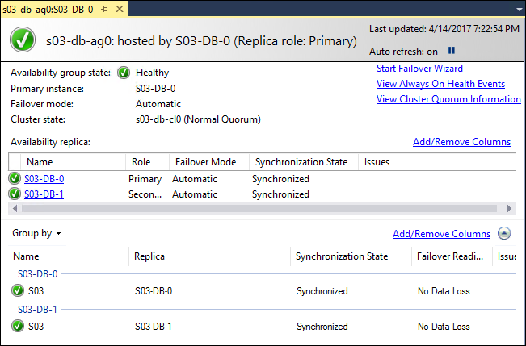
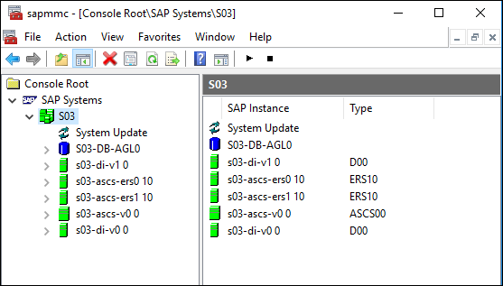

SAP Netweaver on Azure

Hands-on lab unguided

March 2018

Information in this document, including URL and other Internet Web site references, is subject to change without notice. Unless otherwise noted, the example companies, organizations, products, domain names, e-mail addresses, logos, people, places, and events depicted herein are fictitious, and no association with any real company, organization, product, domain name, e-mail address, logo, person, place or event is intended or should be inferred. Complying with all applicable copyright laws is the responsibility of the user. Without limiting the rights under copyright, no part of this document may be reproduced, stored in or introduced into a retrieval system, or transmitted in any form or by any means (electronic, mechanical, photocopying, recording, or otherwise), or for any purpose, without the express written permission of Microsoft Corporation.

Microsoft may have patents, patent applications, trademarks, copyrights, or other intellectual property rights covering subject matter in this document. Except as expressly provided in any written license agreement from Microsoft, the furnishing of this document does not give you any license to these patents, trademarks, copyrights, or other intellectual property.

The names of manufacturers, products, or URLs are provided for informational purposes only and Microsoft makes no representations and warranties, either expressed, implied, or statutory, regarding these manufacturers or the use of the products with any Microsoft technologies. The inclusion of a manufacturer or product does not imply endorsement of Microsoft of the manufacturer or product. Links may be provided to third party sites. Such sites are not under the control of Microsoft and Microsoft is not responsible for the contents of any linked site or any link contained in a linked site, or any changes or updates to such sites. Microsoft is not responsible for webcasting or any other form of transmission received from any linked site. Microsoft is providing these links to you only as a convenience, and the inclusion of any link does not imply endorsement of Microsoft of the site or the products contained therein.

© 2018 Microsoft Corporation. All rights reserved.

Microsoft and the trademarks listed at <https://www.microsoft.com/en-us/legal/intellectualproperty/Trademarks/Usage/General.aspx> are trademarks of the Microsoft group of companies. All other trademarks are property of their respective owners.

**Contents**
<!-- TOC -->

- [SAP on Azure hands-on lab unguided](#sap-on-azure-hands-on-lab-unguided)
    - [Abstract and learning objectives](#abstract-and-learning-objectives)
    - [Overview](#overview)
    - [Solution architecture](#solution-architecture)
    - [Help references](#help-references)
    - [Exercise 1: Deploy the SAP on Azure infrastructure components](#exercise-1-deploy-the-sap-on-azure-infrastructure-components)
        - [Overview](#overview-1)
        - [Tasks to Complete:](#tasks-to-complete)
        - [Task 1: Deploy Active Directory domain controller VMs](#task-1-deploy-active-directory-domain-controller-vms)
        - [Task 2: Prepare the Azure virtual network and Active Directory hosted on Azure VMs for deployment of SAP NetWeaver application and database tier VMs](#task-2-prepare-the-azure-virtual-network-and-active-directory-hosted-on-azure-vms-for-deployment-of-sap-netweaver-application-and-database-tier-vms)
        - [Task 3: Deploy the Scale-Out File Server (SOFS) cluster](#task-3-deploy-the-scale-out-file-server-sofs-cluster)
        - [Task 4: Deploy SAP NetWeaver application and database tier VMs](#task-4-deploy-sap-netweaver-application-and-database-tier-vms)
        - [Task 5: Configure IP addresses of Azure VMs and internal load balancers](#task-5-configure-ip-addresses-of-azure-vms-and-internal-load-balancers)
        - [Task 6: Join SAP NetWeaver application and database VMs to the domain](#task-6-join-sap-netweaver-application-and-database-vms-to-the-domain)
        - [Task 7: Configure User Account Control on application and the database VMs](#task-7-configure-user-account-control-on-application-and-the-database-vms)
        - [Exit criteria](#exit-criteria)
        - [Summary](#summary)
    - [Exercise 2: Configure the SAP NetWeaver ASCS servers](#exercise-2-configure-the-sap-netweaver-ascs-servers)
        - [Overview](#overview-2)
        - [Tasks to complete:](#tasks-to-complete)
        - [Task 1: Set up Failover Clustering on the ASCS VMs](#task-1-set-up-failover-clustering-on-the-ascs-vms)
        - [Task 2: Install the SAP ASCS components on s03-ascs-0](#task-2-install-the-sap-ascs-components-on-s03-ascs-0)
        - [Task 3: Install the SAP ASCS components on s03-ascs-1](#task-3-install-the-sap-ascs-components-on-s03-ascs-1)
        - [Task 4: Configure the SAP NetWeaver cluster with SOFS-based file share](#task-4-configure-the-sap-netweaver-cluster-with-sofs-based-file-share)
        - [Exit criteria](#exit-criteria-1)
        - [Summary](#summary-1)
    - [Exercise 3: Configure SAP NetWeaver database servers](#exercise-3-configure-sap-netweaver-database-servers)
        - [Overview](#overview-3)
        - [Tasks to complete:](#tasks-to-complete-1)
        - [Task 1: Configure storage of the SAP database layer](#task-1-configure-storage-of-the-sap-database-layer)
        - [Task 2: Grant elevated user rights to the SQL Server service account](#task-2-grant-elevated-user-rights-to-the-sql-server-service-account)
        - [Task 3: Install SQL Server 2016 with the SQL\_Latin1\_General\_CP850\_BIN2 collation](#task-3-install-sql-server-2016-with-the-sql\_latin1\_general\_cp850\_bin2-collation)
        - [Task 4: Install the SAP database layer](#task-4-install-the-sap-database-layer)
        - [Task 5: Implement Always-On Availability Group](#task-5-implement-always-on-availability-group)
        - [Task 6: Modify the SAP Default Profile](#task-6-modify-the-sap-default-profile)
        - [Exit criteria](#exit-criteria-2)
        - [Summary](#summary-2)
    - [Exercise 4: Configure SAP NetWeaver Application servers](#exercise-4-configure-sap-netweaver-application-servers)
        - [Overview](#overview-4)
        - [Tasks to complete:](#tasks-to-complete-2)
        - [Task 1: Configure storage and software prerequisites of the SAP Application layer](#task-1-configure-storage-and-software-prerequisites-of-the-sap-application-layer)
        - [Task 2: Install the SAP Primary Application Server (PAS) layer](#task-2-install-the-sap-primary-application-server-pas-layer)
        - [Task 3: Install the SAP Additional Application Server (AAS) layer](#task-3-install-the-sap-additional-application-server-aas-layer)
        - [Task 4: Install the SAP Enhanced Monitoring Extension for SAP](#task-4-install-the-sap-enhanced-monitoring-extension-for-sap)
        - [Exit criteria](#exit-criteria-3)
        - [Summary](#summary-3)
    - [Lab summary](#lab-summary)
    - [After the hands-on lab](#after-the-hands-on-lab)
        - [Task 1: Delete resources](#task-1-delete-resources)

<!-- /TOC -->

# SAP on Azure hands-on lab unguided 

## Abstract and learning objectives 

In this hands-on lab you will setup and configure SAP NetWeaver on Azure infrastructure as a service component. You will setup identity management, Scale-Out File Server (SOFS), NetWeaver application and database tiers and configure them all in a domain. You will then setup high-availability by configuring failover clustering for the SAP ASCS servers. Finally, you will configure the database tier with Always-On Availability Groups and configure the NetWeaver application servers for redundancy and enhanced monitoring.

At the end of the hands-on-lab, you will be better able to deploy SAP on Azure infrastructure components, configure SAP NetWeaver ASCS servers, configure SAP NetWeaver database servers, and configure SAP NetWeaver Application servers.

## Overview

Contoso has asked you to develop a process of provisioning a highly available, Windows Server 2016-based SAP NetWeaver deployment on Azure, with SAP Advanced Business Application Programming (ABAP) stack and SQL Server 2016 as the database tier. To provide high-availability of the ABAP SAP Central Services (ASCS) components, you will implement an instance of a failover cluster. The ASCS component will leverage a Storage Spaces Direct (S2D) cluster, providing support for highly-available shared storage hosting the sapmnt share. To provide high-availability of the database tier, you will implement an instance of SQL Server Always-On Availability Group. In both cases, you will use a Cloud Witness quorum, introduced in Windows Server 2016 Failover Clustering. All Azure VMs will be using managed disks. To streamline deployment, you will take advantage of the Azure Resource Manager templates and Windows PowerShell scripts.

## Solution architecture

From the architectural standpoint, the deployment will consist of the following layers:

-   Authentication layer -- two Active Directory domain controllers

-   Shared storage -- two servers configured as a Storage Spaces Direct (S2D) cluster

    -   Failover Clustering will rely on Cloud Witness-based quorum

    -   The cluster will host a Scale Out File Server (SOFS) containing the highly available sapmnt share

-   SAP ASCS layer -- two servers configured as members of a two-node Windows Failover Clustering cluster

    -   Failover Clustering will rely on Cloud Witness-based quorum

    -   An Azure internal load balancer will provide a front-end IP address of the ASCS Failover Clustering role

-   SAP Application instances layer -- two SAP application servers:

    -   Primary Application Server (PAS)

    -   Additional Application Server (AAS)

-   SAP Database layer -- two servers hosting separate instances of SQL Server 2016 configured as nodes of a SQL Server Always-On Availability Group cluster

    -   Failover Clustering will rely on Cloud Witness-based quorum

    -   An Azure internal load balancer will provide a front-end IP address of the Always-On Availability Group listener

To facilitate high-availability on the platform level, each pair of Azure virtual machines (VMs) in each layer will belong to the same managed availability set.

## Help references

|    |            |
|----------|:-------------:|
| **Description** | **Links** |
| SAP NetWeaver 3-tier compatible template using a Marketplace image   | <https://github.com/Azure/azure-quickstart-templates/tree/master/sap-3-tier-marketplace-image-md>   |
| Use Managed Disks to Create a Storage Spaces Direct (S2D) Scale-Out File Server (SOFS) Cluster with Windows Server 2016   | <https://github.com/robotechredmond/301-storage-spaces-direct-md>      |
| Configure Always-On Availability Group in Azure VM manually  |  <https://docs.microsoft.com/en-us/azure/virtual-machines/windows/sql/virtual-machines-windows-portal-sql-availability-group-tutorial>  |

## Exercise 1: Deploy the SAP on Azure infrastructure components 

Duration: 40 minutes

### Overview

In this exercise, you will deploy Azure infrastructure prerequisites for implementing SAP NetWeaver on Azure Virtual Machines (VMs). This will include creating such resources as an Azure Virtual Network, Azure VMs and Azure load balancers. You will also use this infrastructure to deploy Active Directory domain controllers to Azure VMs and, subsequently, join all remaining Azure VMs to the same Active Directory domain.

### Tasks to Complete:

### Task 1: Deploy Active Directory domain controller VMs

In this task, you will deploy two Azure VMs hosting Active Directory domain controllers of the domain contoso.com by using an Azure Resource Manager QuickStart template from GitHub available at <https://github.com/Azure/azure-quickstart-templates/tree/master/active-directory-new-domain-ha-2-dc>. You will use the following settings during deployment:

-   Resource group name: **s03-RG**

-   virtualNetworkName: **s03-vnet**

-   Virtual Network Address Range: **10.0.0.0/16**

-   Ad Subnet Name: **adSubnet**

-   Ad Subnet: **10.0.0.0/24**

-   Ad PDC Nic IP Address: **10.0.0.4**

-   Ad BDC Nic IP Address: **10.0.0.5**

-   Ad PDCVM Name: **s03-ad-0**

-   Ad BDCVM Name: **s03-ad-1**

-   Admin Username: **demouser**

-   Admin Password: **demo\@pass123**

-   Ad VM Size: **Standard\_D2\_v2**

-   Image Publisher: **MicrosoftWindowsServer**

-   Image Offer: **WindowsServer**

-   Image SKU: **2016-Datacenter**

-   Domain Name: **contoso.com**

### Task 2: Prepare the Azure virtual network and Active Directory hosted on Azure VMs for deployment of SAP NetWeaver application and database tier VMs 

In this task, you will configure Azure Virtual Network and Active Directory hosted on Azure VMs to prepare for deployment of additional Azure VMs that will be hosting your SAP implementation. On the Azure management layer, this will include adding an extra subnet named **sapSubnet** with the IP address range **10.0.1.0/24** and assigning the DNS server representing the newly deployed domain controllers to the adVNET Virtual Network. From the DNS name resolution and Active Directory standpoint, you will perform the following steps:

-   In the contoso.com DNS zone:

    -   Create the following DNS Host (A) records:

        -   **s03-ascs-v0 10.0.1.6** (this IP address must match the IP address that will be assigned to the front end of the ASCS-layer internal load balancer)

        -   **s03-ascs-ers0 10.0.1.8** (this IP address must match the IP address that will be assigned to the first Azure VM of the ASCS-layer)

        -   **s03-ascs-ers1 10.0.1.9** (this IP address must match the IP address that will be assigned to the second Azure VM of the ASCS-layer)

        -   **s03-di-v0 10.0.1.28** (this IP address must match the IP address that will be assigned to the SAP Primary Application Server s0-di-0)

        -   **s03-di-v1 10.0.1.29** (this IP address must match the IP address that will be assigned to the SAP Additional Application Server s0-di-1)

-   In the contoso.com Active Directory:

    -   Create an organizational unit in the root of the contoso.com domain named **S03** that will host SAP-specific users and groups

    -   Create the following user accounts with non-expiring password set to **demo\@pass123** that will be used to facilitate the SAP implementation:

        -   **s03-su**: member of contoso\\Domain Admins and contoso\\Administrators. You will use this account to perform all operating system level configuration tasks, including installation of all SAP components

        -   **s03-db-0-sqlsvc**: you will use this account to configure SQL Server 2016 services on the first SQL Server VM

        -   **s03-db-1-sqlsvc**: you will use this account to configure SQL Server 2016 services on the second SQL Server VM

### Task 3: Deploy the Scale-Out File Server (SOFS) cluster

In this task, you will deploy the scale-out file server (SOFS) cluster that will be hosting a file share for the SAP ASCS servers by using an Azure Resource Manager QuickStart template from GitHub available at <https://github.com/robotechredmond/301-storage-spaces-direct-md>. You will use the following settings during deployment:

-   Resource group: **s2d-RG**

-   Name prefix: **s03**

-   Vm Size: **Standard DS3\_v2**

-   Enable Accelerated Networking: **true**

> Note: Accelerated networking is supported on Azure VM sizes with 2 or more vCPUs

-   Image Sku: **2016-Datacenter-Server-Core**

-   VM Count: **2**

-   VM Disk Size: **128**

-   VM Disk Count: **3**

-   Existing Domain Name: **contoso.com**

-   Admin Username: **demouser**

-   Admin Password: **demo\@pass123**

-   Existing Virtual Network RG Name: **s03-RG**

-   Existing Virtual Network Name: **adVNet**

-   Existing Subnet Name: **s2dSubnet**

-   Sofs Name: **sapglobalhost**

-   Share Name: **sapmnt**

-   Scheduled Update Day: **Sunday**

-   Scheduled Update Time: **3:00 AM**

-   Realtime Antimalware Enabled: **false**

-   Scheduled Antimalware Enabled: **false**

-   Scheduled Antimalware Time: **120**

-   \_artifacts Location: accept the default value

-   \_artifacts Location Sas Token: leave the default value

### Task 4: Deploy SAP NetWeaver application and database tier VMs 

In this task, you will deploy additional Azure VMs that will be hosting your SAP implementation by using an Azure Resource Manager QuickStart template from GitHub available at <https://github.com/Azure/azure-quickstart-templates/tree/master/sap-3-tier-marketplace-image-md>. You will use the following settings during deployment:

-   Resource group: **s03-RG**

-   Sap System Id: **s03**

-   OS Type: **Windows Server 2016 Datacenter**

-   Sap System Size: **Demo**

-   System Availability: **HA**

-   vmSizes:

    -   dbserversize: **Standard\_DS4\_v2**

    -   ascsserversize: **Standard\_DS2\_v2**

    -   diserversize: **Standard\_DS2\_v2**

-   internalStorageTypeASCS: **Premium\_LRS**

-   internalStorageTypeDB: **Premium\_LRS**

-   internalStorageTypeDI: **Premium\_LRS**

-   Admin Username: **demouser**

-   Admin Password: **demo\@pass123**

-   New Or Existing Subnet: **existing**

-   Subnet Id: *id of the **sapSubnet***

-   Health Probe port of s03-lb-ascs load balancer: **3900**

-   Health Probe port of s03-lb-db load balancer: **59999**

> Note: Disregard any custom script extension errors generated by the template deployment.

### Task 5: Configure IP addresses of Azure VMs and internal load balancers

In this exercise, you will configure Public and Private IP addressing for the Azure VMs and internal load balancers deployed in the previous task by using an Azure Resource Manager template. You will assign to each VM a designated, static Private IP address and a dynamic Public IP address. You will also assign a designated, static Private IP address to each load balancer.

> Note: At this point, each of the Azure VMs we have deployed in the previous task has a dynamically assigned Private IP address and no Public IP address. The lack of Public IP addresses is the result of using the SAP NW 3-tier compatible Marketplace image template, which is intended to work this way when deploying it into an existing Azure Virtual Network. When operating in a production environment, you should connect to VMs via their Private IP address (e.g. by leveraging an existing Site-to-Site VPN or ExpressRoute from an on-premises location). You will add a Public IP to each VM in order to simplify the setup process. We will also assign a designated static Private IP address to each VM and each internal load balancer in order to be able to reference specific IP addresses throughout this lab.

Configure the private IP addresses of VMs and load balancers in the following manner:

-   s03-nic-ascs-0: 10.0.1.8

-   s03-nic-ascs-1: 10.0.1.9

-   s03-nic-db-0: 10.0.1.18

-   s03-nic-db-1: 10.0.1.19

-   s03-nic-di-0: 10.0.1.28

-   s03-nic-di-1: 10.0.1.29

-   s03-lb-db: 10.0.1.16

-   s03-lb-ascs: 10.0.1.6

### Task 6: Join SAP NetWeaver application and database VMs to the domain

In this task, you will join all of the Windows Server 2016 Azure VMs that will be hosting your SAP implementation to the Active Directory domain contoso.com.

### Task 7: Configure User Account Control on application and the database VMs

In this task, you will disable User Account Control on the Windows Server 2016 Azure VMs that will be hosting your SAP implementation to the Active Directory domain contoso.com.

> Note: This is a temporary measure. You should re-enable User Account Control once you complete the setup.

### Exit criteria

-   You have deployed the ARM template <https://github.com/Azure/azure-quickstart-templates/tree/master/active-directory-new-domain-ha-2-dc>

-   You have deployed the ARM template <https://github.com/robotechredmond/301-storage-spaces-direct-md> into the same virtual network as the first template

-   You have deployed the ARM template <https://github.com/Azure/azure-quickstart-templates/tree/master/sap-3-tier-marketplace-image> into the same virtual network as the first template

-   You have joined all VMs to the contoso.com Active Directory domain

### Summary

In this exercise, you deployed Azure infrastructure prerequisites for implementing SAP NetWeaver on Azure IaaS virtual machines (VMs). This included creation of such resources as an Azure virtual network, Azure VMs, Azure load balancers and Azure Storage accounts. You also used this infrastructure to deploy Active Directory domain controllers to Azure VMs and, subsequently, joined all the remaining Azure VMs to the same Active Directory domain.

## Exercise 2: Configure the SAP NetWeaver ASCS servers

Duration: 90 minutes

### Overview

In this exercise, you will configure the Azure VMs that constitute the SAP ASCS layer. This will include installing Failover Clustering on s03-ascs-0 and s03-ascs-1. You will also run the SAP Software Provisioning Manager to perform distributed installation of the ASCS components on the s03-ascs-0 and s03-ascs-1 VMs. Afterwards, you will configure the SOFS-based sapmnt share and create SAP NetWeaver ASCS cluster resources by following instructions described in <https://docs.microsoft.com/en-us/azure/virtual-machines/workloads/sap/sap-high-availability-installation-wsfc-file-share> .

### Tasks to complete:

### Task 1: Set up Failover Clustering on the ASCS VMs

In this task, you will start by configuring operating system on s03-ascs-0 and s03-ascs-1. On both VMs, mount the 128 GB data disk as ReFS-formatted U: drive with the disk label **SAP Local FS**. On both VMs, disable Windows firewall for the domain profile. Next, implement a Failover Clustering-based cluster named **s03-ascs-cl0** with the IP address of **10.0.1.7** consisting of **s03-ascs-0** and **s03-ascs-1** Azure VMs. Set up the cluster with a Cloud Witness quorum by using the storage account that was auto-provisioned in the previous exercise when you deployed Storage Spaces Direct (S2D) cluster.

### Task 2: Install the SAP ASCS components on s03-ascs-0

In this task, you will use SAP Software Provisioning Manager to carry out the distributed installation of ASCS components on the first node of ASCS cluster of MS SQL Server-based SAP NetWeaver 7.5 deployment. Run the installation as the **CONTOSO\\s03-su** account you created in the first exercise. During the installation, address all necessary prerequisites, and specify the following parameters:

-   Drive for Local Instances: **U:**

-   SAP System ID (SAPSID): **S03**

-   DNS Domain Name for SAP Systems: **contoso.com**

-   SAP System User Domain: **Domain of Current User**

-   OU Path: **S03**

-   Windows Domain for SAP Host Agent: **Local Domain**

-   ABAP Message Server Ports: **3600**

-   Internal ABAP Message Server Ports: **3900**

-   Install SAP Web Dispatcher integrated: **Yes**

-   Set SAP Web Dispatcher Encryption Mode: **Never**

-   Set all passwords to **demo\@pass123**

Account for the fact you will be using the virtual names, and configure the following registry entries on both VMs:

-   HKLM\\SYSTEM\\CurrentControlSet\\Control\\LSA

    -   Set DisableLoopbackCheck to 1

-   HKLM:\\SYSTEM\\CurrentControlSet\\Services\\lanmanserver\\parameters

    -   Set DisableStrictNameChecking to 1

### Task 3: Install the SAP ASCS components on s03-ascs-1

In this task, you will use SAP Software Provisioning Manager to carry out the distributed installation of ASCS components on the second node of ASCS cluster of MS SQL Server-based SAP NetWeaver 7.5 deployment. Run the installation as the **CONTOSO\\s03-su** account you created in the first exercise. During the installation, address all necessary prerequisites, and specify the following parameters:

-   Drive for Local Instances: **U:**

-   SAP System ID (SAPSID): **S03**

-   DNS Domain Name for SAP Systems: **contoso.com**

-   SAP System User Domain: **Domain of Current User**

-   OU Path: **S03**

-   Windows Domain for SAP Host Agent: **Local Domain**

-   ABAP Message Server Ports: **3600**

-   Internal ABAP Message Server Ports: **3900**

-   Install SAP Web Dispatcher integrated: **Yes**

-   Set SAP Web Dispatcher Encryption Mode: **Never**

-   Set all passwords to **demo\@pass123**

### Task 4: Configure the SAP NetWeaver cluster with SOFS-based file share

In this task, you will configure the ASCS cluster with the sapmnt share hosted on the SOFS you installed in the previous exercise. To accomplish this, follow the procedure documented at <https://docs.microsoft.com/en-us/azure/virtual-machines/workloads/sap/sap-high-availability-installation-wsfc-file-share>.

### Exit criteria

-   You have installed the HA ASCS component on the s03-ascs-0 and s03-ascs-1 VMs

    

### Summary

In this exercise, you configured the Azure VMs that constitute the SAP ASCS layer. This included installing and configuring Failover Clustering on both VMs. You also used the procedure described at <https://docs.microsoft.com/en-us/azure/virtual-machines/workloads/sap/sap-high-availability-installation-wsfc-file-share> to configure the ASCS cluster with the sapmnt share hosted on the SOFS you installed in the previous exercise.

## Exercise 3: Configure SAP NetWeaver database servers

Duration: 120 minutes

### Overview

In this exercise, you will configure the SAP NetWeaver database servers. You will start by installing a separate, stand-alone instance of SQL Server 2016 on each VM. Next, you will run SAP Software Provisioning Manager to install HA DB component on the s03-db-0 VM. Afterwards, you will implement high-availability by setting both SQL Server instances as members of the same Always-On Availability Group. Just as in the previous exercise, you will use Cloud Witness to provide the quorum for the Failover Cluster. You will also copy SQL Server logins from the instance hosted on s03-db-0 to the instance hosted on s03-db-1. Finally, you will update the SAP default profile to point to the Always-On Availability Group listener, rather than to an individual SQL Server 2016 instance.

### Tasks to complete:

### Task 1: Configure storage of the SAP database layer

In this task, you will configure the Azure VMs for the database layer by attaching an extra Premium storage 512 GB data disk to each of them (the template-based deployment resulted in one disk of 128 GB in size already attached to every Azure VM within that deployment). Set the host caching on the 128 GB disk to **None** (since this disk will be used to host logs) and on the 512 GB disk to **Read**-**only** (since this disk will be used to host data files). To provide a Cloud Witness for the database cluster, you will use the same storage account that you created in the second exercise when creating the ASCS cluster, so there is no need to create another storage account for this purpose.

### Task 2: Grant elevated user rights to the SQL Server service account

In this task, you will use Group Policy to grant the following user rights to the SQL Server service account (**s03-db-0-sqlsvc** and **s03-db-1-sqlsvc**) on the Window Server 2016 computers hosting their respective SQL Server instances.

-   Perform volume maintenance tasks

-   Lock pages in memory

These options provide potential performance improvements, as documented in <https://docs.microsoft.com/en-us/sql/relational-databases/databases/database-instant-file-initialization?view=sql-server-2016> and <https://docs.microsoft.com/en-us/sql/database-engine/configure-windows/enable-the-lock-pages-in-memory-option-windows?view=sql-server-2016> .

In a production deployment, you should consider using domain-based Group Policy Objects rather than the local Group Policy. This approach is used in this lab strictly for simplicity.

### Task 3: Install SQL Server 2016 with the SQL\_Latin1\_General\_CP850\_BIN2 collation

In this task, you will configure operating system on s03-db-0 and s03-db-1 and install SQL Server 2016 Service Pack and Cumulative Update on s03-db-0 and s03-db-1 Azure VMs. Run the installation as the **CONTOSO\\s03-su** account you created in the first exercise. Start by disabling Windows firewall for the domain profile and mounting the 128 GB data disk as ReFS-formatted L: drive with the disk label **Logs Disk** and the 512 GB data disk as ReFS-formatted M: drive with the disk label **Data Disk**. Perform the installation of SQL Server 2016 on both s03-db-0 and s03-db-1 with the following settings:

-   Use Microsoft Update to check for updates (recommended): **disabled**

-   Feature Selection:

    -   **Database Engine Services**

    -   **Client Tools Connectivity**

-   Instance Configuration: **Default instance**

-   Service Accounts:

    -   s03-db-0

        -   SQL Server: **contoso\\s03-db-0-sqlsvc**

        -   SQL Server Agent: **contoso\\s03-db-0-sqlsvc**

    -   s03-db-1

        -   SQL Server: **contoso\\s03-db-1-sqlsvc**

        -   SQL Server Agent: **contoso\\s03-db-1-sqlsvc**

-   Collation: **SQL\_Latin1\_General\_CP850\_BIN2**

-   Windows authentication mode:

    -   SQL Server Administrators

        -   **contoso\\s03-su**

        -   **s03-db-0\\Administrators**

-   Data Directories:

    -   **Data root directory: C:\\Program Files\\Microsoft SQL Server**

    -   **User database directory: M:\\Program Files\\Microsoft SQL Server\\MSSQL13.MSSQLSERVER\\MSSQL\\Data**

    -   **User database log directory: L:\\Program Files\\Microsoft SQL Server\\MSSQL13.MSSQLSERVER\\MSSQL\\Data**

    -   **Backup directory: M:\\Program Files\\Microsoft SQL Server\\MSSQL13.MSSQLSERVER\\MSSQL\\Backup**

-   TempDB:

    -   **Data directories: M:\\Program Files\\Microsoft SQL Server\\MSSQL13.MSSQLSERVER\\MSSQL\\Data (note that you will need to create this directory)**

    -   **Log directory: L:\\Program Files\\Microsoft SQL Server\\MSSQL13.MSSQLSERVER\\MSSQL\\Data\
        **

On both s03-db-0 and s03-db-1, download and install SQL Server Management Studio with the default settings.

Copy SAP specific logins from s03-db-0 to s03-db-1 with their existing settings, including the default database and the server role.

### Task 4: Install the SAP database layer

In this task, you will install the SAP database instance on s03-db-0 Azure VM by using the SAP Software Provisioning Manager. Run the installation as the **CONTOSO\\s03-su** account you created in the first exercise. During the installation, address all necessary prerequisites and specify the following parameters:

-   Profile Directory: **\\\\s03-ascs-v0\\sapmnt\\S03\\SYS\\profile**

-   SAP System User Domain: **Domain of Current User**

-   OU Path: **S03**

-   Database instance: **S03-DB-0**

-   SAP Host Agent User Domain: **Local Domain**

-   MS SQL Server Data Files: **4 for small systems **

-   MS SQL Server Database Files:

    -   **data: M:\\S03DATA1**

    -   **data: M:\\S03DATA2**

    -   **data: M:\\S03DATA3**

    -   **data: M:\\S03DATA4**

    -   **log: L:\\S03LOG1**

-   SAP System Database Import:

    -   **Number of Parallel Jobs: 3**

-   Set all passwords to **demo\@pass123**

### Task 5: Implement Always-On Availability Group

In this task, you will implement a Failover Clustering-based cluster named **s03-db-cl0** with the IP address of **10.0.1.17** on s03-db0 and s03-db-1 Azure VMs with Always-On Availability Group hosting the SAP database. Set up the cluster with a Cloud Witness quorum by using the storage account you created in the second exercise. To prepare for setting up Always-On Availability Group for the SAP database you installed in the previous task, grant the **Create Computer Objects** permissions on the **Computers** container in the contoso.com Active Directory to the newly created **contoso\\s03-db-cl0** account. In addition, create a directory structure on s03-db-1 that matches the directory structure on the M: and L: drives of s03-db-0.

Next, from SQL Server Configuration Manager, enable Always-On Availability Groups and restart the SQL Server (MSSQLSERVER) service on both s03-db-0 and s03-db-01.

On s03-db-0, create a new share **C:\\Backup** named **Backup**. On the share level and on the file system level, grant **Read/Write** permissions to **CONTOSO\\s03-db-0-sqlsvc** account and **Read** permissions to the **CONTOSO\\s03-db-1-sqlsvc** account.

From SQL Server Management Studio on s03-db-0, use the New Availability Group Wizard to create a new Availability Group with the following settings:

-   Name: **s03-db-ag0**

-   User database for availability group: **S03**

-   Replicas: **S03-DB-0 and S03-DB-1**

    -   Automatic Failover: **Yes**

    -   Synchronous Commit: **Yes**

    -   Readable Secondary: **No**

    -   Initial Data Synchronization: **Full**

    -   A shared network location accessible by all replicas: [**\\\\S03-DB-0\\Backup**](file://S03-DB-0/Backup)

> Note that majority of customers choose to use Transparent Data Encryption (TDE) when deploying SQL Server databases to Azure. If you use TDE, then you cannot use the Always-On Availability Group wizard. Instead, you have to follow instructions described in <https://blogs.msdn.microsoft.com/saponsqlserver/2017/04/04/more-questions-from-customers-about-sql-server-transparent-data-encryption-tde-azure-key-vault/>. Alternatively, you can enable TDE after establishing the Always On Availability Group, however this is a tedious and slow process. For the purpose of this lab, you will not enable TDE and use the Always-On Availability Group wizard when setting up the Always-On Availability Group.

In the Failover Cluster Manager, create a new Client Access Point with the following settings:

-   Name: **s03-db-agl0**

-   IP address: **10.0.1.16 (static) --** *make sure it matches the IP address assigned to the s03-lb-db load balancer*

Set the dependency of **s03-db-ag0** on **s03-db-agl0**.

Use Windows PowerShell to set the properties of the IP address resource of the newly created Client Access Point as follows:

-   Address: **10.0.1.16**

-   ProbePort: **59999**

-   SubnetMask: **255.255.255.255**

-   Network: **Cluster Network 1**

-   EnableDhcp: **0**

In the SQL Server Management Studio, set the port of the **s03-db-agl0** listener to **1433**.

Bring the Always-On Availability Group clustered role online.

### Task 6: Modify the SAP Default Profile

In this task, you will modify the SAP default profile in order to ensure that the application tier communicates with the database tier via the newly created Always-On Availability Group listener. To accomplish this, set the value of the **dbs/mss/server** parameter to the name of the newly created Availability Group listener (**s03-db-agl0**) in the default profile of the S03 SAP system (hosted on the shared disk of the ASCS layer). In order for the change to take effect, restart the VMs that constitute the SAP ASCS layer.

### Exit criteria

-   You have installed the HA DB component on the s03-db-0 VM

-   You have implemented Always-On Availability Group on s3-db0 and s03-db-1 VMs

    

### Summary

In this exercise, you have configured the SAP NetWeaver database servers. You started by installing a separate, stand-alone instance of SQL Server 2016 on each VM. Next, you ran SAP Software Provisioning Manager to install HA DB component on the s03-db-0 VM. Afterwards, you implemented high-availability by setting both SQL Server instances as members of the same Always-On Availability Group. Just as in the previous exercise, you used Cloud Witness to provide the quorum for the Failover Cluster. You also copied SQL Server logins from the instance hosted on s03-db-0 to the instance hosted on s03-db-1. Finally, you updated the SAP default profile to point to the Always-On Availability Group listener, rather than to an individual SQL Server 2016 instance.

## Exercise 4: Configure SAP NetWeaver Application servers

Duration: 50 minutes

### Overview

In this exercise, you will configure the SAP NetWeaver application servers. You will start by installing Microsoft ODBC Driver for SQL Server on s03-di-0 and s03-di-1 Azure VMs. Next, you will use SAP Software Provisioning Manager to install the Primary Application Server (PAS) instance on s03-di-0 and follow with the installation of an Additional Application Server (AAS) instance on s03-di-1. In addition, you will install SAP Enhanced Monitoring Extension for SAP on Azure VMs included in your SAP deployment. Optionally, you might want to also consider disabling Internet Explorer by following by following these instructions: <https://support.microsoft.com/en-us/help/4013567/how-to-disable-internet-explorer-on-windows>

### Tasks to complete:

### Task 1: Configure storage and software prerequisites of the SAP Application layer

In this task, you will configure the Azure VMs in the Application layer by mounting the 128 GB data disk as ReFS-formatted U: drive with the disk label **SAP Local FS**. On both VMs, disable Windows firewall for the domain profile. You will also install on both Microsoft ODBC Driver for SQL Server (available from <https://www.microsoft.com/en-us/download/confirmation.aspx?id=53339> ) to facilitate connectivity to the database tier.

### Task 2: Install the SAP Primary Application Server (PAS) layer

In this task, you will install the SAP PAS of HA deployment of MS SQL Server-based SAP NetWeaver 7.5 HA deployment on s03-di-0 Azure VM by using the SAP Software Provisioning Manager. Run the installation as the **CONTOSO\\s03-su** account you created in the first exercise. During the installation, address all necessary prerequisites and specify the following parameters:

-   Drive for Local Instances: **U:**

-   Windows Domain: **Domain of current user**

-   Database instance: **S03-DB-AGL0**

-   Existing MS SQL Server Database: **S03**

-   Windows Domain for SAP Host Agent: **Local Domain**

-   PAS Instance Host Name: **s03-di-v0**

-   ABAP Message Server Ports: **3600**

-   Internal ABAP Message Server Ports: **3900**

-   SLD Destination for the SAP System OS Level: **No SLD destination**

-   Message Server Access Control List: **Do not create Message Server Access Control List**

-   Secure Storage Key Generation: **Default Key**

-   Set all passwords to **demo\@pass123**

Account for the fact that you are using the virtual names and configure the following registry entries on both VMs:

-   HKLM\\SYSTEM\\CurrentControlSet\\Control\\LSA

    -   Set DisableLoopbackCheck to 1

-   HKLM:\\SYSTEM\\CurrentControlSet\\Services\\lanmanserver\\parameters

    -   Set DisableStrictNameChecking to 1

### Task 3: Install the SAP Additional Application Server (AAS) layer

In this task, you will install the SAP AAS of HA deployment of MS SQL Server-based SAP NetWeaver 7.5 HA deployment on s03-di-1 Azure VM by using the SAP Software Provisioning Manager. Run the installation as the **CONTOSO\\s03-su** account you created in the first exercise. During the installation, address all necessary prerequisites and specify the following parameters:

-   Drive for Local Instances: **U:**

-   Windows Domain: **Domain of current user**

-   Database instance: **S03-DB-AGL0**

-   Existing MS SQL Server Database: **S03**

-   Windows Domain for SAP Host Agent: **Local Domain**

-   AAS Instance Host Name: **s03-di-v1**

-   Message Server Access Control List: **Do not create Message Server Access Control List**

-   Set all passwords to **demo\@pass123**

### Task 4: Install the SAP Enhanced Monitoring Extension for SAP

In this task, you will install SAP Enhanced Monitoring Extension for SAP on Azure VMs included in your SAP deployment.

### Exit criteria

-   You have installed the SAP PAS on s03-di-0 and SAP AAS on s03-di-1

    

### Summary

In this exercise, you configured the SAP NetWeaver application servers. You started by installing Microsoft ODBC Driver for SQL Server on the s03-di-0 and s03-di-1 Azure VMs. Next, you used SAP Software Provisioning Manager to install the Primary Application Server (PAS) instance on s03-di-0 and followed with the installation of an Additional Application Server (AAS) instance on s03-di-1.

## Lab summary

In this lab, you stepped through a process of provisioning a highly available, Windows Server 2016-based SAP NetWeaver deployment on Azure, with SAP ABAP stack and SQL Server 2016 as the database tier. To provide high-availability of the ABAP SAP Central Services (ASCS) components, you implemented an instance of a Failover Cluster that leveraged a Storage Spaces Direct (S2D) cluster, hosting highly-available shared storage hosting the sapmnt share. To provide high-availability of the database tier, you implemented an instance of SQL Server Always-On Availability Group. In both cases, you will use a Cloud Witness quorum introduced in Windows Server 2016 Failover Clustering. To provide resiliency of the SAP application server instances, you deployed the Primary Application Server (PAS) and an Additional Application Server (AAS) in the same availability set.

## After the hands-on lab 

Duration: 20 Minutes

### Task 1: Delete resources

1.  Now that the HOL is complete, go ahead and delete all of the Resource Groups created for this HOL. You will no longer need those resources, and it will be beneficial to clean up your Azure Subscription.

You should follow all steps provided *after* attending the hands-on lab.

