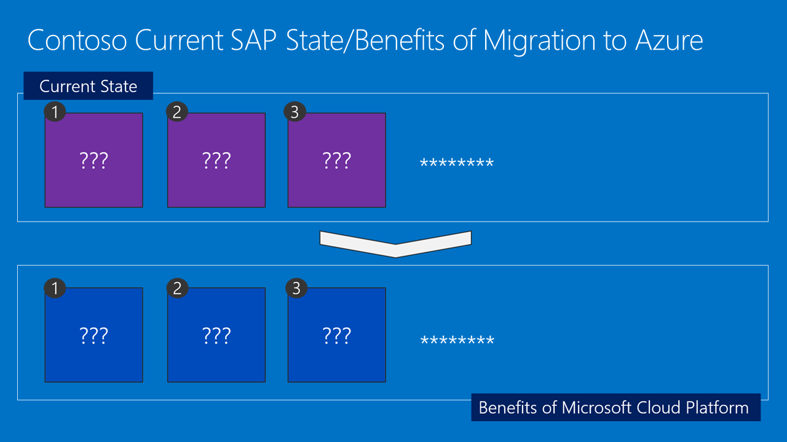

SAP Netweaver on Azure

Whiteboard design session student guide

March 2018

Information in this document, including URL and other Internet Web site references, is subject to change without notice. Unless otherwise noted, the example companies, organizations, products, domain names, e-mail addresses, logos, people, places, and events depicted herein are fictitious, and no association with any real company, organization, product, domain name, e-mail address, logo, person, place or event is intended or should be inferred. Complying with all applicable copyright laws is the responsibility of the user. Without limiting the rights under copyright, no part of this document may be reproduced, stored in or introduced into a retrieval system, or transmitted in any form or by any means (electronic, mechanical, photocopying, recording, or otherwise), or for any purpose, without the express written permission of Microsoft Corporation.

Microsoft may have patents, patent applications, trademarks, copyrights, or other intellectual property rights covering subject matter in this document. Except as expressly provided in any written license agreement from Microsoft, the furnishing of this document does not give you any license to these patents, trademarks, copyrights, or other intellectual property.

The names of manufacturers, products, or URLs are provided for informational purposes only and Microsoft makes no representations and warranties, either expressed, implied, or statutory, regarding these manufacturers or the use of the products with any Microsoft technologies. The inclusion of a manufacturer or product does not imply endorsement of Microsoft of the manufacturer or product. Links may be provided to third party sites. Such sites are not under the control of Microsoft and Microsoft is not responsible for the contents of any linked site or any link contained in a linked site, or any changes or updates to such sites. Microsoft is not responsible for webcasting or any other form of transmission received from any linked site. Microsoft is providing these links to you only as a convenience, and the inclusion of any link does not imply endorsement of Microsoft of the site or the products contained therein.

©  2018 Microsoft Corporation. All rights reserved.

Microsoft and the trademarks listed at <https://www.microsoft.com/en-us/legal/intellectualproperty/Trademarks/Usage/General.aspx> are trademarks of the Microsoft group of companies. All other trademarks are property of their respective owners.

**Contents**

<!-- TOC -->

- [SAP on Azure whiteboard design session student guide](#sap-on-azure-whiteboard-design-session-student-guide)
    - [Abstract and learning objectives](#abstract-and-learning-objectives)
    - [Step 1: Review the customer case study](#step-1-review-the-customer-case-study)
        - [Customer situation](#customer-situation)
        - [Customer needs](#customer-needs)
        - [Technical requirements](#technical-requirements)
        - [Customer objections](#customer-objections)
        - [Infographic for common scenarios](#infographic-for-common-scenarios)
    - [Step 2: Design a proof of concept solution](#step-2-design-a-proof-of-concept-solution)
        - [*Architecting network connectivity*](#architecting-network-connectivity)
        - [*Architecting (ASCS) components*](#architecting-ascs-components)
        - [*Architecting application components*](#architecting-application-components)
        - [*Architecting database components*](#architecting-database-components)
        - [*Determining estimated cost of the solution*](#determining-estimated-cost-of-the-solution)
    - [Step 3: Present the solution](#step-3-present-the-solution)
    - [Wrap-up](#wrap-up)
        - [Additional references](#additional-references)

<!-- /TOC -->

#  SAP on Azure whiteboard design session student guide

## Abstract and learning objectives 

In this whiteboard design session, you will learn how to deploy SAP on Azure infrastructure components as well as perform an SAP on Azure need assessment, take part in an SAP on Azure architecture design discussion, and respond to an RFI/RFP for SAP on Cloud opportunity.

At the end of this whiteboard design session, you will be better able to architect for SAP running on Azure infrastructure as a service components and understand proper configuration of SAP NetWeaver ASCS, database and application servers in Azure.

## Step 1: Review the customer case study 

**Outcome** 

Analyze your customer’s needs.

Timeframe: 15 minutes 

Directions: With all participants in the session, the facilitator/SME presents an overview of the customer case study along with technical tips. 

1.  Meet your table participants and trainer 
2.  Read all of the directions for steps 1–3 in the student guide 
3.  As a table team, review the following customer case study

### Customer situation

Contoso Group is a US-based telecommunications company with worldwide operations serving almost 150 million mobile subscribers. The company is looking to optimize its IT environment and considering moving some of its on-premises SAP workloads to Azure.

Contoso Group has an existing on-premises deployment of SAP ECC (SAP ERP Central Component) 6.0 on Windows Server 2012 R2 with a SQL Server 2014 database in its US-based data center near New York City. The deployment consists of the development, test, quality assurance, and production systems. However, the IT organization finds it challenging to expand the SAP landscape to accommodate growing number of SAP-related business requests. This is related to the time and resources required to move through development and testing phases and implement new business processes into production. In addition, IT finds it difficult to adjust the size of the production environment in order to accommodate varying level of workloads. IT is also concerned about lack of high availability and disaster recovery capabilities in the existing deployment. The estimates of providing such capabilities for production workloads exceed the budget allocated for this purpose by far.

As the result, agility of the organization is hampered by capital expenditures and the time necessary to acquire and provision project-related SAP development and testing environments. Representatives of central IT management, including the company CIO Andrew Cross and its VP of IT Operations are concerned about managing test/dev infrastructure costs. There are also concerns regarding aging data center and hardware. Business Development Manager (BDM) and the company CFO would like to lower TCO for the SAP landscape, including the production ECC environment.

**Current situation**

The production app tier consists of three physical servers, each with 8 CPU cores and 32GB RAM. The production database tier is hosted on a single physical server with the same hardware configuration. The average performance of the application tier and the database tier is about 30,000 SAPS and 15,000 SAPS, respectively. The production SAP database workload generates about 10,000 IOPS. The current production DB size is 750GB. According to the estimates of the Contoso SAP team, the database is bound to grow to about 1TB in the next few years. In case of a disaster affecting the production instance, the business expects the RPO and RTO of 15 minutes and 6 hours, respectively. The database transaction log backup should be performed very 15 minutes, with one full daily backup. Daily full backups must be retained for 1 month and monthly full backups for 1 year.

**Customer objectives**

As Andrew Cross, the company's CIO wants to significantly improve times it takes to provision development and test SAP environments. At the same time, he stresses the importance of minimizing their cost. He also points out the criticality of the SAP production workloads and the need of protecting them against unplanned downtime. As he stated, "The existing on-premises SAP development and test environments no longer meet the agility required by the fast pace of changes in our business. In addition, our operational dependencies on SAP applications force us to seek reasonably priced availability and disaster recovery capabilities for our production SAP deployments."

Contoso CIO and the company CFO, along with Business Development Manager (BDM), Director of SAP Business Analysts, and Director of SAP Operations are all open to taking advantage of Azure as a platform and want their respective teams to be able to leverage the scalability and resiliency provided by the cloud platform.

**Existing Contoso SAP environment**

### Customer needs 

-   Reduce time to deploy new business processes to have competitive customer offers

-   Reduce time required to provision development and test environments

-   Lower costs incurred by the development, test, and production environments

-   Identify an estimated monthly infrastructure cost for operating your solution

### Technical requirements

-   SAP ERP/ECC 6.0 NetWeaver is the application tier

-   SQL Server 2014 is the data tier

-   Application tier on the production system requires total of 30,000 SAPS

-   Database tier on the production system requires total of 15,000 SAPS

-   Database tier on the production system needs 10,000 IOPS

-   The size of database files on the production system is 750GB, with the expected growth to 1TB

-   RPO=15 min, RTO=6 hours

-   Transaction log backups every 15 minutes, full daily backups retained for 1 month, monthly backups retained for 1 year

### Customer objections 

-   If I have already paid for my hardware to run my dev/test environment, how am I getting any cost savings by moving it to Azure? How much more is your cloud solution costing me?

-   What if I need my cloud resources to access on-premises resources?

-   Will Azure meet our security and compliance requirements?

-   Do I have to pay for resources when they are stopped?

-   Can I automate the shutdown at periodic times of day?

### Infographic for common scenarios

## Step 2: Design a proof of concept solution

**Outcome** 
Design a solution and prepare to present the solution to the target customer audience in a 15-minute chalk-talk format. 

Timeframe: 60 minutes

**Business needs**

Directions: With all participants at your table, answer the following questions and list the answers on a flip chart. 

1.  Who should you present this solution to? Who is your target customer audience? Who are the decision makers? 
2.  What customer business needs do you need to address with your solution?

**Design** 
Directions: With all participants at your table, respond to the following questions on a flip chart.

***Architecting a multi-tier SAP solution***

Using the features of Azure and the requirements from the customer, design the application infrastructure and network for A Datum SAP deployment in Azure. Consider such factors as cost of ownership of entire SAP landscape as well as availability and disaster recovery capabilities for the production environment.

Make sure that your design covers the following items:

***High-level architecture***

**Task:** Identifying the target Azure region(s) and the number of tiers.

-   Identify the optimal choices for Azure region(s) where the solution should be deployed

-   Choose between the 2-tier and 3-tier architecture

-   Ensure that high-availability and disaster recovery requirements are satisfied

### *Architecting network connectivity*

**Task:** Design a hybrid network (at a high-level) that will allow you to meet all the customer requirements and support your design for moving Contoso SAP landscape to Azure.

-   Design virtual networking in Azure and suggest the hybrid connectivity configuration between Contoso on-premises environment and Azure

### *Architecting (ASCS) components*

**Task:** Design a highly available and geo-redundant solution for hosting the (A)SCS components of the SAP production environment.

-   Design the architecture that will provide high availability and disaster recovery capabilities for the (A)SCS components of the SAP production environment

-   Provide the sizing information for your design

-   Describe what technologies you will use to implement high availability

-   Describe the disaster recovery approach

### *Architecting application components*

**Task:** Design a scalable, highly available, and geo-redundant solution for hosting the SAP application components of the SAP production environment.

-   Design the architecture that will provide high availability and disaster recovery capabilities for the application components of the SAP production environment

-   Provide the sizing information for your design

-   Describe what technologies you will use to implement high availability

-   Describe the disaster recovery approach

### *Architecting database components*

**Task:** Design a resilient and scalable SQL Server backend configured to span geographically distributed datacenters.

-   Design the architecture that will provide high availability and disaster recovery capabilities for the database components of the SAP production environment

-   Provide the sizing information for your design

-   Describe what technologies you will use to implement high availability

-   Describe the disaster recovery approach

### *Determining estimated cost of the solution*

**Task:** Based on the proposed design, determine the estimated cost of the entire solution.

-   Provide the pricing of the IaaS components of your solution

-   Exclude cost of hybrid connectivity, licensing, and support

-   Consider cost impact of leveraging Azure VM reserved instances (RI) and Azure Hybrid Benefit (AHUB)

**Prepare**

Directions: With all participants at your table: 

1.  Identify any customer needs that are not addressed with the proposed solution
2.  Identify the benefits of your solution 
3.  Determine how you will respond to the customer’s objections 

Prepare a 15-minute chalk-talk style presentation to the customer. 

## Step 3: Present the solution

**Outcome**
 
Present a solution to the target customer audience in a 15-minute chalk-talk format.

Timeframe: 30 minutes

**Presentation** 

Directions:

1.  Pair with another table
2.  One table is the Microsoft team and the other table is the customer
3.  The Microsoft team presents their proposed solution to the customer
4.  The customer makes one of the objections from the list of objections
5.  The Microsoft team responds to the objection
6.  The customer team gives feedback to the Microsoft team 
7.  Tables switch roles and repeat Steps 2–6

##  Wrap-up 

Time frame: 15 minutes

Directions: Tables reconvene with the larger group to hear the facilitator/SME share the preferred solution for the case study.

### Additional references 

|    |            |
|----------|:-------------:|
| **Description** | **Links** |
| Using Azure for hosting and running SAP workload scenarios | <https://docs.microsoft.com/en-us/azure/virtual-machines/workloads/sap/get-started?toc=%2Fazure%2Fvirtual-machines%2Fwindows%2Fclassic%2Ftoc.json>  |
| Deploy SAP NetWeaver and SAP HANA on Azure -- Reference Architecture  |  <https://docs.microsoft.com/en-us/azure/architecture/reference-architectures/sap/> |
| SAP on MS Platform blog   | <https://blogs.msdn.microsoft.com/saponsqlserver/>  |
| World Record SAP Sales and Distribution Standard Application Benchmark for SAP cloud deployments released using Azure IaaS VMs   | <https://blogs.msdn.microsoft.com/saponsqlserver/2015/10/05/world-record-sap-sales-and-distribution-standard-application-benchmark-for-sap-cloud-deployments-released-using-azure-iaas-vms/>  |
| SAP on Azure -- SAP Community Wiki    | <https://wiki.scn.sap.com/wiki/display/VIRTUALIZATION/SAP+on+Microsoft+Azure>  |
| Cloud Benchmark   | [http://www.sap.com/solution/benchmark/appbm/cloud.html\#](http://www.sap.com/solution/benchmark/appbm/cloud.html) |
| SAP Note 1928533 (Supported Products and Azure VM types) | <http://launchpad.support.sap.com/#/notes/1928533>  |

