

SAP NetWeaver on Azure

Whiteboard design session trainer guide

June 2019

Information in this document, including URL and other Internet Web site references, is subject to change without notice. Unless otherwise noted, the example companies, organizations, products, domain names, e-mail addresses, logos, people, places, and events depicted herein are fictitious, and no association with any real company, organization, product, domain name, e-mail address, logo, person, place or event is intended or should be inferred. Complying with all applicable copyright laws is the responsibility of the user. Without limiting the rights under copyright, no part of this document may be reproduced, stored in or introduced into a retrieval system, or transmitted in any form or by any means (electronic, mechanical, photocopying, recording, or otherwise), or for any purpose, without the express written permission of Microsoft Corporation.

Microsoft may have patents, patent applications, trademarks, copyrights, or other intellectual property rights covering subject matter in this document. Except as expressly provided in any written license agreement from Microsoft, the furnishing of this document does not give you any license to these patents, trademarks, copyrights, or other intellectual property.

The names of manufacturers, products, or URLs are provided for informational purposes only and Microsoft makes no representations and warranties, either expressed, implied, or statutory, regarding these manufacturers or the use of the products with any Microsoft technologies. The inclusion of a manufacturer or product does not imply endorsement of Microsoft of the manufacturer or product. Links may be provided to third party sites. Such sites are not under the control of Microsoft and Microsoft is not responsible for the contents of any linked site or any link contained in a linked site, or any changes or updates to such sites. Microsoft is not responsible for webcasting or any other form of transmission received from any linked site. Microsoft is providing these links to you only as a convenience, and the inclusion of any link does not imply endorsement of Microsoft of the site or the products contained therein.

© 2018 Microsoft Corporation. All rights reserved.

Microsoft and the trademarks listed at <https://www.microsoft.com/en-us/legal/intellectualproperty/Trademarks/Usage/General.aspx> are trademarks of the Microsoft group of companies. All other trademarks are property of their respective owners.

**Contents**
<!-- TOC -->

- [Trainer information](#trainer-information)
    - [Role of the trainer](#role-of-the-trainer)
    - [Whiteboard design session flow](#whiteboard-design-session-flow)
    - [Before the whiteboard design session: How to prepare](#before-the-whiteboard-design-session-how-to-prepare)
    - [During the whiteboard design session: Tips for an effective whiteboard design session](#during-the-whiteboard-design-session-tips-for-an-effective-whiteboard-design-session)
- [SAP on Azure whiteboard design session student guide](#sap-on-azure-whiteboard-design-session-student-guide)
    - [Abstract and learning objectives](#abstract-and-learning-objectives)
    - [Step 1: Review the customer case study](#step-1-review-the-customer-case-study)
        - [Customer situation](#customer-situation)
        - [Customer needs](#customer-needs)
        - [Technical requirements](#technical-requirements)
        - [Customer objections](#customer-objections)
        - [Key design considerations](#key-design-considerations)
        - [Infographic for common scenarios](#infographic-for-common-scenarios)
        - [Additional references](#additional-references)
    - [Step 2: Design a proof of concept solution](#step-2-design-a-proof-of-concept-solution)
        - [Architecting network connectivity](#architecting-network-connectivity)
        - [Architecting (ASCS) components](#architecting-ascs-components)
        - [Architecting application components](#architecting-application-components)
        - [Architecting database components](#architecting-database-components)
        - [Determining estimated cost of the solution](#determining-estimated-cost-of-the-solution)
    - [Step 3: Present the solution](#step-3-present-the-solution)
    - [Wrap-up](#wrap-up)
    - [Additional references](#additional-references)
- [SAP on Azure whiteboard design session trainer guide](#sap-on-azure-whiteboard-design-session-trainer-guide)
    - [Step 1: Review the customer case study](#step-1-review-the-customer-case-study-1)
    - [Step 2: Design a proof of concept solution](#step-2-design-a-proof-of-concept-solution-1)
    - [Step 3: Present the solution](#step-3-present-the-solution-1)
    - [Wrap-up](#wrap-up-1)
    - [Preferred target audience](#preferred-target-audience)
    - [Preferred solution](#preferred-solution)
    - [Checklist of preferred objection handling](#checklist-of-preferred-objection-handling)
    - [Customer quote (to be read back to the attendees at the end)](#customer-quote-to-be-read-back-to-the-attendees-at-the-end)

<!-- /TOC -->

# Trainer information

Thank you for taking time to support the whiteboard design sessions as a trainer!

## Role of the trainer

An amazing trainer:

-   Creates a safe environment in which learning can take place.

-   Stimulates the participant's thinking.

-   Involves the participant in the learning process.

-   Manages the learning process (on time, on topic, and adjusting to benefit participants).

-   Ensures individual participant accountability.

-   Ties it all together for the participant.

-   Provides insight and experience to the learning process.

-   Effectively leads the whiteboard design session discussion.

-   Monitors quality and appropriateness of participant deliverables.

-   Effectively leads the feedback process.

## Whiteboard design session flow 

Each whiteboard design session uses the following flow:

**Step 1: Review the customer case study (15 minutes)**

**Outcome**

Analyze your customer's needs.

-   Customer's background, situation, needs and technical requirements

-   Current customer infrastructure and architecture

-   Potential issues, objectives and blockers

**Step 2: Design a proof of concept solution (60 minutes)**

**Outcome**

Design a solution and prepare to present the solution to the target customer audience in a 15-minute chalk-talk format.

-   Determine your target customer audience.

-   Determine customer's business needs to address your solution.

-   Design and diagram your solution.

-   Prepare to present your solution.

**Step 3: Present the solution (30 minutes)**

**Outcome**

Present solution to your customer:

-   Present solution

-   Respond to customer objections

-   Receive feedback

**Wrap-up (15 minutes)**

-   Review preferred solution

## Before the whiteboard design session: How to prepare

Before conducting your first whiteboard design session:

-   Read the Student guide (including the case study) and Trainer guide.

-   Become familiar with all key points and activities.

-   Plan the point you want to stress, which questions you want to drive, transitions, and be ready to answer questions.

-   Prior to the whiteboard design session, discuss the case study to pick up more ideas.

-   Make notes for later.

## During the whiteboard design session: Tips for an effective whiteboard design session

**Refer to the Trainer guide** to stay on track and observe the timings.

**Do not expect to memorize every detail** of the whiteboard design session.

When participants are doing activities, you can **look ahead to refresh your memory**.

-   **Adjust activity and whiteboard design session pace** as needed to allow time for presenting, feedback, and sharing.

-   **Add examples, points, and stories** from your own experience. Think about stories you can share that help you make your points clearly and effectively.

-   **Consider creating a "parking lot"** to record issues or questions raised that are outside the scope of the whiteboard design session or can be answered later. Decide how you will address these issues, so you can acknowledge them without being derailed by them.

***Have fun**! Encourage participants to have fun and share!*

**Involve your participants.** Talk and share your knowledge but always involve your participants, even while you are the one speaking.

**Ask questions** and get them to share to fully involve your group in the learning process.

**Ask first**, whenever possible. Before launching into a topic, learn your audience's opinions about it and experiences with it. Asking first enables you to assess their level of knowledge and experience, and leaves them more open to what you are presenting.

**Wait for responses**. If you ask a question such as, "What's your experience with (fill in the blank)?" then wait. Do not be afraid of a little silence. If you leap into the silence, your participants will feel you are not serious about involving them and will become passive. Give participants a chance to think, and if no one answers, patiently ask again. You will usually get a response.

#  SAP on Azure whiteboard design session student guide

## Abstract and learning objectives 

In this whiteboard design session, you will learn how to deploy SAP on Azure infrastructure components as well as perform an SAP on Azure need assessment, take part in an SAP on Azure architecture design discussion, and respond to an RFI/RFP for SAP on Cloud opportunity.

At the end of this whiteboard design session, you will be better able to architect for SAP running on Azure infrastructure as a service components and understand proper configuration of SAP NetWeaver ASCS, database and application servers in Azure.

## Step 1: Review the customer case study 

**Outcome**

Analyze your customer's needs.

Timeframe: 15 minutes

Directions: With all participants in the session, the facilitator/SME presents an overview of the customer case study along with technical tips.

1.  Meet your table participants and trainer.

2.  Read all of the directions for steps 1-3 in the student guide.

3.  As a table team, review the following customer case study.

### Customer situation

Contoso Group is a US-based telecommunications company with headquarters in NY.  

Contoso Group maintains on-premises deployments of SAP Business Suite on Windows Server 2008 R2 with a SQL Server 2008 R2 in its US-based data center.

The IT organization finds it challenging to expand the SAP landscape to accommodate growing number of SAP-related business requests. This is related to the time and resources required to move through development and testing phases and implement new business processes into production. In addition, IT finds it difficult to adjust the size of the production environment in order to accommodate varying level of workloads. IT is also concerned about lack of high availability and disaster recovery capabilities in the existing deployment. The estimates of providing such capabilities for production workloads exceed the budget allocated for this purpose by far.

As the result, agility of the organization is hampered by capital expenditures and the time necessary to acquire and provision project-related SAP development and testing environments. Representatives of central IT management, including the company CIO Andrew Cross and its VP of IT Operations are concerned about managing test/dev infrastructure costs. There are also concerns regarding aging data center and hardware. Business Development Manager (BDM) and the company CFO would like to lower TCO for the SAP landscape, including the production ECC environment. 

Contoso Leadership and Planning Groups introduced a mandate to drastically reduce server and storage hardware in their own datacenters to minimize IT related costs. Contoso has already a number of their non-SAP systems migrated to Azure. The leadership asked Contoso IT to look into the possibility to migrate its existing SAP Business Suite to cloud. 

Contoso IT decided to leverage its knowledge of the Microsoft cloud platform and existing ExpressRoute connectivity to host its SAP landscape in Azure. 
Considering that Contoso finance and supply chain teams strongly rely on SAP Business Suite, the systems should be highly available and their performance must be predictable and consistent.  In addition, the management team wants to leverage disaster recovery capabilities offered by Azure in order to ensure resiliency in case the primary region hosting the new deployment becomes unavailable. 

Before migrating the production environment, Contoso wants to test its new deployment approach by provisioning development, and UAT environments in Azure.

**Existing Contoso SAP environment**

Contoso Group has an existing on-premises deployment of SAP ECC (SAP ERP Central Component) 6.0 on Windows Server 2008 R2 with a SQL Server 2008 R2 database in its US-based data center near New York City. The deployment consists of the development, test, quality assurance, and production systems. 

The production app tier consists of three physical servers, each with 8 CPU cores and 32GB RAM. The production database tier is hosted on a single physical server with the same hardware configuration. The average performance of the application tier and the database tier is about 30,000 SAPS and 15,000 SAPS, respectively. The production SAP database workload generates about 20,000 IOPS. The current production DB size is 750GB. According to the estimates of the Contoso SAP team, the database is bound to grow to about 1TB in the next few years. In case of a disaster affecting the production instance, the business expects the RPO and RTO of 15 minutes and 2 hours, respectively. 

**Customer objectives**

As Andrew Cross, the company's CIO wants to significantly improve times it takes to provision development and test SAP environments. At the same time, he stresses the importance of minimizing their cost. He also points out the criticality of the SAP production workloads and the need of protecting them against unplanned downtime. As he stated, "The existing on-premises SAP development and test environments no longer meet the agility required by the fast pace of changes in our business. In addition, our operational dependencies on SAP applications force us to seek reasonably priced availability and disaster recovery capabilities for our production SAP deployments."

Contoso CIO and the company CFO, along with Business Development Manager (BDM), Director of SAP Business Analysts, and Director of SAP Operations are all open to taking advantage of Azure as a platform and want their respective teams to be able to leverage the scalability and resiliency provided by the cloud platform.

### Customer needs 

-   Reduce time to deploy new business processes to have competitive customer offers.

-   Reduce time required to provision development and test environments.

-   Lower costs incurred by the development, test, and production environments.

-   Identify an estimated monthly infrastructure cost for operating your solution.

### Technical requirements

-   SAP ERP/ECC 6.0 NetWeaver is the application tier.

-   SQL Server is the data tier.

-   Application tier on the production system requires total of 30,000 SAPS.

-   Database tier on the production system requires total of 15,000 SAPS.

-   Database tier on the production system needs 20,000 IOPS.

-   The size of database files on the production system is 750GB, with the expected growth to 1TB.

-   RPO=15 min, RTO=6 hours

-   SLA : Availability 99.9%, RPO=15min, RTO = 2hr

### Customer objections 

-   If I have already paid for my hardware to run my dev/test environment, how am I getting any cost savings by moving it to Azure? How much more is your cloud solution costing me?

-   What if I need my cloud resources to access on-premises resources?

-   Will Azure meet our security and compliance requirements?

-   Do I have to pay for resources when they are stopped?

-   For my dev environment, can I automate stopping VMs during idle times?

### Key design considerations

1.  Two primary HA/DR options

    -   HA in an Availability Set and DR across regions (DR replica can coexist with QA in the second region)

        This option represents the traditional design, which relies on well-established concept of availability sets and leverages a pair of Azure regions in the same geography. An Azure Availability Set is a logical grouping capability that helps ensure that the VM resources that you place within the Availability Set are failure-isolated from each other when they are deployed within an Azure datacenter. Azure ensures that the VMs you place within an Availability Set run across multiple physical servers, compute racks, storage units, and network switches. This configuration is referred to as placements in different update and fault domains. These placements usually are within an Azure datacenter. Assuming that power source and network issues would affect the datacenter that you are deploying, all your capacity in one Azure region would be affected. 

        Note that it is important to consider high availability and disaster recovery provisions separately for each component of this design:

        -   HANA Database layer - both high availability and disaster recovery is implemented by using HANA System Replication (synchronous or asynchronous, depending on the option). In case of synchronous replication, the high availability functionality relies additionally on Linux-based Pacemaker clustering.

        -   SAP Central Services (ASCS) layer - high availability is implemented by using operating system-level clustering (either Windows Server Failover Clustering or Linux-based Pacemaker clustering, depending on the underlying operating system). Disaster recovery relies across Azure regions on Azure Site Recovery, which replicates virtual disks of cluster members to the secondary site. Azure Site Recovery is also used to orchestrate failover between sites.

        -   SAP file share layer - high availability of the sapmnt share is implemented by using either Windows-based file share (based on Windows Storage Spaces Direct cluster hosting Scale-Out File Server) or Linux-based NFS mount (based on Azure NetApp Files or Linux Distributed Replicated Block Device). Disaster recovery relies on Azure Site Recovery, which replicates the file sharing infrastructure to the secondary site. When using Azure NetApp Files NFS-based approach, NetApp offers a SaaS based solution called NetApp Cloud Sync. You can use any file based-copy tool (such as rsync) to replicate data to the secondary site (including file or folder permissions).      

        -   SAP Application Server layer - high availability is implemented by simply deploying multiple application servers. Disaster recovery across Azure regions relies on Azure Site Recovery, which replicates virtual disks of application servers to the secondary site. Azure Site Recovery is also used to orchestrate failover between sites.

        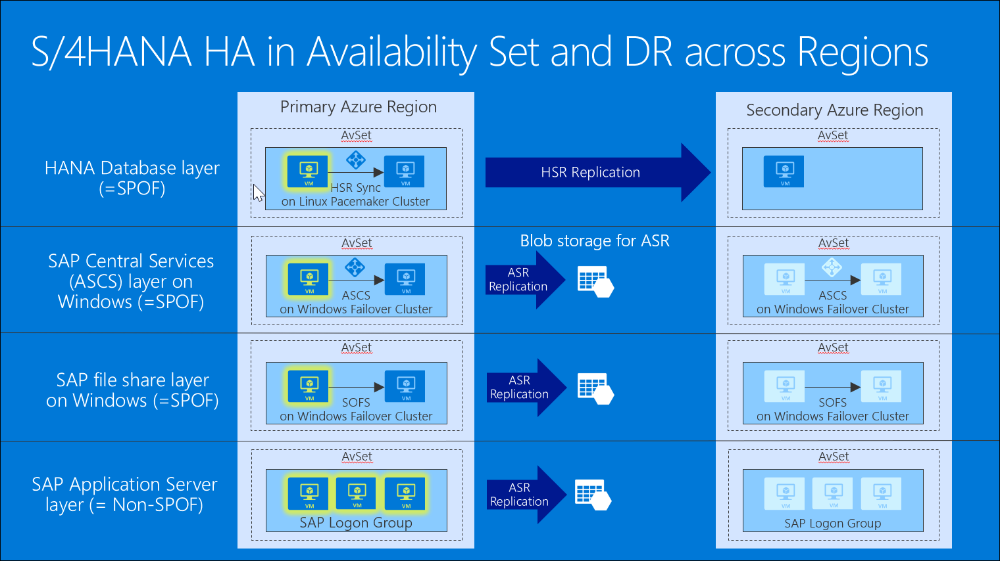

    -   HA/DR across Availability Zones

        This option represents a different design that takes advantage of availability zones, representing separate, physically isolated data centers within the same region. The placement of datacenters that represent Azure Availability Zones constitutes a compromise between delivering acceptable network latency to services deployed in different zones, and a distance between datacenters. The distance matters because even though majority of destructive events are not likely to affect the infrastructure of all Availability Zones in the same region, history offers examples of larger scale disasters that could have such impact. To account for such occurrences, organizations might have the minimum distance requirement between the location of their production and disaster recovery sites. For most Azure customers, the minimum distance definition necessitates the use of two or more Azure regions.

        Note that it is important to consider high availability and disaster recovery provisions separately for each component of this design. In this case, the highly available production components are distributed across Availability Zone 1 and Availability Zone 2:

        -   HANA Database layer is hosted by a Linux Pacemaker cluster containing an active VM instance residing in Availability Zone 1 and standby VM instance residing in Availability Zone 2, with HANA Synchronous replication between nodes of the cluster. Clustering is implemented by using Pacemaker.

        -   ASCS layer hosted by a Windows cluster contains an active VM instance residing in Availability Zone 1 and a standby VM instance residing in Availability Zone 2. 

        -   SAP file share layer on Windows cluster contains an one VM node residing in Availability Zone 1 and another VM node residing in Availability Zone 2. 

        -   SAP Application Server layer consists of a PAS server VM in Availability Zone 1 and AAS in Availability Zone 2. Clustering is not used in this case since high availability is built-into the PAS and AAS functionality.  

        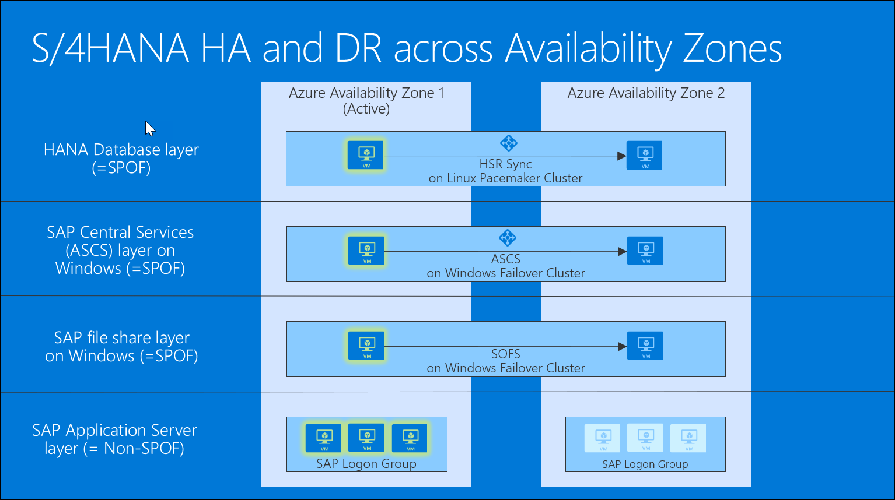

    In addition, when choosing the DR approach for your solutions, consider:

    -   Requirements, which can be divided into two categories:

        -   Business requirements:

            -   Minimum data loss in case of a disaster

            -   Failover completed within hours (including SAP application layer)

            -   Clear failover process

            -   Failover process is abstracted from users and subsystems

            -   Minimum cost

        -   IT requirements:

            -   Production environment is virtualized, on bare metal, or in the cloud

            -   Minimum overhead on production environment (including networking)

            -   No need for traditional SAN/tape backup solutions

    -   Disaster recovery mechanism for each of the three primary components:

        -   Database replication (e.g. SQL Server AlwaysOn)

        -   File replication (e.g. file copy)

        -   VM replication (Azure Site Recovery)

        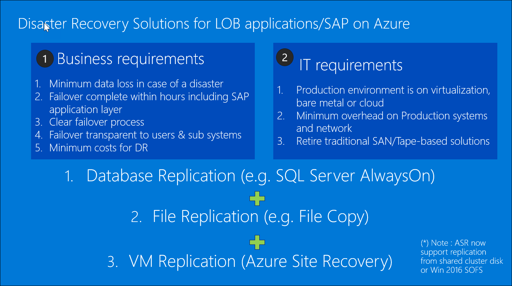

1.  Azure VM compute & storage sizing principles for SAP workloads

    -   Start by identifying customer requirements, including: 

        -   Type of environment: production, or non-production (dev and test)

        -   SAPS required for the SAP application and database tiers

        -   IOPS and storage throughput required for the database tier

        -   System activity period (consider Azure automation to stop non-production VMs during idle times)

    -   Use Premium storage for SAP databases (both database files and log files).

    -   SAP application servers are usually deployed on Standard storage, but can be deployed on small Premium storage disks (P4, P6) if using a single server in order to benefit from single instance SLA.

    -   For database servers, use Windows storage spaces or LINUX volume manaagers to stripe disks and aggregate IOPS, throughput and storage capacity

    -   Next, use select a compute SKU based on SAPS required for database tier

    -   Finally, select compute SKUs based on SAPS required for application tier

    In general, there are two ways to determine the proper size of SAP systems to be implemented in Azure – by using reference sizing or by employing SAP Quick Sizer.

    For existing on-premises systems, you should reference system configuration and resource utilization data.  The system utilization information is collected by the SAP OS Collector and can be reported via transaction OS07N as well as the Early Watch Report.  Similar information can be retrieved by leveraging any system performance and statistics gathering tools.

    The SAP EarlyWatch Alert is a diagnostic service that delivers monitoring of both SAP and non-SAP systems in the SAP Solution Manager. The service captures variety of performance-related data, including, for example, general component status, system configuration, average response times, system load, critical error messages and process interruptions. 

    For new systems, you should use SAP quick sizer, which can be accessed at https://service.sap.com/quicksizer. Note that access to it requires an Online Service System account. Online Service System (or, in short, OSS) is used to provide online access to SAP users and partners to SAP applications and data
Quick Sizer offers two independent sizing approaches: user-based and throughput-based. For smaller environments, the user-based sizing approach might be sufficient. Business requirements are determined by the number of users performing business specific tasks. Users are grouped per business task according to their estimated usage activity. For larger and more complex environments, it is recommended to use throughput-based sizing. This takes into account not only the number of users performing business specific tasks but also an information about business processes and business objects.

    For the purpose of this design session, you will assume that the relevant sizing data has already been collected. In order to identify the configuration of our Azure-based deployment, you will perform three tasks:

    -   Choose VM type of SAP ASCS, application, and database layers based on the provided SAPS requirements

    -   Choose storage type and the number of disks for SAP database layer based on the provided IOPS, throughput, and latency requirements

    -   Identify the number of VMs for SAP ASCS, application, and database layers based on the provided resiliency requirements

    ![A table of customer requirements and sizing for Azure has rows labeled SOFS, ASCS, Application, and Database. Customer requirement columns are SAPS needed, IOPS needed, and Current DB Volume. Nine sizing for Azure columns include items such as Azure VM type, number of vms and whether they are active, SAPS provided, Database Files Premium Storage SKU and number of disks, IOPS for Database Files provided, Storage size allocated for DB files, Database Log Premium Storage SKU and number of disks, and Latency for Log. The Sizing for Azure columns have question marks.](images/Whiteboarddesignsessiontrainerguide-SAPonAzureimages/media/image13.png "How to size SAP on Azure VMs")

    In order to identify the VM types, you will use the information provided in the following table:

    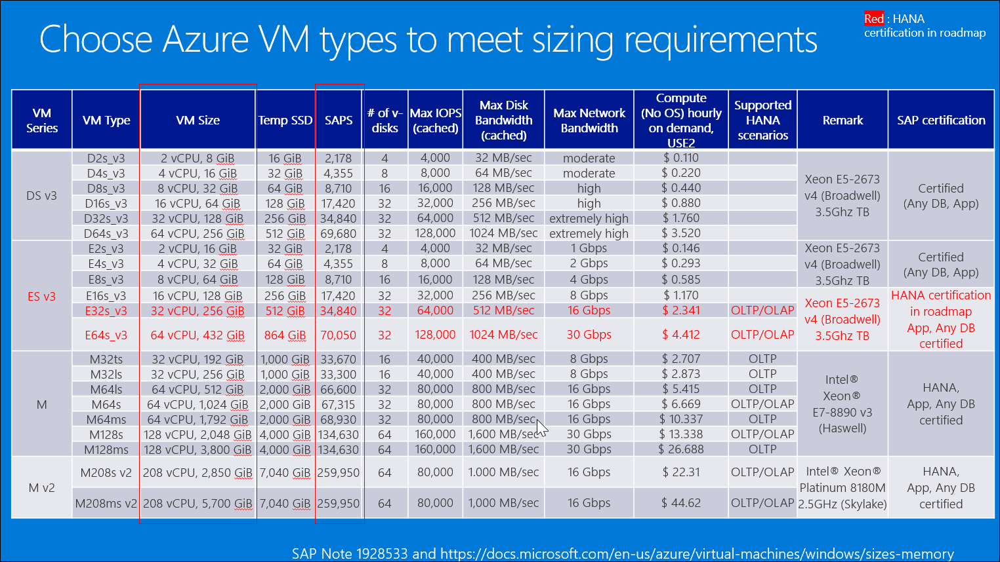

    In order to identify disks for SAP database layer, you will use the information provided in the following table:

    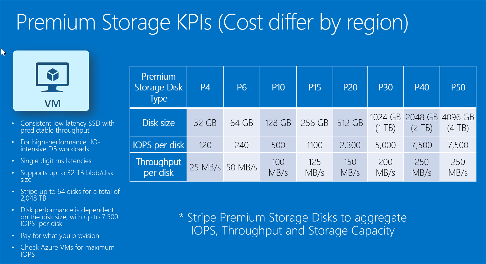

    Premium Storage offers the following characteristics:

    -   Consistent low latency SSD with predictable throughput

    -   Intended for high-performance IO-intensive DB workloads

    -   Single digit ms latencies

    -   Supports up to 32 TB blob/disk size

    -   Stripe (to aggregate IOPS, throughput, and capacity) up to 64 disks for a total of 2,048 TB

    -   Disk performance is dependent on the disk size, with up to 20,000 IOPS per disk 

    -   Ensure to account for Azure VMs level IOPS limits

    -   Pay for what you provision (cost per GB differs by region)

1.  When designing the architecture of your solution, consider the following factors: 

    -   the choice of the Azure region(s)

    -   the hybrid connectivity method (ExpressRoute and/or Site to Site VPN)

    -   the choice of the virtual gateway SKUs

    -   the method of implementing high-availability of the database layer

    -   the method of implementing high-availability of the ASCS and application servers

    -   the role of Azure services in your solution

    -   the method of implementing disaster recovery in your solution

    ![A diagram of Subnet business suite, NetWeaver with HA and DR has two Azure regions. The first region includes a GW Subnet, subnet #1 - AP Prod, Subnet #2 - DB Prod, and subnet #3 - Mgmt. The second region has GW subnet, subnet #4  - AP DR, and subnet #5 - DB DR, and Subnet #6 Mgmt. Both regions are connected via ExpressRoute to a building icon. There are collouts referencing these components labeled, respectively, VPN/ExpressRoute Gateway SKU?, How to design highly available SQL Server VMs?, What other Azure services can be used? Domain controller and other VMs? ExpressRoute or/and S2S VPN?, and What are DR Solutions? ](images/Whiteboarddesignsessiontrainerguide-SAPonAzureimages/media/image16.png "How to build high availability across regions")

1.  Account for backup requirements by incorporating some or all of the following capabilities into your solution:

    -   Online backup of SQL Server databases, files and OS system state with minimum overhead

    -   Backup to Azure Blob Storage (Azure Backup Vault)

    -   Point-in-time restore

    -   Minimizing backup storage (via incremental backups)

    -   Centralized console for monitoring and alert capabilities

    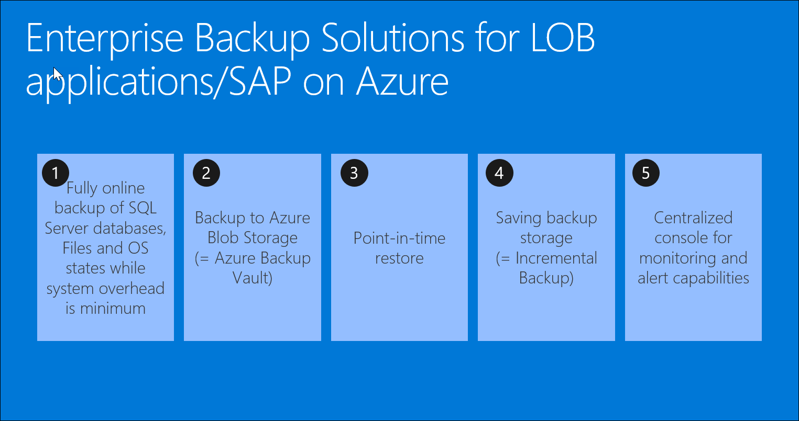

1.  When evaluating the cost of your solution: 

    -   Use Azure Pricing Calculator

    -   Consider best OS licensing option(s):

        -   It is common NOT to include Windows license costs because of Azure Hybrid Use Benefits

        -   Linux OS subscription costs can be based on Azure Marketplace

    -   Provide assumptions for ExpressRoute bandwidth

1.  To summarize, when designing your solution, account for the following requirements:

    -   problem statement and customer benefits

    -   secure and low latency network connectivity

    -   Windows-based application tier

    -   SQL Server-based database tier

    -   Specific sizing requirements (SAPS) for the application tier

    -   Specific sizing requirements (SAPS) for the database tier

    -   Specific IO requirements

    -   HA capabilities (as part of 3-tier deployment)

    -   Load-balanced front-end for the database tier

    -   Backup solution and storage for data retention

    -   Monitoring solution

    -   Security solution

    -   DR capabilities (with multi-region deployment)

    -   Monthly cost estimate

    -   Migration methodology

    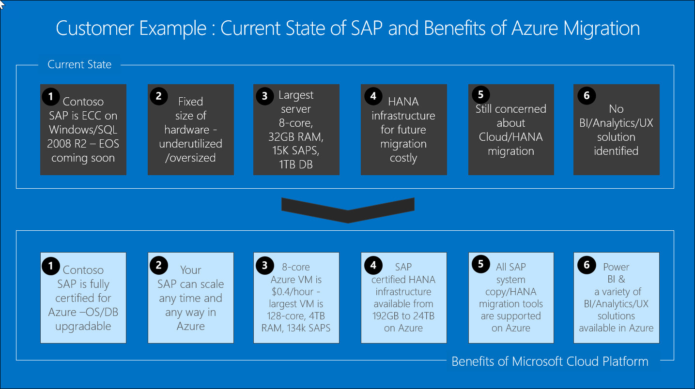

### Infographic for common scenarios

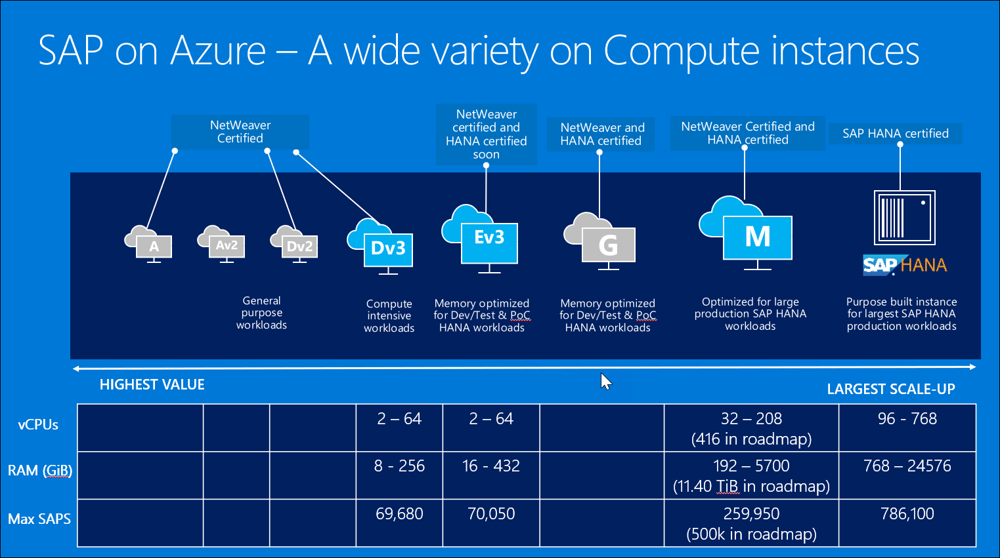

 on Azure VM")

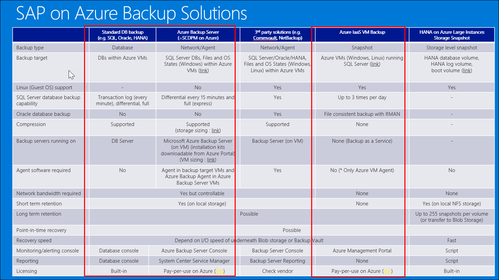

## Step 2: Design a proof of concept solution

**Outcome**

Design a solution and prepare to present the solution to the target customer audience in a 15-minute chalk-talk format.

Timeframe: 60 minutes

**Business needs**

Directions:  With all participants at your table, answer the following questions and list the answers on a flip chart:

1.  Who should you present this solution to? Who is your target customer audience? Who are the decision makers?

2.  What customer business needs do you need to address with your solution?

**Design**

Directions: With all participants at your table, respond to the following questions on a flip chart:

*Architecting a multi-tier SAP solution*

Using the features of Azure and the requirements from the customer, design the application infrastructure and network for Contoso SAP deployment in Azure. Consider such factors as cost of ownership of entire SAP landscape as well as high availability and disaster recovery capabilities for the production environment.

Make sure that your design covers the following items:

*High-level architecture*

**Task:** Identifying the target Azure region(s) and the number of tiers.

-   Identify the optimal choices for Azure region(s) where the solution should be deployed.

-   Choose between the 2-tier and 3-tier architecture.

-   Ensure that high-availability and disaster recovery requirements are satisfied.

### Architecting network connectivity*

**Task:** Design a hybrid network (at a high-level) that will allow you to meet all the customer requirements and support your design for moving Contoso SAP landscape to Azure.

-   Design virtual networking in Azure and suggest the hybrid connectivity configuration between Contoso on-premises environment and Azure.

### Architecting (ASCS) components

**Task:** Design a highly available and geo-redundant solution for hosting the (A)SCS components of the SAP production environment.

-   Design the architecture that will provide high availability and disaster recovery capabilities for the (A)SCS components of the SAP production environment.

-   Provide the sizing information for your design.

-   Describe what technologies you will use to implement high availability.

-   Describe the disaster recovery approach.

### Architecting application components

**Task:** Design a scalable, highly available, and geo-redundant solution for hosting the SAP application components of the SAP production environment.

-   Design the architecture that will provide high availability and disaster recovery capabilities for the application components of the SAP production environment.

-   Provide the sizing information for your design.

-   Describe what technologies you will use to implement high availability.

-   Describe the disaster recovery approach.

### Architecting database components

**Task:** Design a resilient and scalable SQL Server backend configured to span geographically distributed datacenters.

-   Design the architecture that will provide high availability and disaster recovery capabilities for the database components of the SAP production environment.

-   Provide the sizing information for your design.

-   Describe what technologies you will use to implement high availability.

-   Describe the disaster recovery approach.

### Determining estimated cost of the solution

**Task:** Based on the proposed design, determine the estimated cost of the entire solution.

-   Provide the pricing of the components of your solution.

-   Exclude cost of hybrid connectivity, licensing, and support.

-   Consider cost impact of leveraging Azure VM reserved instances (RI) and Azure Hybrid Benefit (AHUB).

**Prepare**

Directions: With all participants at your table:

1.  Identify any customer needs that are not addressed with the proposed solution.

2.  Identify the benefits of your solution.

3.  Determine how you will respond to the customer's objections.

Prepare a 15-minute chalk-talk style presentation to the customer.

## Step 3: Present the solution

**Outcome**

Present a solution to the target customer audience in a 15-minute chalk-talk format.

Timeframe: 30 minutes

**Presentation**

Directions:

1.  Pair with another table.

2.  One table is the Microsoft team and the other table is the customer.

3.  The Microsoft team presents their proposed solution to the customer.

4.  The customer makes one of the objections from the list of objections.

5.  The Microsoft team responds to the objection.

6.  The customer team gives feedback to the Microsoft team.

7.  Tables switch roles and repeat Steps 2-6.

##  Wrap-up 

Timeframe: 15 minutes

Directions: Tables reconvene with the larger group to hear the facilitator/SME share the preferred solution for the case study.

### Additional references 

|    |            |
|----------|:-------------:|
| **Description** | **Links** |
| Using Azure for hosting and running SAP workload scenarios | <https://docs.microsoft.com/en-us/azure/virtual-machines/workloads/sap/get-started>  |
| Deploy SAP NetWeaver (Windows) for AnyDB on Azure virtual machines |  <https://docs.microsoft.com/en-us/azure/architecture/reference-architectures/sap/> |
| SAP on MS Platform blog   | <https://blogs.msdn.microsoft.com/saponsqlserver/>  |
| SAP on Azure -- SAP Community Wiki | <https://wiki.scn.sap.com/wiki/display/VIRTUALIZATION/SAP+on+Microsoft+Azure>  |
| SAP Note 1928533 (Supported Products and Azure VM types) | <http://launchpad.support.sap.com/#/notes/1928533>  |

# SAP on Azure whiteboard design session trainer guide

## Step 1: Review the customer case study

-   Check in with your table participants to introduce yourself as the trainer.

-   Ask, "What questions do you have about the customer case study?"

-   Briefly review the steps and timeframes of the whiteboard design session.

-   Ready, set, go! Let the table participants begin.

## Step 2: Design a proof of concept solution

-   Check in with your tables to ensure that they are transitioning from step to step on time.

-   Provide some feedback on their responses to the business needs and design.

    -   Try asking questions first that will lead the participants to discover the answers on their own.

-   Provide feedback for their responses to the customer's objections.

    -   Try asking questions first that will lead the participants to discover the answers on their own.

## Step 3: Present the solution

-   Determine which table will be paired with your table before Step 3 begins.

-   For the first round, assign one table as the presenting team and the other table as the customer.

-   Have the presenting team present their solution to the customer team.

    -   Have the customer team provide one objection for the presenting team to respond to.

    -   The presentation, objections, and feedback should take no longer than 15 minutes.

    -   If needed, the trainer may also provide feedback.

## Wrap-up

-   Have the table participants reconvene with the larger session group to hear the facilitator/SME share the following preferred solution.

##  Preferred target audience

-   Andy Cross, CIO

-   Business Development Manager (BDM) or Application Sponsor (CFO)

    -   Fund projects & apps

    -   Most interested in public cloud

-   Business Unit IT / Developers (Director of SAP Business Analysts, Director of SAP Operations)

    -   Report to BDM and are responsible for coding and testing apps

    -   Big influencers of public cloud strategy

-   Central IT (VP of IT Operations)

    -   Reports to CIO and responsible for operating datacenter

    -   Concerned about shadow IT created issues: security/compliance, server sprawl, and lack of control

## Preferred solution

Have the table attendees reconvene with the larger session group to hear a subject matter expert (SME) share the following preferred solution:

*Requirements Recap*

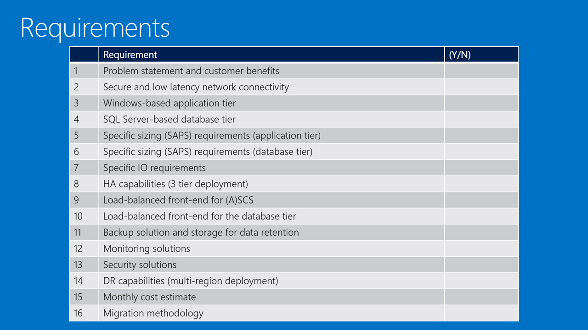

*High-level architecture*

The preferred solution for this design involves moving the SAP environment from on-premises to the Azure data center in East US 2 and extending it to West US 2 to provide disaster recovery capabilities.

**Task:** Identifying the target Azure region(s) and the number of tiers:

-   Identify the optimal choices for the Azure region(s) where the solution should be deployed.

-   Choose between the 2-tier and 3-tier approach.

-   Ensure that high-availability and disaster recovery requirements are satisfied.

**Answer:** By deploying Azure VMs in two regions (with US East 2 as the primary region and US West 2 as the secondary), we are able to address the Disaster Recovery needs of the customer. From the availability standpoint, one of the first decisions you will need to make is whether you will implement a two-tier or three-tier architecture. The 3-tier architecture consists of the presentation tier, the application tier, and the database tier. In the two-tier architecture, the application and database tiers are combined together, running on the same operating system instance.

The three-tier architecture is required to provide high availability in Azure. Each tier should contain two or more VMs in the same availability set to provide 99.95% availability SLA.

For best performance, we choose the alternate site in the same geo - different data centers at least 400 miles apart on the same continent.

*Preferred solution diagram*

![Screenshot of the complete solution diagram of Subnet business suite, NetWeaver with HA and DR has two Azure Datacenters - East US 2, and West US 2. East US 2 includes a GW Subnet, subnet #1 - AP Prod, and Subnet #2 - DB Prod. West US 2 has GW subnet, subnet #4  - AP DR, and subnet #5 - DB DR, and Subnet #6 management. An arrow points from East US 2 subnet 2 to West US 2 subnet 5. Both datacenters are connected via ExpressRoute to a building icon. Callouts listing copmponents of the solution point to GW subnet, Availability Set SAP ASCS on Subnet #1 - AP prod, Subnet #2 - DB prod, Subnet #3 Mgmt, Log Analytics and Backup, ExpressRoute, Subnet #4 - AP DR, Subnet #5 - DB DR, Subnet #6 Mgmt. GW subnet in both regions includes ExpresRoute Gateway. Subnet #1 - AP Prod subnet includes Availability Set SAP ASCS, Availability Set Scale Out File Server, and Availablity Set SAP AP. Subnet #2 - DB Prod includes two Microsoft SQL Server Azure VMs in the same availability set. Subnet #3 Mgmt includes Azure VMs hosting domain controller and Azure Backup Server (SCDPM). Subnet #4 - AP DR includes offline replicas of Availability Set SAP ASCS, Availability Set Scale Out File Server, and Availablity Set SAP AP. Subnet #5 - DB DR includes a single Azure VM hosting SQL Server AlwaysOn async replica. Subnet #6 Mgmt includes Azure VMs hosting domain controller and Azure Backup Server (SCDPM). Azure Datacenter East US 2 and Azure Datacenter West US 2 also include Storage, Automation, Backup, Log Analytics, Site Recovery, and Security Center. ](images/Whiteboarddesignsessiontrainerguide-SAPonAzureimages/media/image8.png)

*Sizing Compute and Storage*

*Preferred solution cost*

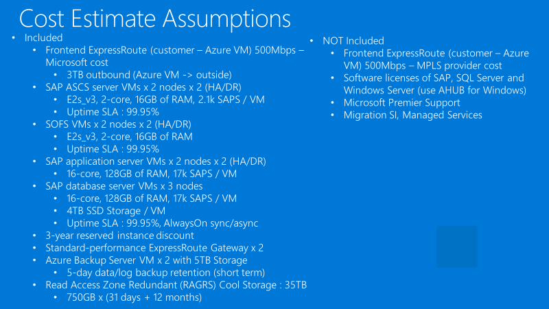

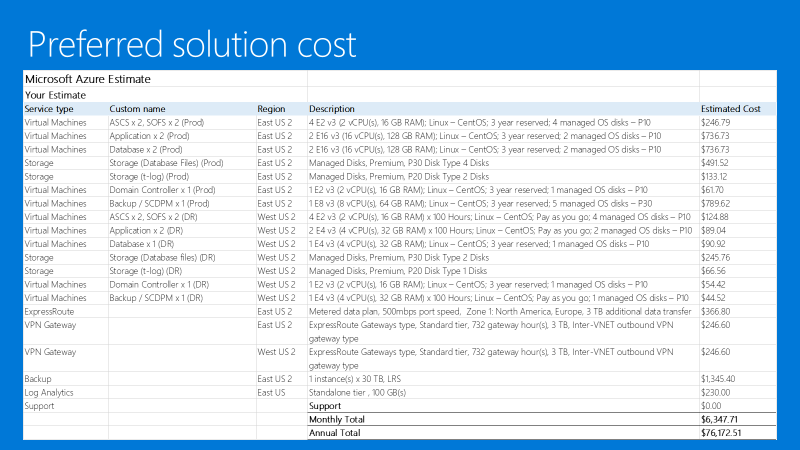

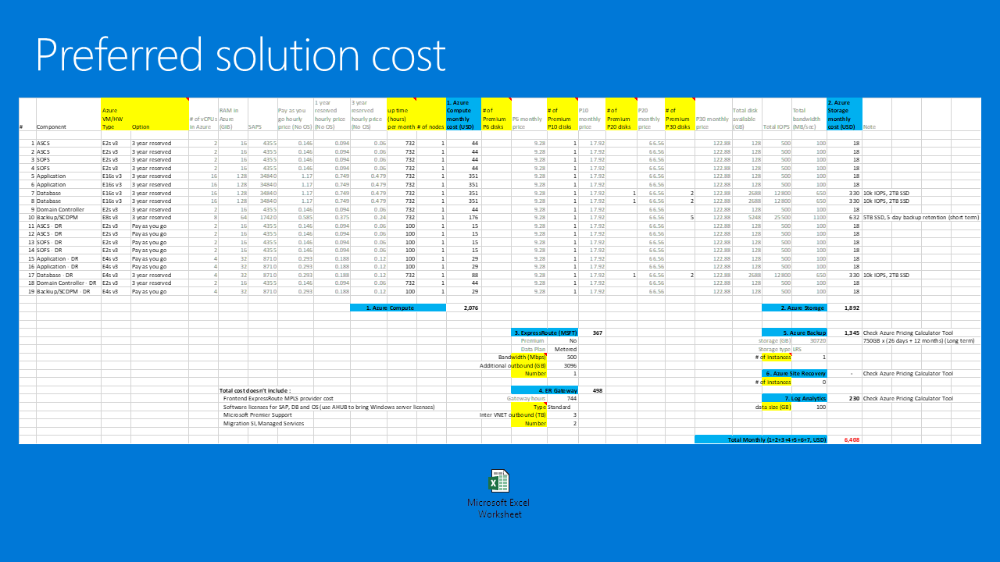

*Architecting network connectivity*

**Task:** Design a hybrid network (at a high-level) that will allow you to meet all the customer requirements and support your design for moving Contoso SAP landscape to Azure:

-   Design virtual networking in Azure and suggest the hybrid connectivity configuration between Contoso on-premises environment and Azure

**Answer:** Use ExpressRoute between the corporate headquarters and two Azure regions that will host the SAP deployment. For development or training scenarios, it might be sufficient to use a site-to-site Virtual Private Network (VPN). You can use the online Azure Speed Test to determine the latency you should expect when establishing a site-to-site VPN connection. However, Site-to-Site VPN connections are, at best, limited to 1.25 Gbps and introduce double digit millisecond latencies. For production SAP workloads hosted in Azure, you should consider using ExpressRoute. This allows for establishing a private connection to Azure, providing up to 10 Gbps of bandwidth and lowering latency to a couple of milliseconds.

*Architecting (ASCS) components*

**Task:** Design a scalable and highly available solution.

**Answer:** By deploying Azure VMs in two regions, we are able to meet the needs of the customer. Scaling of the (A)SCS tier involves increasing or decreasing the size of Azure VMs. The SAP Central Services Instance is protected by leveraging Window Server Failover Cluster. Windows Server 2016 Scale Out File Server (SOFS) and the Storage Spaces Direct (S2D), enable the creation of a cluster on Azure VMs with the shared disk functionality. This ensures high availability of the messaging service and Enqueue Replication Service components. The SAP Central Service uses the Azure internal load balancer to facilitate failover capability.

By deploying Azure VMs hosting the (A)SCS in two regions, we are able to meet the disaster recovery needs of the customer. We schedule a task to copy the primary instance of ASCS' \\sapmnt to a corresponding share on a DR Azure VM once per day. As part of failover, we change the IP of the ASCS virtual instance name to the IP of the Azure VM. We run sapinst.exe with the SAPINST\_USE\_HOSTNAME parameter set to the virtual instance name (stand-alone ASCS system in a distributed deployment).

*Architecting application components*

**Task:** Design a scalable and highly available solution.

**Answer:** Scaling of the application tier can be accomplished by deploying additional application servers (AAS) to supplement the Primary Application Server. The HTTP(S) load balancing is handled by the SAP Web Dispatcher hosted on an Azure VM. The SAP Logon load balancing is handled by the SCS message server.

The application server does not contain any business data and does not need to be replicated to the DR very often. The only content that changes periodically is the SAP kernel after a kernel upgrade.

Consider using ASR for replication from on-premises to Azure and between Azure regions (note that failback between Azure regions is currently unsupported).

*Architecting database components*

**Task:** Design a resilient and scalable SQL Server backend configured to span geographically distributed datacenters.

**Answer:** Scaling of the database tier involves increasing or decreasing the size of Azure VMs. For Microsoft SQL Server, we use AlwaysOn Availability Group (AG) built on top of the Windows Server Failover Clustering and leveraging the Cloud Witness quorum, eliminating the dependency on a shared disk or a file share. Azure internal load balancer represents the listener of the SQL Server AlwaysOn Availability Group containing the SAP database.

Failover between Azure SQL VMs in the same Azure region is automatic (synchronous replication).

Failover between Azure SQL VMs from the primary to the secondary Azure region is manual (potential data loss due to asynchronous replication).

## Checklist of preferred objection handling

1.  If I have already paid for my hardware to run my dev/test environment, how am I getting any cost savings by moving it to Azure?

    **Potential Answer:** A Global audit, tax and consulting company reduced TCO by 40-75% by hosting SAP systems on Azure and turning off unused resources. A global snack food company reduced TCO by 40-75% by moving 126 legacy SAP systems on Azure; A medical supply company reduced TCO by 50% by moving SAP training environment to Azure. Use the TCO tool (http://aka.ms/azuretco) to uncover all categories of potential cost savings (e.g., hardware, software, maintenance, admin, power, facility). Because of the large scale of Microsoft datacenters, we realize the ongoing cost efficiencies that we have been passing to customers in the form of price cuts.

    For very large customers, highlight other benefits (e.g., agility, focus) of using Azure.

2.  What if I need my cloud resources to access on-premises resources?

    **Potential Answer:** Microsoft supports a hybrid solution, with symmetry between on-premises applications and those on the public cloud. Windows Azure Virtual Network allows them to create a logically isolated section in Azure and securely connect it to their on-premises datacenter. If the customer needs dedicated connectivity, talk to them about ExpressRoute.

3.  Will Azure meet our security and compliance requirements?

    **Potential Answer:** Microsoft policy is to be the most transparent about security and compliance policies, procedures, and certifications on the public facing Azure Trust Center.

    Dev/Test workload usually has limited security/compliance requirements.

    Encourage the customer to visit our Azure data centers.

4.  Do I have to pay for resources when they are stopped?

    **Potential Answer:** Yes, the VM must be deallocated before the charges cease. If the VM is stopped it will continue to incur charges.

    Deallocating does not mean deleting the VM as it still exists in storage.

    You will still incur storage charge even if the VM is deallocated.

5.  Can I automate the shutdown at periodic times of day?

    **Potential Answer:** Yes, this functionality is available directly from the Azure platform without the need for a custom solution. In addition, the customer can use Azure Automation runbooks or custom Azure PowerShell and Azure CLI scripts to start Azure VMs on as-needed basis.

## Customer quote (to be read back to the attendees at the end)

"Azure has introduced new opportunities in regard to quickly provisioning development and user acceptance testing environments for our various SAP workloads. It also provided high availability and disaster recovery capabilities for our production environment at a very reasonable price."

---Andrew Cross, CIO, Contoso Group

